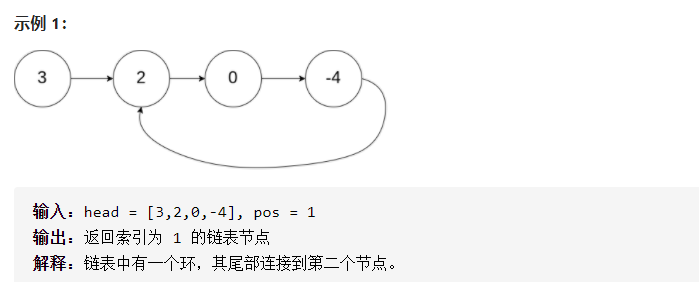

###  [LeetCode 热题 HOT 100](https://leetcode-cn.com/problemset/leetcode-hot-100/)

***********

#### [环形链表 II](https://leetcode-cn.com/problems/linked-list-cycle-ii/)

> 给定一个链表，返回链表开始入环的第一个节点。 如果链表无环，则返回 null。
>
> 为了表示给定链表中的环，我们使用整数 pos 来表示链表尾连接到链表中的位置（索引从 0 开始）。 如果 pos 是 -1，则在该链表中没有环。注意，pos 仅仅是用于标识环的情况，并不会作为参数传递到函数中。
>
> 

##### 方法一 双指针

> 我们使用两个指针，$\textit{fast}$与$ \textit{slow}$。它们起始都位于链表的头部。随后，$\textit{slow}$指针每次向后移动一个位置，而 $\textit{fast}$指针向后移动两个位置。如果链表中存在环，则 $\textit{fast}$指针最终将再次与$ \textit{slow}$指针在环中相遇。
>
> 如下图所示，设链表中环外部分的长度为 $a$。$\textit{slow}$指针进入环后，又走了$b$ 的距离与 $\textit{fast}$相遇。
>
> 显然，当$fast$与$slow$相遇的时候，$fast$走过的长度和刚好是$slow$的两倍。
>
> 我们不妨假设$2（a+b） = a+b+c$，可得到$a=c$。也就是说，$slow$再运动到环的起点的时候，刚好与$head$走到起点的距离是一样的。
>
> 因此，当发现 $\textit{slow}$与 $\textit{fast}$相遇时，我们再额外使用一个指针$ \textit{ptr}$。起始，它指向链表头部；随后，它和 $\textit{slow}$每次向后移动一个位置。最终，它们会在入环点相遇。
>
> 
>
> ```java
> public ListNode detectCycle(ListNode head) {
>         if (head==null || head.next==null)
>             return null;
>         ListNode fast = head;
>         ListNode slow = head;
> 
>         while (fast!=null && fast.next != null){
>             fast = fast.next.next; //先移动的原因是刚开始fast与slow同时指向head
>             slow = slow.next; 
>             if (fast == slow)
>                 break;
>         }
>         if (fast==null || fast.next==null)
>             return null;
>         ListNode curr = head;
>         while (curr != slow){
>             curr = curr.next;
>             slow = slow.next;
>         }
>         return curr;
>     }
> ```

##### 方法二 哈希表

> 一个非常直观的思路是：我们遍历链表中的每个节点，并将它记录下来；一旦遇到了此前遍历过的节点，就可以判定链表中存在环。借助哈希表可以很方便地实现。
>
> ```java
>         ListNode curr = head;
>         HashSet<ListNode> set = new HashSet<>();
>         while (curr!=null){
>             if (set.contains(curr)){
>                 return curr;
>             }
>             else set.add(curr);
>         }
>         return null;
> ```

> HashSet 基于 HashMap 来实现的，是一个不允许有重复元素的集合。
>
> HashSet 允许有 null 值。
>
> HashSet 是无序的，即不会记录插入的顺序。
>
> HashSet 不是线程安全的， 如果多个线程尝试同时修改 HashSet，则最终结果是不确定的。 您必须在多线程访问时显式同步对 HashSet 的并发访问。
>
> HashSet 实现了 Set 接口。
> 添加元素可以使用 add() 方法:
>
> - 可以使用 contains() 方法来判断元素是否存在于集合当中
> - 以使用 remove() 方法来删除集合中的元素
> - 删除集合中所有元素可以使用 clear 方法
> - 要计算 HashSet 中的元素数量可以使用 size() 方法

#### [LRU 缓存机制](https://leetcode-cn.com/problems/lru-cache/)

> 运用你所掌握的数据结构，设计和实现一个  LRU (最近最少使用) 缓存机制 。
> 实现 `LRUCache `类：
>
> - `LRUCache(int capacity) `以正整数作为容量 capacity 初始化 LRU 缓存
> - `int get(int key) `如果关键字 key 存在于缓存中，则返回关键字的值，否则返回 -1 
> - `void put(int key, int value)` 如果关键字已经存在，则变更其数据值；如果关键字不存在，则插入该组「关键字-值」。当缓存容量达到上限时，它应该在写入新数据之前删除最久未使用的数据值，从而为新的数据值留出空间。
>
> $$
> 输入\\
> ["LRUCache", "put", "put", "get", "put", "get", "put", "get", "get", "get"]\\
> [[2], [1, 1], [2, 2], [1], [3, 3], [2], [4, 4], [1], [3], [4]]\\
> 输出\\
> [null, null, null, 1, null, -1, null, -1, 3, 4]\\
> 
> 解释\\
> LRUCache lRUCache = new LRUCache(2);\\
> lRUCache.put(1, 1); // 缓存是 {1=1}\\
> lRUCache.put(2, 2); // 缓存是 {1=1, 2=2}\\
> lRUCache.get(1);    // 返回 1\\
> lRUCache.put(3, 3); // 该操作会使得关键字 2 作废，缓存是 {1=1, 3=3}\\
> lRUCache.get(2);    // 返回 -1 (未找到)\\
> lRUCache.put(4, 4); // 该操作会使得关键字 1 作废，缓存是 {4=4, 3=3}\\
> lRUCache.get(1);    // 返回 -1 (未找到)\\
> lRUCache.get(3);    // 返回 3\\
> lRUCache.get(4);    // 返回 4\\
> $$

##### 方法 哈希表 + 双向链表

> LRU 缓存机制可以通过哈希表辅以双向链表实现，我们用一个哈希表和一个双向链表维护所有在缓存中的键值对。
>
> - 双向链表按照被使用的顺序存储了这些键值对，靠近头部的键值对是最近使用的，而靠近尾部的键值对是最久未使用的。
>
> - 哈希表即为普通的哈希映射（HashMap），通过缓存数据的键映射到其在双向链表中的位置。
>
>
> 
>
> ```java
> public class LRUCache {
>     class DLinkedNode {
>         int key;
>         int value;
>         DLinkedNode prev;
>         DLinkedNode next;
>         public DLinkedNode() {}
>         public DLinkedNode(int _key, int _value) {key = _key; value = _value;}
>     }
> 
>     private Map<Integer, DLinkedNode> cache = new HashMap<Integer, DLinkedNode>();
>     private int size;
>     private int capacity;
>     private DLinkedNode head, tail;
> 
>     public LRUCache(int capacity) {
>         this.size = 0;
>         this.capacity = capacity;
>         // 使用伪头部和伪尾部节点
>         head = new DLinkedNode();
>         tail = new DLinkedNode();
>         head.next = tail;
>         tail.prev = head;
>     }
> 
>     public int get(int key) {
>         DLinkedNode node = cache.get(key);
>         if (node == null) {
>             return -1;
>         }
>         // 如果 key 存在，先通过哈希表定位，再移到头部
>         moveToHead(node);
>         return node.value;
>     }
> 
>     public void put(int key, int value) {
>         DLinkedNode node = cache.get(key);
>         if (node == null) {
>             // 如果 key 不存在，创建一个新的节点
>             DLinkedNode newNode = new DLinkedNode(key, value);
>             // 添加进哈希表
>             cache.put(key, newNode);
>             // 添加至双向链表的头部
>             addToHead(newNode);
>             ++size;
>             if (size > capacity) {
>                 // 如果超出容量，删除双向链表的尾部节点
>                 DLinkedNode tail = removeTail();
>                 // 删除哈希表中对应的项
>                 cache.remove(tail.key);
>                 --size;
>             }
>         }
>         else {
>             // 如果 key 存在，先通过哈希表定位，再修改 value，并移到头部
>             node.value = value;
>             moveToHead(node);
>         }
>     }
> 
>     private void addToHead(DLinkedNode node) {
>         node.prev = head;
>         node.next = head.next;
>         head.next.prev = node;
>         head.next = node;
>     }
> 
>     private void removeNode(DLinkedNode node) {
>         node.prev.next = node.next;
>         node.next.prev = node.prev;
>     }
> 
>     private void moveToHead(DLinkedNode node) {
>         removeNode(node);
>         addToHead(node);
>     }
> 
>     private DLinkedNode removeTail() {
>         DLinkedNode res = tail.prev;
>         removeNode(res);
>         return res;
>     }
> }
> ```

#### [排序链表](https://leetcode-cn.com/problems/sort-list/)

> 给你链表的头结点 `head` ，请将其按 **升序** 排列并返回 **排序后的链表** 。
>
> 

> 目的进阶问题要求达到 $O(n \log n)$) 的时间复杂度和 $O(1)$ 的空间复杂度，时间复杂度是 $O(n \log n)$ 的排序算法包括归并排序、堆排序和快速排序（快速排序的最差时间复杂度是 $O(n^2)$），其中最适合链表的排序算法是归并排序。
>
> 归并排序基于分治算法。最容易想到的实现方式是自顶向下的递归实现，考虑到递归调用的栈空间，自顶向下归并排序的空间复杂度是$ O(\log n)$。如果要达到$ O(1)$ 的空间复杂度，则需要使用自底向上的实现方式。

`归并排序`

> **归并排序**（Merge Sort）是建立在[归并](https://baike.baidu.com/item/归并/253741)操作上的一种有效，稳定的[排序算法](https://baike.baidu.com/item/排序算法/5399605)，该算法是采用[分治法](https://baike.baidu.com/item/分治法/2407337)（Divide and Conquer）的一个非常典型的应用。将已有序的子序列[合并](https://baike.baidu.com/item/合并/5615281)，得到完全有序的[序列](https://baike.baidu.com/item/序列/1302588)；即先使每个子序列有序，再使子序列段间有序。若将两个有序表合并成一个有序表，称为[二路归并](https://baike.baidu.com/item/二路归并/53201558)。
>
> 

##### 方法一：自顶向下归并排序

> 对链表自顶向下归并排序的过程如下。
>
> 1. 找到链表的中点，以中点为分界，将链表拆分成两个子链表。寻找链表的中点可以使用==快慢指针==的做法，快==指针每次移动 2 步，慢指针每次移动 1 步，当快指针到达链表末尾时，慢指针指向的链表节点即为链表的中点==。
>
> 2. 对两个子链表分别排序。
>
> 3. 将两个排序后的子链表合并，得到完整的排序后的链表。可以使用「[21. 合并两个有序链表](https://leetcode-cn.com/problems/merge-two-sorted-lists/)的做法，将两个有序的子链表进行合并。
>
> 上述过程可以通过递归实现。递归的终止条件是链表的节点个数小于或等于 1，即当链表为空或者链表只包含1 个节点时，不需要对链表进行拆分和排序。
>
> ```java
> class Solution {
>     public ListNode sortList(ListNode head) {
>         return SortLink(head, null);
>     }
>     public ListNode SortLink(ListNode head, ListNode tail){
>         if (head==null)
>             return head;
>         if (head.next==tail){
>             head.next=null;
>             return head;
>         }
>         ListNode fast=head, slow=head;
>         while (fast!=tail){
>             fast = fast.next;
>             slow = slow.next;
>             if (fast!=tail)
>                 fast = fast.next;
>         }
>         ListNode mid = slow;
>         ListNode list1 = SortLink(head, mid);
>         ListNode list2 = SortLink(mid, tail);
>         ListNode sort = Merge(list1, list2);
>         return sort;
>     }
> 
>     private ListNode Merge(ListNode list1, ListNode list2) {
>         ListNode dummynode = new ListNode(0);
>         ListNode temp=dummynode, temp1 = list1, temp2=list2;
>         while (temp1!=null && temp2!=null){
>             if (temp1.val <= temp2.val){
>                 temp.next = temp1;
>                 temp1 = temp1.next;
>             }
>             else{
>                 temp.next = temp2;
>                 temp2 = temp2.next;
>             }
>             temp = temp.next;
>         }
>         if (temp1!=null){
>             temp.next = temp1;
>         }
>         if (temp2!=null){
>             temp.next = temp2;
>         }
>         return dummynode.next;
>     }
> ```

##### 方法二： 自底向上归并排序

> 
>
> ```java
> public ListNode sortList(ListNode head) {
>         int length = 0;
>         ListNode node = head; //找到链表长度
>         while (node!=null){
>             node = node.next;
>             length++;
>         }
>         //初始化
>         ListNode dummynode = new ListNode(0);
>         dummynode.next = head;
>         // 循环  子链表从1开始
>         for (int sublength=1;sublength<length;sublength<<=1){
>             ListNode prev = dummynode;
>             ListNode curr = dummynode.next;
> 
>             while (curr!=null){
>                 ListNode head1 = curr;
>                 for (int i=1;i<sublength&&curr!=null&&curr.next!=null;i++){
>                     curr = curr.next;
>                     //第一个链表
>                 }
>                 //第二个链表
>                 ListNode head2 = curr.next;
>                 curr.next = null;
>                 curr = head2;
>                 for (int i=1;i<sublength&&curr!=null&&curr.next!=null;i++){
>                     curr = curr.next;
>                 }
> 
>                 //如果不是因为到了链表结尾而终止，就把第二个链表断开
>                 ListNode next = null;
>                 if (curr!=null){
>                     next = curr.next;
>                     curr.next = null;
>                 }
> 
>                 //合并两个链表
>                 ListNode merged = Merge(head1, head2);
>                 prev.next = merged;
>                 while (prev.next!=null)
>                     prev = prev.next;
>                 
>                 curr = next;
>             }
>         }
>         return dummynode.next;
>     }
>     private ListNode Merge(ListNode list1, ListNode list2) {
>         ListNode dummynode = new ListNode(0);
>         ListNode temp=dummynode, temp1 = list1, temp2=list2;
>         while (temp1!=null && temp2!=null){
>             if (temp1.val <= temp2.val){
>                 temp.next = temp1;
>                 temp1 = temp1.next;
>             }
>             else{
>                 temp.next = temp2;
>                 temp2 = temp2.next;
>             }
>             temp = temp.next;
>         }
>         if (temp1!=null){
>             temp.next = temp1;
>         }
>         if (temp2!=null){
>             temp.next = temp2;
>         }
>         return dummynode.next;
>     }
> ```

#### [乘积最大子数组](https://leetcode-cn.com/problems/maximum-product-subarray/)

> 给你一个整数数组 `nums` ，请你找出数组中乘积最大的连续子数组（该子数组中至少包含一个数字），并返回该子数组所对应的乘积。

##### 方法：动态规划

> 我们可以这样进行状态设计，也就是以$ nums[i]$ 结尾的连续子数组的最大值。现在具体看下如何进行状态设计、推导状态转移方程，进而加以实现。因为数组中存在着负数，所以有可能导致乘积会从最大变为最小，同样的，最小也可能变为最大。\
>
> ==“由于存在负数，那么会导致最大的变最小的，最小的变最大的。因此还需要维护当前最小值==
>
> ```java
>     public int maxProduct(int[] nums) {
>         int length = nums.length;
>         if (length==0)
>             return 0;
>         if (length==1)
>             return nums[0];
>         
>         int Max=nums[0], Min=nums[0], ans=nums[0];
>         for (int i=1;i<length;i++){
>             int mx=Max, mn=Min;
>             Max = Math.max(mx*nums[i], Math.max(nums[i], mn*nums[i]));
>             Min = Math.min(mn*nums[i], Math.min(nums[i], mx*nums[i]));
>             ans = Math.max(Max, ans);
>         }
>         return ans;
>     }
> ```

#### [最小栈](https://leetcode-cn.com/problems/min-stack/)

> 设计一个支持 push ，pop ，top 操作，并能在常数时间内检索到最小元素的栈。
>
> - push(x) —— 将元素 x 推入栈中。
> - pop() —— 删除栈顶的元素。
> - top() —— 获取栈顶元素。
> - getMin() —— 检索栈中的最小元素。
>
> $$
> 输入：
> ["MinStack","push","push","push","getMin","pop","top","getMin"]\\
> [[],[-2],[0],[-3],[],[],[],[]]\\
> 
> 输出：\\
> [null,null,null,null,-3,null,0,-2]\\
> \\
> 解释：
> MinStack minStack = new MinStack();\\
> minStack.push(-2);\\
> minStack.push(0);\\
> minStack.push(-3);\\
> minStack.getMin();   --> 返回 -3.\\
> minStack.pop();\\
> minStack.top();      --> 返回 0.\\
> minStack.getMin();   --> 返回 -2.\\
> $$

##### 方法一 辅助栈

> 
>
> 
>
> ```java
>     Deque<Integer> xstack;
>     Deque<Integer> minstack;
>     public MinStack() {
>         xstack = new LinkedList<>();
>         minstack = new LinkedList<>();
>         minstack.push(Integer.MAX_VALUE);
>     }
> 
>     public void push(int val) {
>         xstack.push(val);
>         minstack.push(Math.min(val, minstack.peek()));
>     }
> 
>     public void pop() {
>         xstack.pop();
>         minstack.pop();
>     }
> 
>     public int top() {
>         return xstack.peek();
>     }
> 
>     public int getMin() {
>         return minstack.peek();
>     }
> ```

##### 方法二 链表

> 
>
> ```java
> class MinStack {
> 
>     /** initialize your data structure here. */
>         class Node{
>             int value;
>             int min;
>             Node next;
>             Node(){}
>             Node(int _value, int _min){this.value=_value; this.min=_min;next=null;}
>     }
>     Node head;
> 
>     public MinStack() {
>         head = null;
>     }
> 
>     public void push(int val) {
>         if (head==null){
>             Node node = new Node(val, val);
>             head = node;
>         }
>         else {
>             Node node = new Node(val, Math.min(val, head.min));
>             node.next = head;
>             head = node;
>         }
>     }
> 
>     public void pop() {
>         if (head==null)
>             return;
>         else {
>             head = head.next;
>         }
>     }
> 
>     public int top() {
>         if (head==null)
>             return -1;
>         else return head.value;
>     }
> 
>     public int getMin() {
>         if (head==null)
>             return -1;
>         else return head.min;
>     }
> }
> ```

#### [相交链表](https://leetcode-cn.com/problems/intersection-of-two-linked-lists/)

> 编写一个程序，找到两个单链表相交的起始节点。
>
> 

##### 方法一：暴力解决

> 

##### 方法二：哈希表

> 

##### 方法三：双指针法

> 

##### 方法四：判断长度

> 因为两个链表不一样长，那么第一次遍历，分别记录两个链表的长度。然后将长度作差，让更长的链表先走相差的那些步，然后两个链表一起走，然后相遇的第一个结点即为两个链表相交的交点。
>
> ```java
>     public ListNode getIntersectionNode(ListNode headA, ListNode headB) {
>         //判断哪个链表更长
>         ListNode A=headA, B=headB;
>         int lengthA=1, lengthB=1;
>         while (A.next!=null){
>             lengthA++;
>             A = A.next;
>         }
> 
>         while (B.next!=null){
>             lengthB++;
>             B = B.next;
>         }
> 
>         int abs = Math.abs(lengthA-lengthB);
>         ListNode nodeA=headA, nodeB=headB;
> 
>         if (lengthA >= lengthB){
>             for (int i=1;i<=abs;i++)
>                 nodeA = nodeA.next;
>         }
>         else {
>             for (int i=1;i<=abs;i++)
>                 nodeB = nodeB.next;
>             }
>         while (lengthA>0){
>             if (nodeA==nodeB)
>                 return nodeA;
>             nodeA = nodeA.next;
>             nodeB = nodeB.next;
>         }
>         return null;
>     }
> ```

#### [多数元素](https://leetcode-cn.com/problems/majority-element/)

> 给定一个大小为 n 的数组，找到其中的多数元素。多数元素是指在数组中出现次数 大于 ⌊ n/2 ⌋ 的元素。
>
> 你可以假设数组是非空的，并且给定的数组总是存在多数元素。
>

##### 方法一：存储每个元素出现的次数

> 

##### 方法二：哈希表

> 
>
> ```java
> public int majorityElement(int[] nums) {
>     HashMap<Integer, Integer> map = new HashMap<>();
>     int n = nums.length;
>     for (int i = 0; i < nums.length; i++) {
>         int before = map.getOrDefault(nums[i], 0);
>         if (before == n / 2) { //超过半数的数字一定有且只有一个。所以在计数过程中如果出现了超过半数的数字，我们可以立刻返回
>             return nums[i];
>         }
>         map.put(nums[i], before + 1);
>     }
>     //随便返回一个
>     return -1;
> }
> ```

##### 方法四：排序

> 
>
> ```java
> class Solution {
>     public int majorityElement(int[] nums) {
>         Arrays.sort(nums);
>         return nums[nums.length / 2];
>     }
> }
> ```

##### 解法五 摩尔投票法

> 
>
> ```java
>         int group = nums[0];
>         int count = 1;
>         for (int i=1;i<nums.length;i++){
>             if (count==0){
>                 group = nums[i];
>                 count=1;
>                 continue;
>             }
>             if (group == nums[i])
>                 count++;
>             else count--;
>         }
>         return group;
> ```
>

#### [打家劫舍](https://leetcode-cn.com/problems/house-robber/)

> 你是一个专业的小偷，计划偷窃沿街的房屋。每间房内都藏有一定的现金，影响你偷窃的唯一制约因素就是相邻的房屋装有相互连通的防盗系统，如果两间相邻的房屋在同一晚上被小偷闯入，系统会自动报警。
>
> 给定一个代表每个房屋存放金额的非负整数数组，计算你 不触动警报装置的情况下 ，一夜之内能够偷窃到的最高金额。
> $$
> 输入：[1,2,3,1]\\
> 输出：4\\
> 解释：偷窃 1 号房屋 (金额 = 1) ，然后偷窃 3 号房屋 (金额 = 3)。\\
>      偷窃到的最高金额 = 1 + 3 = 4 。
> $$

##### 方法：动态规划

> 下面是自己的思路：
>
> ```java
> public int rob(int[] nums) {
>         /*
>         动态规划
>          */
>         int length = nums.length;
>         int[] dp = new int[length];
>         if (length==1)
>             return nums[0];
>         if (length==2)
>             return Math.max(nums[0], nums[1]);
>         if (length==3)
>             return Math.max(nums[0] + nums[2], nums[1]);
>         dp[0] = nums[0];
>         dp[1] = nums[1];
>         dp[2] = dp[0] + nums[2];
>         for (int i=3;i<length;i++){
>             dp[i] = nums[i] + Math.max(dp[i-2], dp[i-3]);
>         }
>         return Math.max(dp[length-1], dp[length-2]);
>     }
>     public static void main(String[] args){
>         int[] nums = new int[]{2, 1, 1, 2};
>         test198 test = new test198();
>         System.out.println(test.rob(nums));
>     }
> ```

> 
>
> ```java
>     public int rob(int[] nums) {
>         if (nums == null || nums.length == 0) {
>             return 0;
>         }
>         int length = nums.length;
>         if (length == 1) {
>             return nums[0];
>         }
>         int[] dp = new int[length];
>         dp[0] = nums[0];
>         dp[1] = Math.max(nums[0], nums[1]);
>         for (int i = 2; i < length; i++) {
>             dp[i] = Math.max(dp[i - 2] + nums[i], dp[i - 1]);
>         }
>         return dp[length - 1];
>     }
> ```

> 上述方法使用了数组存储结果。考虑到每间房屋的最高总金额只和该房屋的前两间房屋的最高总金额相关，因此可以使用滚动数组，在每个时刻只需要存储前两间房屋的最高总金额。
>
> ```java
>     public int rob(int[] nums) {
>         if (nums == null || nums.length == 0) {
>             return 0;
>         }
>         int length = nums.length;
>         if (length == 1) {
>             return nums[0];
>         }
>         int first = nums[0], second = Math.max(nums[0], nums[1]);
>         for (int i = 2; i < length; i++) {
>             int temp = second;
>             second = Math.max(first + nums[i], second);
>             first = temp;
>         }
>         return second;
>     }
> ```

#### [岛屿数量](https://leetcode-cn.com/problems/number-of-islands/)

##### 方法一：深度优先遍历

> 
>
> ```java
> public int numIslands(char[][] grid) {
>         // 深度优先遍历
>         int row=grid.length, col=grid[0].length;
>         int count=0;
>         
>         for (int i=0;i<row;i++){
>             for (int j=0;j<col;j++){
>                 if (grid[i][j] == '1'){
>                     count++;
>                     dfs(grid, i, j);
>                 }
>             }
>         }
>         return count;
>     }
> 
>     private void dfs(char[][] grid, int i, int j) {
>         int row=grid.length, col=grid[0].length;
>         
>         if (i<0 || j<0 || i>=row || j>=col || grid[i][j]=='0')
>             return;
>         
>         grid[i][j] = '0';
>         dfs(grid, i+1, j);        
>         dfs(grid, i-1, j);        
>         dfs(grid, i, j+1);        
>         dfs(grid, i, j-1);        
>     }
> ```

##### 方法二：宽度优先遍历

> 
>
> ```java
> if (grid==null || grid.length==0)
>             return 0;
> 
>         int row=grid.length, col= grid[0].length;
>         int count=0;
> 
>         for (int i=0;i<row;i++){
>             for (int j=0;j<col;j++){
>                 if (grid[i][j] == '1'){
>                     count++;
>                     grid[i][j] = '0';
>                     Queue<Integer> neighbors = new LinkedList<>();
>                     neighbors.add(i*col+j);
>                     while (!neighbors.isEmpty()){
>                         int curr = neighbors.remove();
>                         int x = curr / col;
>                         int y = curr % col;
> 
>                         if ((x-1)>=0 && grid[x-1][y]=='1'){
>                             neighbors.add((x-1)*col+y);
>                             grid[x-1][y] = '0';
>                         }
>                         if ((x+1)<row && grid[x+1][y]=='1'){
>                             neighbors.add((x+1)*col+y);
>                             grid[x+1][y] = '0';
>                         }
>                         if ((y-1)>=0 && grid[x][y-1]=='1'){
>                             neighbors.add(x*col+y-1);
>                             grid[x][y-1] = '0';
>                         }
>                         if ((y+1)<col && grid[x][y+1]=='1'){
>                             neighbors.add(x*col+y+1);
>                             grid[x][y+1] = '0';
>                         }
>                     }
>                 }
>             }
>         }
>         return count;
> ```

##### 方法三：并查集

>  为了求出岛屿的数量，我们可以扫描整个二维网格。如果一个位置为 1，则将其与相邻四个方向上的 1 在并查集中进行合并。
>
> 最终岛屿的数量就是并查集中连通分量的数目。
>
> 
>
> ```java
> class Solution {
>     class UnionFind {
>         int count;
>         int[] parent;
>         int[] rank;
> 
>         public UnionFind(char[][] grid) {
>             count = 0;
>             int m = grid.length;
>             int n = grid[0].length;
>             parent = new int[m * n];
>             rank = new int[m * n];
>             for (int i = 0; i < m; ++i) {
>                 for (int j = 0; j < n; ++j) {
>                     if (grid[i][j] == '1') {
>                         parent[i * n + j] = i * n + j;
>                         ++count;
>                     }
>                     rank[i * n + j] = 0;
>                 }
>             }
>         }
> 
>         public int find(int i) {
>             if (parent[i] != i) parent[i] = find(parent[i]);
>             return parent[i];
>         }
> 
>         public void union(int x, int y) {
>             int rootx = find(x);
>             int rooty = find(y);
>             if (rootx != rooty) {
>                 if (rank[rootx] > rank[rooty]) {
>                     parent[rooty] = rootx;
>                 } else if (rank[rootx] < rank[rooty]) {
>                     parent[rootx] = rooty;
>                 } else {
>                     parent[rooty] = rootx;
>                     rank[rootx] += 1;
>                 }
>                 --count;
>             }
>         }
> 
>         public int getCount() {
>             return count;
>         }
>     }
> 
>     public int numIslands(char[][] grid) {
>         if (grid == null || grid.length == 0) {
>             return 0;
>         }
> 
>         int nr = grid.length;
>         int nc = grid[0].length;
>         int num_islands = 0;
>         UnionFind uf = new UnionFind(grid);
>         for (int r = 0; r < nr; ++r) {
>             for (int c = 0; c < nc; ++c) {
>                 if (grid[r][c] == '1') {
>                     grid[r][c] = '0';
>                     if (r - 1 >= 0 && grid[r-1][c] == '1') {
>                         uf.union(r * nc + c, (r-1) * nc + c);
>                     }
>                     if (r + 1 < nr && grid[r+1][c] == '1') {
>                         uf.union(r * nc + c, (r+1) * nc + c);
>                     }
>                     if (c - 1 >= 0 && grid[r][c-1] == '1') {
>                         uf.union(r * nc + c, r * nc + c - 1);
>                     }
>                     if (c + 1 < nc && grid[r][c+1] == '1') {
>                         uf.union(r * nc + c, r * nc + c + 1);
>                     }
>                 }
>             }
>         }
> 
>         return uf.getCount();
>     }
> }
> ```

#### [反转链表](https://leetcode-cn.com/problems/reverse-linked-list/)

> ```java
> public ListNode reverseList(ListNode head) {
>     ListNode prev = next;
>     ListNode curr = head;
>     while(curr!=null){
>         ListNode next = curr.next;
>         curr.next = prev;
>         prev = curr;
>         curr = next;
>     }
>     return prev;
> }
> ```
>
> 