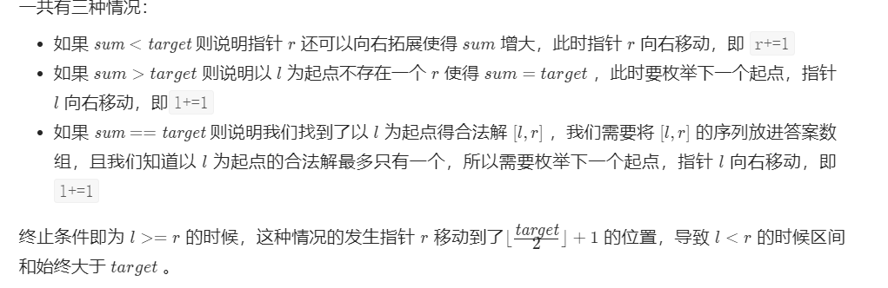
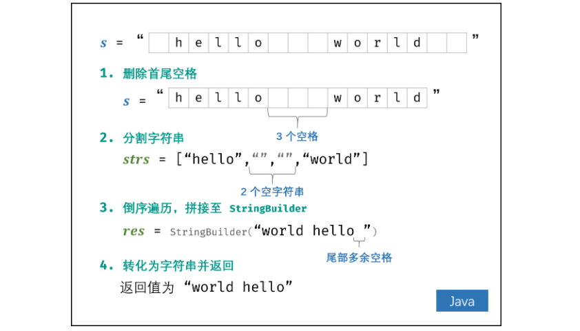

* content
{:toc}
### 剑指Offer

#### [剑指 Offer 03. 数组中重复的数字](https://leetcode-cn.com/problems/shu-zu-zhong-zhong-fu-de-shu-zi-lcof/)

> 找出数组中重复的数字。
>
>
> 在一个长度为$ n $的数组 $nums$ 里的所有数字都在$ 0$到$n-1$ 的范围内。数组中某些数字是重复的，但不知道有几个数字重复了，也不知道每个数字重复了几次。请找出数组中任意一个重复的数字。

##### 方法一：排序+查找

> 自己的思路是这样的，先排序，这样的话重复数字肯定相邻。所以顺序遍历，找到相邻数字相等就返回。
>
> > ```java
> > public class Offer03 {
> >     public int findRepeatNumber(int[] nums) {
> >         Arrays.sort(nums);
> >         for (int i=0;i<nums.length-1;i++){
> >             if (nums[i] == nums[i+1])
> >                 return nums[i];
> >         }
> >         return -1;
> >     }
> > }
> > ```

##### 方法二：哈希集合

> 创建一个哈希集合，然后遍历数组。若当前遍历的值不在哈希集合中，添加到集合中；否则。返回该值。
>
> > ```java
> > public int findRepeatNumber2(int[] nums){
> >         Set<Integer> set = new HashSet<>();
> >         for (int i=0;i<nums.length;i++){
> >             if (set.contains(nums[i]))
> >                 return nums[i];
> >             else set.add(nums[i]);
> >         }
> >         return -1;
> >     }
> > ```

#### [剑指 Offer 04. 二维数组中的查找](https://leetcode-cn.com/problems/er-wei-shu-zu-zhong-de-cha-zhao-lcof/)

> 在一个 n * m 的二维数组中，每一行都按照从左到右递增的顺序排序，每一列都按照从上到下递增的顺序排序。请完成一个高效的函数，输入这样的一个二维数组和一个整数，判断数组中是否含有该整数。
>
> 

##### 方法一：暴力查找

> 挨个遍历数组的值，判断在不在数组里面就好了。

##### 方法二：右上角开始查找

> 观察这个二维数组，会发现有4个点比较特殊。
>
> - 左上角的点：右边、下面的数字都比它大。
> - 右上角的点：左边的数字比它小，下面的数字比它大。
> - 左下角的点：上面的数字比它小，右边的数字比它大。
> - 右下角的点：左边、上面的数字都比它小。
>
> 可以利用右上角点的特殊性来查找target。比target小，就向下遍历；比target大，就向左遍历。
>
> ```java
> class Solution {
>     public boolean findNumberIn2DArray(int[][] matrix, int target) {
>         
>         if (matrix==null || matrix.length==0 || matrix[0].length==0)
>             return false;
>         int row = matrix.length, col = matrix[0].length;
>         int x=0, y=col-1;
>         while (x<row && y>=0){
>             if (matrix[x][y] == target)
>                 return true;
>             else{
>                 if (matrix[x][y] < target)
>                     x++;
>                 else y--;
>             }
>         }
>         return false;
>     }
> }
> ```

#### [剑指 Offer 05. 替换空格](https://leetcode-cn.com/problems/ti-huan-kong-ge-lcof/)

> 请实现一个函数，把字符串 `s` 中的每个空格替换成"%20"。
>
> ```
> 输入：s = "We are happy."
> 输出："We%20are%20happy."
> ```

##### 方法一：String.replaceAll()

> replaceAll() 方法使用给定的参数 replacement 替换字符串所有匹配给定的正则表达式的子字符串。
>
> ```java
> public String replaceAll(String regex, String replacement)
> ```
>
> - **regex** -- 匹配此字符串的正则表达式。
> - **newChar** -- 用来替换每个匹配项的字符串。
>
> ```
> class Solution {
>     public String replaceSpace(String s) {
>         return s.replaceAll(" ", "%20");
>     }
> }
> ```

##### 方法二：拼接字符串

> 利用StringBuilder apped()方法拼接字符串的快速性
>
> ```java
> class Solution {
>     public String replaceSpace(String s) {
>         if (s==null)
>             return null;
>         StringBuilder ss = new StringBuilder();
>         for (int i=0;i<s.length();i++){
>             if (s.charAt(i) == ' ')
>                 ss.append("%20");
>             else ss.append(s.charAt(i));
>         }
>         return ss.toString();
>     }
> }
> ```

##### 补充知识：拼接字符串的方法

> - +号
> - concat()
> - append()
> - join
>
> ==StringBuilder和StringBuffer基本相似，两个类的构造器和方法也基本相同。不同的是：StringBuffer是线程安全的，而StringBuilder则没有实现线程安全功能，所以性能略高。==

#### [剑指 Offer 06. 从尾到头打印链表](https://leetcode-cn.com/problems/cong-wei-dao-tou-da-yin-lian-biao-lcof/)

> 输入一个链表的头节点，从尾到头反过来返回每个节点的值（用数组返回）。
>
> ```java
> 输入：head = [1,3,2]
> 输出：[2,3,1]
> ```

##### 方法一：哈希表

> 定义一个变量$length$，初始为0，用于记录链表的长度。遍历链表，存储length以及对应节点的$val$值。
>
> ```java
> /**
>  * Definition for singly-linked list.
>  * public class ListNode {
>  *     int val;
>  *     ListNode next;
>  *     ListNode(int x) { val = x; }
>  * }
>  */
> class Solution {
>     public int[] reversePrint(ListNode head) {
>         Map<Integer, Integer> map = new HashMap<>();
>         int length = 0; // 链表长度
>         while (head!=null){
>             map.put(length, head.val);
>             length++;
>             head = head.next;
>         }
>         if (length==0)
>             return new int[]{};
>         int[] ans = new int[length];
>         for (int i=0;i<length;i++)
>             ans[i] = map.get(length-1-i);
>         return ans;
>     }
> }
> ```

##### 方法二：栈

> 利用栈先进后出的性质，先将链表的节点值存储进栈中。这样刚好是一个逆序的顺序。
>
> ```java
> /**
>  * Definition for singly-linked list.
>  * public class ListNode {
>  *     int val;
>  *     ListNode next;
>  *     ListNode(int x) { val = x; }
>  * }
>  */
> class Solution {
>     public int[] reversePrint(ListNode head) {
>         Stack<Integer> stack = new Stack<>();
>         if (head==null)
>             return new int[]{};
>         int length = 0;
>         while (head!=null){
>             length++;
>             stack.add(head.val);
>             head = head.next;
>         }
>         int[] ans = new int[length];
>         for (int i=0;i<length;i++){
>             ans[i] = stack.peek();
>             stack.pop();
>         }
>         return ans;
>     }
> }
> ```

##### 补充知识

> `Java Stack`
>
> 
>
> [Java HaseMap](https://www.runoob.com/java/java-hashmap.html)

#### [剑指 Offer 07. 重建二叉树](https://leetcode-cn.com/problems/zhong-jian-er-cha-shu-lcof/)

> 输入某二叉树的前序遍历和中序遍历的结果，请重建该二叉树。假设输入的前序遍历和中序遍历的结果中都不含重复的数字。
>
> ```
> 前序遍历 preorder = [3,9,20,15,7]
> 中序遍历 inorder = [9,3,15,20,7]
> ```

##### 方法一：递归

> 在二叉树的前序遍历中，第一个数字总是树的根结点的值。但在中序遍历序列中，根结点的值在序列的中间，左子树的结点的值位于根结点的值的左边，而右子树的结点的值位于根结点的值的右边。因此我们需要扫描中序遍历序列，才能找到根结点的值。

```java
/**
 * Definition for a binary tree node.
 * public class TreeNode {
 *     int val;
 *     TreeNode left;
 *     TreeNode right;
 *     TreeNode(int x) { val = x; }
 * }
 */
class Solution {
    public TreeNode buildTree(int[] preorder, int[] inorder) {
        if (preorder==null || inorder==null)
            return null;
        TreeNode root = PreInBuildTree(preorder, 0, preorder.length-1, inorder, 0, inorder.length-1);
        return root;
    }

    private TreeNode PreInBuildTree(int[] preorder, int prestart, int prend, int[] inorder, int instart, int inend) {
        if (prestart > prend || instart > inend)
            return null;
        TreeNode root = new TreeNode(preorder[prestart]);
        for (int i=instart;i<=inend;i++){
            if (preorder[prestart] == inorder[i]){
                root.left = PreInBuildTree(preorder, prestart+1, prestart+i-instart, inorder, instart, i-1);
                root.right = PreInBuildTree(preorder, prestart+1+i-instart, prend, inorder, i+1, inend);
            }
        }
        return root;
    }
}
```

###### 举一反三 中序+后序

```java
public static TreeNode rebuildBinaryTree(int[] postorder, int[] inorder) {
	if (postorder == null || inorder == null) {
		return null;
	}
	TreeNode root = rebuildBinaryTreeCore(postorder, 0,
			postorder.length - 1, inorder, 0, inorder.length - 1);
	return root;
}
 
public static TreeNode rebuildBinaryTreeCore(int[] postorder,
		int startPostorder, int endPostorder, int[] inorder,
		int startInorder, int endInorder) {
 
	if (startPostorder > endPostorder || startInorder > endInorder) { // 终止递归的条件
		return null;
	}
	TreeNode root = new TreeNode(postorder[endPostorder]); //  每次迭代的根节点 后序遍历最后的一次
	for (int i = startInorder; i <= endInorder; i++) {
		if (inorder[i] == postorder[endPostorder]) {
			root.left = rebuildBinaryTreeCore(postorder, startPostorder,
					startPostorder - 1 + (i - startInorder), inorder,
					startInorder, i - 1);
			root.right = rebuildBinaryTreeCore(postorder, startPostorder
					+ (i - startInorder), endPostorder - 1, inorder, i + 1,
					endInorder);
		}
	}
	return root;
}
```

##### 方法二：迭代


#### [剑指 Offer 09. 用两个栈实现队列](https://leetcode-cn.com/problems/yong-liang-ge-zhan-shi-xian-dui-lie-lcof/)

> 用两个栈实现一个队列。队列的声明如下，请实现它的两个函数 appendTail 和 deleteHead ，分别完成在队列尾部插入整数和在队列头部删除整数的功能。(若队列中没有元素，deleteHead 操作返回 -1 )
>
> ```java
> 输入：
> ["CQueue","appendTail","deleteHead","deleteHead"]
> [[],[3],[],[]]
> 输出：[null,null,3,-1]
> ```

##### 方法：一个栈用于添加、一个用于删除

***我的想法是，插入操作的时候往stack1插入，删除操作的时候这样删除：如果stack1是空的就返回-1，否则把stack1的元素挨个出栈存到stack2中，然后返回stack2的头元素，再把stack2的元素挨个出栈，插入到stack1中。其实不需要stack2出栈存到stack1中了，因为执行只要执行删除操作的时候先删除stack2中的元素就好了。***

> 维护两个栈，第一个栈支持插入操作，第二个栈支持删除操作。
>
> 根据栈先进后出的特性，我们每次往第一个栈里插入元素后，第一个栈的底部元素是最后插入的元素，第一个栈的顶部元素是下一个待删除的元素。为了维护队列先进先出的特性，我们引入第二个栈，用第二个栈维护待删除的元素，在执行删除操作的时候我们首先看下第二个栈是否为空。如果为空，我们将第一个栈里的元素一个个弹出插入到第二个栈里，这样第二个栈里元素的顺序就是待删除的元素的顺序，要执行删除操作的时候我们直接弹出第二个栈的元素返回即可。
>
> ```java
> class CQueue {
>     Deque<Integer> stack1;
>     Deque<Integer> stack2;
>     
>     public CQueue() {
>         stack1 = new LinkedList<Integer>();
>         stack2 = new LinkedList<Integer>();
>     }
>     
>     public void appendTail(int value) {
>         stack1.push(value);
>     }
>     
>     public int deleteHead() {
>         // 如果第二个栈为空
>         if (stack2.isEmpty()) {
>             while (!stack1.isEmpty()) {
>                 stack2.push(stack1.pop());
>             }
>         } 
>         if (stack2.isEmpty()) {
>             return -1;
>         } else {
>             int deleteItem = stack2.pop();
>             return deleteItem;
>         }
>     }
> }
> ```

#### [剑指 Offer 10- I. 斐波那契数列](https://leetcode-cn.com/problems/fei-bo-na-qi-shu-lie-lcof/)

> 写一个函数，输入 `n` ，求斐波那契（Fibonacci）数列的第 `n` 项（即 `F(N)`）。斐波那契数列的定义如下：
>
> ```java
> F(0) = 0,   F(1) = 1
> F(N) = F(N - 1) + F(N - 2), 其中 N > 1.
> ```

##### 方法一：循环

> ```java
> class Solution {
>     public int fib(int n) {
>         if (n==0)
>             return 0;
>         if (n==1)
>             return 1;
>         int[] num = new int[n+1];
>         for (int i=0;i<=n;i++){
>             if (i==0)
>                 num[i] = 0;
>             if (i==1)
>                 num[i] = 1;
>             if (i>=2)
>                 num[i] = (num[i-1] + num[i-2]) % (1000000007);
>         }
>         return num[n];
>     }
> }
> ```

##### 优化

> 用两个遍历来迭代这个过程
>
> ```java
> class Solution {
>     public int fib(int n) {
>         if (n==0)
>             return 0;
>         if (n==1)
>             return 1;
>         int a = 0, b=1, sum;
>         for (int i=2;i<=n;i++){
>             sum =  ((a + b) % (1000000007));
>             a = b;
>             b = sum;
>         }
>         return b;
>     }
> }
> ```

#### [剑指 Offer 10- II. 青蛙跳台阶问题](https://leetcode-cn.com/problems/qing-wa-tiao-tai-jie-wen-ti-lcof/)

> 一只青蛙一次可以跳上1级台阶，也可以跳上2级台阶。求该青蛙跳上一个 n 级的台阶总共有多少种跳法。
>
> 答案需要取模 1e9+7（1000000007），如计算初始结果为：1000000008，请返回 1。

##### 方法一：动态规划

> 设跳上 $n$ 级台阶有 $f(n)$ 种跳法。在所有跳法中，青蛙的最后一步只有两种情况： 跳上 $1 $级或$2 $级台阶。
> $$
> 当为 1 级台阶： 剩 n−1 个台阶，此情况共有f(n−1) 种跳法；\\
> 当为 2 级台阶： 剩 n-2个台阶，此情况共有 f(n-2) 种跳法。
> $$
>
> ```java
> class Solution {
>     public int numWays(int n) {
>         if(n==0 || n==1)
>             return 1;
>         int dp[] = new int[n+1];
>         dp[0] = 1;
>         dp[1] = 1;
>         for (int i=2;i<=n;i++)
>             dp[i] = (dp[i-1] + dp[i-2]) % (1000000007);
>         return dp[n];
>     }
> }
> ```

##### 优化

> ```java
> class Solution {
>     public int numWays(int n) {
>         if(n==0 || n==1)
>             return 1;
>         int a=1, b=1, sum;
>         for (int i=2;i<=n;i++){
>             sum = (a + b) % (1000000007);
>            a = b;
>            b = sum;
>         }
>         return b;
>     }
> }
> ```

#### [剑指 Offer 11. 旋转数组的最小数字](https://leetcode-cn.com/problems/xuan-zhuan-shu-zu-de-zui-xiao-shu-zi-lcof/)

> 把一个数组最开始的若干个元素搬到数组的末尾，我们称之为数组的旋转。输入一个递增排序的数组的一个旋转，输出旋转数组的最小元素。例如，数组$ [3,4,5,1,2] $为 $[1,2,3,4,5] $的一个旋转，该数组的最小值为$1$。  

##### 方法一：顺序遍历

> 按照顺序遍历数组，如数组发生过旋转，那么肯定会出现遍历数组值的时候出现突然减少的情况。这个就是最小值。如果没用发生过旋转，那么数组一个值变为最小值。
>
> ```java
>     public static int minArray(int[] numbers) {
>         if (numbers==null || numbers.length==0)
>             return 0;
>         boolean flag = false;
>         for (int i=0;i<numbers.length-1;i++){
>             if (numbers[i+1] < numbers[i])
>                 flag = true;
>             if (flag)
>                 return numbers[i+1];
>         }
>         return numbers[0];
>     }
> ```

##### 方法二：折半查找

> 一个包含重复元素的升序数组在经过旋转之后，可以得到下面可视化的折线图：
>
> 
>
> 我们考虑**数组中的最后一个元素$ x$：在最小值右侧的元素，它们的值一定都小于等于$ x$；而在最小值左侧的元素，它们的值一定都大于等于 $x$**。因此，我们可以根据这一条性质，通过二分查找的方法找出最小值。
>
> 在二分查找的每一步中，左边界为$ \it low$，右边界为 $\it high$，区间的中点为 $\it pivot$，最小值就在该区间内。我们将中轴元素 $numbers[pivot] $与右边界元素$ \textit{numbers}[\textit{high}]$ 进行比较，可能会有以下的三种情况：
>
> > 
> >
> > 
>
> > 
> 
> > 
>>
> > 
> 
> ```java
>class Solution {
>     public int minArray(int[] numbers) {
>         if (numbers==null || numbers.length==0)
>             return 0;
>         int low=0, high=numbers.length-1;
>         while (low<high){
>             int mid = low + (high - low) / 2;
>             if (numbers[mid] < numbers[high])
>                 high = mid;
>             else if (numbers[mid] > numbers[high])
>                 low = mid + 1;
>             else high--;
>         }
>         return numbers[low];
>     }
> }
> ```

#### [剑指 Offer 12. 矩阵中的路径](https://leetcode-cn.com/problems/ju-zhen-zhong-de-lu-jing-lcof/)

> 请设计一个函数，用来判断在一个矩阵中是否存在一条包含某字符串所有字符的路径。路径可以从矩阵中的任意一格开始，每一步可以在矩阵中向左、右、上、下移动一格。如果一条路径经过了矩阵的某一格，那么该路径不能再次进入该格子。例如，在下面的$3×4$的矩阵中包含一条字符串$“bfce”$的路径（路径中的字母用加粗标出）。
>
> ```
> [["a","b","c","e"],
> ["s","f","c","s"],
> ["a","d","e","e"]]
> ```
>
> 但矩阵中不包含字符串$“abfb”$的路径，因为字符串的第一个字符b占据了矩阵中的第一行第二个格子之后，路径不能再次进入这个格子。

##### 方法：深度优先遍历

> 暴力法遍历矩阵中所有字符串可能性。DFS 通过递归，先朝一个方向搜到底，再回溯至上个节点，沿另一个方向搜索，以此类推。
>
> > '剪枝'
> >
> > 当前遍历位置超出数组边界或者当前位置已被遍历或者数组当前位置与字符串字符不匹配。
>
> ```java
> public class Offer12 {
>     public boolean exist(char[][] board, String word) {
>         if (board==null || word.length()==0)
>             return false;
>         boolean flag = false;
>         int length1 = board.length;
>         int length2 = board[0].length;
>         int[][] visited = new int[length1][length2];
>         for (int i=0;i<length1;i++){
>             for (int j=0;j<length2;j++){
>                 if (board[i][j] == word.charAt(0)){
>                     flag = DFS(board, word, 0, i, j, visited);
>                 }
>                 if (flag)
>                     return true;
>             }
>         }
>         return flag;
>     }
> 
>     private boolean DFS(char[][] board, String word, int len, int x, int y, int[][] visited) {
> 
>         if (len == word.length()-1)
>             return true;
> 
>         if (x<0 || x>=board.length || y<0 ||y>=board[0].length || board[x][y]!=word.charAt(len) || visited[x][y]==1)
>             return false;
> 
>         visited[x][y] = 1;
>         if (DFS(board, word, len+1, x-1, y, visited) || DFS(board, word, len+1, x+1, y, visited)
>         || DFS(board, word, len+1, x, y-1, visited) || DFS(board, word, len+1, x, y+1, visited))
>             return true;
>         visited[x][y] = 0;
>         return false;
>     }
> }
> ```

#### [剑指 Offer 13. 机器人的运动范围](https://leetcode-cn.com/problems/ji-qi-ren-de-yun-dong-fan-wei-lcof/)

> 地上有一个$m$行$n$列的方格，从坐标 $[0,0] $到坐标$ [m-1,n-1] $。一个机器人从坐标$ [0, 0]$ 的格子开始移动，它每次可以向左、右、上、下移动一格（不能移动到方格外），也不能进入行坐标和列坐标的数位之和大于k的格子。例如，当$k$为1$8$时，机器人能够进入方格$ [35, 37] $，因为$3+5+3+7=18$。但它不能进入方格$ [35, 38]，因为3+5+3+8=19$。请问该机器人能够到达多少个格子？

##### 方法一：深度优先遍历

> 思路：沿着一个方向遍历，知道不能前进位置。然后返回到上一个位置，重复该过程。
>
> ```java
> class Solution {
>     int count = 0;
>     public int movingCount(int m, int n, int k) {
>         if (m<0 || n<0 || k<0)
>             return 0;
>         int[][] visited = new int[m][n];
>         JudgeMove(0, 0, m, n, k, visited);
>         return count;
>     }
> 
>     private void JudgeMove(int i, int j, int m, int n, int k, int[][] visited) {
>         if (i<0 || i>=m || j<0 || j>=n || getNum(i, j)>k || visited[i][j]==1)
>             return;
> 
>         visited[i][j] = 1;
>         count++;
>         JudgeMove(i-1, j, m, n, k, visited);
>         JudgeMove(i+1, j, m, n, k, visited);
>         JudgeMove(i, j-1, m, n, k, visited);
>         JudgeMove(i, j+1, m, n, k, visited);
> 
>         return;
>     }
>     public int getNum(int r,int c){
>         int sum=0;
>         while(r>=1){
>             sum+=r%10;
>             r=r/10;
>         }
>         while(c>=1){
>             sum+=c%10;
>             c=c/10;
>         }
>         return sum;
>     }
> }
> ```

##### 方法二：广度优先遍历

> 从$[0,0]$位置开始，向右向下两个方向广度遍历。利用队列先进先出的性质，遍历可能的位置。
>
> ```java
> class Solution {
>     public int movingCount(int m, int n, int k) {
>         if (m<0 || n<0 || k<0)
>             return 0;
>         int count = 0;
> 
>         int[][] visited = new int[m][n];
>         Queue<Integer> q = new LinkedList<>();
>         if (0<=k)
>             q.offer(0);
>         while (!q.isEmpty()){
>             int res = q.peek();
>             q.poll();
>             int x = res / n;
>             int y = res % n;
>             if (x>=0 && x<m && y>=0 && y<n && visited[x][y]==0 && GetNum(x, y)<=k){
>                 count++;
>                 visited[x][y] = 1;
>                 q.offer((x+1) * n + y);
>                 q.offer(x * n + y + 1);
>             }
>         }
>         return count;
>     }
> 
>     private int GetNum(int x, int y) {
>         return (x % 10 + x / 10 + y % 10 + y / 10);
>     }
> }
> ```

#### [剑指 Offer 14- I. 剪绳子](https://leetcode-cn.com/problems/jian-sheng-zi-lcof/)

> 给你一根长度为$ n$ 的绳子，请把绳子剪成整数长度的 $m$ 段（$m、n$都是整数，$n>1$并且$m>1$），每段绳子的长度记为 $k[0],k[1]...k[m-1] $。请问 $k[0]*k[1]*...*k[m-1] $可能的最大乘积是多少？例如，当绳子的长度是8时，我们把它剪成长度分别为$2、3、3$的三段，此时得到的最大乘积是18。
>
> ```java
> 输入: 2
> 输出: 1
> 解释: 2 = 1 + 1, 1 × 1 = 1
> 
> 输入: 10
> 输出: 36
> 解释: 10 = 3 + 3 + 4, 3 × 3 × 4 = 36
> ```

##### 方法一：动态规划

> 1. 用一个`dp数组`记录`从0到n`长度的绳子剪掉后的最大乘积，也就是`dp[i]`表示长度为`i`的绳子剪成`m`段后的最大乘积，初始化`dp[2] = 1`
> 2. 我们先把绳子剪掉第一段(`j`表示)。若`j=1`，没有意义，因为这样做乘积不会变大。所以`j`的最小值为`2`。
> 3. 剪掉第一段以后，剩下的绳子可以不剪，此时长度为$j\times (i-j)$。也可以把剩下的$i-j$长度的绳子剪，$i-j$绳子剪的话，最大乘积是$dp[i-j]$。取两者最大值即可：$Max(j\times(i-j), j\times(dp[i-j]))$。
> 4. 第一段长度$j$可以取的区间为$[2,i/2]$，对所有$j$不同的情况取最大值，因此最终$dp[i]$的转移方程为
>    $dp[i] = max(dp[i], max(j * (i - j), j * dp[i - j]))$。
> 5. 返回$dp[n]$。
>
> > ```java
> > class Solution {
> >     public int cuttingRope(int n) {
> >         if (n <=0 )
> >             return 0;
> >         if (n==2)
> >             return 1;
> >         
> >         int[] dp = new int[n+1];
> >         dp[2] = 1;
> >         dp[3] = 2;
> >         for (int i=4;i<=n;i++){
> >             for (int j=2;j<=(i/2);j++){
> >                 dp[i] = Math.max(dp[i], Math.max(j*(i-j), j*dp[i-j]));
> >             }
> >         }
> >         return dp[n];
> >     }
> > }
> > ```

##### 方法二：贪心算法+数学证明

> 
>
> > ```java
> > class Solution {
> >     public int cuttingRope(int n) {
> >         int res = 1;
> >         if (n<4)
> >             return n-1;
> >         while (n>=3){
> >             res*=3;
> >             n-=3;
> >         }
> >         if (n==2)
> >             res = res * 2;
> >         if (n==1)
> >             res = res / 3 * 2 * 2;
> >         return res;
> >         /*
> >         while(n > 4){
> >             res *= 3;
> >             n -= 3;
> >         }
> >         return res * n;
> >         */
> >     }
> > }
> > ```

#### [剑指 Offer 15. 二进制中1的个数](https://leetcode-cn.com/problems/er-jin-zhi-zhong-1de-ge-shu-lcof/)

> 请实现一个函数，输入一个整数（以二进制串形式），输出该数二进制表示中 1 的个数。例如，把 9 表示成二进制是 1001，有 2 位是 1。因此，如果输入 9，则该函数输出 2。
>
> ```java
> 输入：00000000000000000000000000001011
> 输出：3
> 解释：输入的二进制串 00000000000000000000000000001011 中，共有三位为 '1'。
> ```

##### 方法一：十进制转二进制

> 先将输入的十进制数字转为二进制，然后数其中1的个数
>
> > ```java
> > public class Solution {
> >     // you need to treat n as an unsigned value
> >     public int hammingWeight(int n) {
> >         String s = Integer.toBinaryString(n);
> >         int count = 0;
> >         for (int i=0;i<s.length();i++){
> >             if (s.charAt(i) == '1')
> >                 count++;
> >         }
> >         return count;
> >     }
> > }
> > ```

##### 方法二：巧用 *n*&(*n*−1)

> 
>
> 1. 初始化数量统计变量 res。
> 2. 循环消去最右边的 11 ：当 n = 0 时跳出。
>    - res += 1 ： 统计变量加 1 ；
>    - n &= n - 1 ： 消去数字 n 最右边的 1 。
> 3. 返回统计数量 res 。
>
> > ```java
> > public class Solution {
> >     // you need to treat n as an unsigned value
> >     public int hammingWeight(int n) {
> >         int count = 0;
> >         while (n!=0){
> >             count++;
> >             n = n & (n-1);
> >         }
> >         return count;
> >     }
> > }
> > ```

#### [剑指 Offer 16. 数值的整数次方](https://leetcode-cn.com/problems/shu-zhi-de-zheng-shu-ci-fang-lcof/)

> 实现 [pow(*x*, *n*)](https://www.cplusplus.com/reference/valarray/pow/) ，即计算 x 的 n 次幂函数（即，$x^n$）。不得使用库函数，同时不需要考虑大数问题。

##### 方法：快速幂

> 一开始就简单的判断幂是整数还是复数，然后用循环的方式做来着。但是超时

`幂运算`

> 每一步都把指数分成两半，而相应的底数做平方运算。这样不仅能把非常大的指数给不断变小，所需要执行的循环次数也变小，而最后表示的结果却一直不会变。
>
> 

> 
>
> 
>
> 
>
> ```java
> class Solution {
>     public double myPow(double x, int n) {
>         if (n == 0)
>             return 1.0;
>         long c = n;
>         double res = 1.0;
>         if (n<0){
>             x = 1 / x;
>             c = -c;
>         }
>         while (c>0){
>             if ((c&1)==1)
>                 res = res * x;
>             x = x * x;
>             c>>=1;
>         }
>         return res;
>     }
> }
> ```

#### [剑指 Offer 17. 打印从1到最大的n位数](https://leetcode-cn.com/problems/da-yin-cong-1dao-zui-da-de-nwei-shu-lcof/)

> 输入数字 `n`，按顺序打印出从 1 到最大的 n 位十进制数。比如输入 3，则打印出 1、2、3 一直到最大的 3 位数 999。

##### 方法一：顺序输出（不推荐、未考虑大数）

> 假设输入的是$n$，那么我们只要定义一个数组，从$1$存储到$10^n-1$就好了。
>
> > ```java
> > public int[] printNumbers(int n) {
> >     if (n<=0)
> >         return new int[]{};
> >     double length = (Math.pow(10, n) - 1);
> >     int[] num = new int[(int) length];
> >     for (int i=0;i<length;i++)
> >         num[i] = i+1;
> >     return num;
> > ```

##### 方法二：大数打印解法

###### 返回字符串


> 注意的是，最高位的数字是不能从$0$开始遍历的。
>
> > ```java
> > char[] num, loop = {'0', '1', '2', '3', '4', '5', '6', '7', '8', '9'};
> >     StringBuffer buffer = new StringBuffer();
> > 
> >     public String printNumbers(int n){
> >         num = new char[n];
> >         for (int i=1;i<=n;i++){
> >             DFS(0, i);
> >         }
> >         String s =  buffer.deleteCharAt(buffer.length()-1).toString();
> >         return s;
> >     }
> > 
> >     private void DFS(int index, int len) {
> >         if (index == len){
> >             buffer.append(new String(num)+ ",");
> >             return;
> >         }
> >         int start;
> >         if (index==0)
> >             start=1;
> >         else start = 0;
> > 
> >         for (int i=start;i<10;i++){
> >             num[index] = loop[i];
> >             DFS(index+1, len);
> >         }
> >     }
> > ```

###### 返回数组

> ```java
> public class Solution {
>     char[] num, loop = {'0', '1', '2', '3', '4', '5', '6', '7', '8', '9'};
>     int[] res;
>     int count;
> 
>     public int[] printNumbers(int n){
>         res = new int[(int)(Math.pow(10, n)-1)];
>         num = new char[n];
>         for (int i=1;i<=n;i++)
>             dfs(0, i);
> 
>         return res;
>     }
> 
>     private void dfs(int index, int len) {
>         if (index==len){
>             String s = new String(num);
>             res[count++] = Integer.parseInt(s.trim()); // trim() 方法用于删除字符串的头尾空白符。
>             return;
>         }
>         int start;
>         if (index==0)          
>         //若从0作为起点：if(index == 0 && len>1)
>         //若从1作为起点
>             start=1;
>         else start=0;
>         for (int i=start;i<10;i++){
>             num[index] = loop[i];
>             dfs(index+1, len);
>         }
>     }
> }
> ```

#### [剑指 Offer 18. 删除链表的节点](https://leetcode-cn.com/problems/shan-chu-lian-biao-de-jie-dian-lcof/)

> 给定单向链表的头指针和一个要删除的节点的值，定义一个函数删除该节点。
>
> 返回删除后的链表的头节点。
>
> ```java
> 输入: head = [4,5,1,9], val = 5
> 输出: [4,1,9]
> 解释: 给定你链表中值为 5 的第二个节点，那么在调用了你的函数之后，该链表应变为 4 -> 1 -> 9.
> ```

##### 方法：指针遍历

> 从头指针开始遍历，若当前指针$curr$的下一节点为要删除的节点，则$curr.next=curr.next.next$。
>
> ==注意：==
>
> > 删除$curr.next$以后，可能有三种情况：
> >
> > 1. 下一个节点可能还需要删除；
> > 2. 下一个节点不需要删除；
> > 3. 下一个节点为空；
> >
> > 所以需要判断是情况1、还是情况2、3；如果是情况1，则继续删除；如果是情况2、3，则$curr=curr.next$。
>
> 特殊情况：头节点是要删除的节点
>
> $hean=head.next$一直到头节点不是要删除的节点。
>
> ```java
> class Solution {
>     public ListNode deleteNode(ListNode head, int val) {
>         if (head==null)
>             return null;
>         while (head.val == val)
>             head = head.next;
>         ListNode curr = head;
>         while (curr!=null && curr.next!=null){
>             if (curr.next.val==val)
>                 curr.next = curr.next.next;
>             if (curr.next==null || curr.next.val != val)
>                 curr = curr.next;
>         }
>         return head;
>     }
> }
> ```

#### [剑指 Offer 19. 正则表达式匹配](https://leetcode-cn.com/problems/zheng-ze-biao-da-shi-pi-pei-lcof/)

> 请实现一个函数用来匹配包含'. '和'*'的正则表达式。模式中的字符'.'表示任意一个字符，而'*'表示它前面的字符可以出现任意次（含0次）。在本题中，匹配是指字符串的所有字符匹配整个模式。例如，字符串"aaa"与模式"a.a"和"ab\*ac\*a"匹配，但与"aa.a"和"ab*a"均不匹配。

##### 方法：动态规划

> 
>
> 
>
> 
>
> 
>
> ```java
> class Solution {
>  public boolean isMatch(String s, String p) {
>      int m = s.length();
>      int n = p.length();
>      boolean f[][] = new boolean[m + 1][n + 1];
>      f[0][0] = true;//f[0][0]代表s和p均为空字符串，f[1][1]代表s和p的第一个字符（即在s和p中下标为0的字符）
>      for(int i = 0; i <= m ; ++i) {
>          for(int j = 1; j <= n; ++j) {
>              if(p.charAt(j - 1) == '*') {//p的第j个字符为*
>                  if(matches(s, p, i, j - 1)) {//匹配s的第i个字符和p的第j-1个字符
>                      f[i][j] = f[i - 1][j] || f[i][j - 2];//p中*前面的字符在s中出现多次或者在s中只出现1次
>                  }
>                  else {
>                      f[i][j] = f[i][j - 2];//p中*前面的在s中字符出现0次
>                  }
>              }
>              else {//p的第j个字符不为*
>                 if(matches(s, p, i, j)) {//匹配s的第i个字符和p的第j个字符
>                     f[i][j] = f[i - 1][j - 1];//匹配成功，状态转移；匹配不成功，默认是false
>                 } 
>              }
>          }
>      }
>      return f[m][n];
>  }
> 
>  private boolean matches(String s, String p, int i, int j) {//注意在字符串中的下标变换
>      if(i == 0) {
>          return false;
>      }
>      if(p.charAt(j - 1) == '.') {
>          return true;
>      }
>      return s.charAt(i - 1) == p.charAt(j - 1);
>  }
> }
> ```

#### [剑指 Offer 20. 表示数值的字符串](https://leetcode-cn.com/problems/biao-shi-shu-zhi-de-zi-fu-chuan-lcof/)

> 请实现一个函数用来判断字符串是否表示数值（包括整数和小数）。例如，字符串"+100"、"5e2"、"-123"、"3.1416"、"-1E-16"、"0123"都表示数值，但"12e"、"1a3.14"、"1.2.3"、"+-5"及"12e+5.4"都不是。

##### 方法一：考虑所有情况

> 以下情况都不符合数值的要求：
>
> - `.`之前出现`.`，或者`e/E`。
> - `e/E`出现在字符串的第一个位置或者最后一个位置。
> - `+/-`没有出现在字符串第一个位置，也没有紧挨在`e/E`之后出现；
> - 其他情况，例如出现`a`等字符串
>
> > ```java
> > class Solution {
> >     public boolean isNumber(String s) {
> >         if (s.length()==0 || s==null)
> >             return false;
> >         boolean is_Num=false, is_Dot = false,is_Ee=false;
> >         s = s.trim();
> >         for (int i=0;i<s.length();i++){
> >             if (s.charAt(i)>='0' && s.charAt(i)<='9')
> >                 is_Num=true;
> >             else if (s.charAt(i)=='.'){ //.之前不能有., 也不能有e/E
> >                 if (is_Dot || is_Ee)
> >                     return false;
> >                 is_Dot=true;
> >             }
> >             else if (s.charAt(i)=='e' || s.charAt(i)=='E'){//e或者之前不能没有数字，也不能同时出现两个e或E
> >                 if (!is_Num || is_Ee)
> >                     return false;
> >                 is_Ee = true;
> >                 is_Num = false;
> >             }
> >             else if (s.charAt(i)=='+' || s.charAt(i)=='-'){//+-只能出现在第一个位置或者e/E的后面
> >                 if (i!=0 && s.charAt(i-1)!='e' && s.charAt(i-1)!='E')
> >                     return false;
> >             }
> >             else return false;
> >         }
> >         return is_Num;
> >     }
> > }
> > ```

##### 方法二：有限状态自动机

> **字符类型**：空格 「 」、数字「 0—9 」 、正负号 「 +− 」 、小数点 「 . 」 、幂符号 「 eE 」 。
>
> **状态定义：**
>
> 按照字符串从左到右的顺序，定义以下 9 种状态。
>
> 1. 开始的空格
> 2. 幂符号前的正负号
> 3. 小数点前的数字
> 4. 小数点、小数点后的数字
> 5. 当小数点前为空格时，小数点、小数点后的数字
> 6. 幂符号
> 7. 幂符号后的正负号
> 8. 幂符号后的数字
> 9. 结尾的空格
>
> **结束状态：**
>
> 合法的结束状态有 2, 3, 7, 8 。
>
> **算法流程：**
>
> 
>
> > ```java
> > class Solution {
> >     public boolean isNumber(String s) {
> >         Map[] states = {
> >             new HashMap<>() {{ put(' ', 0); put('s', 1); put('d', 2); put('.', 4); }}, // 0.
> >             new HashMap<>() {{ put('d', 2); put('.', 4); }},                           // 1.
> >             new HashMap<>() {{ put('d', 2); put('.', 3); put('e', 5); put(' ', 8); }}, // 2.
> >             new HashMap<>() {{ put('d', 3); put('e', 5); put(' ', 8); }},              // 3.
> >             new HashMap<>() {{ put('d', 3); }},                                        // 4.
> >             new HashMap<>() {{ put('s', 6); put('d', 7); }},                           // 5.
> >             new HashMap<>() {{ put('d', 7); }},                                        // 6.
> >             new HashMap<>() {{ put('d', 7); put(' ', 8); }},                           // 7.
> >             new HashMap<>() {{ put(' ', 8); }}                                         // 8.
> >         };
> >         int p = 0;
> >         char t;
> >         for(char c : s.toCharArray()) {
> >             if(c >= '0' && c <= '9') t = 'd';
> >             else if(c == '+' || c == '-') t = 's';
> >             else if(c == 'e' || c == 'E') t = 'e';
> >             else if(c == '.' || c == ' ') t = c;
> >             else t = '?';
> >             if(!states[p].containsKey(t)) return false;
> >             p = (int)states[p].get(t);
> >         }
> >         return p == 2 || p == 3 || p == 7 || p == 8;
> >     }
> > }
> > ```

#### [剑指 Offer 21. 调整数组顺序使奇数位于偶数前面](https://leetcode-cn.com/problems/diao-zheng-shu-zu-shun-xu-shi-qi-shu-wei-yu-ou-shu-qian-mian-lcof/)

> 输入一个整数数组，实现一个函数来调整该数组中数字的顺序，使得所有奇数位于数组的前半部分，所有偶数位于数组的后半部分
>
> ```java
> 输入：nums = [1,2,3,4]
> 输出：[1,3,2,4] 
> 注：[3,1,2,4] 也是正确的答案之一。
> ```

##### 方法：双指针

> 定义一个头指针，从$0$开始向后遍历，一个尾指针从$length-1$开始向前遍历。若头指针找到偶数，尾指针找到奇数，交换。
>
> ```java
> class Solution {
>     public int[] exchange(int[] nums) {
>         if (nums.length<=1)
>             return nums;
>         int begin=0, end=nums.length-1;
>         while (begin<end){
>             while (begin<end && nums[begin]%2==1)
>                 begin++;
>             while (begin<end && nums[end]%2==0)
>                 end--;
>             int temp = nums[end];
>             nums[end] = nums[begin];
>             nums[begin] = temp;
>         }
>         return nums;
>     }
> }
> ```

#### [剑指 Offer 22. 链表中倒数第k个节点](https://leetcode-cn.com/problems/lian-biao-zhong-dao-shu-di-kge-jie-dian-lcof/)

> 输入一个链表，输出该链表中倒数第k个节点。为了符合大多数人的习惯，本题从1开始计数，即链表的尾节点是倒数第1个节点。
>
> 例如，一个链表有 6 个节点，从头节点开始，它们的值依次是 1、2、3、4、5、6。这个链表的倒数第 3 个节点是值为 4 的节点。

##### 方法：双指针

> 定义一个快指针`fast`和一个慢指针`slow`，先让`fast`走$k-1$步，然后`fast`、`slow`同时向后移动。当`fast`指向最后一个节点的时候，`slow`刚好指向最后第$k$个节点。
>
> > ```java
> > class Solution {
> >     public ListNode getKthFromEnd(ListNode head, int k) {
> >         if (k==0)
> >             return null;
> >         ListNode fast = head, slow=head;
> >         for (int i=0;i<k-1 && fast!=null;i++)
> >             fast = fast.next;
> >         if (fast == null)
> >             return head;
> >         while (fast.next!=null){
> >             fast = fast.next;
> >             slow = slow.next;
> >         }
> >         return slow;
> >     }
> > }
> > ```

#### [剑指 Offer 24. 反转链表](https://leetcode-cn.com/problems/fan-zhuan-lian-biao-lcof/)

> 定义一个函数，输入一个链表的头节点，反转该链表并输出反转后链表的头节点。
> $$
> 输入: 1->2->3->4->5->NULL\\
> 输出: 5->4->3->2->1->NULL
> $$

##### 方法一：循环

> 这个我差不多已经记住代码了
>
> > ```java
> > /**
> >  * Definition for singly-linked list.
> >  * public class ListNode {
> >  *     int val;
> >  *     ListNode next;
> >  *     ListNode(int x) { val = x; }
> >  * }
> >  */
> > class Solution {
> >     public ListNode reverseList(ListNode head) {
> >         if (head==null)
> >             return null;
> >         ListNode prev = null;
> >         while (head!=null){
> >             ListNode next = head.next;
> >             head.next = prev;
> >             prev = head;
> >             head = next;
> >         }
> >         return prev;
> >     }
> > }
> > ```

##### 方法二：递归

> 
>
> ```java
> class Solution {
>     public ListNode reverseList(ListNode head) {
>         if (head == null || head.next == null) {
>             return head;
>         }
>         ListNode newHead = reverseList(head.next);
>         head.next.next = head;
>         head.next = null;
>         return newHead;
>     }
> }
> ```

#### [剑指 Offer 25. 合并两个排序的链表](https://leetcode-cn.com/problems/he-bing-liang-ge-pai-xu-de-lian-biao-lcof/)

> 输入两个递增排序的链表，合并这两个链表并使新链表中的节点仍然是递增排序的。

##### 方法：跟合并排序数组差不多

> 感觉思路跟合并两个有序数组差不多
>
> > ```java
> > /**
> >  * Definition for singly-linked list.
> >  * public class ListNode {
> >  *     int val;
> >  *     ListNode next;
> >  *     ListNode(int x) { val = x; }
> >  * }
> >  */
> > class Solution {
> >     public ListNode mergeTwoLists(ListNode l1, ListNode l2) {
> >         ListNode dummyHead = new ListNode(-1);
> >         ListNode curNode = dummyHead;
> >         while(l1 != null && l2 != null) {
> >             if(l1.val < l2.val) {
> >                 curNode.next = l1;
> >                 curNode = curNode.next;
> >                 l1 = l1.next;
> >             }else {
> >                 curNode.next = l2;
> >                 curNode = curNode.next;
> >                 l2 = l2.next;
> >             }
> >         }
> >         if(l1 != null) {
> >             curNode.next = l1;
> >         }
> >         if(l2 != null) {
> >             curNode.next = l2;
> >         }
> >         return dummyHead.next;
> >     }
> > }
> > ```

#### [剑指 Offer 26. 树的子结构](https://leetcode-cn.com/problems/shu-de-zi-jie-gou-lcof/)

> 输入两棵二叉树A和B，判断B是不是A的子结构。(约定空树不是任意一个树的子结构)
>
> B是A的子结构， 即 A中有出现和B相同的结构和节点值。

##### 方法：递归+先序遍历

> 若树$B$是树 $A $的子结构，则子结构的根节点可能为树 $A$ 的任意一个节点。因此，判断树$ B $是否是树$ A $的子结构，需完成以下两步工作：
>
> 1. 先序遍历树 $A$ 中的每个节点 $n_A$；（对应函数 `isSubStructure(A, B)`）
> 2. 判断树 $A$ 中 以 $n_A$为根节点的子树 是否包含树 $B$ 。（对应函数 `recur(A, B)`）
>
> 
>
> > ```java
> >     public boolean isSubStructure(TreeNode A, TreeNode B) {
> >         if (A==null || B==null)
> >             return false;
> > 
> >         return recurr(A, B) || isSubStructure(A.left, B) || isSubStructure(A.right, B);
> >     }
> > 
> >     private boolean recurr(TreeNode A, TreeNode B) {
> >         if (B==null)
> >             return true;
> >         if (A==null || A.val!=B.val)
> >             return false;
> >         return recurr(A.left, B.left) && recurr(A.right, B.right);
> >     }
> > ```

#### [剑指 Offer 27. 二叉树的镜像](https://leetcode-cn.com/problems/er-cha-shu-de-jing-xiang-lcof/)

> 请完成一个函数，输入一个二叉树，该函数输出它的镜像
>
> 

##### 方法一：递归

> 根据二叉树镜像的定义，考虑递归遍历（dfs）二叉树，交换每个节点的左 / 右子节点，即可生成二叉树的镜像。
>
> ```java
> /**
>  * Definition for a binary tree node.
>  * public class TreeNode {
>  *     int val;
>  *     TreeNode left;
>  *     TreeNode right;
>  *     TreeNode(int x) { val = x; }
>  * }
>  */
> class Solution {
>     public TreeNode mirrorTree(TreeNode root) {
>         if (root==null)
>             return null;
>         TreeNode temp = root.left;
>         root.left = mirrorTree(root.right);
>         root.right = mirrorTree(temp);
>         return root;
>     }
> }
> ```

##### 方法二：辅助栈

>  这个方法就类似于树的前序遍历，每次将头节点入栈。然后出栈，将栈的左右孩子入栈，然后将左右孩子交换。
>
> ```java
> /**
>  * Definition for a binary tree node.
>  * public class TreeNode {
>  *     int val;
>  *     TreeNode left;
>  *     TreeNode right;
>  *     TreeNode(int x) { val = x; }
>  * }
>  */
> class Solution {
>     public TreeNode mirrorTree(TreeNode root) {
>         if (root==null)
>             return null;
>         Stack<TreeNode> stack = new Stack<>();
>         stack.add(root);
>         while (!stack.isEmpty()){
>             TreeNode node = stack.pop();
>             if (node.left!=null) stack.add(node.left);
>             if (node.right!=null) stack.add(node.right);
>             TreeNode temp = node.left;
>             node.left = node.right;
>             node.right = temp;
>         }
>         return root;
>     }
> }
> ```

##### 总结

> 感觉上面两种方法刚好是一个顺序相反的思路，递归是从下往上，辅助栈是从上往下；
>
> 递归是从叶子节点开始交换的，然后慢慢上面的上面节点开始交互。
>
> 辅助栈是从根节点的左右孩子节点开始交换，然后慢慢下面的节点交换。

#### [剑指 Offer 28. 对称的二叉树](https://leetcode-cn.com/problems/dui-cheng-de-er-cha-shu-lcof/)

> 请实现一个函数，用来判断一棵二叉树是不是对称的。如果一棵二叉树和它的镜像一样，那么它是对称的。

##### 方法：递归

> 对称二叉树定义：对于树中**任意两个对称节点**$L$和$R$，一定有：
>
> - $L.val=R.val：$即此两个对称节点值相等。
> - $L.left.val=R.right.val：$即$L$的左子节点和$R$的右子节点对称；
> - $L.right.val=R.left.val：$即$L$的右子节点和$R$的左子节点对称；
>
> 
>
> `isSymmetric(root) `：
>
> **特例处理：** 若根节点 `root `为空，则直接返回 `true` 。
> **返回值：** 即` recur(root.left, root.right) `;
> `recur(L, R) ：`
>
> - **终止条件：**
>   当 L 和 R 同时越过叶节点： 此树从顶至底的节点都对称，因此返回 true ；
> - 当 L或 R 中只有一个越过叶节点： 此树不对称，因此返回 false ；
> - 当节点 L 值不等于节点 R 值： 此树不对称，因此返回 false ；
>
> ```java
> /**
>  * Definition for a binary tree node.
>  * public class TreeNode {
>  *     int val;
>  *     TreeNode left;
>  *     TreeNode right;
>  *     TreeNode(int x) { val = x; }
>  * }
>  */
> class Solution {
>     public boolean isSymmetric(TreeNode root) {
>         if (root==null)
>             return true;
>         return curr(root.left, root.right);
>     }
> 
>     private boolean curr(TreeNode left, TreeNode right) {
>         if (left==null && right==null)
>             return true;
>         if (left==null || right==null || left.val!=right.val)
>             return false;
>         return curr(left.left, right.right) && curr(left.right, right.left);
>     }
> }
> ```

#### [剑指 Offer 29. 顺时针打印矩阵](https://leetcode-cn.com/problems/shun-shi-zhen-da-yin-ju-zhen-lcof/)

> 输入一个矩阵，按照从外向里以顺时针的顺序依次打印出每一个数字。
>
> ```
> 输入：matrix = [[1,2,3],[4,5,6],[7,8,9]]
> 输出：[1,2,3,6,9,8,7,4,5]
> ```

##### 方法：顺序遍历数组

> 如果数组为$null$或者数组长度为$0$，则直接返回空数组；
>
> 分为四个步骤：从左到右，从上到下，从右到左，从下到上。
>
> `这是自己写的代码，但是提交的时候显示时间超出限制`
>
> > ```java
> > package ForOffer;
> > 
> > /**
> >  * @author LYJ
> >  * @create 2021-04-07 21:48
> >  */
> > public class Offer29 {
> >     public int[] spiralOrder(int[][] matrix) {
> >         if (matrix.length==0)
> >             return new int[]{};
> >         int row=matrix.length, col=matrix[0].length;
> >         int MaxNum = row * col; // 总共的个数
> >         int count = 0;  //已遍历的个数
> >         int minX=0, maxX=row-1, minY=0, maxY=col-1;// 行列的边界
> >         int x=0, y=0;  // 当前遍历位置
> >         int[] result = new int[MaxNum];
> > 
> >         while (count < MaxNum){
> > 
> >             while (count<MaxNum && y<maxY){
> >                 result[count++] = matrix[x][y++];
> >             }
> >             // x++;
> >             minX++;
> > 
> >             while (count<MaxNum && x<maxX){
> >                 result[count++] = matrix[x++][y];
> >             }
> >             // y--;
> >             maxY--;
> > 
> >             while (count<MaxNum && y>minY){
> >                 result[count++] = matrix[x][y--];
> >             }
> >             // x--;
> >             maxX--;
> > 
> >             while (count<MaxNum && x>minX){
> >                 result[count++] = matrix[x--][y];
> >             }
> >             // y++;
> >             minY++;
> >         }
> >         return result;
> >     }
> > }
> > ```
> >
> > `官方代码`
> >
> > > ```java
> > > class Solution {
> > >     public int[] spiralOrder(int[][] matrix) {
> > >         if (matrix == null || matrix.length == 0 || matrix[0].length == 0) {
> > >             return new int[0];
> > >         }
> > >         int rows = matrix.length, columns = matrix[0].length;
> > >         int[] order = new int[rows * columns];
> > >         int index = 0;
> > >         int left = 0, right = columns - 1, top = 0, bottom = rows - 1;
> > >         while (left <= right && top <= bottom) {
> > >             for (int column = left; column <= right; column++) {
> > >                 order[index++] = matrix[top][column];
> > >             }
> > >             for (int row = top + 1; row <= bottom; row++) {
> > >                 order[index++] = matrix[row][right];
> > >             }
> > >             if (left < right && top < bottom) {
> > >                 for (int column = right - 1; column > left; column--) {
> > >                     order[index++] = matrix[bottom][column];
> > >                 }
> > >                 for (int row = bottom; row > top; row--) {
> > >                     order[index++] = matrix[row][left];
> > >                 }
> > >             }
> > >             left++;
> > >             right--;
> > >             top++;
> > >             bottom--;
> > >         }
> > >         return order;
> > >     }
> > > }
> > > ```

#### [剑指 Offer 31. 栈的压入、弹出序列](https://leetcode-cn.com/problems/zhan-de-ya-ru-dan-chu-xu-lie-lcof/)

> 输入两个整数序列，第一个序列表示栈的压入顺序，请判断第二个序列是否为该栈的弹出顺序。假设压入栈的所有数字均不相等。例如，序列${1,2,3,4,5}$是某栈的压栈序列，序列 ${4,5,3,2,1}$是该压栈序列对应的一个弹出序列，但${4,3,5,1,2}$就不可能是该压栈序列的弹出序列。

##### 方法：辅助栈

> 考虑借用一个辅助栈$stack$ ，模拟 压入 / 弹出操作的排列。根据是否模拟成功，即可得到结果。
>
> - 入栈操作： 按照压栈序列的顺序执行。
>
> - 出栈操作： 每次入栈后，循环判断 “栈顶元素 == 弹出序列的当前元素” 是否成立，将符合弹出序列顺序的栈顶元素全部弹出。
>
>   > 由于题目规定 `栈的所有数字均不相等` ，因此在循环入栈中，每个元素出栈的位置的可能性是唯一的（若有重复数字，则具有多个可出栈的位置）。因而，在遇到 “栈顶元素 == 弹出序列的当前元素” 就应立即执行出栈。
>
> 
>
> ```java
> class Solution {
>     public boolean validateStackSequences(int[] pushed, int[] popped) {
>         if (pushed==null || pushed.length==0)
>             return true;
>         Stack<Integer> stack = new Stack<>();
>         int i=0;
>         for (int j=0;j<pushed.length;j++){
>             stack.add(pushed[j]);
>             while (!stack.isEmpty() && stack.peek()==popped[i])
>             {
>                 stack.pop();
>                 i++;
>             }
>         }
>         return stack.empty();
>     }
> }
> ```

#### [剑指 Offer 32 - I. 从上到下打印二叉树](https://leetcode-cn.com/problems/cong-shang-dao-xia-da-yin-er-cha-shu-lcof/)

> 从上到下打印出二叉树的每个节点，同一层的节点按照从左到右的顺序打印。
>
> 

##### 方法：广度优先遍历

**思路**

> 从上到下打印，又称为二叉树的广度优先遍历
>
> 借助**队列**先入先出的特性实现

**流程**

> 
>
> > ```java
> > /**
> >  * Definition for a binary tree node.
> >  * public class TreeNode {
> >  *     int val;
> >  *     TreeNode left;
> >  *     TreeNode right;
> >  *     TreeNode(int x) { val = x; }
> >  * }
> >  */
> > class Solution {
> >     public int[] levelOrder(TreeNode root) {
> >         if (root==null)
> >             return new int[]{};
> >         List<Integer> list = new ArrayList<>();
> >         Deque<TreeNode> deque = new LinkedList<>();
> >         deque.offer(root);
> >         while (!deque.isEmpty()){
> >             TreeNode node = deque.pop();
> >             list.add(node.val);
> >             if (node.left!=null)
> >                 deque.offer(node.left);
> >             if (node.right!=null)
> >                 deque.offer(node.right);
> >         }
> >         int[] res = new int[list.size()];
> >         int i=0;
> >         for (Integer s:list)
> >             res[i++] = s;
> >         return res;
> >     }
> > }
> > ```

#### [剑指 Offer 32 - II. 从上到下打印二叉树 II](https://leetcode-cn.com/problems/cong-shang-dao-xia-da-yin-er-cha-shu-ii-lcof/)

> 从上到下按层打印二叉树，同一层的节点按从左到右的顺序打印，每一层打印到一行。
>
> 

##### 方法：广度优先遍历

> I. 按层打印： 题目要求的二叉树的 **从上至下** 打印（即按层打印），又称为二叉树的 **广度优先搜索（BFS**）。BFS 通常借助 **队列** 的先入先出特性来实现。
>
> II. 每层打印到一行： **将本层全部节点打印到一行，并将下一层全部节点加入队列**，以此类推，即可分为多行打印。
>
> 
>
> > ```java
> > class Solution {
> >     public List<List<Integer>> levelOrder(TreeNode root) {
> >         Queue<TreeNode> queue = new LinkedList<>();
> >         List<List<Integer>> res = new ArrayList<>();
> >         if(root != null) queue.add(root);
> >         while(!queue.isEmpty()) {
> >             List<Integer> tmp = new ArrayList<>();
> >             for(int i = queue.size(); i > 0; i--) { //必须是int i=queue.size(), 不然的话后面queue.size()会变
> >                 TreeNode node = queue.poll();
> >                 tmp.add(node.val);
> >                 if(node.left != null) queue.add(node.left);
> >                 if(node.right != null) queue.add(node.right);
> >             }
> >             res.add(tmp);
> >         }
> >         return res;
> >     }
> > }
> > ```

#### [剑指 Offer 32 - III. 从上到下打印二叉树 III](https://leetcode-cn.com/problems/cong-shang-dao-xia-da-yin-er-cha-shu-iii-lcof/)

> 请实现一个函数按照之字形顺序打印二叉树，即第一行按照从左到右的顺序打印，第二层按照从右到左的顺序打印，第三行再按照从左到右的顺序打印，其他行以此类推。
>
> 

##### 方法一：层序遍历+倒序‘

> - **偶数层倒序：** 若 `res` 的长度为 **奇数** ，说明当前是偶数层，则对 `tmp` 执行 **倒序** 操作。
>
> ```java
> /**
>  * Definition for a binary tree node.
>  * public class TreeNode {
>  *     int val;
>  *     TreeNode left;
>  *     TreeNode right;
>  *     TreeNode(int x) { val = x; }
>  * }
>  */
> class Solution {
>         public List<List<Integer>> levelOrder(TreeNode root) {
>         Deque<TreeNode> deque = new LinkedList<>();
>         List<List<Integer>> res = new ArrayList<>();
>         if (root!=null)
>             deque.offer(root);
>         while (!deque.isEmpty()){
>             List<Integer> list = new ArrayList<>();
>             for (int i=deque.size();i>0;i--){
>                 TreeNode node = deque.poll();
>                 list.add(node.val);
>                 if (node.left!=null) deque.add(node.left);
>                 if (node.right!=null) deque.add(node.right);
>             }
>             if (res.size()%2==0) {
>             }
>             else {
>                 list = ReverseList(list); // 也可以使用 Collections.reverse(tmp);
>             }
>             res.add(list);
>         }
>         return res;
>     }
> 
>     private List<Integer> ReverseList(List<Integer> list) {
>         List<Integer> res = new ArrayList<>();
> 
>         for (int i=0;i<list.size();i++)
>             res.add(list.get(list.size()-1-i));
>         
>         return res;
>     }
> }
> ```

##### 方法二：层序遍历+双端队列

> 利用双端队列的两端皆可添加元素的特性，设打印列表（双端队列） `tmp` ，并规定：
>
> - 奇数层 则添加至 `tmp` **尾部** ，
> - 偶数层 则添加至 `tmp` **头部** 。
>
> > ```java
> > class Solution {
> >     public List<List<Integer>> levelOrder(TreeNode root) {
> >         Queue<TreeNode> queue = new LinkedList<>();
> >         List<List<Integer>> res = new ArrayList<>();
> >         if(root != null) queue.add(root);
> >         while(!queue.isEmpty()) {
> >             LinkedList<Integer> tmp = new LinkedList<>();
> >             for(int i = queue.size(); i > 0; i--) {
> >                 TreeNode node = queue.poll();
> >                 if(res.size() % 2 == 0) tmp.addLast(node.val); // 偶数层 -> 队列头部
> >                 else tmp.addFirst(node.val); // 奇数层 -> 队列尾部
> >                 if(node.left != null) queue.add(node.left);
> >                 if(node.right != null) queue.add(node.right);
> >             }
> >             res.add(tmp);
> >         }
> >         return res;
> >     }
> > }
> > ```

#### [剑指 Offer 30. 包含min函数的栈](https://leetcode-cn.com/problems/bao-han-minhan-shu-de-zhan-lcof/)

> 定义栈的数据结构，请在该类型中实现一个能够得到栈的最小元素的 min 函数在该栈中，调用 min、push 及 pop 的时间复杂度都是 O(1)。
>
> ```
> MinStack minStack = new MinStack();
> minStack.push(-2);
> minStack.push(0);
> minStack.push(-3);
> minStack.min();   --> 返回 -3.
> minStack.pop();
> minStack.top();      --> 返回 0.
> minStack.min();   --> 返回 -2.
> ```

##### 方法：辅助栈

> 思路：若辅助栈为空，或者栈顶元素不大于入栈$A$，则入辅助栈。
>
> 
>
> ```java
> class MinStack {
> 
>     Stack<Integer> stack1, stack2;
>     /** initialize your data structure here. */
>     public MinStack() {
>         stack1 = new Stack<>();
>         stack2 = new Stack<>();
>     }
> 
>     public void push(int x) {
>         stack1.push(x);
>         if (stack2.isEmpty() || stack2.peek()>=x)
>             stack2.push(x);
>     }
> 
>     public void pop() {
>         int x = stack1.pop();
>         if (x==stack2.peek())
>             stack2.pop();
>     }
> 
>     public int top() {
>         return stack1.peek();
>     }
> 
>     public int min() {
>         return stack2.peek();
>     }
> }
> ```

#### [剑指 Offer 33. 二叉搜索树的后序遍历序列](https://leetcode-cn.com/problems/er-cha-sou-suo-shu-de-hou-xu-bian-li-xu-lie-lcof/)

> 输入一个整数数组，判断该数组是不是某二叉搜索树的后序遍历结果。如果是则返回 `true`，否则返回 `false`。假设输入的数组的任意两个数字都互不相同。

- **后序遍历：** `[ 左子树 | 右子树 | 根节点 ]` ，即遍历顺序为 “左、右、根” 。
- **二叉搜索树：**左子树中所有节点的值 < 根节点的值；右子树中所有节点的值 > 根节点的值；其左、右子树也分别为二叉搜索树。

##### 方法一：递归

> ​		后续遍历得到的序列中最后一个元素一定是树的根节点的值。数组中前面的数字可以分为两部分：左子树的值序列和右子树的值序列。左子树值都小于根节点值，右子树值都大于根节点值。
>
> ​		确定了左子树值和右子树值的序列，还是按上面的方法确定对应的子树的结构，这是一个递归的过程。如果递归过程中发现其右子序列中有值小于根值，那么这不是一个后序序列。
>
> > ```java
> > class Solution {
> >     public boolean verifyPostorder(int[] postorder) {
> >         if (postorder==null || postorder.length==0 || postorder.length==1)
> >             return true;
> >         return JudgePostOrder(postorder, 0, postorder.length-1);
> >     }
> > 
> >     private boolean JudgePostOrder(int[] postorder, int start, int end) {
> >         if (start>=end)
> >             return true;
> >         int i=start;
> >         while (postorder[i]<postorder[end])
> >             i++;
> >         for (int j=i;j<=end;j++)
> >             if (postorder[j]<postorder[end])
> >                 return false;
> >             
> >         return JudgePostOrder(postorder, start, i-1) && JudgePostOrder(postorder, i, end-1);
> >     }
> > }
> > ```

##### 方法二：循环

> 非递归也是一个基于递归的思想：
>
> ​		左子树一定比右子树小，因此去掉根后，数字分为left，right两部分，right部分的最后一个数字是右子树的根，它比左子树所有值大，因此我们可以每次只看右子树是否符合条件即可。即使到达了左子树，左子树也可以看出由左右子树组成的树还像右子树那样处理。对于右子树，左子树的所有值都比右子树的根小可以暂时把他看出右子树的左子树，只需看看右子树的右子树是否符合要求即可。
>
> > ```java
> > class Solution {
> >     public boolean verifyPostorder(int[] postorder) {
> >         if (postorder==null || postorder.length==0 || postorder.length==1)
> >             return true;
> >         int begin=0;
> >         int end = postorder.length-1;
> >         while (end>1){
> >             while (postorder[begin]<postorder[end])
> >                 begin++;
> >             while (postorder[begin]>postorder[end])
> >                 begin++;
> >             if (begin<end)
> >                 return false;
> >             
> >             begin=0;
> >             end--;
> >         }
> >         return true;
> >     }
> > }
> > ```

##### 方法三：辅助栈

> 后序遍历倒序：` [ 根节点 | 右子树 | 左子树 ] `。类似 先序遍历的镜像 ，即先序遍历为 “根、左、右” 的顺序，而后序遍历的倒序为 “根、右、左” 顺序。
>
> 
>
> 
>
> 
>
> > ```java
>> class Solution {
> >     public boolean verifyPostorder(int[] postorder) {
> >         Stack<Integer> stack = new Stack<>();
> >         int root = Integer.MAX_VALUE;
> >         for(int i = postorder.length - 1; i >= 0; i--) {
> >             if(postorder[i] > root) return false;
> >             while(!stack.isEmpty() && stack.peek() > postorder[i])
> >             	root = stack.pop();
> >             stack.add(postorder[i]);
> >         }
> >         return true;
> >     }
> > }
> > ```

#### [剑指 Offer 34. 二叉树中和为某一值的路径](https://leetcode-cn.com/problems/er-cha-shu-zhong-he-wei-mou-yi-zhi-de-lu-jing-lcof/)

> 输入一棵二叉树和一个整数，打印出二叉树中节点值的和为输入整数的所有路径。从树的根节点开始往下一直到叶节点所经过的节点形成一条路径。
>
> 

##### 方法：DFS

> 先序遍历： 按照 “根、左、右” 的顺序，遍历树的所有节点。
> 路径记录： 在先序遍历中，记录从根节点到当前节点的路径。当路径为 ① 根节点到叶节点形成的路径 且 ② 各节点值的和等于目标值 sum 时，将此路径加入结果列表。
>
> **注意：**因为不知道二叉树中有没有负数，所以必须遍历到叶子节点。
>
> > ```java
> > /**
> >  * Definition for a binary tree node.
> >  * public class TreeNode {
> >  *     int val;
> >  *     TreeNode left;
> >  *     TreeNode right;
> >  *     TreeNode() {}
> >  *     TreeNode(int val) { this.val = val; }
> >  *     TreeNode(int val, TreeNode left, TreeNode right) {
> >  *         this.val = val;
> >  *         this.left = left;
> >  *         this.right = right;
> >  *     }
> >  * }
> >  */
> > class Solution {
> >     List<List<Integer>> res = new ArrayList<>();
> >     List<Integer> list = new ArrayList<>();
> > 
> >     public List<List<Integer>> pathSum(TreeNode root, int target) {
> >         if (root==null)
> >             return res;
> >         FinePath(root, target);
> >         return res;
> >     }
> > 
> >     private void FinePath(TreeNode root, int target) {
> >         list.add(root.val);
> >         if (root.left==null && root.right==null && target==root.val)
> >             res.add(new ArrayList(list));
> >         if (root.left!=null)
> >             FinePath(root.left, target-root.val);
> >         if (root.right!=null)
> >             FinePath(root.right, target-root.val);
> >         list.remove(list.size()-1);
> >         return;
> >     }
> > }
> > ```

#### [剑指 Offer 35. 复杂链表的复制](https://leetcode-cn.com/problems/fu-za-lian-biao-de-fu-zhi-lcof/)

> 请实现 `copyRandomList` 函数，复制一个复杂链表。在复杂链表中，每个节点除了有一个` next` 指针指向下一个节点，还有一个 `random `指针指向链表中的任意节点或者 `null`。
>
> 

##### 方法一：深度优先遍历

> 因为是一个链表，我们先遍历链表的所有节点，同时创建一个value值和他一样的新节点，注意这个新节点的next和random都是空的。
>
> 等把所有的节点都创建完成的时候，再把他们的next和random进行赋值。
>
> > ```java
> > /*
> > // Definition for a Node.
> > class Node {
> >     int val;
> >     Node next;
> >     Node random;
> > 
> >     public Node(int val) {
> >         this.val = val;
> >         this.next = null;
> >         this.random = null;
> >     }
> > }
> > */
> > class Solution {
> >     public Node copyRandomList(Node head) {
> >         if (head==null)
> >             return null;
> >         Map<Node, Node> map = new HashMap<>();
> >         Node node = head;
> >         while (node!=null){
> >             map.put(node, new Node(node.val));
> >             node = node.next;
> >         }
> >         Node curr = head;
> >         while (curr!=null){
> >             map.get(curr).next = map.get(curr.next);
> >             map.get(curr).random = map.get(curr.random);
> >             curr = curr.next;
> >         }
> >         return map.get(head);
> >     }
> > }
> > ```

##### 方法二：递归

> 类似于dfs，创建一个节点之后，接着通过递归的方式创建他的next节点……
>
> > ```java
> > /*
> > // Definition for a Node.
> > class Node {
> >     int val;
> >     Node next;
> >     Node random;
> > 
> >     public Node(int val) {
> >         this.val = val;
> >         this.next = null;
> >         this.random = null;
> >     }
> > }
> > */
> > class Solution {
> >     public Node copyRandomList(Node head) {
> >         Map<Node, Node> map = new HashMap<>();
> >         return curr(head, map);
> >     }
> > 
> >     private Node curr(Node head, Map<Node, Node> map) {
> >         if (head == null)
> >             return null;
> >         if (map.containsKey(head))
> >             return map.get(head);
> >         Node res = new Node(head.val);
> >         map.put(head, res);
> >         res.next = curr(head.next, map);
> >         res.random = curr(head.random, map);
> >         return res;
> >     }
> > }
> > ```

#### [剑指 Offer 36. 二叉搜索树与双向链表](https://leetcode-cn.com/problems/er-cha-sou-suo-shu-yu-shuang-xiang-lian-biao-lcof/)

> 输入一棵二叉搜索树，将该二叉搜索树转换成一个排序的循环双向链表。要求不能创建任何新的节点，只能调整树中节点指针的指向。
>
> 
>
> 

##### 方法一：中序遍历+按顺序读取

> 自己的思路是，按照中序便利的顺序读取每一个节点，然后将节点值保存在一个list中。
>
> 然后遍历该list，每次遍历新建一个节点
>
> > ```java
> > /*
> > // Definition for a Node.
> > class Node {
> >     public int val;
> >     public Node left;
> >     public Node right;
> > 
> >     public Node() {}
> > 
> >     public Node(int _val) {
> >         val = _val;
> >     }
> > 
> >     public Node(int _val,Node _left,Node _right) {
> >         val = _val;
> >         left = _left;
> >         right = _right;
> >     }
> > };
> > */
> > class Solution {
> >      List<Integer> list = new ArrayList<>();
> >     public Node treeToDoublyList(Node root) {
> >         if (root == null)
> >             return null;
> > 
> >         DFS(root, list);
> >         int first = list.get(0);
> >         Node head = new Node(-1);
> >         Node one = new Node(first);
> >         head.right = one;
> >         Node curr = one;
> >         for (int i=1;i<list.size();i++){
> >             Node node = new Node(list.get(i));
> >             curr.right = node;
> >             node.left = curr;
> >             curr = curr.right;
> >         }
> >         curr.right = head.right;
> >         head.right.left = curr;
> >         return head.right;
> >     }
> >         private void DFS(Node root, List<Integer> list) {
> >         if (root.left!=null)
> >             DFS(root.left, list);
> >         list.add(root.val);
> >         if (root.right!=null)
> >             DFS(root.right, list);
> >         
> >         return;
> >     }
> > }
> > ```

##### 方法二：中序遍历同时构造链表

> 
>
> 

```java
/*
// Definition for a Node.
class Node {
    public int val;
    public Node left;
    public Node right;

    public Node() {}

    public Node(int _val) {
        val = _val;
    }

    public Node(int _val,Node _left,Node _right) {
        val = _val;
        left = _left;
        right = _right;
    }
};
*/
class Solution {
    Node head, prev;
    public Node treeToDoublyList(Node root) {
        if (root==null)
        	return null;
        DFS(root);
        //进行头节点和尾节点的相互指向，这两句的顺序也是可以颠倒的
        head.left = prev;
        prev.right = head;
        return head;
    }
    public void DFS(Node root){
    	if (root==null)
    		return;
		DFS(root.left);
         //pre用于记录双向链表中位于cur左侧的节点，即上一次迭代中的cur,当pre==null时，cur左侧没有节点,即此时cur为双向链表中的头节点
        //反之，pre!=null时，cur左侧存在节点pre，需要进行pre.right=cur的操作。 root;
		if (prev == null)
			head = root;
		else 
			prev.right 
		root.left = prev;
		prev = root;
		DFS(root.right);
    }
}
```

#### [剑指 Offer 37. 序列化二叉树](https://leetcode-cn.com/problems/xu-lie-hua-er-cha-shu-lcof/)

> 请实现两个函数，分别用来序列化和反序列化二叉树。

##### 方法：层次遍历二叉树

> 层次遍历二叉树，不过这次遍历需要将null值也添加进队列。
>
> ***不过我有个问题，就是这样序列化以后，每个叶子节点带上两个null，好像与题目给出的答案不符合。***

```java
/**
 * Definition for a binary tree node.
 * public class TreeNode {
 *     int val;
 *     TreeNode left;
 *     TreeNode right;
 *     TreeNode(int x) { val = x; }
 * }
 */
public class Codec {

    // Encodes a tree to a single string.
    public String serialize(TreeNode root) {
        if(root == null) return "[]";
        StringBuilder res = new StringBuilder("[");
        Queue<TreeNode> queue = new LinkedList<>() {{ add(root); }};
        while(!queue.isEmpty()) {
            TreeNode node = queue.poll();
            if(node != null) {
                res.append(node.val + ",");
                queue.add(node.left);
                queue.add(node.right);
            }
            else res.append("null,");
        }
        res.deleteCharAt(res.length() - 1);
        res.append("]");
        return res.toString();
    }

    public TreeNode deserialize(String data) {
        if(data.equals("[]")) return null;
        String[] vals = data.substring(1, data.length() - 1).split(",");
        TreeNode root = new TreeNode(Integer.parseInt(vals[0]));
        Queue<TreeNode> queue = new LinkedList<>() {{ add(root); }};
        int i = 1;
        while(!queue.isEmpty()) {
            TreeNode node = queue.poll();
            if(!vals[i].equals("null")) {
                node.left = new TreeNode(Integer.parseInt(vals[i]));
                queue.add(node.left);
            }
            i++;
            if(!vals[i].equals("null")) {
                node.right = new TreeNode(Integer.parseInt(vals[i]));
                queue.add(node.right);
            }
            i++;
        }
        return root;
    }
}

// Your Codec object will be instantiated and called as such:
// Codec codec = new Codec();
// codec.deserialize(codec.serialize(root));
```

####  [剑指 Offer 38. 字符串的排列](https://leetcode-cn.com/problems/zi-fu-chuan-de-pai-lie-lcof/)

> 输入一个字符串，打印出该字符串中字符的所有排列。
>
> 你可以以任意顺序返回这个字符串数组，但里面不能有重复元素。
>
> ```
> 输入：s = "abc"
> 输出：["abc","acb","bac","bca","cab","cba"]
> ```

##### 方法：深度优先遍历

> **总结：**一般这种求出可能结果的都是用深度优先遍历。
>
> 对于一个长度为 n的字符串（假设字符互不重复），其排列方案数共有：
>
> $n \times (n-1) \times (n-2) \times … \times 2 \times 1$
>
> **排列方案的生成：**
>
> 根据字符串排列的特点，考虑深度优先搜索所有排列方案。即通过字符交换，先固定第 1 位字符（$n$ 种情况）、再固定第 2 位字符（ $n-1$ 种情况）、... 、最后固定第 n 位字符（ $1$ 种情况）。
>
> 
>
> > ```java
> > class Solution {
> >     List<String> res = new LinkedList<>();
> >     char[] c;
> >     public String[] permutation(String s) {
> >         c = s.toCharArray();
> >         dfs(0);
> >         return res.toArray(new String[res.size()]);
> >     }
> >     void dfs(int x) {
> >         if(x == c.length - 1) {
> >             res.add(String.valueOf(c));      // 添加排列方案
> >             return;
> >         }
> >         //这里就很巧妙了,第一层可以是a,b,c那么就有三种情况，这里i = x,正巧dfs(0)，正好i = 0开始
> >         // 当第二层只有两种情况，dfs(1）i = 1开始
> >         HashSet<Character> set = new HashSet<>();
> >         for(int i = x; i < c.length; i++) {
> >             if(set.contains(c[i])) continue; // 重复，因此剪枝
> >             set.add(c[i]);
> >             swap(i, x);                      // 交换，将 c[i] 固定在第 x 位
> >             dfs(x + 1);                      // 开启固定第 x + 1 位字符
> >             swap(i, x);                      // 恢复交换
> >             
> >             //返回时交换回来，这样保证到达第1层的时候，一直都是abc。这里捋顺一下，开始一直都是abc，那么第一位置总共就3个交换
> >             //分别是a与a交换，这个就相当于 x = 0, i = 0;
> >             //     a与b交换            x = 0, i = 1;
> >             //     a与c交换            x = 0, i = 2;
> >             //就相当于上图中开始的三条路径
> >             //第一个元素固定后，每个引出两条路径,
> >             //     b与b交换            x = 1, i = 1;
> >             //     b与c交换            x = 1, i = 2;
> >         }
> >     }
> >     void swap(int a, int b) {
> >         char tmp = c[a];
> >         c[a] = c[b];
> >         c[b] = tmp;
> >     }
> > }
> > ```

#### [剑指 Offer 39. 数组中出现次数超过一半的数字](https://leetcode-cn.com/problems/shu-zu-zhong-chu-xian-ci-shu-chao-guo-yi-ban-de-shu-zi-lcof/)

> 数组中有一个数字出现的次数超过数组长度的一半，请找出这个数字。
>
> 你可以假设数组是非空的，并且给定的数组总是存在多数元素
>
> ```
> 输入: [1, 2, 3, 2, 2, 2, 5, 4, 2]
> 输出: 2
> ```

##### 方法一：排序

> 给数组排序，则出现次数超过数组一般长度的数字必然在$num[length/2]$处。
>
> ```java
> class Solution {
>     public int majorityElement(int[] nums) {
>         Arrays.sort(nums);
>         return nums[nums.length/2];
>     }
> }
> ```

##### 方法二：**摩尔投票法**

> 假设数组中每个不同的数字就代表一个国家，而数字的个数就代表这个国家的人数，他们在一起混战，就是每两个两个同归于尽。我们就可以知道那个人数大于数组长度一半的肯定会获胜。
>
> 就算退一万步来说，其他的所有人都来攻击这个人数最多的国家，他们每两个两个同归于尽，最终剩下的也是那个众数。
>
> ```java
> public int majorityElement(int[] nums) {
>         int major = nums[0];
>         int count = 1;
>         for (int i=1;i<nums.length;i++){
>             if (count==0){
>                 count++;
>                 major = nums[i];
>             }
>             else {
>                 if (major==nums[i]) 
>                     count++;
>                 else count--;
>             }
>         }
>         return major;
>     }
> ```

##### 方法三：**哈希表统计法**

> 遍历数组 `nums` ，用 HashMap 统计各数字的数量，即可找出 众数 。此方法时间和空间复杂度均为*O(N)O(*N*)* 。
>
> ```java
> public int majorityElement(int[] nums) {
>         Map<Integer, Integer> counts = new HashMap<>();
>         int length = nums.length;
>         for (int i = 0; i < length; i++) {
>             int count = counts.getOrDefault(nums[i], 0) + 1;
>             //如果某个数字出现的个数已经超过数组的一半，自己返回
>             if (count > length / 2)
>                 return nums[i];
>             counts.put(nums[i], count);
>         }
>         return -1;
>     }
> ```

#### [剑指 Offer 40. 最小的k个数](https://leetcode-cn.com/problems/zui-xiao-de-kge-shu-lcof/)

> 输入整数数组 `arr` ，找出其中最小的 `k` 个数。例如，输入4、5、1、6、2、7、3、8这8个数字，则最小的4个数字是1、2、3、4。

##### 方法一：排序、输出

> 最简单的想法就是先给数组排序，然后输出前k个值。
>
> > ```java
> > public int[] getLeastNumbers(int[] arr, int k) {
> >     if (arr==null || arr.length==0 || k==0)
> >         return new int[]{};
> > 
> >     int len = Math.min(arr.length, k);
> > 
> >     int[] ans = new int[len];
> >     Arrays.sort(arr);
> >     for (int i=0;i<len;i++)
> >         ans[i] = arr[i];
> > 
> >     return ans;
> > }
> > ```

##### 方法二：堆

> 使用堆数据结构来辅助得到最小的 k 个数。堆的性质是每次可以找出最大或最小的元素。我们可以使用一个大小为 k 的最大堆（大顶堆），将数组中的元素依次入堆，当堆的大小超过 k 时，便将多出的元素从堆顶弹出。
>
> 在写代码的时候，我们使用的也是库函数中的优先队列数据结构，如 Java 中的 `PriorityQueue`。
>
> > ```java
> > class Solution {
> >     public int[] getLeastNumbers(int[] arr, int k) {
> >         if (k==0)
> >             return new int[]{};
> >         // 使用一个最大堆（大顶堆）
> >         // Java 的 PriorityQueue 默认是小顶堆，添加 comparator 参数使其变成最大堆
> >         Queue<Integer> queue = new PriorityQueue<>(k, (i1,i2)->Integer.compare(i2, i1));
> > 
> >         for (int i=0;i<arr.length;i++){
> >              // 当前数字小于堆顶元素才会入堆
> >             if (queue.isEmpty() || queue.size()<k || queue.peek()>arr[i])
> >                 queue.offer(arr[i]);
> >             if (queue.size()>k)
> >                 queue.poll();       // 删除堆顶最大元素         
> >         }
> >         
> >         int j=0;
> >         int[] ans = new int[k];
> >         for (int a:queue)
> >             ans[j++] = a;
> >         
> >         return ans;
> >     }
> > }
> > ```

##### 补充知识：`PriorityQueue`

> `PriorityQueue`类在Java1.5中引入。`PriorityQueue`是基于优先堆的一个无界队列，这个优先队列中的元素可以**默认自然排序或者通过提供的Comparator（比较器）在队列实例化的时排序**。要求使用Java Comparable和Comparator接口给对象排序，并且在排序时会按照优先级处理其中的元素。
>
> `底层数据结构`
>
> 二叉堆
>
> （1）二叉堆是一个完全二叉树
>
> （2）根节点总是大于左右子节点（大顶堆），或者是小于左右子节点（小顶堆）。

##### 方法三：快排变形

> Top K 问题的另一个解法就比较难想到，需要在平时有算法的积累。实际上，“查找第 k 大的元素”是一类算法问题，称为选择问题。找第 k 大的数，或者找前 k 大的数，有一个经典的 quick select（快速选择）算法。这个名字和 quick sort（快速排序）看起来很像，算法的思想也和快速排序类似，都是分治法的思想。
>
> 让我们回顾快速排序的思路。快速排序中有一步很重要的操作是 partition（划分），从数组中随机选取一个枢纽元素 v，然后原地移动数组中的元素，使得比 v 小的元素在 v 的左边，比 v 大的元素在 v 的右边，如下图所示：
>
> 
>
> 
>
> > ```java
> > class Solution {
> >     public int[] getLeastNumbers(int[] arr, int k) {
> >         if (k==0)
> >             return new int[]{};
> >         if (arr.length<=k)
> >             return arr;
> > 
> >         partitionArray(arr, 0, arr.length-1, k);
> > 
> >         int[] ans = new int[k];
> >         for (int i=0;i<k;i++)
> >             ans[i] = arr[i];
> >         return ans;
> >     }
> > 
> >     private void partitionArray(int[] arr, int prev, int back, int k) {
> >         int m = SelectSort(arr, prev, back, k);
> >         if (m==k)
> >             return;
> >         else if (m<k)
> >             partitionArray(arr, m+1, back, k);
> >         else if (m>k)
> >             partitionArray(arr, prev, m-1, k);
> >     }
> > 
> >     private int SelectSort(int[] arr, int prev, int back, int k) {
> >         int front=prev, latter=back;
> >         int flag = arr[prev];
> >         while (front<latter){
> >             while (front<latter && arr[latter]>flag)
> >                 latter--;
> >             if (front<latter && arr[latter]<=flag)
> >                 arr[front++] = arr[latter];
> > 
> >             while (front<latter && arr[front]<=flag)
> >                 front++;
> >             if (front<latter && arr[front]>flag)
> >                 arr[latter--] = arr[front];
> >         }
> >         arr[front] = flag;
> > 
> >         return front;
> >     }
> > }
> > ```

#### [剑指 Offer 41. 数据流中的中位数](https://leetcode-cn.com/problems/shu-ju-liu-zhong-de-zhong-wei-shu-lcof/)

> 如何得到一个数据流中的中位数？如果从数据流中读出奇数个数值，那么中位数就是所有数值排序之后位于中间的数值。如果从数据流中读出偶数个数值，那么中位数就是所有数值排序之后中间两个数的平均值。
>
> [2,3,4] 的中位数是 3
>
> [2,3] 的中位数是 (2 + 3) / 2 = 2.5
>
> 

##### 方法：双优先队列

> 自己本来的思路是这样的，定义一个优先队列queue和一个列表list，添加元素的时候就往queue中添加，求中位数的时候就先把queue'中的数存储到list中，求完中位数，再把list中的数字返回给queue。***超时***
>
> 
>
> 针对本题，根据以上思路，可以将数据流保存在一个列表中，并在添加元素时 保持数组有序 。此方法的时间复杂度为 $O(N)$，其中包括： 查找元素插入位置 $O(logN) $（二分查找）、向数组某位置插入元素 $O(N) $（插入位置之后的元素都需要向后移动一位）。
>
> 
>
> 
>
> > ```java
> > class MedianFinder {
> > 
> >     Queue<Integer> A;
> >     Queue<Integer> B;
> >     
> >     /** initialize your data structure here. */
> >     public MedianFinder() {
> >         A = new PriorityQueue<>(); // 小根堆
> >         B = new PriorityQueue<>((i1,i2)->Integer.compare(i2, i1));// 大根堆
> >     }
> > 
> >     public void addNum(int num) {
> >         if (A.size()==B.size()){
> >             B.offer(num);
> >             A.offer(B.poll());
> >         }
> >         else {
> >             A.offer(num);
> >             B.offer(A.poll());
> >         }
> >     }
> > 
> >     public double findMedian() {
> >         if (A.size()!=B.size())
> >             return A.peek();
> >         else return (A.peek() + B.peek()) / 2.0;
> >     }
> > }
> > 
> > /**
> >  * Your MedianFinder object will be instantiated and called as such:
> >  * MedianFinder obj = new MedianFinder();
> >  * obj.addNum(num);
> >  * double param_2 = obj.findMedian();
> >  */
> > ```

#### [剑指 Offer 42. 连续子数组的最大和](https://leetcode-cn.com/problems/lian-xu-zi-shu-zu-de-zui-da-he-lcof/)

> 输入一个整型数组，数组中的一个或连续多个整数组成一个子数组。求所有子数组的和的最大值。
>
> 要求时间复杂度为O(n)。
>
> ```
> 输入: nums = [-2,1,-3,4,-1,2,1,-5,4]
> 输出: 6
> 解释: 连续子数组 [4,-1,2,1] 的和最大，为 6。
> ```

##### 方法：动态规划

> 设动态规划列表 $dp$ ，$dp[i]$ 代表以元素 $nums[i]$ 为结尾的连续子数组最大和。
>
> 为何定义最大和 $dp[i]$ 中必须包含元素 $nums[i]$：保证 $dp[i]$ 递推到 $dp[i+1]$ 的正确性；如果不包含 $nums[i]$ ，递推时则不满足题目的连续子数组 要求。
>
> 能量方程：
> $$
> dp[i-1]>0时，dp[i] = dp[i-1] + num[i];\\
> dp[i-1]<0时，dp[i] = num[i];\\
> 总结来说，dp[i] = Math.max(dp[i-1] + num[i], num[i])
> $$
>
> > ```java
> > class Solution {
> >     public int maxSubArray(int[] nums) {
> >         if (nums.length==0)
> >             return 0;
> >         else if (nums.length==1)
> >             return nums[0];
> > 
> >         int ans = nums[0];
> >         int curr = nums[0];
> >         for (int i=1;i< nums.length;i++){
> >             curr = Math.max(curr+nums[i], nums[i]);
> >             ans = Math.max(ans, curr);
> >         }
> >         return ans;
> >     }
> > }
> > ```

#### [剑指 Offer 43. 1～n 整数中 1 出现的次数](https://leetcode-cn.com/problems/1nzheng-shu-zhong-1chu-xian-de-ci-shu-lcof/)

> 输入一个整数 n ，求1～n这n个整数的十进制表示中1出现的次数。
>
> 例如，输入12，1～12这些整数中包含1 的数字有1、10、11和12，1一共出现了5次。

##### 方法：找规律

> 
>
> 
>
> 
>
> 
>
> ```java
>     public int CountDigitOne(int n){
>         int digit=1, res=0;
>         int high=n/10, cur=n%10, low=0;
>         while (high!=0 || cur!=0){
>             if (cur==0)
>                 res+=high*digit;
>             else if (cur==1)
>                 res+=high*digit+low+1;
>             else res+=(high+1)*digit;
>             low = low + cur * digit;
>             cur = high % 10;
>             high = high / 10;
>             digit = digit * 10;
>         }
>         return res;
>     }
> ```

#### [剑指 Offer 44. 数字序列中某一位的数字](https://leetcode-cn.com/problems/shu-zi-xu-lie-zhong-mou-yi-wei-de-shu-zi-lcof/)

> 数字以$0123456789101112131415…$的格式序列化到一个字符序列中。在这个序列中，第5位（从下标0开始计数）是5，第13位是1，第19位是4，等等。
>
> 请写一个函数，求任意第n位对应的数字。
>
> > ```
> > 输入：n = 3
> > 输出：3
> > ```

##### 方法：数学推导，找规律

> 
>
> - 第一步，确定数字$n$所在数字的位数，记作$digit$。
>
>   
>
> - 确定 $n$ 所在的 **数字** ，记为 $num$ ；
>
>   
>
> - 确定 $n$是$num$中的哪一数位，并返回结果。
>
> 
>
> > ```java
> > class Solution {
> >     public int findNthDigit(int n) {
> >         if (n < 0) {
> >             return -1;
> >         }
> >         /*
> >             初始化 位数、当前位数的开始数字、当前位数的总数
> >         */
> >         int digit = 1;  // 位数
> >         long start = 1;  // 当前位数的开始数字
> >         long count = 9;  // 当前位数的总数
> >         /*
> >             计算目标数字 的 位数 和 余数
> >         */
> >         while (n > count) {
> >             n -= count; // 计算 剩余多少数字
> >             start *= 10;
> >             digit++;
> >             count = digit * start * 9;  // 计算 下一位数，新增的数字范围大小
> >         }
> >         long num = start + (n - 1) / digit; // 计算当前位数下，目标数字距离第一个数字的偏移量
> >         return Long.toString(num).charAt((n - 1) % digit) - '0';    // 计算结果
> >     }
> > }
> > ```

#### [剑指 Offer 45. 把数组排成最小的数](https://leetcode-cn.com/problems/ba-shu-zu-pai-cheng-zui-xiao-de-shu-lcof/)

> 输入一个非负整数数组，把数组里所有数字拼接起来排成一个数，打印能拼接出的所有数字中最小的一个。
>
> ```java
> 输入: [3,30,34,5,9]
> 输出: "3033459"
> ```

##### 方法：自定义排序

> 求拼起来的最小数字，本质上是一个排序问题。设数组 $nums$中任意两数字的字符串为$ x$ 和$y$，则规定 **排序判断规则** 为：
>
> 若拼接字符串$ x + y > y + x$，则 $x $“大于” $y$ ；
> 反之，若$ x + y < y + x$ ，则 $x$ “小于” $y $；
>
> > ```java
> > class Solution {
> >     public String minNumber(int[] nums) {
> >         String[] strs = new String[nums.length];
> >         for(int i = 0; i < nums.length; i++)
> >             strs[i] = String.valueOf(nums[i]);
> >         Arrays.sort(strs, (x, y) -> (x + y).compareTo(y + x));
> >         StringBuilder res = new StringBuilder();
> >         for(String s : strs)
> >             res.append(s);
> >         return res.toString();
> >     }
> > }
> > ```
> >
> >  快速排序的方法：
> >
> > ```java
> > class Solution {
> >     public String minNumber(int[] nums) {
> >         String[] strs = new String[nums.length];
> >         for(int i = 0; i < nums.length; i++)
> >             strs[i] = String.valueOf(nums[i]);
> >         quickSort(strs, 0, strs.length - 1);
> >         StringBuilder res = new StringBuilder();
> >         for(String s : strs)
> >             res.append(s);
> >         return res.toString();
> >     }
> >     void quickSort(String[] strs, int l, int r) {
> >         if(l >= r) return;
> >         int i = l, j = r;
> >         String tmp = strs[i];
> >         while(i < j) {
> >             // compareTo(x, y)    x>y，返回1；x=y，返回0；x<y。返回-1；
> >             while((strs[j] + strs[l]).compareTo(strs[l] + strs[j]) >= 0 && i < j) j--;
> >             while((strs[i] + strs[l]).compareTo(strs[l] + strs[i]) <= 0 && i < j) i++;
> >             tmp = strs[i];
> >             strs[i] = strs[j];
> >             strs[j] = tmp;
> >         }
> >         strs[i] = strs[l];
> >         strs[l] = tmp;
> >         quickSort(strs, l, i - 1);
> >         quickSort(strs, i + 1, r);
> >     }
> > }
> > ```

#### [剑指 Offer 46. 把数字翻译成字符串](https://leetcode-cn.com/problems/ba-shu-zi-fan-yi-cheng-zi-fu-chuan-lcof/)

> 给定一个数字，我们按照如下规则把它翻译为字符串：0 翻译成 “a” ，1 翻译成 “b”，……，11 翻译成 “l”，……，25 翻译成 “z”。一个数字可能有多个翻译。请编程实现一个函数，用来计算一个数字有多少种不同的翻译方法。

##### 方法：动态规划

> 
>
> > ```java
> >     public int translateNum(int num) {
> >         if (num<0)
> >             return 0;
> >         else if (num<10)
> >             return 1;
> >         char[] chars = String.valueOf(num).toCharArray();
> >         int[] dp = new int[chars.length];
> >         dp[0] = 1;
> >         int temp = (chars[0] - '0')*10 + (chars[1] - '0');
> >         if (temp>=10 && temp<=25)
> >             dp[1] = 2;
> >         else dp[1] = 1;
> > 
> >         for (int i=2;i<chars.length;i++){
> >             temp = (chars[i-1] - '0') * 10 + (chars[i] - '0');
> >             if (temp>=10 && temp<=25)
> >                 dp[i] = dp[i-1] + dp[i-2];
> >             else dp[i] = dp[i-1];
> >         }
> >         return dp[dp.length-1];
> >     }
> > ```

#### [剑指 Offer 47. 礼物的最大价值](https://leetcode-cn.com/problems/li-wu-de-zui-da-jie-zhi-lcof/)

> 在一个 m*n 的棋盘的每一格都放有一个礼物，每个礼物都有一定的价值（价值大于 0）。你可以从棋盘的左上角开始拿格子里的礼物，并每次向右或者向下移动一格、直到到达棋盘的右下角。给定一个棋盘及其上面的礼物的价值，请计算你最多能拿到多少价值的礼物？
>
> >```java
> >输入: 
> >[
> >  [1,3,1],
> >  [1,5,1],
> >  [4,2,1]
> >]
> >输出: 12
> >解释: 路径 1→3→5→2→1 可以拿到最多价值的礼物
> >```

##### 方法：动态规划

> 
>
> > ```java
> > class Solution {
> >     public int maxValue(int[][] grid) {
> >         if (grid==null || grid.length==0)
> >             return 0;
> >         int row=grid.length, col=grid[0].length;
> >         int[][] dp = new int[row][col];
> >         dp[0][0] = grid[0][0];
> >         for (int i=1;i<row;i++)
> >             dp[i][0] = dp[i-1][0] + grid[i][0];
> >         for (int j=1;j<col;j++)
> >             dp[0][j] = dp[0][j-1] + grid[0][j];
> >         
> >         for (int i=1;i<row;i++){
> >             for (int j=1;j<col;j++)
> >                 dp[i][j] = Math.max(dp[i-1][j], dp[i][j-1]) + grid[i][j]; 
> >         }
> >         return dp[row-1][col-1];
> >     }
> > }
> > ```

#### [剑指 Offer 48. 最长不含重复字符的子字符串](https://leetcode-cn.com/problems/zui-chang-bu-han-zhong-fu-zi-fu-de-zi-zi-fu-chuan-lcof/)

> 请从字符串中找出一个最长的不包含重复字符的子字符串，计算该最长子字符串的长度。
>
> ```
> 输入: "abcabcbb"
> 输出: 3 
> 解释: 因为无重复字符的最长子串是 "abc"，所以其长度为 3。
> ```

##### 双指针 + 哈希表

> 指针$j$遍历字符 $s$ ，哈希表统计字符 $s[j]$ **最后一次出现的索引** 。
>
> 根据上轮左指针$ i$和 $dic[s[j]]$ ，每轮更新左边界$i$ ，保证区间$ [i + 1, j] $内无重复字符且最大。
> $$
> i = max(i, disc[s[j]])
> $$
> 更新结果 **res**： 取上轮res 和本轮双指针区间$i-1,j$的宽度（即$j-i$ ）中的最大值。
> $$
> res = \max(res, j - i)
> $$
>
> > ```java
> > class Solution {
> >     public int lengthOfLongestSubstring(String s) {
> >         Map<Character, Integer> dic = new HashMap<>();
> >         int i = -1, res = 0;
> >         for(int j = 0; j < s.length(); j++) {
> >             if(dic.containsKey(s.charAt(j)))
> >                 i = Math.max(i, dic.get(s.charAt(j))); // 更新左指针 i
> >             dic.put(s.charAt(j), j); // 哈希表记录
> >             res = Math.max(res, j - i); // 更新结果
> >         }
> >         return res;
> >     }
> > }
> > ```

#### [剑指 Offer 49. 丑数](https://leetcode-cn.com/problems/chou-shu-lcof/)

> 我们把只包含质因子 2、3 和 5 的数称作丑数（Ugly Number）。求按从小到大的顺序的第 n 个丑数。
>
> ```
> 输入: n = 10
> 输出: 12
> 解释: 1, 2, 3, 4, 5, 6, 8, 9, 10, 12 是前 10 个丑数。
> ```

##### 方法一：暴力查找(超时)

> 定义一个函数$JudgeUglyNumber(int\ \ num)$判断$num$是否为丑数；
>
> 因为1是第一个丑数，所以从2开始找到n-1个丑数即可。
>
> > ```java
> >     public int nthUglyNumber(int n) {
> >         if (n<=0)
> >             return 0;
> >         else if (n==1)
> >             return 1;
> >         int count = 1;
> >         int begin = 1;
> >         while (count<n){
> >             begin++;
> >             if (JudgeUglyNumber(begin))
> >                 count++;
> >         }
> >         return begin;
> >     }
> >     public boolean JudgeUglyNumber(int num){
> >         while (num % 2==0)
> >             num = num / 2;
> >         while (num % 3 ==0)
> >             num = num / 3;
> >         while (num % 5==0)
> >             num = num / 5;
> >         return num==1;
> >     }
> > ```

##### 方法二：动态规划

> 丑数的递推性质： 丑数只包含因子 $2,3,5$ ，因此有 “丑数 == 某较小丑数 $\times$ 某因子” （例如：$10 = 5 \times 2$）。
>
> 
>
> > ```java
> >    剑指 Offer 50. 第一个只出现一次的字符 public int TheNUglyNumber(int n){
> >         if (n<=0)
> >             return 0;
> >         int[] ugly = new int[n];
> >         ugly[0] = 1;
> >         int nextIndex = 1;
> >         int p2 = 0;
> >         int p3 = 0;
> >         int p5 = 0;
> >         while (nextIndex<n){
> >             int nextugly = Math.min(Math.min(ugly[p2] * 2, ugly[p3] * 3), ugly[p5] * 5);
> >             ugly[nextIndex] = nextugly;
> >             if (ugly[p2] * 2 <= ugly[nextugly])
> >                 p2++;
> >             if (ugly[p3] * 3 <= ugly[nextugly])
> >                 p3++;
> >             if (ugly[p5] * 5 <= ugly[nextugly])
> >                 p5++;
> >             nextIndex++;
> >         }
> >         return ugly[n-1];
> >     }
> > ```

#### [剑指 Offer 50. 第一个只出现一次的字符](https://leetcode-cn.com/problems/di-yi-ge-zhi-chu-xian-yi-ci-de-zi-fu-lcof/)

> 在字符串 s 中找出第一个只出现一次的字符。如果没有，返回一个单空格。 s 只包含小写字母
>
> ```
> s = "abaccdeff"
> 返回 "b"
> 
> s = "" 
> 返回 " "
> ```

##### 方法一：双列表

> 一个`list`存储只出现一次的字符，另一个`list`存储重复出现的字符。
>
> > 思路：
> >
> > 向`list1`添加字符之间先判断`list1`中存不存在该字符，若存在，说明该字符重复，从`list1`中删除该字符，同时添加到`list2`。若`list1`不存在该字符，有两种情况。第一种，该字符第一次出现，这种情况下`list2`中也是不存在该字符的；第二种，该字符多于两次出现，这种情况下`list2`中是存在着该字符的。所以按照这个思路，`list1`中的第一个字符便是想要的答案。
>
> > ```java
> > class Solution {
> >     public char firstUniqChar(String s) {
> >         if (s==null || s.length()==0)
> >             return ' ';
> >         List<Character> list = new ArrayList<>(); // 存储只出现一次的字符
> >         List<Character> dblist = new ArrayList<>(); // 存储出现多次的字符
> > 
> >         for (int i=0;i<s.length();i++){
> >             int index1 = list.indexOf(s.charAt(i));
> >             if (index1==-1){
> >                 int index2 = dblist.indexOf(s.charAt(i));
> >                 if (index2==-1)
> >                     list.add(s.charAt(i));
> >                 else
> >                     continue;
> >             }
> >             else {
> >                 list.remove(index1);
> >                 dblist.add(s.charAt(i));
> >             }
> >         }
> >         if (list.size()==0)
> >             return ' ';
> >         else
> >             return list.get(0);
> >     }
> > }
> > ```

##### 方法二：哈希表

> 1. 遍历字符串 `s` ，使用哈希表统计 “各字符数量是否 >1 ”。
> 2. 再遍历字符串 `s` ，在哈希表中找到首个 “数量为 1 的字符”，并返回。
>
> 
>
> > ```java
> > class Solution {
> >     public char firstUniqChar(String s) {
> >         HashMap<Character, Boolean> dic = new HashMap<>();
> >         char[] sc = s.toCharArray();
> >         for(char c : sc)
> >             dic.put(c, !dic.containsKey(c));
> >         for(char c : sc)
> >             if(dic.get(c)) return c;
> >         return ' ';
> >     }
> > }
> > ```

#### [剑指 Offer 51. 数组中的逆序对](https://leetcode-cn.com/problems/shu-zu-zhong-de-ni-xu-dui-lcof/)

> 在数组中的两个数字，如果前面一个数字大于后面的数字，则这两个数字组成一个逆序对。输入一个数组，求出这个数组中的逆序对的总数。
>
> ```
> 输入: [7,5,6,4]
> 输出: 5
> ```

##### 方法一：双层循环暴力查找（超时）

> 对每一个数字，遍历数组中后面的数字来判断是不是构成逆序对。
>
> > ```java
> > class Solution {
> >     public int reversePairs(int[] nums) {
> >         if (nums.length==0 || nums==null)
> >             return 0;
> >         int count = 0;
> >         int length = nums.length;
> >         for (int i=0;i<length;i++){
> >             for (int j=i+1;j<length;j++)
> >                 if (nums[j]<nums[i])
> >                     count++;
> >         }
> >         return count;
> >     }
> > }
> > ```

##### 方法二：归并排序

> >
> >
> >
> >
> >```java
> >public class ReversePairs {
> >    //统计逆序对的总数
> >    int count = 0;
> >
> >    public int reversePairs(int[] nums) {
> >        mergeSort(nums, 0, nums.length - 1);
> >        return count;
> >    }
> >
> >    //归并排序
> >    public void mergeSort(int[] nums, int start, int end) {
> >        if (start < end) {
> >            int mid = start + ((end - start) >> 1);
> >            mergeSort(nums, start, mid);
> >            mergeSort(nums, mid + 1, end);
> >            //合并操作
> >            merge(nums, start, mid, end);
> >        }
> >    }
> >
> >    public void merge(int[] nums, int start, int mid, int end) {
> >        int[] temp = new int[end - start + 1];
> >        int p1 = start;
> >        int p2 = mid + 1;
> >        int p = 0;
> >        while (p1 <= mid && p2 <= end) {
> >            if (nums[p1] <= nums[p2]) {
> >                temp[p++] = nums[p1++];
> >            } else {
> >                //此时就是nums[p1]>nums[p2]的时候，组成逆序对
> >                //数量是mid-p1+1
> >                count = count + mid - p1 + 1;
> >                temp[p++] = nums[p2++];
> >            }
> >        }
> >        while (p1 <= mid) {
> >            temp[p++] = nums[p1++];
> >        }
> >        while (p2 <= end) {
> >            temp[p++] = nums[p2++];
> >        }
> >        for (int i = 0; i < temp.length; i++) {
> >            nums[i + start] = temp[i];
> >        }
> >    }
> >```


#### [剑指 Offer 52. 两个链表的第一个公共节点](https://leetcode-cn.com/problems/liang-ge-lian-biao-de-di-yi-ge-gong-gong-jie-dian-lcof/)

> 输入两个链表，找出它们的第一个公共节点。
>
> 

##### 方法一：先求出两个链表的长度

> 先求出两个链表的长度$length1，length2$，让长度长的那个链表先遍历$abs(length2-length1)$个节点，然后两个链表再同时遍历即可。
>
> > ```java
> > public ListNode getIntersectionNode(ListNode headA, ListNode headB) {
> >         if (headA==null || headB==null)
> >             return null;
> >         ListNode pa = headA;
> >         int length1=0;
> >         while (pa!=null){
> >             length1++;
> >             pa = pa.next;
> >         }
> >         ListNode pb = headB;
> >         int length2 = 0;
> >         while (pb!=null){
> >             length2++;
> >             pb = pb.next;
> >         }
> >         ListNode A=headA, B=headB;
> >         if (length1>length2){
> >             for (int i=0;i<length1-length2;i++)
> >                 A=A.next;
> >         }
> >         else if (length1<length2){
> >             for (int i=0;i<length2-length1;i++)
> >                 B=B.next;
> >         }
> >         while (A!=null && B!=null){
> >             if (A.val==B.val){
> >                 return A;
> >             }
> >             A=A.next;
> >             B=B.next;
> >         }
> >         return null;
> >     }
> > ```

##### 方法二：双指针

> 我们使用两个指针` node1`，`node2` 分别指向两个链表 `headA`，`headB` 的头结点，然后同时分别逐结点遍历，当` node1 `到达链表 `headA` 的末尾时，重新定位到链表 `headB `的头结点；当 `node2 `到达链表 `headB `的末尾时，重新定位到链表` headA `的头结点。
>
> 这样，当它们相遇时，所指向的结点就是第一个公共结点。
>
> > ```java
> > /**
> >  * Definition for singly-linked list.
> >  * public class ListNode {
> >  *     int val;
> >  *     ListNode next;
> >  *     ListNode(int x) {
> >  *         val = x;
> >  *         next = null;
> >  *     }
> >  * }
> >  */
> > public class Solution {
> >     public ListNode getIntersectionNode(ListNode headA, ListNode headB) {
> >         if (headA==null || headB==null)
> >             return null;
> >         ListNode A=headA, B=headB;
> >         while (A!=B){
> >             if (A==null)
> >                 A = headB;
> >             else A = A.next;
> >             
> >             if (B==null)
> >                 B = headA;
> >             else B = B.next;
> >         }
> >         return A;
> >     }
> > }
> > ```

#### [剑指 Offer 53 - I. 在排序数组中查找数字 I](https://leetcode-cn.com/problems/zai-pai-xu-shu-zu-zhong-cha-zhao-shu-zi-lcof/)

> 统计一个数字在排序数组中出现的次数。
>
> ```
> 输入: nums = [5,7,7,8,8,10], target = 8
> 输出: 2
> ```

##### 方法一：顺序查找

> 顺序遍历数组，设置变量`count`记录出现的次数，每次遍历到数字，`count++`。若当前数字大于`count`或者超出数组界限则停止遍历。
>
> > ```java
> > class Solution {
> >     public int search(int[] nums, int target) {
> >         if (nums==null || nums.length==0)
> >             return 0;
> >         int count = 0;
> >         for (int i=0;i<nums.length && nums[i]<=target;i++)
> >             if (nums[i]==target)
> >                 count++;
> >             
> >         return count;
> >     }
> > }
> > ```

##### 方法二：折半查找

> 我的思路如下：
>
> > 通过折半查找目标`target`，若找到，可同时向前向后遍历，因为排序数组相同的数子排在一起。
> >
> > > ```java
> > > class Solution {
> > >     public int search(int[] nums, int target) {
> > >         if (nums==null || nums.length==0)
> > >             return 0;
> > >         int count = 0;
> > >         int left = 0, right=nums.length-1;
> > >         int mid = 0;
> > >         while (left <= right){
> > >             mid = left + (right-left) / 2;
> > >             if (nums[mid]==target){
> > >                 count++;
> > >                 break;
> > >             }
> > >             else if (nums[mid]<target)
> > >                 left = mid + 1;
> > >             else right = mid - 1;
> > >         }
> > >         if (left<right){
> > >             int prev = mid - 1;
> > >             int back = mid + 1;
> > >             while (prev>=0 && nums[prev]==target){
> > >                 count++;
> > >                 prev--;
> > >             }
> > >             while (back<nums.length && nums[back]==target){
> > >                 count++;
> > >                 back++;
> > >             }
> > >         }
> > >             
> > >         return count;
> > >     }
> > > }
> > > ```
> >
> > 其他思路：
> >
> > > 
> > >
> > > 可以使用折半查找，找到左边界$left$和右边界$right$。
> > >
> > > > ```java
> > > > class Solution {
> > > >     public int search(int[] nums, int target) {
> > > >         // 搜索右边界 right
> > > >         int i = 0, j = nums.length - 1;
> > > >         while(i <= j) {
> > > >             int m = (i + j) / 2;
> > > >             if(nums[m] <= target) i = m + 1;
> > > >             else j = m - 1;
> > > >         }
> > > >         int right = i;
> > > >         // 若数组中无 target ，则提前返回
> > > >         if(j >= 0 && nums[j] != target) return 0;
> > > >         // 搜索左边界 right
> > > >         i = 0; j = nums.length - 1;
> > > >         while(i <= j) {
> > > >             int m = (i + j) / 2;
> > > >             if(nums[m] < target) i = m + 1;
> > > >             else j = m - 1;
> > > >         }
> > > >         int left = j;
> > > >         return right - left - 1;
> > > >     }
> > > > }
> > > > ```
> > > >
> > > > `优化`：
> > > >
> > > > > 可将**二分查找右边界 $right$的代码** 封装至函数 `helper()`
> > > > >
> > > > > 
> > > > >
> > > > > 如上图所示，由于数组 $nums$ 中元素都为整数，因此可以分别二分查找$ target$和 $target - 1$ 的右边界，将两结果相减并返回即可。
> > > > >
> > > > > 本质上看， `helper() `函数旨在查找数字$target$ 在数组 $nums $中的 插入点 ，且若数组中存在值相同的元素，则插入到这些元素的右边。
> > > > >
> > > > > > ```java
> > > > > > class Solution {
> > > > > >     public int search(int[] nums, int target) {
> > > > > >         return helper(nums, target) - helper(nums, target - 1);
> > > > > >     }
> > > > > >     int helper(int[] nums, int tar) {
> > > > > >         int i = 0, j = nums.length - 1;
> > > > > >         while(i <= j) {
> > > > > >             int m = (i + j) / 2;
> > > > > >             if(nums[m] <= tar) i = m + 1;
> > > > > >             else j = m - 1;
> > > > > >         }
> > > > > >         return i;
> > > > > >     }
> > > > > > }
> > > > > > ```

#### [剑指 Offer 53 - II. 0～n-1中缺失的数字](https://leetcode-cn.com/problems/que-shi-de-shu-zi-lcof/)

> 一个长度为$n-1$的递增排序数组中的所有数字都是唯一的，并且每个数字都在范围$0～n-1$之内。在范围$0～n-1$内的n个数字中有且只有一个数字不在该数组中，请找出这个数字。

##### 方法一：顺序查找

> 因为没有缺失的话，$num[i]==i$，所以我们可以顺序遍历数组，找到第一个$nums[i]$与$i$不等时，$i$即为该数字。
>
> 特殊情况：
>
> - 遍历数组完以后并没用发现$num[i]!=i$的存在，返回数组的长度；
>
> > ```java
> > class Solution {
> >     public int missingNumber(int[] nums) {
> >         if (nums==null || nums.length==0)
> >             return 0;
> >         for (int i=0;i<nums.length;i++){
> >             if (nums[i]!=i)
> >                 return i;
> >         }
> >         return nums.length;
> >     }
> > }
> > ```

##### 方法二：折半查找

> 根据题意，数组可以按照以下规则划分为两部分。
>
> - 左子数组：$ nums[i] = i$ ；
> - 右子数组： $nums[i] \ne i$ ;
>
> 缺失的数字等于 **“右子数组的首位元素”** 对应的索引；因此考虑使用二分法查找 “右子数组的首位元素”。
>
> 
>
> > ```java
> > class Solution {
> >     public int missingNumber(int[] nums) {
> >         int left=0, right=nums.length-1;
> >         while (left<=right){
> >             int mid = left + (right - left)/2;
> >             if (nums[mid]==mid)
> >                 left=mid+1;
> >             else right=mid-1;
> >         }
> >         return left;
> >     }
> > }
> > ```

#### [剑指 Offer 54. 二叉搜索树的第k大节点](https://leetcode-cn.com/problems/er-cha-sou-suo-shu-de-di-kda-jie-dian-lcof/)

> 给定一棵二叉搜索树，请找出其中第k大的节点。
>
> 

##### 方法一：中序遍历+ArrayList存储

> 二叉搜索树的中序遍历即为**递增序列**，我们可以将该升序序列存储到ArrayList中，然后再取出第K大的节点。
>
> > ```java
> > /**
> >  * Definition for a binary tree node.
> >  * public class TreeNode {
> >  *     int val;
> >  *     TreeNode left;
> >  *     TreeNode right;
> >  *     TreeNode(int x) { val = x; }
> >  * }
> >  */
> > class Solution {
> >     public int kthLargest(TreeNode root, int k) {
> >         if (root==null)
> >             return 0;
> >         List<Integer> list = new ArrayList<>();
> >         InOrder(root, list);
> >         return list.get(list.size()-k);
> >     }
> > 
> >     private void InOrder(TreeNode root, List<Integer> list) {
> >         if (root!=null){
> >             InOrder(root.left, list);
> >             list.add(root.val);
> >             InOrder(root.right, list);
> >         }
> >         return;
> >     }
> > }
> > ```

##### 方法二：中序逆序遍历

> > 二叉搜索树的中序遍历为 **递增序列** 。易得二叉搜索树的 **中序遍历倒序** 为 **递减序列** 。
>
> 因此，求 “二叉搜索树第 k 大的节点” 可转化为求 “此树的中序遍历倒序的第 k个节点”。
>
> 
>
> > ```java
> > /**
> >  * Definition for a binary tree node.
> >  * public class TreeNode {
> >  *     int val;
> >  *     TreeNode left;
> >  *     TreeNode right;
> >  *     TreeNode(int x) { val = x; }
> >  * }
> >  */
> > class Solution {
> >     int res, k;
> >     public int kthLargest(TreeNode root, int k){
> >         this.k=k;
> >         DFS(root);
> >         return res;
> >     }
> > 
> >     private void DFS(TreeNode root) {
> >         if (root!=null){
> >             DFS(root.right);
> >             if (k==0) return;
> >             if (--k==0) res=root.val;
> >             DFS(root.left);
> >         }
> >         return;
> >     }
> > }
> > ```

#### [剑指 Offer 55 - I. 二叉树的深度](https://leetcode-cn.com/problems/er-cha-shu-de-shen-du-lcof/)

> 输入一棵二叉树的根节点，求该树的深度。从根节点到叶节点依次经过的节点（含根、叶节点）形成树的一条路径，最长路径的长度为树的深度。
>
> 

##### 方法一：深度优先遍历

> 树的深度和其左（右）子树的深度之间的关系。显然，**此树的深度** 等于 **左子树的深度** 与 **右子树的深度** 中的 **最大值** +1 。
>
> > ```java
> > class Solution {
> >     public int maxDepth(TreeNode root) {
> >         if(root == null) return 0;
> >         return Math.max(maxDepth(root.left), maxDepth(root.right)) + 1;
> >     }
> > }
> > ```

##### 方法二：广度优先遍历

> 使用层次遍历：每遍历一层，则计数器 +1 ，直到遍历完成，则可得到树的深度。
>
> > ```java
> > class Solution {
> >     public int maxDepth(TreeNode root) {
> >         if (root==null)
> >             return 0;
> >         Deque<TreeNode> deque = new LinkedList<>();
> >         deque.offer(root);
> >         int depth = 0;
> >         while (!deque.isEmpty()){
> >             int size = deque.size();
> >             for (int i=0;i<size;i++){
> >                 TreeNode node = deque.poll();
> >                 if (node.left!=null) deque.offer(node.left);
> >                 if (node.right!=null) deque.offer(node.right);
> >             }
> >             depth++;
> >         }
> >         return depth;
> >     }
> > }
> > ```

#### [剑指 Offer 55 - II. 平衡二叉树](https://leetcode-cn.com/problems/ping-heng-er-cha-shu-lcof/)

> 输入一棵二叉树的根节点，判断该树是不是平衡二叉树。如果某二叉树中任意节点的左右子树的深度相差不超过1，那么它就是一棵平衡二叉树。
>
> > 

 **此树的深度** 等于 **左子树的深度** 与 **右子树的深度** 中的 **最大值** +1 。

##### 方法一：后序遍历+剪枝

> 对二叉树做后序遍历，从底至顶返回子树深度，若判定某子树不是平衡树则 “剪枝” ，直接向上返回。
>
> ```java
> public class Solution55_2 {
> 
>     public boolean isBalanced(TreeNode root) {
>         return dfs(root)==-1?false:true;
>     }
> 
>     //用left，right记录root左右子节点的深度，避免遍历root时对左右节点的深度进行重复计算。
>     //考虑到需要同时记录各个节点的深度和其是否符合平衡性要求，这里的返回值设为int,用一个特殊值-1来表示出现不平衡的节点的情况，而不是一般采用的boolean
>     public int dfs(TreeNode root){
>     	//用后序遍历的方式遍历二叉树的每个节点（从底至顶）,先左子树，再右子树，最后根节点，
>         if(root==null) return 0;//root等于0时，该节点符合要求，返回其深度0，而不返回-1；
>         int left = dfs(root.left);//left最开始的取值为0，从底朝上遍历，先左子树，后右子树，最后根节点
>         if(left==-1) return -1;//若出现节点的深度为-1，则进行剪枝，开始向上返回，之后的迭代不再进行
>         int right = dfs(root.right);
>         if(right==-1) return -1;
>         return Math.abs(right-left)<2?Math.max(left,right)+1:-1;//+1不能少
>         //最开始计算的是左子树最左侧的一个叶节点，其左右子节点不存在，left=0，right=0，满足条件，返回该叶节点的深度max(0,0)+1=1;
>     }
> }
> ```

##### 方法二：先序遍历 + 判断深度 （从顶至底）

> 思路是构造一个获取当前子树的深度的函数 `depth(root)` （即 [面试题55 - I. 二叉树的深度](####[剑指 Offer 55 - I. 二叉树的深度](https://leetcode-cn.com/problems/er-cha-shu-de-shen-du-lcof/)) ），通过比较某子树的左右子树的深度差 `abs(depth(root.left) - depth(root.right)) <= 1 `是否成立，来判断某子树是否是二叉平衡树。若所有子树都平衡，则此树平衡。
>
> > ```java
> > /**
> >  * Definition for a binary tree node.
> >  * public class TreeNode {
> >  *     int val;
> >  *     TreeNode left;
> >  *     TreeNode right;
> >  *     TreeNode(int x) { val = x; }
> >  * }
> >  */
> > class Solution {
> >     public boolean isBalanced(TreeNode root) {
> >         if (root==null)
> >             return true;
> >         return isBalanced(root.left) && isBalanced(root.right) && Math.abs(GetDepth(root.left)-GetDepth(root.right))<=1;
> >     }
> > 
> >     private int GetDepth(TreeNode root) {
> >         if (root==null)
> >             return 0;
> >         return 1 + Math.max(GetDepth(root.left), GetDepth(root.right));
> >     }
> > }
> > ```

#### [剑指 Offer 56 - I. 数组中数字出现的次数](https://leetcode-cn.com/problems/shu-zu-zhong-shu-zi-chu-xian-de-ci-shu-lcof/)

> 一个整型数组 `nums` 里除两个数字之外，其他数字都出现了两次。请写程序找出这两个只出现一次的数字。要求时间复杂度是O(n)，空间复杂度是O(1)。

##### 方法：位运算

> 题目要求时间复杂度为$O(n)$，空间复杂度为$O(1)$。所以就排除使用哈希表或者链表集合这种方法了。
>
> **简化问题：** 一个整型数组 `nums` 里除 **一个** 数字之外，其他数字都出现了两次。
>
> 
>
> **本题难点：** 数组 `nums` 有 **两个** 只出现一次的数字，因此无法通过异或直接得到这两个数字。
>
> 设两个只出现一次的数字为 $x$ , $y$ ，由于 $x \ne y$，则 $x$和 $y$ 二进制至少有一位不同（即分别为$0$ 和 $1$ ），根据此位可以将$ nums$ 拆分为分别包含 $x $和 $y $的两个子数组。
>
> 易知两子数组都满足 「除一个数字之外，其他数字都出现了两次」。因此，仿照以上简化问题的思路，分别对两子数组遍历执行异或操作，即可得到两个只出现一次的数字$x$,$y$ 。
>
> > ```java
> > class Solution {
> >     public int[] singleNumbers(int[] nums) {
> >         //因为相同的数字异或为0，任何数字与0异或结果是其本身。
> >         //所以遍历异或整个数组最后得到的结果就是两个只出现一次的数字异或的结果：即 z = x ^ y
> >         int z = 0;  
> >         for(int i : nums) 
> >             z ^= i;
> >         //我们根据异或的性质可以知道：z中至少有一位是1，否则x与y就是相等的。
> >         //我们通过一个辅助变量m来保存z中哪一位为1.（可能有多个位都为1，我们找到最低位的1即可）。
> >         //举个例子：z = 10 ^ 2 = 1010 ^ 0010 = 1000,第四位为1.
> >         //我们将m初始化为1，如果（z & m）的结果等于0说明z的最低为是0
> >         //我们每次将m左移一位然后跟z做与操作，直到结果不为0.
> >         //此时m应该等于1000，同z一样，第四位为1.
> >         int m = 1;
> >         while((z & m) == 0) 
> >              m <<= 1;
> >         //我们遍历数组，将每个数跟m进行与操作，结果为0的作为一组，结果不为0的作为一组
> >         //例如对于数组：[1,2,10,4,1,4,3,3]，我们把每个数字跟1000做与操作，可以分为下面两组：
> >         //nums1存放结果为0的: [1, 2, 4, 1, 4, 3, 3]
> >         //nums2存放结果不为0的: [10] (碰巧nums2中只有一个10，如果原数组中的数字再大一些就不会这样了)
> >         //此时我们发现问题已经退化为数组中有一个数字只出现了一次
> >         //分别对nums1和nums2遍历异或就能得到我们预期的x和y
> >         int x = 0, y = 0;
> >         for(int i : nums) {
> >             //这里我们是通过if...else将nums分为了两组，一边遍历一遍异或。
> >             //跟我们创建俩数组nums1和nums2原理是一样的。
> >             if((i & m) == 0) x ^= i;
> >             else y ^= i;
> >         }
> >         return new int[]{x, y};
> >     }
> > }
> > ```

#### [剑指 Offer 56 - II. 数组中数字出现的次数 II](https://leetcode-cn.com/problems/shu-zu-zhong-shu-zi-chu-xian-de-ci-shu-ii-lcof/)

> 在一个数组 `nums` 中除一个数字只出现一次之外，其他数字都出现了三次。请找出那个只出现一次的数字。

##### 方法一：哈希表记录数字出现次数

> 这个题目没有要求空间复杂度，最简单的、最容易想到的就是实习哈希表记录每个数字出现的次数。
>
> > ```java
> > class Solution {
> >     public int singleNumber(int[] nums) {
> >         int length = nums.length;
> >         int res = 0;
> >         Map<Integer, Integer> map = new HashMap<>();
> >         for (int i=0;i<length;i++){
> >             map.put(nums[i], map.getOrDefault(nums[i], 0)+1);
> >         }
> >         for (int i=0;i<length;i++){
> >             if (map.get(nums[i])==1){
> >                 res = nums[i];
> >                 break;
> >             }
> >         }
> >         return res;
> >     }
> > }
> > ```

##### 方法二：位运算

> 考虑数字的二进制形式，对于出现三次的数字，各 二进制位 出现的次数都是 3 的倍数。
> 因此，统计所有数字的各二进制位中 1 的出现次数，并对 3求余，结果则为只出现一次的数字。
>
> 

###### 有限状态自动机

看不太懂，[有限状态自动机](https://leetcode-cn.com/problems/shu-zu-zhong-shu-zi-chu-xian-de-ci-shu-ii-lcof/solution/mian-shi-ti-56-ii-shu-zu-zhong-shu-zi-chu-xian-d-4/)

###### 遍历统计

实际上，只需要修改求余的数值 *m* ，即可实现解决 **除了一个数字以外，其余数字都出现 *m* 次** 的通用问题。

> ```java
> class Solution {
>     public int singleNumber(int[] nums) {
>         int[] counts = new int[32];
>         for(int num : nums) {
>             for(int j = 0; j < 32; j++) {
>                 counts[j] += num & 1;
>                 num >>>= 1;
>             }
>         }
>         int res = 0, m = 3;
>         for(int i = 0; i < 32; i++) {
>             res <<= 1;
>             res |= counts[31 - i] % m;
>         }
>         return res;
>     }
> }
> ```

#### [剑指 Offer 57. 和为s的两个数字](https://leetcode-cn.com/problems/he-wei-sde-liang-ge-shu-zi-lcof/)

> 输入一个递增排序的数组和一个数字s，在数组中查找两个数，使得它们的和正好是s。如果有多对数字的和等于s，则输出任意一对即可。

##### 方法：双指针

> 本题若使用HaseMap或者List，空间复杂度为$O(N)$，不满足条件。
>
> 因为本题的数组是递增的，所以可以使用双指针。
>
> > ```java
> >     public int[] TwoSum(int[] nums, int target){
> >         if (nums==null || nums.length==0)
> >             return new int[]{};
> > 
> >         int begin=0, end = nums.length-1;
> >         for (;begin<=end;){
> >             if (nums[begin] + nums[end] > target)
> >                 end--;
> >             else if (nums[begin] + nums[end] < target)
> >                 begin++;
> >             else return new int[]{nums[begin], nums[end]};
> >         }
> >         return new int[]{};
> >     }
> > ```

#### [剑指 Offer 57 - II. 和为s的连续正数序列](https://leetcode-cn.com/problems/he-wei-sde-lian-xu-zheng-shu-xu-lie-lcof/)

> 输入一个正整数` target` ，输出所有和为` target` 的连续正整数序列（至少含有两个数）。
>
> 序列内的数字由小到大排列，不同序列按照首个数字从小到大排列。
>
> ```
> 输入：target = 9
> 输出：[[2,3,4],[4,5]]
> ```

##### 方法：双指针

> 用用两个指针$ l$和$ r$表示当前枚举到的以$l $为起点到$r$的区间，$\textit{sum}$ 表示 $[l,r] $的区间和，由求和公式$O(1) $可求得为 $\textit{sum}=\frac{(l+r) \times (r-l+1)}{2}$
> ，起始$ l=1,r=2$。
>
> 
>
> > ```java
> > class Solution {
> >     public int[][] findContinuousSequence(int target) {
> >         List<int[]> res = new ArrayList<>();
> >         for (int l=1, r=2;l<r;){
> >             int curr = (l+r) * (r-l+1) / 2;
> >             if (curr==target){
> >                 int[] arr = new int[r-l+1];
> >                 for (int i=l;i<=r;++i)
> >                     arr[i-l]=i;
> >                 res.add(arr);
> >                 l++;//这一行之前忘写了。求出一个序列以后，一定要left++，不然一直死循环。
> >             }
> >             else if (curr<target)
> >                 r++;
> >             else l++;
> >         }
> >         return res.toArray(new int[res.size()][]);
> >     }
> > }
> > ```

#### [剑指 Offer 58 - I. 翻转单词顺序](https://leetcode-cn.com/problems/fan-zhuan-dan-ci-shun-xu-lcof/)

> 输入一个英文句子，翻转句子中单词的顺序，但单词内字符的顺序不变。为简单起见，标点符号和普通字母一样处理。例如输入字符串"I am a student. "，则输出"student. a am I"。

##### 方法一：双指针

> 定义$left、right$两个指针，从字符串后面开始向前查找单词。
>
> > ```java
> > class Solution {
> >     public String reverseWords(String s) {
> >         s = s.trim(); // 删除首尾空格
> >         String[] arr = s.split(" ");
> >         StringBuilder builder = new StringBuilder();
> >         for (int i=arr.length-1;i>=0;i--){
> >             if (arr[i].equals(""))
> >                 continue;
> >             else builder.append(arr[i] + " ");
> >         }
> >         return builder.toString().trim();
> >     }
> > }
> > ```

##### 方法二：库函数

> 
>
> > ```java
> > class Solution {
> >     public String reverseWords(String s) {
> >         s = s.trim(); // 删除首尾空格
> >         int right=s.length()-1, left=right;
> >         StringBuilder builder = new StringBuilder();
> >         while (left>=0){
> >             while (left>=0 && s.charAt(left)!=' ')
> >                 left--;
> >             builder.append(s.substring(left+1, right+1) + " ");
> >             while (left>=0 && s.charAt(left)==' ')
> >                 left--;
> >             right = left;
> >         }
> >         return builder.toString().trim();
> >     }
> > }
> > ```

#### [剑指 Offer 58 - II. 左旋转字符串](https://leetcode-cn.com/problems/zuo-xuan-zhuan-zi-fu-chuan-lcof/)

> 字符串的左旋转操作是把字符串前面的若干个字符转移到字符串的尾部。请定义一个函数实现字符串左旋转操作的功能。比如，输入字符串"abcdefg"和数字2，该函数将返回左旋转两位得到的结果"cdefgab"。

##### 方法：substring切片

> ```java
> class Solution {
>     public String reverseLeftWords(String s, int n) {
>         if (s==null || s.length()==0)
>             return "";
>         if (s.length()<=n)
>             return s;
>         int length=s.length();
>         String part1 = s.substring(0, n);
>         String part2 = s.substring(n, length);
>         return part2+part1;
>     }
> }
> ```

##### 若面试规定不允许使用 **切片函数** ，则使用此方法。

> ```java
> class Solution {
>     public String reverseLeftWords(String s, int n) {
>         StringBuilder builder = new StringBuilder();
>         int length = s.length();
>         for (int i=n;i<=length-1;i++)
>             builder.append(s.charAt(i));
>         for (int i=0;i<=n-1;i++)
>             builder.append(s.charAt(i));
>         return builder.toString();
>     }
> }
> 
> //利用求余运算简化代码
> class Solution {
>     public String reverseLeftWords(String s, int n) {
>         StringBuilder res = new StringBuilder();
>         for(int i = n; i < n + s.length(); i++)
>             res.append(s.charAt(i % s.length()));
>         return res.toString();
>     }
> }
> 
> ```

##### 规定 Java 只能用 String ，则使用此方法。

> ```java
> class Solution {
>     public String reverseLeftWords(String s, int n) {
>         String res = "";
>         int length = s.length();
>         for (int i=n;i<=length-1;i++)
>             res = res + s.charAt(i);
>         for (int i=0;i<=n-1;i++)
>             res = res + s.charAt(i);
>         
>         return res;
>     }
> }
> //求余运算简化代码
> class Solution {
>     public String reverseLeftWords(String s, int n) {
>         String res = "";
>         for(int i = n; i < n + s.length(); i++)
>             res += s.charAt(i % s.length());
>         return res;
>     }
> }
> ```

#### [剑指 Offer 59 - I. 滑动窗口的最大值](https://leetcode-cn.com/problems/hua-dong-chuang-kou-de-zui-da-zhi-lcof/)

> 给定一个数组 `nums` 和滑动窗口的大小 `k`，请找出所有滑动窗口里的最大值。
>
> ```
> 输入: nums = [1,3,-1,-3,5,3,6,7], 和 k = 3
> 输出: [3,3,5,5,6,7] 
> 解释: 
> 
>   滑动窗口的位置                最大值
> ---------------               -----
> [1  3  -1] -3  5  3  6  7       3
>  1 [3  -1  -3] 5  3  6  7       3
>  1  3 [-1  -3  5] 3  6  7       5
>  1  3  -1 [-3  5  3] 6  7       5
>  1  3  -1  -3 [5  3  6] 7       6
>  1  3  -1  -3  5 [3  6  7]      7
> ```

##### 方法一：暴力

> 用`list`存储滑动窗口的最大值。每次从滑动窗口中找出一个最大值，知道结束
>
> > ```java
> > class Solution {
> >     public int[] maxSlidingWindow(int[] nums, int k) {
> >         if (nums==null || nums.length==0)
> >             return new int[]{};
> > 
> >         List<Integer> list = new ArrayList<>();
> >         int slow=0, fast=k-1;
> >         while (fast<=nums.length-1){
> >             GetTheMax(nums, slow, fast, list);
> >             fast++;
> >             slow++;
> >         }
> >         int[] ans = new int[list.size()];
> >         for (int i=0;i<list.size();i++)
> >             ans[i] = list.get(i);
> >         return ans;
> >     }
> > 
> >     private void GetTheMax(int[] nums, int slow, int fast, List<Integer> list) {
> >         int max = nums[slow];
> >         for (int i=slow;i<=fast;i++)
> >             if (nums[i]>max)
> >                 max=nums[i];
> >         list.add(max);
> >     }
> > }
> > ```

#####  方法二：单调队列

> 
>
> 窗口对应的数据结构为 **双端队列** ，本题使用 **单调队列** 即可解决以上问题。遍历数组时，每轮保证单调队列 $deque$ ：
>
> - $deque$ 内 仅包含窗口内的元素$ \Rightarrow$ 每轮窗口滑动移除了元素 $nums[i - 1]$ ，需将 $deque$ 内的对应元素一起删除。
> - $deque$ 内的元素 非严格递减$ \Rightarrow$每轮窗口滑动添加了元素 $nums[j + 1]$，需将 $deque$ 内所有$<nums[j+1]$ 的元素删除。
>
> 此方法分为两部分：
>
> - 第一部分：窗口还未形成的时候，此时只是单纯的向窗口内部添加元素，这个时候我们要保证窗口内的元素非严格递减，**所以向窗口内添加元素$num[j+1]$的时候需要判断窗口内的元素是否小于$num[j+1]$，若尾部元素小于$num[j+1]$，则讲尾部元素出队，$num[j+1]$入队。若尾部元素大于$num[j+1]$，则单纯的$num[j+1]$入队即可。**
> - 第二部分：窗口已经形成。此时在第一部分的基础上还要考虑**出队的$num[i-1]$**是否是最大值，**若是的话，先将队首的最大值出队，然后在进行队尾的入队操作。若不是的话，则队首无需出队，==因为离开窗口的那个元素不产生影响==。**
>
> > ```java
> > class Solution {
> >     public int[] maxSlidingWindow(int[] nums, int k) {
> >         if (nums==null || nums.length==0)
> >             return new int[]{};
> > 
> >         Deque<Integer> deque = new LinkedList<>();
> >         int[] res = new int[nums.length-k+1];
> >         int j=0, i=1-k;
> >         while (j<nums.length){
> >             if (i>0 && deque.peekFirst()==nums[i-1])
> >                 deque.removeFirst();
> >             while (!deque.isEmpty() && deque.peekLast()<nums[j])
> >                 deque.removeLast();
> >             deque.addLast(nums[j]);
> > 
> >             if (i>=0)
> >                 res[i] = deque.peekFirst();
> >             i++;
> >             j++;
> >         }
> >         return res;
> >     }
> > }
> > 
> > //注解版
> > class Solution {
> >     public int[] maxSlidingWindow(int[] nums, int k) {
> >         //单调队列
> >         //下面是要注意的点：
> >         //队列按从大到小放入
> >         //如果首位值（即最大值）不在窗口区间，删除首位
> >         //如果新增的值小于队列尾部值，加到队列尾部
> >         //如果新增值大于队列尾部值，删除队列中比新增值小的值，如果在把新增值加入到队列中
> >         //如果新增值大于队列中所有值，删除所有，然后把新增值放到队列首位，保证队列一直是从大到小
> >         if (nums.length == 0)   return nums;
> > 
> >         Deque<Integer> deque = new LinkedList<>();
> >         int[] arr = new int[nums.length - k + 1];
> >         int index = 0;  //arr数组的下标
> >         //未形成窗口区间
> >         for (int i = 0; i < k; i++) {
> >             //队列不为空时，当前值与队列尾部值比较，如果大于，删除队列尾部值
> >             //一直循环删除到队列中的值都大于当前值，或者删到队列为空
> >             while (!deque.isEmpty() && nums[i] > deque.peekLast())  deque.removeLast();
> >             //执行完上面的循环后，队列中要么为空，要么值都比当前值大，然后就把当前值添加到队列中
> >             deque.addLast(nums[i]);
> >         }
> >         //窗口区间刚形成后，把队列首位值添加到队列中
> >         //因为窗口形成后，就需要把队列首位添加到数组中，而下面的循环是直接跳过这一步的，所以需要我们直接添加
> >         arr[index++] = deque.peekFirst();
> >         //窗口区间形成
> >         for (int i = k; i < nums.length; i++) {
> >             //i-k是已经在区间外了，如果首位等于nums[i-k]，那么说明此时首位值已经不再区间内了，需要删除
> >             if (deque.peekFirst() == nums[i - k])   deque.removeFirst();
> >             //删除队列中比当前值大的值
> >             while (!deque.isEmpty() && nums[i] > deque.peekLast())  deque.removeLast();
> >             //把当前值添加到队列中
> >             deque.addLast(nums[i]);
> >             //把队列的首位值添加到arr数组中
> >             arr[index++] = deque.peekFirst();
> >         }
> >         return arr;
> >     }
> > }
> > ```

#### [剑指 Offer 59 - II. 队列的最大值](https://leetcode-cn.com/problems/dui-lie-de-zui-da-zhi-lcof/)

> 请定义一个队列并实现函数` max_value` 得到队列里的最大值，要求函数`max_value`、`push_back` 和 `pop_front` 的均摊时间复杂度都是`O(1)`。
>
> 若队列为空，`pop_front` 和 `max_value` 需要返回 -1。
>
> ```
> 输入: 
> ["MaxQueue","push_back","push_back","max_value","pop_front","max_value"]
> [[],[1],[2],[],[],[]]
> 输出: [null,null,null,2,1,2]
> 
> ```

##### 方法：维护一个单调的双端队列

> **这个题目跟前面滑动窗口最大值很像，都是维护一个不严格递减的双端队列。**
>
> 考虑构建一个递减列表来保存队列 **所有递减的元素** ，递减链表随着入队和出队操作实时更新，这样队列最大元素就始终对应递减列表的首元素，实现了获取最大值$ O(1)$时间复杂度。
>
> 
>
> > ```java
> > class MaxQueue {
> >     Queue<Integer> queue;
> >     Deque<Integer> deque;
> >     public MaxQueue() {
> >         queue = new LinkedList<>();
> >         deque = new LinkedList<>();
> >     }
> >     public int max_value() {
> >         return deque.isEmpty() ? -1 : deque.peekFirst();
> >     }
> >     public void push_back(int value) {
> >         queue.offer(value);
> >         while(!deque.isEmpty() && deque.peekLast() < value)
> >             deque.pollLast();
> >         deque.offerLast(value);
> >     }
> >     public int pop_front() {
> >         if(queue.isEmpty()) return -1;
> >         if(queue.peek().equals(deque.peekFirst()))
> >             deque.pollFirst();
> >         return queue.poll();
> >     }
> > }
> > //下面是自己写的
> > class MaxQueue {
> > 
> >     Deque<Integer> dequeA;
> >     Deque<Integer> dequeB;
> > 
> >     public MaxQueue() {
> >         dequeA = new LinkedList<>();
> >         dequeB = new LinkedList<>();
> >     }
> > 
> >     public int max_value() {
> >         if (dequeA.isEmpty())
> >             return -1;
> >         else return dequeB.peekFirst();
> >     }
> > 
> >     public void push_back(int value) {
> >         dequeA.addLast(value);
> >         while (!dequeB.isEmpty() && dequeB.peekLast()<value)
> >             dequeB.removeLast();
> >         dequeB.addLast(value);
> >     }
> > 
> >     public int pop_front() {
> >         if (dequeA.isEmpty())
> >             return -1;
> >         else {
> >             int value = dequeA.peekFirst();
> >             dequeA.removeFirst();
> >             if (value == dequeB.peekFirst())
> >                 dequeB.removeFirst();
> >             return value;
> >         }
> >     }
> > }
> > 
> > /**
> >  * Your MaxQueue object will be instantiated and called as such:
> >  * MaxQueue obj = new MaxQueue();
> >  * int param_1 = obj.max_value();
> >  * obj.push_back(value);
> >  * int param_3 = obj.pop_front();
> >  */
> > ```

#### [剑指 Offer 60. n个骰子的点数](https://leetcode-cn.com/problems/nge-tou-zi-de-dian-shu-lcof/)

> 把n个骰子扔在地上，所有骰子朝上一面的点数之和为s。输入n，打印出s的所有可能的值出现的概率。
>
> ```
> 输入: 1
> 输出: [0.16667,0.16667,0.16667,0.16667,0.16667,0.16667]
> ```

##### 方法：动态规划

> 设输入$n$个骰子的解（即概率列表）为 $f(n)$，其中「点数和」 $x$ 的概率为$ f(n, x)$ 。
>
> 假设已知 $n - 1$ 个骰子的解$f(n−1)$ ，此时添加一枚骰子，求 $n$ 个骰子的点数和为$x $的概率 $f(n,x) $。
>
> 当添加骰子的点数为$1$ 时，前 $n−1 $个骰子的点数和应为$x−1$ ，方可组成点数和 $x$ ；同理，当此骰子为$2$ 时，前$n−1 $个骰子应为 $x−2$ ；以此类推，直至此骰子点数为$6$ 。将这$6 $种情况的概率相加，即可得到概率 $f(n,x) $。递推公式如下所示：
> $$
> f(n,x)= \sum_{i=1}^6 f(n-1, x-i)\times \frac{1}{6}
> $$
> 根据以上分析，得知通过子问题的解 $f(n−1) $可递推计算出$f(n)$ ，而输入一个骰子的解$f(1) $已知，因此可通过解 $f(1)$ 依次递推出任意解 $f(n) $。
>
> 
>
> 观察发现，以上递推公式虽然可行，但$ f(n - 1, x - i)$ 中的$ x - i$会有越界问题。例如，若希望递推计算$ f(2, 2)$，由于一个骰子的点数和范围为 $[1,6] $，因此只应求和$f(1,1) $，即 $f(1,0) , f(1,−1) , ... , f(1, -4)$ 皆无意义。此越界问题导致代码编写的难度提升。
>
> 
>
> 具体来看，由于新增骰子的点数只可能为$1$ 至 $6$ ，因此概率 $f(n−1,x)$ 仅与$ f(n, x + 1) , f(n,x+2), ... , f(n, x + 6)$相关。因而，遍历 $f(n - 1)$中各点数和的概率，并将其相加至$ f(n)$ 中所有相关项，即可完成 $f(n - 1)$至$ f(n)$的递推。
>
> > ```java
> > class Solution {
> >     public double[] dicesProbability(int n) {
> >         double[] dp = new double[6];
> >         Arrays.fill(dp, 1.0 / 6.0);
> >         for (int i = 2; i <= n; i++) {
> >             double[] tmp = new double[5 * i + 1];
> >             for (int j = 0; j < dp.length; j++) {
> >                 for (int k = 0; k < 6; k++) {
> >                     tmp[j + k] += dp[j] / 6.0;
> >                 }
> >             }
> >             dp = tmp;
> >         }
> >         return dp;
> >     }
> > }
> > ```

#### [剑指 Offer 61. 扑克牌中的顺子](https://leetcode-cn.com/problems/bu-ke-pai-zhong-de-shun-zi-lcof/)

> 从扑克牌中随机抽5张牌，判断是不是一个顺子，即这5张牌是不是连续的。2～10为数字本身，A为1，J为11，Q为12，K为13，而大、小王为 0 ，可以看成任意数字。A 不能视为 14。
>
> ```
> 输入: [0,0,1,2,5]
> 输出: True
> 
> 输入: [1,2,3,4,5]
> 输出: True
> ```

根据题意，此 5 张牌是顺子的 **充分条件** 如下：

除大小王外，所有牌 无重复 ；
设此 5 张牌中最大的牌为 $max$，最小的牌为 $min$ （大小王除外），则需满足：
$$
max - min < 5
$$


##### 方法一：Set+遍历

> - 遍历五张牌，遇到大小王（即 $0$ ）直接跳过。
>
> - 判别重复： 利用 `Set `实现遍历判重，` Set `的查找方法的时间复杂度为$ O(1)$；
>
> - 获取最大 / 最小的牌： 借助辅助变量 $ma$ 和 $mi$ ，遍历统计即可。
>
>   > ```java
>   > class Solution {
>   >     public boolean isStraight(int[] nums) {
>   >         Set<Integer> set = new HashSet<>();
>   >         int max=0, min=14;
>   >         for (int num:nums){
>   >             if (num==0)
>   >                 continue;
>   >             max = Math.max(max, num);
>   >             min = Math.min(min, num);
>   >             if (set.contains(num))
>   >                 return false;
>   >             set.add(num);
>   >         }
>   >         return max-min<5;
>   >     }
>   > }
>   > ```

##### 方法二：排序+遍历

> - 先对数组执行排序。
>
> - 判别重复： 排序数组中的相同元素位置相邻，因此可通过遍历数组，判断 $nums[i] = nums[i + 1]$是否成立来判重。
>
> - 获取最大 / 最小的牌： 排序后，数组末位元素$ nums[4]$为最大牌；元素 $nums[joker]$为最小牌，其中$ joker$为大小王的数量。
>
>   > ```java
>   > class Solution {
>   >     public boolean isStraight(int[] nums) {
>   >         int joker = 0;
>   >         Arrays.sort(nums);
>   >         for (int i=0;i<4;i++){
>   >             if (nums[i]!=0 && nums[i]==nums[i+1])
>   >                 return false;
>   >             if (nums[i]==0)
>   >                 joker++;
>   >         }
>   >         return nums[4] - nums[joker]<5;
>   >     }
>   > }
>   > ```

#### [剑指 Offer 62. 圆圈中最后剩下的数字](https://leetcode-cn.com/problems/yuan-quan-zhong-zui-hou-sheng-xia-de-shu-zi-lcof/)

> $0,1,···,n-1$这n个数字排成一个圆圈，从数字$0$开始，每次从这个圆圈里删除第$m$个数字（删除后从下一个数字开始计数）。求出这个圆圈里剩下的最后一个数字。
>
> 例如，$0、1、2、3、4$这$5$个数字组成一个圆圈，从数字0开始每次删除第3个数字，则删除的前4个数字依次是$2、0、4、1$，因此最后剩下的数字是$3$。

##### 分析：


##### 方法一：环形链表模拟圆圈

> ```java
> public static int lastRemaining(int n, int m) {
>     if (n < 1 || m < 1) {
>         return -1;
>     }
>     List<Integer> list = new LinkedList<>();
>     for (int i = 0; i < n; i++) {
>         list.add(i);
>     }
>     // 要删除元素的位置
>     int idx = 0;
>     // 开始计数的位置
>     int start = 0;
>     while (list.size() > 1) {
>         // 只要移动m-1次就可以移动到下一个要删除的元素上
>         for (int i = 1; i < m; i++) {
>             idx = (idx + 1) % list.size(); // 【A】
>         }
>         list.remove(idx);
>         // 确保idx指向每一轮的第一个位置
>         // 下面的可以不用，【A】已经可以保证其正确性了，可以分析n=6，m=6的第一次删除情况
>     //  if (idx == list.size()) {
>     //      idx = 0;
>     //  }
>     }
>     return list.get(0);
> }
> ```

##### 方法二：动态规划

> 

> ```java
> class Solution {
>     public int lastRemaining(int n, int m) {
>         int f = 0;
>         for (int i = 2; i != n + 1; ++i) {
>             f = (m + f) % i;
>         }
>         return f;
>     }
> }
> ```

#### [剑指 Offer 63. 股票的最大利润](https://leetcode-cn.com/problems/gu-piao-de-zui-da-li-run-lcof/)

> 假设把某股票的价格按照时间先后顺序存储在数组中，请问买卖该股票一次可能获得的最大利润是多少？
>
> ```java
> 输入: [7,1,5,3,6,4]
> 输出: 5
> 解释: 在第 2 天（股票价格 = 1）的时候买入，在第 5 天（股票价格 = 6）的时候卖出，最大利润 = 6-1 = 5 。
>      注意利润不能是 7-1 = 6, 因为卖出价格需要大于买入价格。
> ```

##### 方法一：暴力枚举

> ```java
> class Solution {
>     public int maxProfit(int[] prices) {
>         int max=0;
>         for (int i=0;i<prices.length-1;i++){
>             for (int j=i+1;j<prices.length;j++){
>                 max = Math.max(max, prices[j]-prices[i]);
>             }
>         }
>         return max;
>     }
> }
> ```

##### 方法二：一次遍历

> 只要用一个变量记录一个历史最低价格 `minprice`，我们就可以假设自己的股票是在那天买的。那么我们在第` i `天卖出股票能得到的利润就是 `prices[i] - minprice`。
>
> > ```java
> > class Solution {
> >     public int maxProfit(int[] prices) {
> >         int max=0;
> >         int minprice = Integer.MAX_VALUE;
> >         for (int i=0;i<prices.length;i++){
> >             if (prices[i]<minprice)
> >                 minprice=prices[i];
> >             else max = Math.max(max, prices[i]-minprice);
> >         }
> >         return max;
> >     }
> > }
> > ```
>
> 感觉这样跟动态规划很像：
>
> 
>
> > ```java
> > class Solution {
> >     public int maxProfit(int[] prices) {
> >         int cost = Integer.MAX_VALUE, profit = 0;
> >         for(int price : prices) {
> >             cost = Math.min(cost, price);
> >             profit = Math.max(profit, price - cost);
> >         }
> >         return profit;
> >     }
> > }
> > ```

#### [剑指 Offer 64. 求1+2+…+n](https://leetcode-cn.com/problems/qiu-12n-lcof/)

> 求 `1+2+...+n` ，要求不能使用乘除法、for、while、if、else、switch、case等关键字及条件判断语句（A?B:C）。

##### 方法：逻辑运算符的短路效应

> 
>
> > ```java
> > class Solution {
> >     public int sumNums(int n) {
> >         boolean x = n > 1 && (n += sumNums(n - 1)) > 0;
> >         return n;
> >     }
> > }
> > ```

#### [剑指 Offer 65. 不用加减乘除做加法](https://leetcode-cn.com/problems/bu-yong-jia-jian-cheng-chu-zuo-jia-fa-lcof/)

> 写一个函数，求两个整数之和，要求在函数体内不得使用 “+”、“-”、“*”、“/” 四则运算符号。

##### 方法：位运算

> 设两数字的二进制形式 $a,b$ ，其求和 $s = a + b$ ，$a(i)$ 代表 $a$ 的二进制第 $i$位，则分为以下四种情况：
>
> 
>
> 
>
> ```java
>     public int add(int a, int b) {
>         if (b==0)
>             return a;
> 
>         return add(a^b, (a&b)<<1);
>     }
> ```

#### [剑指 Offer 66. 构建乘积数组](https://leetcode-cn.com/problems/gou-jian-cheng-ji-shu-zu-lcof/)

> 给定一个数组 $A[0,1,…,n-1]$，请构建一个数组$ B[0,1,…,n-1]$，其中$ B[i] $的值是数组$ A$ 中除了下标$ i $以外的元素的积, 即 $B[i]=A[0]×A[1]×…×A[i-1]×A[i+1]×…×A[n-1]$。不能使用除法。

##### 方法一：双层循环 超时

> ```java
>     public int[] constructArr(int[] a) {
>         if (a==null ||a.length==0)
>             return new int[]{};
> 
>         int[] b = new int[a.length];
>         int length = a.length;
>         for (int i=0;i<length;i++){
>             int ans = 1;
>             for (int j=0;j<length;j++){
>                 if (j==i)
>                     continue;
>                 ans = ans * a[j];
>             }
>             b[i] = ans;
>         }
>         return b;
>     }
> ```

##### 方法二：左边乘以右边

>  按照对角线讲数组分成左右两部分。
>
> 
>
> > ```java
> >     public int[] ConstructArr(int[] a){
> >         if (a==null || a.length==0)
> >             return new int[]{};
> >         int length = a.length;
> >         int[] left = new int[length];
> >         int[] right = new int[length];
> >         int[] ans = new int[length];
> >         left[0] = 1;
> >         right[length-1] = 1;
> > 
> >         for (int i=1;i<length;i++) // 左边部分
> >             left[i] = left[i-1]*a[i-1];
> >         for (int i=length-2;i>=0;i--)//右边部分
> >             right[i] = right[i+1]*a[i+1];
> > 
> >         for (int i=0;i<length;i++)
> >             ans[i] = left[i] * right[i];
> > 
> >         return ans;
> >     }
> > 
> > //简化版
> > class Solution {
> >     public int[] constructArr(int[] a) {
> >         if(a.length == 0) return new int[0];
> >         int[] b = new int[a.length];
> >         b[0] = 1;
> >         int tmp = 1;
> >         for(int i = 1; i < a.length; i++) {
> >             b[i] = b[i - 1] * a[i - 1];
> >         }
> >         for(int i = a.length - 2; i >= 0; i--) {
> >             tmp *= a[i + 1];
> >             b[i] *= tmp;
> >         }
> >         return b;
> >     }
> > }
> > ```

#### [剑指 Offer 67. 把字符串转换成整数](https://leetcode-cn.com/problems/ba-zi-fu-chuan-zhuan-huan-cheng-zheng-shu-lcof/)

> 写一个函数` StrToInt`，实现把字符串转换成整数这个功能。不能使用 `atoi `或者其他类似的库函数。
>
> 首先，该函数会根据需要丢弃无用的开头空格字符，直到寻找到第一个非空格的字符为止。
>
> 当我们寻找到的第一个非空字符为正或者负号时，则将该符号与之后面尽可能多的连续数字组合起来，作为该整数的正负号；假如第一个非空字符是数字，则直接将其与之后连续的数字字符组合起来，形成整数。
>
> 该字符串除了有效的整数部分之后也可能会存在多余的字符，这些字符可以被忽略，它们对于函数不应该造成影响。
>
> 注意：假如该字符串中的第一个非空格字符不是一个有效整数字符、字符串为空或字符串仅包含空白字符时，则你的函数不需要进行转换。
>
> 在任何情况下，若函数不能进行有效的转换时，请返回 0。
>
> 说明：
>
> 假设我们的环境只能存储 32 位大小的有符号整数，那么其数值范围为$ [−2^{31},  2^{31} − 1]$。如果数值超过这个范围，请返回  INT_MAX $(2^{31}− 1) $或 INT_MIN $(−2^{31}) $。
>
> ```
> 输入: "42"
> 输出: 42
> 
> 输入: "   -42"
> 输出: -42
> 解释: 第一个非空白字符为 '-', 它是一个负号。
>      我们尽可能将负号与后面所有连续出现的数字组合起来，最后得到 -42 。
> 
> 输入: "-91283472332"
> 输出: -2147483648
> 解释: 数字 "-91283472332" 超过 32 位有符号整数范围。 
>      因此返回 INT_MIN (−231) 。
> ```

##### 方法：难点在于数字越界上

> 
>
> 
>
> > ```java
> > class Solution {
> >     public int strToInt(String str) {
> >         str = str.trim();
> >         if (str==null || str.length()==0)
> >             return 0;
> >         int res=0, start=0, sign=1, boundary=Integer.MAX_VALUE/10;
> >         if (str.charAt(0)=='-'){
> >             start = 1;
> >             sign = -1;
> >         }
> >         else if (str.charAt(0)=='+'){
> >             start = 1;
> >         }
> >         for (int j=start;j<str.length();j++){
> >             if (str.charAt(j)<'0' || str.charAt(j)>'9')
> >                 break;
> >             if (res>boundary || res==boundary && str.charAt(j)>'7')
> >                 return sign==1?Integer.MAX_VALUE:Integer.MIN_VALUE;
> >             res = res * 10 + (str.charAt(j) - '0');
> > 
> >         }
> >         return res * sign;
> >     }
> > }
> > ```
> >
> >  若不使用 `trim() / strip()` 方法，而从头开始遍历字符串，则可以将空间复杂度降低至 $O(1)$ ，代码如下：
> >
> > > ```java
> > > class Solution {
> > >     public int strToInt(String str) {
> > >        if (str.length()==0)
> > >             return 0;
> > >         int begin=0;
> > >         while (str.charAt(begin)==' '){
> > >             ++begin;
> > >             if (begin==str.length())
> > >                 return 0;
> > >         }
> > >         int boundary=Integer.MAX_VALUE/10, sign=1, res=0;
> > >         if (str.charAt(begin)=='-')
> > >             sign = -1;
> > >         if (str.charAt(begin)=='+' || str.charAt(begin)=='-')
> > >             begin++;
> > >         
> > >         for (int j=begin;j<str.length();j++){
> > >             if (str.charAt(j)<'0' || str.charAt(j)>'9')
> > >                 break;
> > >             if (res>boundary || res==boundary && str.charAt(j)>'7')
> > >                 return sign==1?Integer.MAX_VALUE:Integer.MIN_VALUE;
> > >             res = res * 10 + (str.charAt(j) - '0');
> > >         }
> > >         return res * sign;
> > >     }
> > > }
> > > ```


#### [剑指 Offer 68 - I. 二叉搜索树的最近公共祖先](https://leetcode-cn.com/problems/er-cha-sou-suo-shu-de-zui-jin-gong-gong-zu-xian-lcof/)

> 给定一个二叉搜索树, 找到该树中两个指定节点的最近公共祖先。
>
> 百度百科中最近公共祖先的定义为：“对于有根树 T 的两个结点 p、q，最近公共祖先表示为一个结点 x，满足 x 是 p、q 的祖先且 x 的深度尽可能大（一个节点也可以是它自己的祖先）。”
>
> 例如，给定如下二叉搜索树:  root = [6,2,8,0,4,7,9,null,null,3,5]
>
> 
>
> ```java
> 输入: root = [6,2,8,0,4,7,9,null,null,3,5], p = 2, q = 8
> 输出: 6 
> 解释: 节点 2 和节点 8 的最近公共祖先是 6。
> ```
>
> 

##### 分析：

> 最近公共祖先的定义： 设节点 $ root$ 为节点 $ p,q$ 的某公共祖先，若其左子节点 $root.left$ 和右子节点$ root.right$都不是$p,q $的公共祖先，则称 $root$ 是 “最近的公共祖先” 。


##### 方法一：迭代

> ```java
> /**
>  * Definition for a binary tree node.
>  * public class TreeNode {
>  *     int val;
>  *     TreeNode left;
>  *     TreeNode right;
>  *     TreeNode(int x) { val = x; }
>  * }
>  */
> class Solution {
>     public TreeNode lowestCommonAncestor(TreeNode root, TreeNode p, TreeNode q) {
>         while (root!=null){
>             if (p.val<root.val && q.val<root.val)
>                 root = root.left;
>             else if (p.val>root.val && q.val>root.val)
>                 root = root.right;
>             else break;
>         }
>         return root;
>     }
> }
> ```

##### 方法二：递归

> ```java
> class Solution {
>     public TreeNode lowestCommonAncestor(TreeNode root, TreeNode p, TreeNode q) {
>         if(root.val < p.val && root.val < q.val)
>             return lowestCommonAncestor(root.right, p, q);
>         if(root.val > p.val && root.val > q.val)
>             return lowestCommonAncestor(root.left, p, q);
>         return root;
>     }
> }
> ```

#### [剑指 Offer 68 - II. 二叉树的最近公共祖先](https://leetcode-cn.com/problems/er-cha-shu-de-zui-jin-gong-gong-zu-xian-lcof/)

> 给定一个二叉树, 找到该树中两个指定节点的最近公共祖先。
>
> 百度百科中最近公共祖先的定义为：“对于有根树 T 的两个结点 p、q，最近公共祖先表示为一个结点 x，满足 x 是 p、q 的祖先且 x 的深度尽可能大（一个节点也可以是它自己的祖先）。”
>
> 例如，给定如下二叉树:$ root = [3,5,1,6,2,0,8,null,null,7,4]$，
>
> 

##### 方法：DFS

> 最近公共祖先的定义： 设节点 $root$ 为节点$ p, q$ 的某公共祖先，若其左子节点$ root.left$ 和右子节点$ root.right$ 都不是$ p,q$ 的公共祖先，则称$ root$ 是 “最近的公共祖先” 。
>
> 
>
> 
>
> > ```java
> > /**
> >  * Definition for a binary tree node.
> >  * public class TreeNode {
> >  *     int val;
> >  *     TreeNode left;
> >  *     TreeNode right;
> >  *     TreeNode(int x) { val = x; }
> >  * }
> >  */
> > class Solution {
> >     public TreeNode lowestCommonAncestor(TreeNode root, TreeNode p, TreeNode q) {
> >         if (root==null || root==q ||root==p)
> >             return root;
> >         TreeNode left = lowestCommonAncestor(root.left, p, q);
> >         TreeNode right = lowestCommonAncestor(root.right, p, q);
> >         if (left==null)
> >             return right;
> >         if (right==null)
> >             return left;
> >         return root; 
> >     }
> > }
> > ```