* content
{:toc}
###  [LeetCode 热题 HOT 100](https://leetcode-cn.com/problemset/leetcode-hot-100/)

***********

#### 1. [两数之和](https://leetcode-cn.com/problems/two-sum/)

> 给定一个整数数组 nums 和一个整数目标值 target，请你在该数组中找出 和为目标值 的那 两个 整数，并返回它们的数组下标。
>
> 你可以假设每种输入只会对应一个答案。但是，数组中同一个元素在答案里不能重复出现。
>
> 你可以按任意顺序返回答案。

##### 方法一：暴力破解

> 双层循环求解就好啦。
>
> ```python
> class Solution(object):
>  def twoSum(self, nums, target):
>      result = []
>      for i in range(len(nums)):
>          for j in range(i+1, len(nums)):
>              if nums[i] + nums[j] == target:
>                  result.append(i)
>                  result.append(j)
>                  return result
>      """
>      :type nums: List[int]
>      :type target: int
>      :rtype: List[int]
>      """
> ```

##### 方法二：哈希表

> 
>
> ```java
>  public int[] twoSum(int[] nums, int target) {
>      Map<Integer, Integer> ans = new HashMap<>();
>      int[] res = new int[2];
> 
>      for (int i=0;i<nums.length;i++){
>          if (ans.containsKey(target - nums[i])){
>              res[0] = ans.get(target - nums[i]);
>              res[1] = i;
>              break;
>          }
>          ans.put(nums[i], i);
>      }
>      return res;
>  }
> ```

#### 2. 两数相加

> 给你两个 非空 的链表，表示两个非负的整数。它们每位数字都是按照 逆序 的方式存储的，并且每个节点只能存储 一位 数字。
>
> 请你将两个数相加，并以相同形式返回一个表示和的链表。
>
> 可以假设除了数字 0 之外，这两个数都不会以 0 开头。

##### 方法：同时遍历两个链表

> 
>
> ```java
> /**
>  * Definition for singly-linked list.
>  * public class ListNode {
>  *     int val;
>  *     ListNode next;
>  *     ListNode() {}
>  *     ListNode(int val) { this.val = val; }
>  *     ListNode(int val, ListNode next) { this.val = val; this.next = next; }
>  * }
>  */
> class Solution {
>     public ListNode addTwoNumbers(ListNode l1, ListNode l2) {
>         ListNode node1=l1, node2=l2;
> 
>         ListNode head=null, tail=null;
> 
>         int x=0, y=0, carry=0;
> 
>         while (node1!=null || node2!=null){
>             if (node1!=null)
>                 x = node1.val;
>             else x = 0;
> 
>             if (node2!=null)
>                 y = node2.val;
>             else y = 0;
> 
>             if (head == null)
>                 head = tail = new ListNode((x + y  + carry) % 10);
>             else {
>                 tail.next  = new ListNode((x + y  +carry) % 10);;
>                 tail = tail.next;
>             }
> 
>             carry = (x + y + carry) / 10;
> 
>             if (node1!=null)
>                 node1 = node1.next;
> 
>             if (node2!=null)
>                 node2 = node2.next;
>         }
>         if (carry > 0)
>             tail.next = new ListNode(carry);
>         return head;
>     }
> }
> ```

#### 3. [无重复字符的最长子串](https://leetcode-cn.com/problems/longest-substring-without-repeating-characters/)

> 给定一个字符串，请你找出其中不含有重复字符的 **最长子串** 的长度。
>
> ```
> 输入: s = "abcabcbb"
> 输出: 3 
> 解释: 因为无重复字符的最长子串是 "abc"，所以其长度为 3。
> ```
>
> ```
> 输入: s = "pwwkew"
> 输出: 3
> 解释: 因为无重复字符的最长子串是 "wke"，所以其长度为 3。
>      请注意，你的答案必须是 子串 的长度，"pwke" 是一个子序列，不是子串。
> ```

##### 方法：滑动窗口

> 
>
> 
>
> ```java
>  public int lengthOfLongestSubstring(String s) {
> 
>      int length = s.length();
>      Set<Character> ans = new HashSet<>();
>      int max = 0;
> 
>      int end=0, begin=0;
>      while (end<length && begin<length){
>          if (!ans.contains(s.charAt(end))){
>              ans.add(s.charAt(end++));
>              max = Math.max(max, end-begin);
>          }
>          else ans.remove(s.charAt(begin++));
>      }
>      return max;
>  }
> ```

##### 方法二：优化的滑动窗口

> 用哈希表存储每个字符。
>
> ```java
>  public int lengthOfLongestSubstring(String s) {
>      int n = s.length(), ans = 0;
>      Map<Character, Integer> map = new HashMap<>();
>      for (int end = 0, start = 0; end < n; end++) {
>          if (map.containsKey(s.charAt(end))) {
>              start = Math.max(map.get(s.charAt(end)), start);
>          }
>          ans = Math.max(ans, end - start + 1);
>          //end-start+1是因为此时i,end索引仍处于不重复的位置，end还没有向后移动，取的[start,end]长度,+1因为索引从1开始
>          map.put(s.charAt(end), end + 1); // 加 1 表示从字符位置后一个才开始不重复,不然就把最后一个数给替换了
>      }
>      return ans;
> ```

#### 4. [寻找两个正序数组的中位数](https://leetcode-cn.com/problems/median-of-two-sorted-arrays/)

> 给定两个大小分别为 `m` 和 `n` 的正序（从小到大）数组 `nums1` 和 `nums2`。请你找出并返回这两个正序数组的 **中位数** 。
>
> ```
> 输入：nums1 = [1,3], nums2 = [2]
> 输出：2.00000
> 解释：合并数组 = [1,2,3] ，中位数 2
> ```

##### 方法：合并数组

> 将两个数组按顺序合并成为有序数组，再求中位数。
>
> ```java
> class Solution {
>  public double findMedianSortedArrays(int[] nums1, int[] nums2) {
>      int length1 = nums1.length, length2 = nums2.length;
>      int[] ans = new int[length1+length2];
> 
>      int l1 = 0, l2 = 0;
>      int k = 0;
>      while (l1<length1 && l2<length2){
>          if (nums1[l1] <= nums2[l2])
>              ans[k++] = nums1[l1++];
>          else ans[k++] = nums2[l2++];
>      }
>      while (l1<length1)
>          ans[k++] = nums1[l1++];
>      while (l2<length2)
>          ans[k++] = nums2[l2++];
> 
>      if ((length1 + length2) % 2 == 1)
>          return ans[(length1+length2-1)/2];
>      else return (ans[(length1+length2)/2] + ans[(length1+length2-2)/2]) / 2.0;
>  }
> }
> ```

#### 5. [ 最长回文子串](https://leetcode-cn.com/problems/longest-palindromic-substring/)

> 给你一个字符串 `s`，找到 `s` 中最长的回文子串。
>
> ```
> 输入：s = "babad"
> 输出："bab"
> 解释："aba" 同样是符合题意的答案。
> ```

##### 方法一：动态规划

***代码没怎么看明白***

> 我们用$ P(i,j)$表示字符串$ s$ 的第$ i$到$ j$个字母组成的串（下文表示成$ s[i:j]$）是否为回文串：
>
> 
>
> 
>
> ```java
> class Solution {
>  public String longestPalindrome(String s) {
>      int n = s.length();
>      boolean[][] dp = new boolean[n][n];
>      String ans = "";
>      for (int l = 0; l < n; ++l) {
>          for (int i = 0; i + l < n; ++i) {
>              int j = i + l;
>              if (l == 0) {
>                  dp[i][j] = true;
>              } else if (l == 1) {
>                  dp[i][j] = (s.charAt(i) == s.charAt(j));
>              } else {
>                  dp[i][j] = (s.charAt(i) == s.charAt(j) && dp[i + 1][j - 1]);
>              }
>              if (dp[i][j] && l + 1 > ans.length()) {
>                  ans = s.substring(i, i + l + 1);
>              }
>          }
>      }
>      return ans;
>  }
> }
> ```

##### 方法二：中心扩散

> ```java
> public String longestPalindrome(String s) {
>   int length = s.length();
>      int max = 1;
> 
>      String res = s.substring(0, 1);
>   for (int i=0;i<length-1;i++){
>          String str1 = SerachPailndrome(s, i, i);
>          String str2 = SerachPailndrome(s, i, i+1);
>          String longstr;
>          if (str1.length() >= str2.length())
>              longstr = str1;
>          else longstr = str2; // longstr = str1.length()>str2.length()?str1:str2;
> 
>          if (longstr.length() > max){
>           max = longstr.length();
>              res = longstr;
>          }
>      }
>      return res;
>  }
> 
>  private String SerachPailndrome(String s, int forward, int back) {
>   while (forward>=0 && back<s.length()){
>          if (s.charAt(forward) == s.charAt(back)){
>              forward--;
>              back++;
>          }
>          else break;
>      }
>      return s.substring(forward+1, back);
>  }
> ```

#### 10. [正则表达式匹配](https://leetcode-cn.com/problems/regular-expression-matching/)

> 给你一个字符串 s 和一个字符规律 p，请你来实现一个支持 '.' 和 '*' 的正则表达式匹配。
>
> '.' 匹配任意单个字符
> '*' 匹配零个或多个前面的那一个元素
> 所谓匹配，是要涵盖 整个 字符串 s的，而不是部分字符串。
>
> ```
> 输入：s = "aa" p = "a"
> 输出：false
> 解释："a" 无法匹配 "aa" 整个字符串。
> 
> 输入：s = "aa" p = "a*"
> 输出：true
> 解释：因为 '*' 代表可以匹配零个或多个前面的那一个元素, 在这里前面的元素就是 'a'。因此，字符串 "aa" 可被视为 'a' 重复了一次。
> ```

##### 方法：动态规划

>  [题解](https://leetcode-cn.com/problems/regular-expression-matching/solution/zheng-ze-biao-da-shi-pi-pei-by-leetcode-solution/)
>
>  
>
>  
>
>  
>
>  
>
>  ```java
>  class Solution {
>   public boolean isMatch(String s, String p) {
>       int m = s.length();
>       int n = p.length();
>       boolean f[][] = new boolean[m + 1][n + 1];
>       f[0][0] = true;//f[0][0]代表s和p均为空字符串，f[1][1]代表s和p的第一个字符（即在s和p中下标为0的字符）
>       for(int i = 0; i <= m ; ++i) {
>           for(int j = 1; j <= n; ++j) {
>               if(p.charAt(j - 1) == '*') {//p的第j个字符为*
>                   if(matches(s, p, i, j - 1)) {//匹配s的第i个字符和p的第j-1个字符
>                       f[i][j] = f[i - 1][j] || f[i][j - 2];//p中*前面的字符在s中出现多次或者在s中只出现1次
>                   }
>                   else {
>                       f[i][j] = f[i][j - 2];//p中*前面的在s中字符出现0次
>                   }
>               }
>               else {//p的第j个字符不为*
>                  if(matches(s, p, i, j)) {//匹配s的第i个字符和p的第j个字符
>                      f[i][j] = f[i - 1][j - 1];//匹配成功，状态转移；匹配不成功，默认是false
>                  } 
>               }
>           }
>       }
>       return f[m][n];
>   }
>  
>   private boolean matches(String s, String p, int i, int j) {//注意在字符串中的下标变换
>       if(i == 0) {
>           return false;
>       }
>       if(p.charAt(j - 1) == '.') {
>           return true;
>       }
>       return s.charAt(i - 1) == p.charAt(j - 1);
>   }
>  }
>  ```

##### 再理解

> 
>
> 
>
> 

#### 11. [盛最多水的容器](https://leetcode-cn.com/problems/container-with-most-water/)

> 

##### 方法一：双循环暴力破解

> 遍历所有可能的情况，求出最大解。
>
> ```java
> class Solution {
>  public int maxArea(int[] height) {
>      int volume = 0;
>      int length = height.length;
>      for (int i=0;i<length-1;i++){
>          for (int j=i+1;j<length;j++){
>              if (volume < Math.min(height[i], height[j])*(j-i)){
>                  volume = Math.min(height[i], height[j])*(j-i);
>              }
>          }
>      }
>      return volume;
>  }
> }
> ```

##### 方法二：双指针

> ```java
> class Solution {
>  public int maxArea(int[] height) {
>      int low=0, high = height.length-1;
>      int volume = 0;
> 
>      while (low < high){
>          int temp = Math.min(height[low], height[high]) * (high - low);
>          volume = Math.max(volume, temp);
> 
>          if (height[low] < height[high])
>              low++;
>          else high--;
>      }
>      return volume;
>  }
> }
> ```

#### 15. [三数之和](https://leetcode-cn.com/problems/3sum/)

> 给你一个包含 n 个整数的数组 $nums$，判断 $nums $中是否存在三个元素 $a，b，c $，使得$ a + b + c = 0 ？$请你找出所有和为 $0 $且不重复的三元组。
>
> 注意：答案中不可以包含重复的三元组。
>
> ```
> 输入：nums = [-1,0,1,2,-1,-4]
> 输出：[[-1,-1,2],[-1,0,1]]
> ```

##### 方法：先排序，再双指针

>  
>
>  ```java
>  class Solution {
>   public List<List<Integer>> threeSum(int[] nums) {
>       int n = nums.length;
>       Arrays.sort(nums);
>       List<List<Integer>> ans = new ArrayList<List<Integer>>();
>       // 枚举 a
>       for (int first = 0; first < n; ++first) {
>           // 需要和上一次枚举的数不相同
>           if (first > 0 && nums[first] == nums[first - 1]) {
>               continue;
>           }
>           // c 对应的指针初始指向数组的最右端
>           int third = n - 1;
>           int target = -nums[first];
>           // 枚举 b
>           for (int second = first + 1; second < n; ++second) {
>               // 需要和上一次枚举的数不相同
>               if (second > first + 1 && nums[second] == nums[second - 1]) {
>                   continue;
>               }
>               // 需要保证 b 的指针在 c 的指针的左侧
>               while (second < third && nums[second] + nums[third] > target) {
>                   --third;
>               }
>               // 如果指针重合，随着 b 后续的增加
>               // 就不会有满足 a+b+c=0 并且 b<c 的 c 了，可以退出循环
>               if (second == third) {
>                   break;
>               }
>               if (nums[second] + nums[third] == target) {
>                   List<Integer> list = new ArrayList<Integer>();
>                   list.add(nums[first]);
>                   list.add(nums[second]);
>                   list.add(nums[third]);
>                   ans.add(list);
>               }
>           }
>       }
>       return ans;
>   }
>  }
>  ```

#### 17. [电话号码的字母组合](https://leetcode-cn.com/problems/letter-combinations-of-a-phone-number/)

> 给定一个仅包含数字$ 2~9$ 的字符串，返回所有它能表示的字母组合。答案可以按 任意顺序 返回。
>
> 给出数字到字母的映射如下（与电话按键相同）。注意 $1 $不对应任何字母。
>
> > 
>
> ```java
> 输入：digits = "23"
> 输出：["ad","ae","af","bd","be","bf","cd","ce","cf"]
> ```

##### 方法：回溯

> 回溯算法用于寻找所有的可行解，如果发现一个解不可行，则会舍弃不可行的解。在这道题中，由于每个数字对应的每个字母都可能进入字母组合，因此不存在不可行的解，直接穷举所有的解即可。
>
> ```java
> class Solution {
>  public List<String> letterCombinations(String digits) {
>      List<String> ans = new ArrayList<>();
>      if (digits.length() == 0)
>          return ans;
>      String pattern = "";
>      backtracking(pattern, digits, 0, ans);
>      return ans;
>  }
> 
>  public static void backtracking(String pattern, String digits, int flag, List<String> list){
>      String[] alphabet = {"", "", "abc", "def", "ghi", "jkl", "mno", "pqrs", "tuv", "wxyz"};
> 
>      if (flag == digits.length()){
>          list.add(pattern);
>          return;
>      }
> 
>      //先获得数字对应的字符串，然后遍历它
>      String str = alphabet[digits.charAt(flag) - '0'];
> 
>      for (int i=0; i<str.length(); i++){
>          backtracking(pattern+str.charAt(i), digits, flag+1, list);
>      }
>  }
> }
> ```

#### 19. [删除链表的倒数第 N 个结点](https://leetcode-cn.com/problems/remove-nth-node-from-end-of-list/)

> 给你一个链表，删除链表的倒数第 `n` 个结点，并且返回链表的头结点。
>
> > 使用一趟循环
>
> > 

##### 方法：双指针

> 
>
> ```java
> public class test019 {
>  /*
>  删除链表的倒数第 N 个结点
>   */
>  public ListNode removeNthFromEnd(ListNode head, int n) {
>      ListNode dummy = new ListNode(0);
>      dummy.next = head;
>      ListNode first=head, second=dummy;
> 
>      for (int i=0;i<n;i++)
>          first = first.next;
> 
>      while (first!=null){
>          first = first.next;
>          second = second.next;
>      }
>      second.next = second.next.next;
>      return dummy.next;
>  }
> }
> ```

#### 20. [有效的括号](https://leetcode-cn.com/problems/valid-parentheses/)

> 
>
> ```
> 输入：s = "()"
> 输出：true
> 
> 输入：s = "([)]"
> 输出：false
> ```

##### 方法：栈

> 可以利用栈先进后出的特性，每次遇到一个左括号，就将其放入栈，每次遇到一个右括号，就将其与栈顶的左括号匹配。
>
> > ```java
> >  public boolean isValid(String s) {
> >      Stack<Character> stack = new Stack<>();
> >      int length = s.length();
> >      if (length % 2 ==1)
> >          return false;
> > 
> >      for (int i=0;i<length;i++){
> >          if (s.charAt(i)=='(' || s.charAt(i)=='[' || s.charAt(i)=='{')
> >              stack.push(s.charAt(i));
> >          else {
> >              if (stack.empty())
> >                  return false;
> >              if (s.charAt(i)==']' && stack.peek()!='[')
> >                  return false;
> >              if (s.charAt(i)==')' && stack.peek()!='(')
> >                  return false;
> >              if (s.charAt(i)=='}' && stack.peek()!='{')
> >                  return false;
> >              stack.pop();
> >          }
> >      }
> >      if (stack.empty())
> >          return true;
> >      else return false;
> >  }
> > ```

###### 补充知识：[Java Stack](#https://www.runoob.com/java/java-stack-class.html)

> 

#### 21. [合并两个有序链表](https://leetcode-cn.com/problems/merge-two-sorted-lists/)

> 将两个升序链表合并为一个新的 **升序** 链表并返回。新链表是通过拼接给定的两个链表的所有节点组成的。 
>
> 

##### 方法一：递归

> 
>
> ```java
> class Solution {
>  public ListNode mergeTwoLists(ListNode l1, ListNode l2) {
>      ListNode head = null;
>      if (l1==null)
>          return l2;
>      if (l2==null)
>          return l1;
> 
>      if (l1.val <= l2.val){
>          head = l1;
>          head.next = mergeTwoLists(l1.next, l2);
>      }else {
>          head = l2;
>          head.next = mergeTwoLists(l1, l2.next);
>      }
> 
>      return head;
>  }
> }
> ```

##### 方法二：迭代

> 
>
> ```java
>  public ListNode mergeTwoLists(ListNode l1, ListNode l2) {
>      ListNode dummy = new ListNode(0);
>      ListNode head;
>      if (l1==null)
>          return l2;
>      if (l2==null)
>          return l1;
>      if (l1.val < l2.val){
>          dummy.next = head = l1;
>          l1 = l1.next;
>      }
>      else {
>          dummy.next = head = l2;
>          l2 = l2.next;
>      }
>      while (l1!=null && l2!=null){
>          if (l1.val < l2.val){
>              head.next = l1;
>              l1 = l1.next;
>          }
>          else {
>              head.next = l2;
>              l2 = l2.next;
>          }
>          head = head.next;
>      }
>      if (l1!=null)
>          head.next = l1;
>      if (l2!=null)
>          head.next = l2;
>      return dummy.next;
>  }
> ```

#### 22. [括号生成](https://leetcode-cn.com/problems/generate-parentheses/)

> 数字 `n` 代表生成括号的对数，请你设计一个函数，用于能够生成所有可能的并且 **有效的** 括号组合。
>
> ```
> 输入：n = 3
> 输出：["((()))","(()())","(())()","()(())","()()()"]
> ```

##### 方法：回溯

>如果左括号数量不大于 $n$，我们可以放一个左括号。如果右括号数量小于左括号的数量，我们可以放一个右括号。
>
>> ```java
>> class Solution {
>> public List<String> generateParenthesis(int n) {
>> List<String> result = new ArrayList<>();
>> helper(result, "", 0, 0, n);
>> return result;
>> }
>>   private void helper(List<String> result, String s, int left, int right, int n) {
>>      if (left==n && right==n){
>>          result.add(s);
>>          return;
>>       }
>>       if (left < n)
>>       	helper(result, s + "(", left+1, right, n);
>>       if (right < left)            
>>           helper(result, s + ")", left, right+1, n);
>>       }
>>       }
>> ```
>
>
>
>>         ```
>>         
>>         ```
>
>>         ```
>>         
>>         ```

#### 23.[合并K个升序链表](https://leetcode-cn.com/problems/merge-k-sorted-lists/)

> 给你一个链表数组，每个链表都已经按升序排列。
>
> 请你将所有链表合并到一个升序链表中，返回合并后的链表。
>
> > ```
> > 输入：lists = [[1,4,5],[1,3,4],[2,6]]
> > 输出：[1,1,2,3,4,4,5,6]
> > 解释：链表数组如下：
> > [
> > 1->4->5,
> > 1->3->4,
> > 2->6
> > ]
> > 将它们合并到一个有序链表中得到。
> > 1->1->2->3->4->4->5->6
> > ```

##### 方法一：两个两个链表，顺序排序

> ```java
> /**
>  * Definition for singly-linked list.
>  * public class ListNode {
>  *     int val;
>  *     ListNode next;
>  *     ListNode() {}
>  *     ListNode(int val) { this.val = val; }
>  *     ListNode(int val, ListNode next) { this.val = val; this.next = next; }
>  * }
>  */
> class Solution {
>     public ListNode mergeKLists(ListNode[] lists) {
>         if (lists==null || lists.length==0)
>             return null;
> 
>         ListNode curr = lists[0];
>         for (int i=1;i<lists.length;i++){
>             curr = MergeLists(curr, lists[i]);
>         }
>         return curr;
>     }
> 
>     private ListNode MergeLists(ListNode curr, ListNode list) {
>         if (curr==null)
>             return list;
>         if (list==null)
>             return curr;
>         ListNode dummy=null, head = null;
>         if (curr.val<list.val){
>             head = curr;
>             curr = curr.next;
>         }
>         else {
>             head = list;
>             list = list.next;
>         }
>         dummy = head;
>         while (curr!=null && list!=null){
>             if (curr.val<list.val){
>                 dummy.next = curr;
>                 curr = curr.next;
>             }
>             else {
>                 dummy.next = list;
>                 list = list.next;
>             }
>             dummy = dummy.next;
>         }
>         if (curr!=null)
>             dummy.next = curr;
>         if (list!=null)
>             dummy.next = list;
>         return head;
>     }
> }
> ```

##### 方法二：归并排序

> 将 $k $个链表配对并将同一对中的链表合并；
> 第一轮合并以后， kk 个链表被合并成了$ \frac{k}{2} $个链表，平均长度为 $\frac{2n}{k} $，然后是 $\frac{k}{4} $个链表，$ \frac{k}{8} $个链表等等；
> 重复这一过程，直到我们得到了最终的有序链表。
>
> > ```java
> > /**
> >  * Definition for singly-linked list.
> >  * public class ListNode {
> >  *     int val;
> >  *     ListNode next;
> >  *     ListNode() {}
> >  *     ListNode(int val) { this.val = val; }
> >  *     ListNode(int val, ListNode next) { this.val = val; this.next = next; }
> >  * }
> >  */
> > class Solution {
> >     public ListNode mergeKLists(ListNode[] lists) {
> >         if (lists==null || lists.length==0)
> >             return null;
> >         int length = lists.length;
> >         return Merger(0, length-1, lists);
> >     }
> > 
> >     private ListNode Merger(int left, int right, ListNode[] lists) {
> >         if (left==right)
> >             return lists[left];
> >         if (left>right)
> >             return null;
> >         int mid = (right+left) / 2;
> >         ListNode prev = Merger(left, mid, lists);
> >         ListNode back = Merger(mid+1, right, lists);
> >         return MergeLists(prev, back);
> >     }
> > 
> >     private ListNode MergeLists(ListNode curr, ListNode list) {
> >         if (curr==null)
> >             return list;
> >         if (list==null)
> >             return curr;
> >         ListNode dummy=null, head = null;
> >         if (curr.val<list.val){
> >             head = curr;
> >             curr = curr.next;
> >         }
> >         else {
> >             head = list;
> >             list = list.next;
> >         }
> >         dummy = head;
> >         while (curr!=null && list!=null){
> >             if (curr.val<list.val){
> >                 dummy.next = curr;
> >                 curr = curr.next;
> >             }
> >             else {
> >                 dummy.next = list;
> >                 list = list.next;
> >             }
> >             dummy = dummy.next;
> >         }
> >         if (curr!=null)
> >             dummy.next = curr;
> >         if (list!=null)
> >             dummy.next = list;
> >         return head;
> >     }
> > }
> > ```

##### 方法三：使用优先队列合并

> 没看懂
>
> 看官方[答案](https://leetcode-cn.com/problems/merge-k-sorted-lists/solution/he-bing-kge-pai-xu-lian-biao-by-leetcode-solutio-2/#comment)

#### 31. [下一个排列](https://leetcode-cn.com/problems/next-permutation/)

> 实现获取 下一个排列 的函数，算法需要将给定数字序列重新排列成字典序中下一个更大的排列。
>
> 如果不存在下一个更大的排列，则将数字重新排列成最小的排列（即升序排列）。
>
> 必须 原地 修改，只允许使用额外常数空间。
>
> ```
> 输入：nums = [1,2,3]
> 输出：[1,3,2]
> 
> 输入：nums = [3,2,1]
> 输出：[1,2,3]
> 
> 输入：nums = [1,1,5]
> 输出：[1,5,1]
> ```

##### 方法：扫描

> 以数字序列$[1,2,3] $为例，其排列按照字典序依次为：
> $$
> [1,2,3]\\
> [1,3,2]\\
> [2,1,3]\\
> [2,3,1]\\
> [3,1,2]\\
> [3,2,1]
> $$
> 这样，排列 $[2,3,1]$的下一个排列即为 $[3,1,2]$。特别的，最大的排列 $[3,2,1]$ 的下一个排列为最小的排列$ [1,2,3]$。

**思路及解法**

> 注意到下一个排列总是比当前排列要大，除非该排列已经是最大的排列。我们希望找到一种方法，能够找到一个大于当前序列的新序列，且变大的幅度尽可能小。具体地：
>
> - 我们需要将一个左边的「较小数」与一个右边的「较大数」交换，以能够让当前排列变大，从而得到下一个排列。
> - 同时我们要让这个「较小数」尽量靠右，而「较大数」尽可能小。当交换完成后，「较大数」右边的数需要按照升序重新排列。这样可以在保证新排列大于原来排列的情况下，使变大的幅度尽可能小。
>
> 以排列$ [4,5,2,6,3,1]$ 为例：
>
> 我们能找到的符合条件的一对「较小数」与「较大数」的组合为$2 $与 $3$，满足「较小数」尽量靠右，而「较大数」尽可能小。
>
> 当我们完成交换后排列变为 $[4,5,3,6,2,1]$，此时我们可以重排「较小数」右边的序列，序列变为 $[4,5,3,1,2,6]$。
>
> 具体地，我们这样描述该算法，对于长度为 $n$ 的排列$a$：
>
> 首先从后向前查找第一个顺序对 $(i,i+1)$，满足 $a[i] < a[i+1]$。这样「较小数」即为 $a[i]$。此时$ [i+1,n)$必然是下降序列。
>
> 如果找到了顺序对，那么在区间$ [i+1,n)$ 中从后向前查找第一个元素$j $满足$ a[i] < a[j]$。这样「较大数」即为 $a[j]$。
>
> 交换 $a[i] $与 $a[j]$，此时可以证明区间 $[i+1,n)$ 必为降序。我们可以直接使用双指针反转区间$ [i+1,n)$使其变为升序，而无需对该区间进行排序。
>
> > ```java
> > class Solution {
> >  public void nextPermutation(int[] nums) {
> >      int length = nums.length;
> >      int i = 0;
> >      int j = 0;
> > 
> >      for (i=length-1;i>0;i--)
> >          if (nums[i]>nums[i-1])
> >              break;
> >      if (i>=1){
> >          for (j=length-1;j>=i;j--){
> >              if (nums[j] > nums[i-1]){
> >                  swap(i-1, j, nums);
> >                  break;
> >              }
> >          }
> >          reverse(i, length-1, nums);
> >      }
> >      else reverse(0, length-1, nums);
> >  }
> >  public void reverse(int start, int end, int[] nums){
> >      while (start < end){
> >          swap(start, end, nums);
> >          start++;
> >          end--;
> >      }
> >  }
> > 
> >  private void swap(int start, int end, int[] nums) {
> >      int temp;
> >      temp = nums[start];
> >      nums[start] = nums[end];
> >      nums[end] = temp;
> >  }
> > }
> > ```

#### [32. 最长有效括号](https://leetcode-cn.com/problems/longest-valid-parentheses/)

> 给你一个只包含 `'('` 和 `')'` 的字符串，找出最长有效（格式正确且连续）括号子串的长度。
>
> ```
> 输入：s = "(()"
> 输出：2
> 解释：最长有效括号子串是 "()"
> 
> 输入：s = ")()())"
> 输出：4
> 解释：最长有效括号子串是 "()()"
> ```

##### 方法一：动态规划

> 我们定义$ \textit{dp}[i] $表示以下标$ i$ 字符结尾的最长有效括号的长度。我们将$ \textit{dp}$ 数组全部初始化为$0 $。显然有效的子串一定以 $\text{‘)’}$ 结尾，因此我们可以知道以 $\text{‘(’}$ 结尾的子串对应的 $\textit{dp}$ 值必定为 $0 $，我们只需要求解$ \text{‘)’}$在 $\textit{dp}$数组中对应位置的值。
>
> 我们从前往后遍历字符串求解 $\textit{dp}$值，我们每两个字符检查一次：
>
> $s[i] = \text{‘)’}$ 且$ s[i - 1] = \text{‘(’}，$也就是字符串形如$“……()”$，我们可以推出：$\textit{dp}[i]=\textit{dp}[i-2]+2$
>
> 我们可以进行这样的转移，是因为结束部分的$ "()" $是一个有效子字符串，并且将之前有效子字符串的长度增加了 $2$ 。
>
> $s[i] = \text{‘)’}$且 $s[i - 1] = \text{‘)’}$，也就是字符串形如 $“……))”$，我们可以推出：
> 如果 $s[i - \textit{dp}[i - 1] - 1] = \text{‘(’}$，那么$\textit{dp}[i]=\textit{dp}[i-1]+\textit{dp}[i-\textit{dp}[i-1]-2]+2$
>
> > ```java
> > class Solution {
> >  public int longestValidParentheses(String s) {
> >      if (s.length()==0 || s==null)
> >          return 0;
> >      int dis = 0;
> >      int[] dp = new int[s.length()];
> >      for (int i=1;i<s.length();i++){
> >          if (s.charAt(i)==')'){
> >              if (s.charAt(i-1)=='(')
> >                  dp[i] = (i>=2?dp[i-2]:0) + 2;
> >              else if (i-dp[i-1]>0 && s.charAt(i-dp[i-1]-1)=='(')
> >                  dp[i] = dp[i-1] + ((i-dp[i-1])>=2?dp[i-dp[i-1]-2]:0) + 2;
> >              dis = Math.max(dis, dp[i]);
> >          }
> >      }
> >      return dis;
> >  }
> > }
> > ```

##### 方法二：栈

> ​		我们始终保持栈底元素为当前已经遍历过的元素中**「最后一个没有被匹配的右括号的下标」**，这样的做法主要是考虑了边界条件的处理，栈里其他元素维护左括号的下标：
>
> - 对于遇到的每个$ \text{‘(’}$，我们将它的下标放入栈中
> - 对于遇到的每个 $\text{‘)’}$ ，我们先弹出栈顶元素表示匹配了当前右括号：
>   - 如果栈为空，说明当前的右括号为没有被匹配的右括号，我们将其下标放入栈中来更新我们之前提到的「最后一个没有被匹配的右括号的下标」
>   - 如果栈不为空，当前右括号的下标减去栈顶元素即为「以该右括号为结尾的最长有效括号的长度」
>
> > ```java
> > class Solution {
> >  public int longestValidParentheses(String s) {
> >      int dis = 0;
> >      Stack<Integer> stack = new Stack<>();
> >      stack.add(-1);
> >      for (int i=0;i<s.length();i++){
> >          if (s.charAt(i)=='(')
> >              stack.add(i);
> >          else {
> >              stack.pop();
> >              if (stack.isEmpty())
> >                  stack.add(i);
> >              else 
> >                  dis = Math.max(dis, i-stack.peek());
> >          }
> >      }
> >      return dis;
> >  }
> > }
> > ```

##### 方法三：正向逆向结合

> 我们利用两个计数器 $\textit{left}$ 和 $\textit{right}$。首先，我们从左到右遍历字符串，对于遇到的每个$ \text{‘(’}$，我们增加 $\textit{left}$ 计数器，对于遇到的每个 $\text{‘)’}$ ，我们增加$ \textit{right}$计数器。每当$ \textit{left}$计数器与$ \textit{right}$计数器相等时，我们计算当前有效字符串的长度，并且记录目前为止找到的最长子字符串。当$ \textit{right}$计数器比$ \textit{left}$计数器大时，我们将 $\textit{left}$和$ \textit{right}$计数器同时变回 $0$。
>
> 这样的做法贪心地考虑了以当前字符下标结尾的有效括号长度，每次当右括号数量多于左括号数量的时候之前的字符我们都扔掉不再考虑，重新从下一个字符开始计算，但这样会漏掉一种情况，就是遍历的时候左括号的数量始终大于右括号的数量，即 $(() $，这种时候最长有效括号是求不出来的。
>
> 解决的方法也很简单，我们只需要从右往左遍历用类似的方法计算即可，只是这个时候判断条件反了过来：
>
> - 当$ \textit{left}$计数器比 $\textit{right}$计数器大时，我们将$ \textit{left}$和 $\textit{right}$计数器同时变回 $0$
> - 当 $\textit{left}$计数器与$ \textit{right}$计数器相等时，我们计算当前有效字符串的长度，并且记录目前为止找到的最长子字符串
>
> > ```java
> >      int left=0, right=0, dis=0;
> >      for (int i=0;i<s.length();i++){
> >          if (s.charAt(i)=='(')
> >              left++;
> >          else right++;
> >          if (left==right)
> >              dis = Math.max(dis, 2*right);
> >          if (left<right){
> >              left = 0;
> >              right = 0;
> >          }
> >      }
> >      left=0, right=0
> >      for (int i=s.length()-1;i>=0;i--){
> >          if (s.charAt(i)=='(')
> >              left++;
> >          else right++;
> >          if (left==right)
> >              dis = Math.max(dis, 2*left);
> >          if (left>right){
> >              left = 0;
> >              right = 0;
> >          }
> >      }
> >      return dis;
> > ```

#### [33. 搜索旋转排序数组](https://leetcode-cn.com/problems/search-in-rotated-sorted-array/)

> 整数数组 `nums `按升序排列，数组中的值 互不相同 。
>
> 在传递给函数之前，`nums` 在预先未知的某个下标 $k（0 <= k < nums.length）$上进行了 旋转，使数组变为$ [nums[k]$, $nums[k+1], ..., nums[n-1], nums[0], nums[1], ..., nums[k-1]]（$下标 从 0 开始 计数）。例如， $[0,1,2,4,5,6,7] $在下标 3 处经旋转后可能变为$ [4,5,6,7,0,1,2] $。
>
> 给你 旋转后 的数组 $nums $和一个整数 target ，如果$ nums $中存在这个目标值 target ，则返回它的下标，否则返回 -1 。
> **进阶：**你可以设计一个时间复杂度为 `O(log n)` 的解决方案吗？

##### 方法一：顺序查找

> 这是最简单也是最容易想到的方法。时间复杂度是$O(N)$，空间复杂度是$O(1)$。
>
> > ```java
> > public int search(int[] nums, int target) {
> >      for (int i=0;i<nums.length;i++)
> >          if (nums[i]==target)
> >              return i;
> > 
> >      return -1;
> >  }
> > ```

##### 方法二：二分查找

> 看到有序数组+查找，最应该想到的就是二分查找。时间复杂度可以达到$O(logn)$。
>
> 在常规二分查找的时候查看当前 mid 为分割位置分割出来的两个部分 [l, mid] 和 [mid + 1, r] 哪个部分是有序的，并根据有序的那个部分确定我们该如何改变二分查找的上下界，因为我们能够根据有序的那部分判断出 target 在不在这个部分：
>
> - 如果$ [l, mid - 1] $是有序数组，且 target 的大小满足$ [\textit{nums}[l],\textit{nums}[mid]]$，则我们应该将搜索范围缩小至 $[l, mid - 1]$，否则在$ [mid + 1, r]$ 中寻找。
> - 如果$ [mid, r] $是有序数组，且 target 的大小满足 $\textit{nums}[mid+1],\textit{nums}[r]]$，则我们应该将搜索范围缩小至$ [mid + 1, r]$，否则在$ [l, mid - 1] $中寻找。
>
> 先根据 $nums[mid]$ 与 $nums[left] $的关系判断 mid 是在左段还是右段，接下来再判断 target 是在 mid 的左边还是右边，从而来调整左右边界 left 和 right。
>
> > ```
> > class Solution {
> >  public int search(int[] nums, int target) {
> >      if (nums.length==0)
> >          return -1;
> >      int length = nums.length;
> >      if (nums.length==1)
> >          return nums[0]==target?0:-1;
> >      int left=0, right=length-1;
> >      while (left<=right){
> >          int mid = left + (right - left) / 2;
> >          if (nums[mid] == target)
> >              return mid;
> >          if (nums[left]<=nums[mid]){ //左边有序
> >              if (nums[left]<=target && target<nums[mid])
> >                  right = mid - 1;
> >              else left = mid + 1;
> >          }
> >          else {// 右边有序
> >              if (nums[mid]<target && target<=nums[right])
> >                  left = mid + 1;
> >              else right = mid - 1;
> >          }
> >      }
> >      return -1;
> >  }
> > }
> > ```
> >
> > 
> >
> > > ```java
> > > class Solution {
> > >  public int search(int[] nums, int target) {
> > >      int lo = 0, hi = nums.length - 1;
> > >      while (lo <= hi) {
> > >          int mid = lo + (hi - lo) / 2;
> > >          if (nums[mid] == target) {
> > >              return mid;
> > >          }
> > > 
> > >          // 先根据 nums[0] 与 target 的关系判断目标值是在左半段还是右半段
> > >          if (target >= nums[0]) {
> > >              // 目标值在左半段时，若 mid 在右半段，则将 mid 索引的值改成 inf
> > >              if (nums[mid] < nums[0]) {
> > >                  nums[mid] = Integer.MAX_VALUE;
> > >              }
> > >          } else {
> > >              // 目标值在右半段时，若 mid 在左半段，则将 mid 索引的值改成 -inf
> > >              if (nums[mid] >= nums[0]) {
> > >                  nums[mid] = Integer.MIN_VALUE;
> > >              }
> > >          }
> > > 
> > >          if (nums[mid] < target) {
> > >              lo = mid + 1;
> > >          } else {
> > >              hi = mid - 1;
> > >          }
> > >      }
> > >      return -1;
> > >  }
> > > }
> > > ```

#### [34. 在排序数组中查找元素的第一个和最后一个位置](https://leetcode-cn.com/problems/find-first-and-last-position-of-element-in-sorted-array/)

> 给定一个按照升序排列的整数数组 `nums`，和一个目标值 `target`。找出给定目标值在数组中的开始位置和结束位置。
>
> 如果数组中不存在目标值 `target`，返回$ [-1, -1]$。
>
> 进阶：
>
> 你可以设计并实现时间复杂度为$ O(log n) $的算法解决此问题吗？

##### 方法一：顺序查找

>  从数组第一个元素开始查找，找到$target$并记录开始位置和结束位置。

##### 方法二：二分查找

> 二分查找查找$target$，考虑$ \textit{target}$开始和结束位置，其实我们要找的就是数组中「第一个等于 $\textit{target}$的位置」（记为 $\textit{leftIdx}$）和「第一个大于$ \textit{target}$的位置减一」（记为 $\textit{rightIdx}$）。
>
> 二分查找中，寻找 $\textit{leftIdx}$即为在数组中寻找第一个大于等于$ \textit{target}$的下标，寻找 $\textit{rightIdx}$即为在数组中寻找第一个大于 $\textit{target}$的下标，然后将下标减一。两者的判断条件不同，为了代码的复用，我们定义 $binarySearch(nums, target, lower)$表示在 $\textit{nums}$数组中二分查找 $\textit{target}$的位置，如果$ \textit{lower}$为 $true$，则查找第一个大于等于$ \textit{target}$的下标，否则查找第一个大于 $\textit{target}$的下标。
>
> > ```java
> > class Solution {
> >  public int[] searchRange(int[] nums, int target) {
> >      int leftIdx = binarySearch(nums, target, true);
> >      int rightIdx = binarySearch(nums, target, false) - 1;
> >      if (leftIdx <= rightIdx && rightIdx < nums.length && nums[leftIdx] == target && nums[rightIdx] == target) {
> >          return new int[]{leftIdx, rightIdx};
> >      } 
> >      return new int[]{-1, -1};
> >  }
> > 
> >  public int binarySearch(int[] nums, int target, boolean lower) {
> >      int left = 0, right = nums.length - 1, ans = nums.length;
> >      while (left <= right) {
> >          int mid = (left + right) / 2;
> >          if (nums[mid] > target || (lower && nums[mid] >= target)) {
> >              right = mid - 1;
> >              ans = mid;
> >          } else {
> >              left = mid + 1;
> >          }
> >      }
> >      return ans;
> >  }
> > }
> > 
> > ```

#### [39. 组合总和](https://leetcode-cn.com/problems/combination-sum/)

> 给定一个无重复元素的数组 `candidates` 和一个目标数 `target` ，找出 `candidates` 中所有可以使数字和为 `target` 的组合。
>
> `candidates `中的数字可以无限制重复被选取。
>
> 说明：
>
> 所有数字（包括 target）都是正整数。
> 解集不能包含重复的组合。 

##### 方法：搜索回溯

> 对于这类寻找所有可行解的题，我们都可以尝试用「搜索回溯」的方法来解决。
>
> > ```java
> > class Solution {
> >  public List<List<Integer>> combinationSum(int[] candidates, int target) {
> >      List<Integer> list = new ArrayList<>();
> >      List<List<Integer>> ans = new ArrayList<>();
> >      DFS(candidates, 0, target, list, ans);
> >      return ans;
> >  }
> > 
> >  private void DFS(int[] candidates, int start, int target, List<Integer> list, List<List<Integer>> ans) {
> >      if (target==0){
> >          ans.add(new ArrayList(list));
> >          return;
> >      }
> >      for (int i=start;i<candidates.length;i++){
> >          if (target>=candidates[i]){
> >              list.add(candidates[i]);
> >              DFS(candidates, i, target-candidates[i], list, ans);
> >              list.remove(list.size()-1);
> >          }
> >      }
> >  }
> > }
> > ```


#### [42. 接雨水](https://leetcode-cn.com/problems/trapping-rain-water/)

> 给定 *n* 个非负整数表示每个宽度为 1 的柱子的高度图，计算按此排列的柱子，下雨之后能接多少雨水。
>
> 
>
> ```
> 输入：height = [0,1,0,2,1,0,1,3,2,1,2,1]
> 输出：6
> 解释：上面是由数组 [0,1,0,2,1,0,1,3,2,1,2,1] 表示的高度图，在这种情况下，可以接 6 个单位的雨水（蓝色部分表示雨水）。
> ```

**当前柱子可以接水的话，柱子的高度一定低于左边和右边的珠子。假设左边最高的柱子高度是height1, 右边最高的柱子高度hi是height2，当前柱子的高度是height，则能接的水是$Min(height1, height2)-height$**。

##### 方法一：暴力破解

> 直接按问题描述进行。对于数组中的每个元素，我们找出下雨后水能达到的最高位置，等于两边最大高度的较小值减去当前高度的值
>
> > ```java
> >  public int trap(int[] height) {
> >      if (height==null || height.length==0)
> >          return 0;
> >      int ans = 0;
> >      for (int i=1;i<height.length;i++){
> >          int max_left=0, max_right=0;
> >          for (int j=i;j>=0;j--)
> >              max_left = Math.max(max_left, height[j]);
> > 
> >          for (int j=i;j<height.length;j++)
> >              max_right = Math.max(max_right, height[j]);
> > 
> >          ans = ans + Math.min(max_left, max_right) - height[i];
> >      }
> >      return ans
> > ```

##### 方法二：动态求解

> 找到数组中从下标$ i $到最左端最高的条形块高度 $\text{left_max}$。
> 找到数组中从下标$ i $到最右端最高的条形块高度$ \text{right_max}$。
> 扫描数组 $\text{height}$ 并更新答案：
> 累加 $\min(\text{max_left}[i],\text{max_right}[i]) - \text{height}[i] $到 $ans$上
>
> > ```java
> > class Solution {
> >  public int trap(int[] height) {
> >      if (height==null || height.length==0)
> >          return 0;
> >      int length = height.length;
> >      int ans = 0;
> >      int[] left = new int[length];
> >      int[] right = new int[length];
> >      left[0] = height[0];
> >      for (int i=1;i<length;i++)
> >          left[i] = Math.max(height[i], left[i-1]);
> >      right[length-1] = height[length-1];
> >      for (int i=length-2;i>=0;i--)
> >          right[i] = Math.max(height[i], right[i+1]);
> > 
> >      for (int i=1;i<length;i++)
> >          ans  = ans + Math.min(left[i], right[i]) - height[i];
> >      return ans;
> >  }
> > }
> > ```

##### 方法三：辅助栈

> 我们在遍历数组时维护一个栈。如果当前的条形块小于或等于栈顶的条形块，我们将条形块的索引入栈，意思是当前的条形块被栈中的前一个条形块界定。如果我们发现一个条形块长于栈顶，我们可以确定栈顶的条形块被当前条形块和栈的前一个条形块界定，因此我们可以弹出栈顶元素并且累加答案到 $\text{ans}$。
>
> 
>
> > ```java
> > public int trap(int[] height) {
> >  int ans = 0, current = 0;
> >  Deque<Integer> stack = new LinkedList<Integer>();
> >  while (current < height.length) {
> >      while (!stack.isEmpty() && height[current] > height[stack.peek()]) {
> >          int top = stack.pop();
> >          if (stack.isEmpty())
> >              break;
> >          int distance = current - stack.peek() - 1;
> >          int bounded_height = Math.min(height[current], height[stack.peek()]) - height[top];
> >          ans += distance * bounded_height;
> >      }
> >      stack.push(current++);
> >  }
> >  return ans;
> > }
> > ```

##### 方法四：双指针

> 从动态编程方法的示意图中我们注意到，只要$ \text{right_max}[i]>\text{left_max}[i]$（元素 0 到元素 6），积水高度将由 left_max 决定，类似地$ \text{left_max}[i]>\text{right_max}[i]$（元素 8 到元素 11）。
> 所以我们可以认为如果一端有更高的条形块（例如右端），积水的高度依赖于当前方向的高度（从左到右）。当我们发现另一侧（右侧）的条形块高度不是最高的，我们则开始从相反的方向遍历（从右到左）。
> 我们必须在遍历时维护 $\text{left_max}$ 和 $\text{right_max}$ ，但是我们现在可以使用两个指针交替进行，实现 1 次遍历即可完成。
>
> >```java
> >class Solution {
> >public int trap(int[] height) {
> >   if (height==null || height.length==0)
> >       return 0;
> >   int left_max=0, right_max=0;
> >   int left=0, right=height.length-1;
> >   int ans=0;
> >   while (left<right){
> >       if (height[left] < height[right]){
> >           if (height[left] > left_max){
> >               left_max = height[left];
> >           }
> >           else 
> >               ans = ans + (left_max - height[left]);
> >           ++left;
> >       }
> >       else {
> >           if (height[right] > right_max)
> >               right_max = height[right];
> >           else ans = ans + (right_max - height[right]);
> >           --right;
> >       }
> >   }
> >   return ans;
> >}
> >}
> >```

#### [46. 全排列](https://leetcode-cn.com/problems/permutations/)

##### 方法：回溯

> > ```java
> > class Solution {
> >  public List<List<Integer>> permute(int[] nums) {
> >      List<List<Integer>> ansList = new LinkedList();
> >      boolean[] visited = new boolean[nums.length];
> >      traceBack(nums, visited, new LinkedList<>(), ansList);
> >      return ansList;
> >  }
> > 
> >  private void traceBack(int[] nums, boolean[] visited, LinkedList<Integer> objects, List<List<Integer>> ansList) {
> >      // 所有数都填完了
> >      if (objects.size() == nums.length){
> >          ansList.add(new LinkedList<>(objects));
> >          return;
> >      }
> >      for (int i=0;i<nums.length;i++){
> >          if (!visited[i]){
> >              objects.addLast(nums[i]);
> >              visited[i] = true;
> >              traceBack(nums, visited, objects, ansList);
> >              objects.removeLast();
> >              visited[i] = false;
> >          }
> >      }
> >  }
> > }
> > ```

#### [48. 旋转图像](https://leetcode-cn.com/problems/rotate-image/)

> 给定一个 $n × n$ 的二维矩阵 $matrix$ 表示一个图像。请你将图像顺时针旋转 $90$ 度。
>
> 你必须在 原地 旋转图像，这意味着你需要直接修改输入的二维矩阵。请不要 使用另一个矩阵来旋转图像。
>
> 

##### 方法: 分解$\rightarrow$对角线翻转+水平上下翻转

> 可以把顺时针旋转$90^o$分解为两个步骤: 显示沿对角线翻转, 再接着上下翻转.
>
> $\rightarrow$$\rightarrow$
>
> > ```java
> > class Solution {
> > public void rotate(int[][] matrix){
> >      int length = matrix.length;
> >      for (int i=0;i<length-1;i++){
> >          for (int j=0;j<length-1-i;j++){
> >              int temp = matrix[i][j];
> >              matrix[i][j] = matrix[length-1-j][length-1-i];
> >              matrix[length-1-j][length-i-1] = temp;
> >          }
> >      }
> >      for (int i=0;i<length/2;i++){
> >          for (int j=0;j<length;j++){
> >              int temp = matrix[i][j];
> >              matrix[i][j] = matrix[length-i-1][j];
> >              matrix[length-i-1][j] = temp;
> >          }
> >      }
> >  }
> > }
> > ```

#### [49. 字母异位词分组](https://leetcode-cn.com/problems/group-anagrams/)

> 给定一个字符串数组，将字母异位词组合在一起。字母异位词指字母相同，但排列不同的字符串。
>
> ```java
> 输入: ["eat", "tea", "tan", "ate", "nat", "bat"]
> 输出:
> [
> ["ate","eat","tea"],
> ["nat","tan"],
> ["bat"]
> ]
> ```

##### 方法一：排序+记录

> 互为字母异位词的两个字符串包含的字母相同，因此对两个字符串分别进行排序之后得到的字符串一定是相同的，故可以将排序之后的字符串作为哈希表的键。
>
> $<key, value>$中$key$表示排序之后的字符串，$value$用列表存储字母异位词。
>
> > ```java
> > class Solution {
> >  public List<List<String>> groupAnagrams(String[] strs) {
> >      Map<String, List<String>> map = new HashMap<>();
> >      for (int i=0;i<strs.length;i++){
> >          char[] chars = strs[i].toCharArray();
> >          Arrays.sort(chars);
> >          String key = new String(chars);
> >          List<String> list = map.getOrDefault(key, new ArrayList<>());
> >          list.add(strs[i]);
> >          map.put(key, list);
> >      }
> >      return new ArrayList<>(map.values());
> >  }
> > }
> > ```

##### 方法二：统计字母出现次数

> 由于互为字母异位词的两个字符串包含的字母相同，因此两个字符串中的相同字母出现的次数一定是相同的，故可以将每个字母出现的次数使用字符串表示，作为哈希表的键。
>
> 由于字符串只包含小写字母，因此对于每个字符串，可以使用长度为$26$ 的数组记录每个字母出现的次数。需要注意的是，在使用数组作为哈希表的键时，不同语言的支持程度不同，因此不同语言的实现方式也不同。
>
> > ```java
> > class Solution {
> >  public List<List<String>> groupAnagrams(String[] strs) {
> >      Map<String, List<String>> map = new HashMap<>();
> >      for (String str: strs){
> >          int[] count = new int[26];
> >          for (int i=0;i<str.length();++i){
> >              count[str.charAt(i)-'a']++;
> >          }
> > 
> >          StringBuilder builder = new StringBuilder();
> >          for (int i=0;i<26;i++){
> >              if (count[i]!=0){
> >                  builder.append((char) ('a' + i)); //单词
> >                  builder.append(count[i]);//单词出现的次数
> >              }
> >          }
> >          String s = builder.toString();
> >          List<String> list = map.getOrDefault(s, new ArrayList<>());
> >          list.add(str);
> >          map.put(s, list);
> >      }
> >      return new ArrayList<>(map.values());
> >  }
> > }
> > ```

#### [50. Pow(x, n)](https://leetcode-cn.com/problems/powx-n/)

> 实现 [pow(*x*, *n*)](https://www.cplusplus.com/reference/valarray/pow/) ，即计算 $x $的 $n $次幂函数（即，$x^n$）。

本题的方法被称为「快速幂算法」，有递归和迭代两个版本。这篇题解会从递归版本的开始讲起，再逐步引出迭代的版本。

当指数$n$ 为负数时，我们可以计算 $x^{-n}$  再取倒数得到结果，因此我们只需要考虑 $n $为自然数的情况。

##### 方法一：快速幂 + 递归

> 「快速幂算法」的本质是分治算法。举个例子，如果我们要计算$ x^{64}$，我们可以按照：
> $$
> x \to x^2 \to x^4 \to x^8 \to x^{16} \to x^{32} \to x^{64}
> $$
> 的顺序，从$x$ 开始，每次直接把上一次的结果进行平方，计算$6$ 次就可以得到 $x^{64}$ 的值，而不需要对 $x$ 乘 $63 $次 $x$。
>
> 再举一个例子，如果我们要计算 $x^{77}$，我们可以按照：
>
> $$
> x \to x^2 \to x^4 \to x^9 \to x^{19} \to x^{38} \to x^{77}
> $$
> 的顺序，在 $x \to x^2$，$x^2 \to x^4$ ，$x^{19} \to x^{38}$  这些步骤中，我们直接把上一次的结果进行平方，而在$ x^4 \to x^9$ ，$x^9 \to x^{19}$，$x^{38} \to x^{77}$  这些步骤中，我们把上一次的结果进行平方后，还要额外乘一个 $x$。
>
> 直接从左到右进行推导看上去很困难，因为在每一步中，我们不知道在将上一次的结果平方之后，还需不需要额外乘 xx。但如果我们从右往左看，分治的思想就十分明显了：
>
> - 当我们要计算$ x^n$  时，我们可以先递归地计算出$ y = x^{\lfloor n/2 \rfloor}$ ，其中 $\lfloor a \rfloor$ 表示对 $a$ 进行下取整；
>
> - 根据递归计算的结果，如果 $n $为偶数，那么$ x^n = y^2$ ；如果$n $为奇数，那么$ x^n = y^2 \times x$。
> - 递归的边界为 $n = 0$，任意数的$0 $次方均为 $1$。
>
> 由于每次递归都会使得指数减少一半，因此递归的层数为 $O(\log n)$，算法可以在很快的时间内得到结果。
>
> > ```java
> > class Solution {
> >  public double myPow(double x, int n) {
> >      if (n==0)
> >          return 1.0;
> >      double temp = 1;
> >      for (int i=n;i!=0;i/=2){
> >          if (i%2!=0)
> >              temp = temp * x;
> >          x = x * x;
> >      }
> >      if (n>0)
> >          return temp;
> >      else return (1 / temp);
> >  }
> > }
> > ```

##### 方法二：快速幂+迭代

> 由于递归需要使用额外的栈空间，我们试着将递归转写为迭代。在方法一中，我们也提到过，从左到右进行推导是不容易的，因为我们不知道是否需要额外乘 $x$。但我们不妨找一找规律，看看哪些地方额外乘了$x$，并且它们对答案产生了什么影响。
>
> 我们还是以 $x^{77}$作为例子：
>
> $$
> x \to x^2 \to x^4 \to^+ x^9 \to^+ x^{19} \to x^{38} \to^+ x^{77}
> $$
> 并且把需要额外乘 $x$ 的步骤打上了 $+$ 标记。可以发现：
>
> $x^{38} \to^+ x^{77}$中额外乘的 $x$ 在 $x^{77}$ 中贡献$x$；
>
> $x^9 \to^+ x^{19}$ 中额外乘的 $x$ 在之后被平方了$2 $次，因此在 $x^{77}$ 中贡献了 $x^{2^2} = x^4$ ；
>
> $x^4 \to^+ x^9x $ 中额外乘的 $x$ 在之后被平方了 $3$ 次，因此在 $x^{77}$中贡献了 $x^{2^3} = x^8$ 
>
> 最初的 $x$ 在之后被平方了$6$ 次，因此在 $x^{77}$ 中贡献了 $x^{2^6} = x^{64}$
>
> 我们把这些贡献相乘，$x \times x^4 \times x^8 \times x^{64}$恰好等于$ x^{77}$。而这些贡献的指数部分又是什么呢？它们都是 $2 $的幂次，这是因为每个额外乘的 $x $在之后都会被平方若干次。而这些指数 $1，4，8$ 和$64$，**恰好就对应了$77 $的二进制表示 $(1001101)_2$中的每个$1$！**
>
> 
>
> > ```java
> > class Solution {
> >  public double myPow(double x, int n) {
> >      long N = n;
> >      return N >= 0 ? quickMul(x, N) : 1.0 / quickMul(x, -N);
> >  }
> > 
> >  public double quickMul(double x, long N) {
> >      double ans = 1.0;
> >      // 贡献的初始值为 x
> >      double x_contribute = x;
> >      // 在对 N 进行二进制拆分的同时计算答案
> >      while (N > 0) {
> >          if (N % 2 == 1) {
> >              // 如果 N 二进制表示的最低位为 1，那么需要计入贡献
> >              ans *= x_contribute;
> >          }
> >          // 将贡献不断地平方
> >          x_contribute *= x_contribute;
> >          // 舍弃 N 二进制表示的最低位，这样我们每次只要判断最低位即可
> >          N /= 2;
> >      }
> >      return ans;
> >  }
> > }
> > ```

#### 

#### [53. 最大子序和](https://leetcode-cn.com/problems/maximum-subarray/)

> 给定一个整数数组 `nums` ，找到一个具有最大和的连续子数组（子数组最少包含一个元素），返回其最大和。
>
> ```java
> 输入：nums = [-2,1,-3,4,-1,2,1,-5,4]
> 输出：6
> 解释：连续子数组 [4,-1,2,1] 的和最大，为 6 。
> ```

##### 方法：动态规划

> 假设 $\textit{nums}$ 数组的长度是$ n$，下标从 $0$ 到 $n-1$。
>
> 我们用 $f(i)$ 代表以第$ i$个数结尾的「连续子数组的最大和」，那么很显然我们要求的答案就是：
>
> $\max_{0 \leq i \leq n-1} \{ f(i) \}$
>
> 因此我们只需要求出每个位置的$ f(i)$，然后返回$f $数组中的最大值即可。那么我们如何求 $f(i)$ 呢？我们可以考虑$ \textit{nums}[i]$单独成为一段还是加入 $f(i-1)$对应的那一段，这取决于 $\textit{nums}[i]$ 和$ f(i-1) + \textit{nums}[i]$ 的大小，我们希望获得一个比较大的，于是可以写出这样的动态规划转移方程:
> $$
> f(i) = max\{f(i-1) + nums[i], nums[i]\}
> $$
> 我们可以只用一个变量$ \textit{pre}$来维护对于当前 $f(i)$ 的 $f(i-1)$的值是多少，从而让空间复杂度降低到$ O(1)$，这有点类似「滚动数组」的思想。
>
> ```java
>     public int maxSubArray(int[] nums) {
>         if (nums==null || nums.length==0)
>             return 0;
>         int length = nums.length;
>         int[] dp = new int[length];
>         dp[0] = nums[0];
>         int ans = dp[0];
>         for (int i=1;i<length;i++){
>             dp[i] = Math.max(nums[i], dp[i-1]+nums[i]);
>             ans = Math.max(dp[i], ans);
>         }
>         return ans;
>     }
>         /**
>         int pre = 0, maxAns = nums[0];
>         for (int x : nums) {
>             pre = Math.max(pre + x, x);
>             maxAns = Math.max(maxAns, pre);
>         }
>         return maxAns;
>          */
> ```

#### [54. 螺旋矩阵](https://leetcode-cn.com/problems/spiral-matrix/)

> 给你一个 `m` 行 `n` 列的矩阵 `matrix` ，请按照 **顺时针螺旋顺序** ，返回矩阵中的所有元素。
>
> ```
> 1 2 3
> 4 5 6
> 7 8 9
> 输入：matrix = [[1,2,3],[4,5,6],[7,8,9]]
> 输出：[1,2,3,6,9,8,7,4,5]
> ```

##### 方法：模拟螺旋矩阵的路径

> 按照螺旋矩阵的路径开始遍历矩阵$left\rightarrow right, top\rightarrow bottom, right\rightarrow left, bottom\rightarrow top$。遍历完一次以后更新边界，继续遍历
>
> > ```java
> > class Solution {
> >     public List<Integer> spiralOrder(int[][] matrix) {
> >         List<Integer> ans = new ArrayList<>();
> >         int row=matrix.length, col=matrix[0].length;
> >         int top=0, bottom=row-1, left=0, right=col-1;
> >         int count = 0;
> >         int x=0, y=0;
> >         while (count < row * col){
> >             while (count < row * col && y<=right){
> >                 ans.add(matrix[x][y]);
> >                 y++;
> >                 count++;
> >             }
> >             y--;
> >             x++;
> >             top++;
> >             while (count < row * col && x<=bottom){
> >                 ans.add(matrix[x][y]);
> >                 x++;
> >                 count++;
> >             }
> >             x--;
> >             y--;
> >             right--;
> >             while (count < row * col && y>=left){
> >                 ans.add(matrix[x][y]);
> >                 y--;
> >                 count++;
> >             }
> >             y++;
> >             x--;
> >             bottom--;
> >             while (count < row * col && x>=top){
> >                 ans.add(matrix[x][y]);
> >                 x--;
> >                 count++;
> >             }
> >             x++;
> >             y++;
> >             left++;
> >         }
> >         return ans;
> >     }
> > }
> > ```

#### [55. 跳跃游戏](https://leetcode-cn.com/problems/jump-game/)

> 给定一个非负整数数组 `nums` ，你最初位于数组的 **第一个下标** 。
>
> 数组中的每个元素代表你在该位置可以跳跃的最大长度。
>
> 判断你是否能够到达最后一个下标。
>
> ```
> 输入：nums = [2,3,1,1,4]
> 输出：true
> 解释：可以先跳 1 步，从下标 0 到达下标 1, 然后再从下标 1 跳 3 步到达最后一个下标。
> ```

##### 方法：贪心算法

> 假设数组长度为$length$，我们从$0$开始遍历的话，判断的是能不能到达$length-1$的位置。我们可以从$0$开始遍历，记录当前下标$i$所能到达的最远距离，同时用$reach$来维护，则$reach = Max\{reach, i+nums[i]\}$。若$reach$小于当前下标$i$或者大于$length-1$则推出循环，最后判断$reach$是否大于等于$length-1$即可。
>
> > ```java
> > class Solution {
> >     public boolean canJump(int[] nums) {
> >         int reach=0;
> >         int length = nums.length;
> >         for (int i=0;i<length-1;i++){
> >             if (reach>=length-1 || reach<i )
> >                 break;
> >             reach = Math.max(reach, i+nums[i]);
> >         }
> >         return reach>=(length-1);
> >     }
> > }
> > ```

#### [56. 合并区间](https://leetcode-cn.com/problems/merge-intervals/)

> 以数组 intervals 表示若干个区间的集合，其中单个区间为$ intervals[i] = [starti, endi] $。请你合并所有重叠的区间，并返回一个不重叠的区间数组，该数组需恰好覆盖输入中的所有区间。
>
> ```
> 输入：intervals = [[1,3],[2,6],[8,10],[15,18]]
> 输出：[[1,6],[8,10],[15,18]]
> 解释：区间 [1,3] 和 [2,6] 重叠, 将它们合并为 [1,6].
> ```

##### 方法：排序+比较

> 按照区间的左端点进行排序，然后基于第一个区间，与其他的区间进行比较，存在以下两种情况：
>
> - 当前区间的右端点小于后一个区间的左端点，此时区间不重叠；
> - 当前区间的右端点大于后一个区间的左端点，此时区间重叠，需要将区间进行合并，合并后的右区间为两个区间有边界的最大值。
>
> >```java
> >class Solution {
> >    public int[][] merge(int[][] intervals) {
> >        List<int []> ans = new ArrayList<>();
> >        Arrays.sort(intervals, Comparator.comparing(o->o[0]));
> >        ans.add(intervals[0]);
> >
> >        for (int i=1;i<intervals.length;i++){
> >            int[] temp = intervals[i];
> >            int[] arr = ans.get(ans.size()-1);
> >            if (arr[1]>=temp[0]){
> >                arr[1] = Math.max(arr[1], temp[1]);
> >                //ans.set(ans.size()-1, arr); 数组，地址
> >            }
> >            else ans.add(temp);
> >        }
> >        return ans.toArray(new int[ans.size()][]);
> >    }
> >}
> >```

#### [57. 插入区间](https://leetcode-cn.com/problems/insert-interval/)

> 给你一个 **无重叠的** *，*按照区间起始端点排序的区间列表。
>
> 在列表中插入一个新的区间，你需要确保列表中的区间仍然有序且不重叠（如果有必要的话，可以合并区间）。
>
> > ```java
> > 输入：intervals = [[1,3],[6,9]], newInterval = [2,5]
> > 输出：[[1,5],[6,9]]
> > ```

##### 方法一：利用56题的方法

> 先将intervals和newInterval合并为一个二位数组，然后用第56题排序+比较的方法对区间进行处理
>
> > ```java
> > class Solution {
> >     public int[][] insert(int[][] intervals, int[] newInterval) {
> >         List<int[]> ans = new ArrayList<>();
> >         for (int i=0;i<intervals.length;i++)
> >             ans.add(intervals[i]);
> >         ans.add(newInterval);
> >         return merge(ans.toArray(new int[ans.size()][]));
> >     }
> >     public int[][] merge(int[][] intervals) {
> >         List<int []> ans = new ArrayList<>();
> >         Arrays.sort(intervals, Comparator.comparing(o->o[0]));
> >         ans.add(intervals[0]);
> > 
> >         for (int i=1;i<intervals.length;i++){
> >             int[] temp = intervals[i];
> >             int[] arr = ans.get(ans.size()-1);
> >             if (arr[1]>=temp[0])
> >                 arr[1] = Math.max(arr[1], temp[1]);
> >                 // ans.set(ans.size()-1, arr);
> >             else ans.add(temp);
> >         }
> >         return ans.toArray(new int[ans.size()][]);
> >     }
> > }
> > ```

##### 方法二：插入区间分为三部分

> 在给定的区间集合 $\mathcal{X}$ 互不重叠的前提下，当我们需要插入一个新的区间 $S = [\textit{left}, \textit{right}]$ 时，我们只需要：
>
> - 找出所有与区间$ S$ 重叠的区间集合 $\mathcal{X}'$；
> - 将 $\mathcal{X}'$中的所有区间连带上区间 $S$ 合并成一个大区间；
> - 最终的答案即为不与 $\mathcal{X}'$重叠的区间以及合并后的大区间。
>
> 所以针对这个题目，我们可以将$intervals$分为三部分：
>
> 1. $intervals[i][1]<newInterval[0]$，区间无冲突；
> 2. $intervals[i][0]>newInterval[1]$，区间无冲突；
> 3. 二者之间，区间有冲突。
>
> >```java
> >class Solution {
> >    public int[][] insert(int[][] intervals, int[] newInterval) {
> >       ArrayList<int[]> res = new ArrayList<>();
> >        int len = intervals.length;
> >        int i = 0;
> >        // 判断左边不重合
> >        while (i < len && intervals[i][1] < newInterval[0]) {
> >            res.add(intervals[i]);
> >            i++;
> >        }
> >        // 判断重合
> >        while (i < len && intervals[i][0] <= newInterval[1]) {
> >            newInterval[0] = Math.min(intervals[i][0], newInterval[0]);
> >            newInterval[1] = Math.max(intervals[i][1], newInterval[1]);
> >            i++;
> >        }
> >        res.add(newInterval);
> >        // 判断右边不重合
> >        while (i < len && intervals[i][0] > newInterval[1]) {
> >            res.add(intervals[i]);
> >            i++;
> >        }
> >        return res.toArray(new int[0][]);
> >    }
> >}
> >```

#### [58. 最后一个单词的长度](https://leetcode-cn.com/problems/length-of-last-word/)

> 给你一个字符串 s，由若干单词组成，单词之间用空格隔开。返回字符串中最后一个单词的长度。如果不存在最后一个单词，请返回 0 。
>
> 单词 是指仅由字母组成、不包含任何空格字符的最大子字符串
>
> ```
> 输入：s = "Hello World"
> 输出：5
> 输入：s = " "
> 输出：0
> ```

##### 方法一：Java split()函数

> 利用Java自带的split()函数将句子切分为数组，输出数组最有一个元素的长度即可。
>
> > ```java
> > class Solution {
> >     public int lengthOfLastWord(String s) {
> >         String[] arr = s.trim().split(" ");
> >         int length = arr.length;
> >         if (length == 0)
> >             return 0;
> >         else 
> >             return arr[length-1].length();
> >     }
> > }
> > ```

##### 方法二：双指针

> 首先使用Java自带的`trim()`函数去掉字符串两端的空格，然后设置$end$指向末尾，使用$start$从后向前遍历，知道$start==-1$或者$start$指向空格。
>
> > ```java
> > class Solution {
> >     public int lengthOfLastWord(String s) {
> >         s = s.trim();
> >         int length = s.length();
> >         if (length==0)
> >             return 0;
> >         int start = length-1, end = length-1;
> >         while (start>=0 && s.charAt(start)!=' ')
> >             start--;
> >         return end - start;
> >     }
> > }
> > //不适用trim()函数
> > class Solution {
> >     public int lengthOfLastWord(String s) {
> >         int end = s.length() - 1;
> >         while(end >= 0 && s.charAt(end) == ' ') end--;
> >         if(end < 0) return 0;
> >         int start = end;
> >         while(start >= 0 && s.charAt(start) != ' ') start--;
> >         return end - start;
> >     }
> > }
> > ```

#### [62. 不同路径](https://leetcode-cn.com/problems/unique-paths/)

> 一个机器人位于一个 $m \times n$ 网格的左上角 （起始点在下图中标记为 “Start” ）。
>
> 机器人每次只能向下或者向右移动一步。机器人试图达到网格的右下角（在下图中标记为 “Finish” ）。
>
> 问总共有多少条不同的路径？
>
> 
>
> 

##### 方法一：动态规划

> 我们用$ f(i, j)$ 表示从左上角走到$ (i, j)$的路径数量，其中 $i $和$ j$的范围分别是$ [0, m)$ 和$ [0, n)$。
>
> 根据题目规定，只能向下或者向右移动一步，所以位置$(i,j)$只能通过$(i-1,j)$和$(i,j-1)$到达，所以我们可以写出状态转移方程
> $$
> f(i,j)  = f(i-1,j) + f(i,j-1)
> $$
>
> >```java
> >class Solution {
> >    public int uniquePaths(int m, int n) {
> >        int[][] dp = new int[m][n];
> >        for (int i=0;i<n;i++)
> >            dp[0][i] = 1;
> >        for (int i=0;i<m;i++)
> >            dp[i][0] = 1;
> >        for (int i=1;i<m;i++){
> >            for (int j=1;j<n;j++){
> >                dp[i][j] = dp[i-1][j] + dp[i][j-1];
> >            }
> >        }
> >        return dp[m-1][n-1];
> >    }
> >}
> >```

##### 方法二：组合数学

> 从左上角到右下角的过程中，我们需要移动 $m+n-2$次，其中有 $m-1$ 次向下移动，$n−1 $次向右移动。因此路径的总数，就等于从$ m+n-2$次移动中选择$ m-1$次向下移动的方案数，即组合数：
> $$
> C _{m+n−2}^{m−1}
> ​	
>  =( \frac{m+n-2}{m-1}	
> )= \frac{(m+n−2)(m+n−3)⋯n}{(m−1)!}
> 
> ​	
>  = \frac{(m+n−2)!}{(m−1)!(n−1)!}
> 
> ​
> $$
>
> >```java
> >class Solution {
> >    public int uniquePaths(int m, int n) {
> >        long path = 1;
> >        for (int i=n,j=1;j<m;i++,j++){
> >            path = path * i / j;
> >        }
> >        return (int)path;
> >    }
> >}
> >```

#### [64. 最小路径和](https://leetcode-cn.com/problems/minimum-path-sum/)

> 给定一个包含非负整数的$m\times n$ 网格 `grid` ，请找出一条从左上角到右下角的路径，使得路径上的数字总和为最小。
>
> **说明：**每次只能向下或者向右移动一步。
>
> 

##### 方法：动态规划

> 由于路径的方向只能是向下或向右，因此网格的第一行的每个元素只能从左上角元素开始向右移动到达，网格的第一列的每个元素只能从左上角元素开始向下移动到达，此时的路径是唯一的，因此每个元素对应的最小路径和即为对应的路径上的数字总和。
>
> 对于不在第一行和第一列的元素，可以从其上方相邻元素向下移动一步到达，或者从其左方相邻元素向右移动一步到达，元素对应的最小路径和等于其上方相邻元素与其左方相邻元素两者对应的最小路径和中的最小值加上当前元素的值。由于每个元素对应的最小路径和与其相邻元素对应的最小路径和有关，因此可以使用动态规划求解。
>
> 创建二维数组 $\textit{dp}$，与原始网格的大小相同，$\textit{dp}[i][j]$表示从左上角出发到$ (i,j)$位置的最小路径和。显然，$\textit{dp}[0][0]=\textit{grid}[0][0]$。对于 $\textit{dp}￥ 中的其余元素，通过以下状态转移方程计算元素值。
>
> 当 $i>0$且$j=0$ 时，$\textit{dp}[i][0]=\textit{dp}[i-1][0]+\textit{grid}[i][0]$。
>
> 当 $i=0$ 且 $j>0$时，$\textit{dp}[0][j]=\textit{dp}[0][j-1]+\textit{grid}[0][j]$。
>
> 当$ i>0$且$ j>0$ 时，$\textit{dp}[i][j]=\min(\textit{dp}[i-1][j],\textit{dp}[i][j-1])+\textit{grid}[i][j]$。
>
> >```java
> >class Solution {
> >    public int minPathSum(int[][] grid) {
> >        int row=grid.length, col = grid[0].length;
> >        int[][] dp = new int[row][col];
> >        dp[0][0] = grid[0][0];
> >        for (int i=1;i<row;i++)
> >            dp[i][0] = dp[i-1][0] + grid[i][0];
> >        
> >        for (int j=1;j<col;j++)
> >            dp[0][j] = dp[0][j-1] + grid[0][j];
> >        
> >        for (int i=1;i<row;i++){
> >            for (int j=1;j<col;j++){
> >                dp[i][j] = grid[i][j] + Math.min(dp[i-1][j], dp[i][j-1]);
> >            }
> >        }
> >        return dp[row-1][col-1];
> >    }
> >}
> >```

#### [70. 爬楼梯](https://leetcode-cn.com/problems/climbing-stairs/)

>  假设你正在爬楼梯。需要 *n* 阶你才能到达楼顶。
>
> 每次你可以爬 1 或 2 个台阶。你有多少种不同的方法可以爬到楼顶呢？
>
> **注意：**给定 *n* 是一个正整数。
>
> ```
> 输入： 2
> 输出： 2
> 解释： 有两种方法可以爬到楼顶。
> 1.  1 阶 + 1 阶
> 2.  2 阶
> ```

##### 方法一：动态规划

> 我们用$ f(x)$表示爬到第$ x$级台阶的方案数，考虑最后一步可能跨了一级台阶，也可能跨了两级台阶，所以我们可以列出如下式子：
> $$
> f(x) = f(x-1) + f(x-2)
> $$
> 它意味着爬到第$ x$级台阶的方案数是爬到第$ x - 1$级台阶的方案数和爬到第$ x - 2$级台阶的方案数的和。很好理解，因为每次只能爬 $1$ 级或 $2$级，所以 $f(x)$只能从 $f(x - 1)$和$ f(x - 2)$转移过来，而这里要统计方案总数，我们就需要对这两项的贡献求和。
>
> >```java
> >class Solution {
> >    public int climbStairs(int n) {
> >        if (n==1)
> >            return 1;
> >        if (n==2)
> >            return 2;
> >        int[] dp = new int[n+1];
> >        dp[1] = 1;
> >        dp[2] = 2;
> >        for (int i=3;i<=n;i++)
> >            dp[i] = dp[i-1] + dp[i-2];
> >        return dp[n];
> >    }
> >}
> >```

##### 方法二：矩阵快速幂

>  
>
>  


##### 方法三：通项公式

> $f(n) $是齐次线性递推，根据递推方程 $f(n) = f(n - 1) + f(n - 2)$，我们可以写出这样的特征方程：
>
> $$
> x^2 = x + 1
> $$
> 求得$ x_1 = \frac{1+\sqrt{5}}{2}$，$x_2 = \frac{1-\sqrt{5}}{2}$，设通解为$ f(n) = c_1 x_1 ^n + c_2 x_2 ^ n$，代入初始条件 $f(1) = 1$，$f(2) = 1$，得 $c_1 = \frac{1}{\sqrt{5}}$，$c_2 = -\frac{1}{\sqrt{5}}$，我们得到了这个递推数列的通项公式：
> $$
> f(n) = \frac{1}{\sqrt{5}}\left[ \left(\frac{1+\sqrt{5}}{2}\right)^{n} - \left(\frac{1-\sqrt{5}}{2}\right)^{n} \right]
> $$
> 接着我们就可以通过这个公式直接求第$n$ 项了。
>
> >```java
> >public class Solution {
> >public int climbStairs(int n) {
> >   double sqrt5 = Math.sqrt(5);
> >   double fibn = Math.pow((1 + sqrt5) / 2, n + 1) - Math.pow((1 - sqrt5) / 2, n + 1);
> >   return (int) Math.round(fibn / sqrt5);
> >}
> >}
> >```

#### [72. 编辑距离](https://leetcode-cn.com/problems/edit-distance/)

> 给你两个单词 word1 和 word2，请你计算出将 word1 转换成 word2 所使用的最少操作数 。
>
> 你可以对一个单词进行如下三种操作：
>
> 插入一个字符
> 删除一个字符
> 替换一个字符

##### 方法：动态规划

> 题目给定了两个单词，设为 A 和 B，这样我们就有六种操作方法。
>
> 但我们可以发现，如果我们有单词 A 和单词 B：
>
> 对单词 A 删除一个字符和对单词 B 插入一个字符是等价的。例如当单词 A 为 doge，单词 B 为 dog 时，我们既可以删除单词 A 的最后一个字符 e，得到相同的 dog，也可以在单词 B 末尾添加一个字符 e，得到相同的 doge；
>
> 同理，对单词 B 删除一个字符和对单词 A 插入一个字符也是等价的；
>
> 对单词 A 替换一个字符和对单词 B 替换一个字符是等价的。例如当单词 A 为 bat，单词 B 为 cat 时，我们修改单词 A 的第一个字母 b -> c，和修改单词 B 的第一个字母 c -> b 是等价的。
>
> 这样以来，本质不同的操作实际上只有三种：
>
> - 在单词 `A` 中插入一个字符；
> - 在单词 `B` 中插入一个字符；
> - 修改单词 `A` 的一个字符。
>
> 我们用 $D[i][j]$ 表示 `A` 的前 `i` 个字母和 `B` 的前 `j` 个字母之间的编辑距离。
>
> 当我们获得 $D[i][j-1]$，$D[i-1][j] $和$D[i-1][j-1] $的值之后就可以计算出 $D[i][j]$。
>
> - $D[i][j-1] $为 A 的前$ i $个字符和 B 的前$ j - 1 $个字符编辑距离的子问题。即对于 B 的第$ j $个字符，我们在 A 的末尾添加了一个相同的字符，那么$ D[i][j] $最小可以为$ D[i][j-1] + 1$；
>
> - $D[i-1][j] $为 A 的前$ i - 1 $个字符和 B 的前 $j $个字符编辑距离的子问题。即对于 A 的第$ i $个字符，我们在 B 的末尾添加了一个相同的字符，那么 D[i][j] 最小可以为$ D[i-1][j] + 1$；
>
> - $D[i-1][j-1] $为 A 前$ i - 1 $个字符和 B 的前 $j - 1 $个字符编辑距离的子问题。即对于 B 的第$ j $个字符，我们修改 A 的第 $i $个字符使它们相同，那么 $D[i][j] $最小可以为 $D[i-1][j-1] + 1$。特别地，如果 A 的第$ i$ 个字符和 B 的第$ j$ 个字符原本就相同，那么我们实际上不需要进行修改操作。在这种情况下，$D[i][j] $最小可以为$ D[i-1][j-1]$。
>
> 那么我们可以写出如下的状态转移方程：
>
> 若 A 和 B 的最后一个字母相同：
>
> $$
> \begin{aligned} D[i][j] &= \min(D[i][j - 1] + 1, D[i - 1][j]+1, D[i - 1][j - 1])\\ &= 1 + \min(D[i][j - 1], D[i - 1][j], D[i - 1][j - 1] - 1) \end{aligned}
> $$
>
> 若 A 和 B 的最后一个字母不同：
>
> $$
> D[i][j] = 1 + \min(D[i][j - 1], D[i - 1][j], D[i - 1][j - 1])
> $$
>
> > ```java
> > class Solution {
> >     public int minDistance(String word1, String word2) {
> >         int len1 = word1.length();
> >         int len2 = word2.length();
> >         // 有一个字符串为空串
> >         if (len1 * len2 == 0)
> >             return len1 + len2;
> >         
> >         int[][] dp = new int[len1+1][len2+1];
> >          // 边界状态初始化
> >         for (int i=0;i<=len1;i++)
> >             dp[i][0] = i;
> >         for (int i=0;i<=len2;i++)
> >             dp[0][i] = i;
> >         for (int i=1;i<=len1;i++){
> >             for (int j=1;j<=len2;j++){
> >                 int left = dp[i-1][j];
> >                 int down = dp[i][j-1];
> >                 int left_down = dp[i-1][j-1];
> >                 if (word1.charAt(i-1)==word2.charAt(j-1))
> >                     dp[i][j] = Math.min(Math.min(left, down), left_down-1) + 1;
> >                 else dp[i][j] = Math.min(Math.min(left, down), left_down) + 1;
> >             }
> >         }
> >         return dp[len1][len2];
> >     }
> > }
> > ```

#### [75. 颜色分类](https://leetcode-cn.com/problems/sort-colors/)

> 给定一个包含红色、白色和蓝色，一共 n 个元素的数组，原地对它们进行排序，使得相同颜色的元素相邻，并按照红色、白色、蓝色顺序排列。
>
> 此题中，我们使用整数 0、 1 和 2 分别表示红色、白色和蓝色。
>
> **进阶：**
>
> - 你可以不使用代码库中的排序函数来解决这道题吗？
> - 你能想出一个仅使用常数空间的一趟扫描算法吗？

##### 方法一：排序算法

> 没有进阶的话，可以使用排序算法

##### 方法二：双指针

> 我们也可以考虑使用指针$prev$来交换 $0$，$back$来交换 $2$。此时，$prev$ 的是 $0$，而 $back$ 的初始值为 $n-1$。在遍历的过程中，我们需要找出所有的$0$ 交换至数组的头部，并且找出所有的 $2$ 交换至数组的尾部。
>
> 由于此时其中一个指针 $back$是从右向左移动的，因此当我们在从左向右遍历整个数组时，如果遍历到的位置超过了$back$ ，那么就可以直接停止遍历了。
>
> 我们从左向右遍历整个数组，设当前遍历到的位置为 i*i*，对应的元素为 $\textit{nums}[i]$；
>
> - 当我们找到$2 $时，我们需要不断地将其与 $\textit{nums}[back]$进行交换，直到新的$ \textit{nums}[i]$ 不为 $2$。此时，如果 $\textit{nums}[i]$为$ 0$，那么对应着第二种情况；如果 $\textit{nums}[i]$ 为 $1$，那么就不需要进行任何后续的操作。
> - 如果找到了$ 0$，那么与前面两种方法类似，将其与$ \textit{nums}[prev]$ 进行交换，并将 $prev$ 向后移动一个位置；
>
> > ```java
> > public void sortColors(int[] nums) {
> >         if (nums.length==1)
> >             return;
> >         int len = nums.length;
> >         int prev=0, back=len-1;
> > 
> >        for (int i=0;i<=back;i++){
> >             while (i<=back && nums[i]==2){
> >                 int temp = nums[i];
> >                 nums[i] =  nums[back];
> >                 nums[back] = temp;
> >                 back--;
> >             }
> >              if (nums[i]==0){
> >                 int temp = nums[i];
> >                 nums[i] = nums[prev];
> >                 nums[prev] = temp;
> >                 prev++;
> >             }
> >         }
> >     }
> > ```

#### [76. 最小覆盖子串](https://leetcode-cn.com/problems/minimum-window-substring/)

> 给你一个字符串 s 、一个字符串 t 。返回 s 中涵盖 t 所有字符的最小子串。如果 s 中不存在涵盖 t 所有字符的子串，则返回空字符串 "" 。
>
> 注意：如果 s 中存在这样的子串，我们保证它是唯一的答案。
>
> ```
> 输入：s = "ADOBECODEBANC", t = "ABC"
> 输出："BANC"
> ```

##### 方法：滑动窗口

> 我们可以用滑动窗口的思想解决这个问题。在滑动窗口类型的问题中都会有两个指针，一个用于「延伸」现有窗口的 $right$ 指针，和一个用于「收缩」窗口的$left$指针。在任意时刻，只有一个指针运动，而另一个保持静止。
>
> - 若当前两个指针之间的字串不包含目标字串，则$right++$
> - 若当前两个指针之间的字串包含目标字串，则$left++$
>
> 判断当前的窗口是否包含所有$t$ 所需的字符:
>
> ​		设置两个哈希表，一个哈希表$con$存储字符串$t$中出现的字符以及出现次数；一个哈希表$windows$存储滑动窗口$left$、$right$之间字符串中出现的字符以及字符的出现字数。只要$windows$中字符的出现次数不少于$con$中的次数即可。
>
> > ```java
> > class Solution {
> >     public String minWindow(String s, String t) {
> >         if (s.length()<t.length())
> >             return "";
> > 
> >         int len = t.length();
> >         String ans = "";
> >         int left=0, right=len-1;
> >         Map<Character, Integer> con = new HashMap<>();
> >         for (int i=0;i<len;++i){
> >             char c = t.charAt(i);
> >             con.put(c, con.getOrDefault(c, 0)+1);
> >         }
> >         Map<Character, Integer> windows = new HashMap<>();
> >         for (int i=left;i<=right;++i){
> >             char c = s.charAt(i);
> >             windows.put(c, windows.getOrDefault(c, 0)+1);
> >         }
> >         while (right<s.length()){
> >             if (MatchMap(windows, con, t)){
> >                 if (ans.equals("") || (!ans.equals("") && ans.length()>(right-left+1))){
> >                     ans = s.substring(left, right+1);
> >                 }
> >                 char c = s.charAt(left);
> >                 windows.put(c, windows.getOrDefault(c, 0)-1);
> >                 ++left;
> >             }
> >             else {
> >                 ++right;
> >                 if (right<s.length()){
> >                     char c = s.charAt(right);
> >                     windows.put(c, windows.getOrDefault(c, 0) + 1);
> >                 }
> >             }
> >         }
> >         return ans;
> >     }
> > 
> >     private boolean MatchMap(Map<Character, Integer> windows, Map<Character, Integer> con, String t) {
> >         Iterator iter = con.entrySet().iterator();
> >         while (iter.hasNext()){
> >             Map.Entry entry = (Map.Entry) iter.next();
> >             Character key = (Character) entry.getKey();
> >             Integer val = (Integer) entry.getValue();
> >             if (windows.getOrDefault(key, 0)<val)
> >                 return false;
> >         }
> >         return true;
> >     }
> >     /*
> >             for (int i=0;i<t.length();i++){
> >             if (windows.getOrDefault(t.charAt(i), -1)<con.getOrDefault(t.charAt(i), -1)){
> >                 return false;
> >             }
> >         }
> >         return true;
> >         不明白这样判断的时候为什么会超时
> >     */
> > }
> > ```

#### [78. 子集](https://leetcode-cn.com/problems/subsets/)

> 给你一个整数数组 `nums` ，数组中的元素 **互不相同** 。返回该数组所有可能的子集（幂集）。
>
> 解集 **不能** 包含重复的子集。你可以按 **任意顺序** 返回解集
>
> ```java
> 输入：nums = [1,2,3]
> 输出：[[],[1],[2],[1,2],[3],[1,3],[2,3],[1,2,3]]
> ```

##### 方法：深度优先遍历

> **一般这种需要求出所有可能结果的问题，基本上都是用深度优先遍历**
>
> >```java
> >class Solution {
> >    public List<List<Integer>> subsets(int[] nums) {
> >          List<Integer> list = new ArrayList<>();
> >          List<List<Integer>> ans = new ArrayList<>();
> >
> >          DFS(ans, list, 0, nums);
> >          return ans;
> >    }
> >
> >    private void DFS(List<List<Integer>> ans, List<Integer> list, int start, int[] nums) {
> >        if (list.size()<=nums.length){
> >            ans.add(new ArrayList<>(list));
> >            //return;
> >        }
> >        for (int i=start;i<nums.length;i++){
> >            list.add(nums[i]);
> >            DFS(ans, list, i+1, nums);
> >            list.remove(list.size()-1);
> >        }
> >    }
> >}
> >```

#### [79. 单词搜索](https://leetcode-cn.com/problems/word-search/)

> 给定一个 $m \times n $二维字符网格 $board$ 和一个字符串单词 $word$ 。如果 $word$ 存在于网格中，返回$ true $；否则，返回 $false$ 。
>
> 单词必须按照字母顺序，通过相邻的单元格内的字母构成，其中“相邻”单元格是那些水平相邻或垂直相邻的单元格。同一个单元格内的字母不允许被重复使用。
>
> 

##### 方法：深度优先遍历

> - 从二维数组$board$中找到$word$的第一个单词所在的位置，可能有多个；
> - 以该单词为基础，向四个方向遍历；
>
> 判断成功、失败
>
> - 若当前位置的单词与$word$单词不匹配，失败；
> - 当前位置超出数组界限，失败；
> - 当前已经访问到字符串的末尾，且对应字符依然匹配，此时直接返回 $\texttt{true}$。
>
> >```java
> >class Solution {
> >    public boolean exist(char[][] board, String word) {
> >        int row=board.length, col=board[0].length;
> >        boolean ans = false;
> >        for (int i=0;i<row;i++){
> >            for (int j=0;j<col;j++){
> >                if (board[i][j]==word.charAt(0));{
> >                    ans = DFS(board, word, i, j, 0);
> >                    if (ans)
> >                        return true;
> >                }
> >            }
> >        }
> >        return false;
> >    }
> >
> >    private boolean DFS(char[][] board, String word, int x, int y, int index) {
> >        if (index==word.length())
> >            return true;
> >        if (x<0 || x>=board.length || y<0 || y>=board[0].length || board[x][y]=='^' || board[x][y]!=word.charAt(index))
> >            return false;
> >        char t = board[x][y];
> >        board[x][y] = '^';
> >        boolean ans = DFS(board, word, x-1, y, index+1) || DFS(board, word, x+1, y, index+1) ||
> >                DFS(board, word, x, y-1, index+1) || DFS(board, word, x, y+1, index+1);
> >        board[x][y] = t;
> >        return ans;
> >    }
> >}
> >```

#### [84. 柱状图中最大的矩形](https://leetcode-cn.com/problems/largest-rectangle-in-histogram/)

> 给定 *n* 个非负整数，用来表示柱状图中各个柱子的高度。每个柱子彼此相邻，且宽度为 1 。
>
> 求在该柱状图中，能够勾勒出来的矩形的最大面积。
>
> 

##### 方法一：暴力（超时）

> 双层循环，求出所有可能的矩形面积，输出面积的最大值。
>
> ```java
> public int largestRectangleArea(int[] heights) {
> 
>         //超时
>         if (heights.length==0)
>             return 0;
>         if (heights.length==1)
>             return heights[0];
> 
>         int length = heights.length;
>         int max = 0;
>         for (int i=0;i<length;i++){
>             int h = heights[i];
>             for (int j=i;j<length;j++){
>                 h = Math.min(h, heights[j]);
>                 int volume = h * (j-i+1);
>                 max = Math.max(max, volume);
>             }
>         }
>         return max;
>     }
> ```

##### 方法二：辅助栈

> 第`i`个位置最大面积是什么?
>
> 是以`i`为中心,向左找第一个小于`heights[i]`的位置`left`;向右找第一个小于于`heights[i]`的位置`right`,即最大面积为`heights[i] * (right - left -1)`，比如：
>
> 所以,我们的问题就变成如何找$right$和$left$
>
> 我们可以顺序查找，即分别左右移动；但是超时；
>
> 我们可以使用辅助栈的方法：
>
> ​	继续观察这个图，发现当$f(n) < f(n-1) $的时候，$f(n)$不再需要向右查找，只需要向左查找。那需要向左查找到什么时候为止呢？一直遍历到左边界或者小于$f(i)$的值即可。
>
> **从左往右遍历，当$f(n) > f(n-1)$需要放入队列里面；当$f(n) <= f(n-1)$的时候，$f(n-1)$最大面积可以确认，$f(n-1)$离开队列，继续判断队列首元素，直至小于$f(n$)为止。我们可以用栈维持这个队列。栈中元素为坐标值。**
>
> >```java
> >class Solution {
> >    public int largestRectangleArea(int[] heights) {
> >        int ans = 0;
> >        int[] arr = new int[heights.length+2];
> >        for (int i=0;i<heights.length;i++)
> >            arr[i+1] = heights[i];//在开头和结尾分别添加一个虚拟柱子，高度为0，为了防止[3, 4]等情况
> >        Stack<Integer> stack = new Stack<>();
> >        for (int i=0;i<arr.length;i++){
> >            while (!stack.isEmpty() && arr[stack.peek()]>arr[i]){
> >                int curr = stack.pop();
> >                ans = Math.max(ans, (i - stack.peek() - 1) * arr[curr]); //i-stack.peek()-1防止[2,1,2]等
> >            }
> >            stack.push(i);
> >        }
> >        return ans; 
> >    }
> >}
> >```

#### [85. 最大矩形](https://leetcode-cn.com/problems/maximal-rectangle/)

> 给定一个仅包含 `0` 和 `1` 、大小为 `rows x cols` 的二维二进制矩阵，找出只包含 `1` 的最大矩形，并返回其面积。
>
> 

##### 方法：辅助栈

> 根据[84. 柱状图中最大的矩形](####84. 柱状图中最大的矩形)的解法，我们可以试着把这个题目向其靠拢。
>
> - 将二维数组转化为84题中的柱状图
>
>   - > ```java
>     > 0 0 1 1 0 -> 0 0 1 1 0
>     > 0 0 1 1 0 -> 0 0 2 2 0
>     > 1 1 0 0 0 -> 1 1 0 0 0
>     > 1 1 1 0 0 -> 2 2 1 0 0
>     > ```
>
> - 按照84题的方法求解最大值
>
> > ```java
> > class Solution {
> >     public int maximalRectangle(char[][] matrix) {
> >         if (matrix==null || matrix.length==0)
> >             return 0;
> >         int rows=matrix.length, cols=matrix[0].length;
> >         int[][] dp = new int[rows][cols];
> >         for (int i=0;i<rows;++i){ //转换为柱状图
> >             for (int j=0;j<cols;++j){
> >                 if (i==0){ //第一行
> >                     dp[i][j] = matrix[i][j] - '0';
> >                 }
> >                 else { //不是第一行
> >                     if (matrix[i][j]=='0'){
> >                         dp[i][j] = 0;
> >                     }
> >                     else {
> >                         dp[i][j] = 1 + dp[i-1][j];
> >                     }
> >                 }
> >             }
> >         }
> >         int ans = 0;
> >         for (int i=0;i<rows;++i){
> >             int temp = largestRectangleArea(dp[i]);
> >             ans = Math.max(ans, temp);
> >         }
> >         return ans;        
> >     }
> >     public int largestRectangleArea(int[] heights) {
> >         int ans = 0;
> >         int[] arr = new int[heights.length+2];
> >         for (int i=0;i<heights.length;i++)
> >             arr[i+1] = heights[i];
> >         Stack<Integer> stack = new Stack<>();
> >         for (int i=0;i<arr.length;i++){
> >             while (!stack.isEmpty() && arr[stack.peek()]>arr[i]){
> >                 int curr = stack.pop();
> >                 ans = Math.max(ans, (i - stack.peek() - 1) * arr[curr]);
> >             }
> >             stack.push(i);
> >         }
> >         return ans;
> >     }
> > }
> > ```

#### [94. 二叉树的中序遍历](https://leetcode-cn.com/problems/binary-tree-inorder-traversal/)

> 给定一个二叉树的根节点 `root` ，返回它的 **中序** 遍历。
>
> ```
> 输入：root = [1,null,2,3]
> 输出：[1,3,2]
> ```

##### 方法一：递归

> 二叉树的中序遍历：左子树->根节点->右子树
>
> 定义 $inorder(root)$ 表示当前遍历到 $\textit{root}$节点的答案，那么按照定义，我们只要递归调用 $inorder(root.left) $来遍历 $\textit{root}$节点的左子树，然后将$ \textit{root}$节点的值加入答案，再递归调用$inorder(root.right) $来遍历$ \textit{root}$节点的右子树即可，递归终止的条件为碰到空节点。
>
> > ```java
> > /**
> >  * Definition for a binary tree node.
> >  * public class TreeNode {
> >  *     int val;
> >  *     TreeNode left;
> >  *     TreeNode right;
> >  *     TreeNode() {}
> >  *     TreeNode(int val) { this.val = val; }
> >  *     TreeNode(int val, TreeNode left, TreeNode right) {
> >  *         this.val = val;
> >  *         this.left = left;
> >  *         this.right = right;
> >  *     }
> >  * }
> >  */
> > class Solution {
> >     public List<Integer> inorderTraversal(TreeNode root) {
> >         List<Integer> list = new ArrayList<>();
> >         InOrder(root, list);
> >         return list;
> >     }
> > 
> >     private void InOrder(TreeNode root, List<Integer> list) {
> >         if (root!=null){
> >             InOrder(root.left, list);
> >             list.add(root.val);
> >             InOrder(root.right, list);
> >         }
> >     }
> > }
> > ```

##### 方法二：迭代

> 我们可以使用一个栈来模拟递归的过程
>
> ```cpp
>         // 栈 先进后出
>         // 前序遍历，出栈顺序：根左右; 入栈顺序：右左根
>         // 中序遍历，出栈顺序：左根右; 入栈顺序：右根左
>         // 后序遍历，出栈顺序：左右根; 入栈顺序：根右左
> ```
>
> > ```java
> > /**
> >  * Definition for a binary tree node.
> >  * public class TreeNode {
> >  *     int val;
> >  *     TreeNode left;
> >  *     TreeNode right;
> >  *     TreeNode() {}
> >  *     TreeNode(int val) { this.val = val; }
> >  *     TreeNode(int val, TreeNode left, TreeNode right) {
> >  *         this.val = val;
> >  *         this.left = left;
> >  *         this.right = right;
> >  *     }
> >  * }
> >  */
> > class Solution {
> >     public List<Integer> inorderTraversal(TreeNode root) {
> >         List<Integer> list = new ArrayList<>();
> >         Stack<TreeNode> stack = new Stack<>();
> >         while (root!=null || !stack.isEmpty()){
> >             while (root!=null){
> >                 stack.push(root);
> >                 root = root.left;
> >             }
> >             // 此时root==null，说明上一步的root没有左子树
> >             // 1. 执行左出栈。因为此时root==null，导致root.right一定为null
> >             // 2. 执行下一次外层while代码块，根出栈。此时root.right可能存在
> >             // 3a. 若root.right存在，右入栈，再出栈
> >             // 3b. 若root.right不存在，重复步骤2
> >             root = stack.pop();
> >             list.add(root.val);
> >             root = root.right;
> >         }
> >         return list;
> >     }
> > }
> > ```

##### 方法三：Morris 中序遍历

> **Morris 遍历算法**是另一种遍历二叉树的方法，它能将非递归的中序遍历空间复杂度降为$ O(1)$。
>
> **Morris 遍历算法**整体步骤如下（假设当前遍历到的节点为$x$）：
>
> 1. 如果 $x $ 无左孩子，先将 $x$的值加入答案数组，再访问$ x$ 的右孩子，即$ x = x.\textit{right}$。如
> 2. 如果 $ x$ 有左孩子，则找到 $x$左子树上最右的节点（即左子树中序遍历的最后一个节点，$x$ 在中序遍历中的前驱节点），我们记为 $\textit{predecessor}$。根据 $\textit{predecessor}$的右孩子是否为空，进行如下操作。
>    - 如果$ \textit{predecessor}$的右孩子为空，则将其右孩子指向$ x$，然后访问 $x$的左孩子，即 $x = x.\textit{left}$。
>    - 如果$ \textit{predecessor}$的右孩子不为空，则此时其右孩子指向$x$，说明我们已经遍历完 $x$的左子树，我们将 $\textit{predecessor}$的右孩子置空，将$x$ 的值加入答案数组，然后访问 $x$ 的右孩子，即$ x = x.\textit{right}$。
> 3. 重复上述操作，直至访问完整棵树。
>
> > ```java
> > class Solution {
> >     public List<Integer> inorderTraversal(TreeNode root) {
> >         List<Integer> res = new ArrayList<Integer>();
> >         TreeNode predecessor = null;
> > 
> >         while (root != null) {
> >             if (root.left != null) {
> >                 // predecessor 节点就是当前 root 节点向左走一步，然后一直向右走至无法走为止
> >                 predecessor = root.left;
> >                 while (predecessor.right != null && predecessor.right != root) {
> >                     predecessor = predecessor.right;
> >                 }
> >                 
> >                 // 让 predecessor 的右指针指向 root，继续遍历左子树
> >                 if (predecessor.right == null) {
> >                     predecessor.right = root;
> >                     root = root.left;
> >                 }
> >                 // 说明左子树已经访问完了，我们需要断开链接
> >                 else {
> >                     res.add(root.val);
> >                     predecessor.right = null;
> >                     root = root.right;
> >                 }
> >             }
> >             // 如果没有左孩子，则直接访问右孩子
> >             else {
> >                 res.add(root.val);
> >                 root = root.right;
> >             }
> >         }
> >         return res;
> >     }
> > }
> > ```

#### [96. 不同的二叉搜索树](https://leetcode-cn.com/problems/unique-binary-search-trees/)

> 给你一个整数 `n` ，求恰由 `n` 个节点组成且节点值从 `1` 到 `n` 互不相同的 **二叉搜索树** 有多少种？返回满足题意的二叉搜索树的种数。
>
> ```java
> 输入：n = 1
> 输出：1
>     
> 输入：n = 3
> 输出：5
> ```

##### 方法一：动态规划

> 给定一个有序序列 $1 \cdots n$，为了构建出一棵二叉搜索树，我们可以遍历每个数字 $i$，将该数字作为树根，将 $1 \cdots (i-1)$ 序列作为左子树，将$ (i+1) \cdots n$序列作为右子树。接着我们可以按照同样的方式递归构建左子树和右子树。
>
> 在上述构建的过程中，由于根的值不同，因此我们能保证每棵二叉搜索树是唯一的。
>
> 我们设置两个函数：
>
> - $dp[n]$ 长度为$n$的序列能够构建出的二叉搜索树的数目;
> - $F(i,n)$以$i$为根的长度为$n$的不同二叉搜索树的数目（$1\leq i \leq n$）。
>
> 很显然：
> $$
> dp[n] = \sum_{i=1}^{n} F(i,n), \ \ \ F(i,n) = dp[i-1]\times dp[n-i]
> $$
> $F(i,n)=dp[i-1]\times dp[n-i]$是指以$i$为根的二叉搜索树的数等于左子树可以构成的搜索树数目*右子树可以构成的搜索树数目。
>
> 对于边界情况，当序列长度为 $1$（只有根）或为 $0$（空树）时，只有一种情况，即：
> $$
> dp[0]=1, dp[1]=1
> $$
>
> > ```java
> > class Solution {
> >     public int numTrees(int n) {
> >         if (n==0 || n==1)
> >             return 1;
> >         int[] dp = new int[n+1];
> >         dp[0] = 1;
> >         dp[1] = 1;
> >         for (int i=2;i<=n;++i){
> >             for (int j=1;j<=i;++j){
> >                 dp[i] = dp[j-1] * dp[i-j] + dp[i];
> >             }
> >         }
> >         return dp[n];
> >     }
> > }
> > ```

#### [98. 验证二叉搜索树](https://leetcode-cn.com/problems/validate-binary-search-tree/)

> 给定一个二叉树，判断其是否是一个有效的二叉搜索树。
>
> 假设一个二叉搜索树具有如下特征：
>
> 节点的左子树只包含小于当前节点的数。
> 节点的右子树只包含大于当前节点的数。
> 所有左子树和右子树自身必须也是二叉搜索树。
>
> ```java
> 输入:
>     2
>    / \
>   1   3
> 输出: true
> ```

##### 方法一：递归

> 利用二叉搜索树的性质：左$<$根$<$右。
>
> 设计一个递归函数 $helper(root, lower, upper) $来递归判断，函数表示考虑以 $root $为根的子树，判断子树中所有节点的值是否都在$ (l,r)$的范围内（注意是开区间）。如果$ root $节点的值$ val$ 不在 $(l,r)$的范围内说明不满足条件直接返回，否则我们要继续递归调用检查它的左右子树是否满足，如果都满足才说明这是一棵二叉搜索树。
>
> > ```java
> > public class Solution {
> >     public boolean isValidBST(TreeNode root) {
> >         return IsValid(root, Long.MIN_VALUE, Long.MAX_VALUE);
> >     }
> > 
> >     private boolean IsValid(TreeNode root, long minValue, long maxValue) {
> >         if (root==null)
> >             return true;
> >         if (root.val<=minValue || root.val>=maxValue)
> >             return false;
> >         return ((IsValid(root.left, minValue, root.val)) && (IsValid(root.right, root.val, maxValue)));
> >     }
> > }
> > ```

##### 方法二：中序遍历

> 若一棵二叉树是二叉搜索树，则它的中序遍历必为递增序列。
>
> 所以我们可以先遍历这颗树，然后判断遍历结果是不是升序。
>
> 中序遍历二叉树可以使用递归的方法，也可以不用。

#### [101. 对称二叉树](https://leetcode-cn.com/problems/symmetric-tree/)

> 给定一个二叉树，检查它是否是镜像对称的。
>
> 例如，二叉树 `[1,2,2,3,4,4,3]` 是对称的。
>
> ```
>   	1
>    / \
>   2   2
>  / \ / \
> 3  4 4  3
> ```
>
> 但是下面这个 `[1,2,2,null,3,null,3]` 则不是镜像对称的:
>
> ```
>     1
>    / \
>   2   2
>    \   \
>    3    3
> ```

##### 方法一：递归

> 我们可以设置两个指针$left$，$right$来同步遍历一棵树，初始同时指向根节点$root$。然后$left$遍历$root$的左子树，$right$遍历$root$的右子树。接下来$left$左移时，$right$右移，$left$右移时，$right$左移，并同时判断两个指针所指向的节点值是不是相同。
>
> > ```java
> > /**
> >  * Definition for a binary tree node.
> >  * public class TreeNode {
> >  *     int val;
> >  *     TreeNode left;
> >  *     TreeNode right;
> >  *     TreeNode() {}
> >  *     TreeNode(int val) { this.val = val; }
> >  *     TreeNode(int val, TreeNode left, TreeNode right) {
> >  *         this.val = val;
> >  *         this.left = left;
> >  *         this.right = right;
> >  *     }
> >  * }
> >  */
> > class Solution {
> >     public boolean isSymmetric(TreeNode root) {
> >         if (root==null)
> >             return true;
> >         return IsSymmetric(root.left, root.right);
> >     }
> > 
> >     private boolean IsSymmetric(TreeNode left, TreeNode right) {
> >         if (left==null && right==null)
> >             return true;
> >         else if (left!=null && right!=null)
> >             return ((left.val==right.val) && IsSymmetric(left.left, right.right) && IsSymmetric(left.right, right.left));
> >         else return false;
> >     }
> > }
> > ```

##### 方法二：迭代

> 首先我们引入一个队列，这是把递归程序改写成迭代程序的常用方法。初始化时我们把根节点入队两次。每次提取两个结点并比较它们的值（队列中每两个连续的结点应该是相等的，而且它们的子树互为镜像），然后将两个结点的左右子结点按相反的顺序插入队列中。当队列为空时，或者我们检测到树不对称（即从队列中取出两个不相等的连续结点）时，该算法结束。
>
> > ```java
> > /**
> >  * Definition for a binary tree node.
> >  * public class TreeNode {
> >  *     int val;
> >  *     TreeNode left;
> >  *     TreeNode right;
> >  *     TreeNode() {}
> >  *     TreeNode(int val) { this.val = val; }
> >  *     TreeNode(int val, TreeNode left, TreeNode right) {
> >  *         this.val = val;
> >  *         this.left = left;
> >  *         this.right = right;
> >  *     }
> >  * }
> >  */
> > class Solution {
> >     public boolean isSymmetric(TreeNode root) {
> >         return Check(root, root);
> >     }
> > 
> >     private boolean Check(TreeNode left, TreeNode right) {
> >         Queue<TreeNode> queue = new LinkedList<>();
> >         queue.offer(left);
> >         queue.offer(right);
> >         while (!queue.isEmpty()){
> >             left = queue.poll();
> >             right = queue.poll();
> >             if (left==null && right==null)
> >                 continue;
> >             if ((left==null || right==null) || (left.val!=right.val))
> >                 return false;
> >             
> >             queue.offer(left.left);
> >             queue.offer(right.right);
> >             queue.offer(left.right);
> >             queue.offer(right.left);
> >         }
> >         return true;
> >     }
> > }
> > ```

#### [102. 二叉树的层序遍历](https://leetcode-cn.com/problems/binary-tree-level-order-traversal/)

> 给你一个二叉树，请你返回其按 **层序遍历** 得到的节点值。 （即逐层地，从左到右访问所有节点）。
>
> **示例：**
> 二叉树：`[3,9,20,null,null,15,7]`,
>
> ```java
>     3
>    / \
>   9  20
>     /  \
>    15   7
> ```
>
> 返回其层序遍历结果：
>
> ```java
> [
>   [3],
>   [9,20],
>   [15,7]
> ]
> ```

##### 方法：队列+广度优先遍历

> - 首先根元素入队
> - 当队列不为空的时候
>   - 求当前队列的长度 $s_i$
>   - 依次从队列中取 $s_i$个元素进行拓展，然后进入下一次迭代
>
> > ```java
> > /**
> >  * Definition for a binary tree node.
> >  * public class TreeNode {
> >  *     int val;
> >  *     TreeNode left;
> >  *     TreeNode right;
> >  *     TreeNode() {}
> >  *     TreeNode(int val) { this.val = val; }
> >  *     TreeNode(int val, TreeNode left, TreeNode right) {
> >  *         this.val = val;
> >  *         this.left = left;
> >  *         this.right = right;
> >  *     }
> >  * }
> >  */
> > class Solution {
> >     public List<List<Integer>> levelOrder(TreeNode root) {
> >         List<List<Integer>> list = new ArrayList<>();
> >         if (root==null)
> >             return list;
> >         Queue<TreeNode> queue = new LinkedList<>();
> >         queue.offer(root);
> >         while (!queue.isEmpty()){
> >             int size = queue.size();
> >             List<Integer> ll = new ArrayList<>();
> >             for (int i=0;i<size;++i){
> >                 TreeNode node = queue.poll();
> >                 ll.add(node.val);
> >                 if (node.left!=null){
> >                     queue.offer(node.left);
> >                 }
> >                 if (node.right!=null){
> >                     queue.offer(node.right);
> >                 }
> >             }
> >             list.add(new ArrayList<>(ll));
> >         }
> >         return list;
> >     }
> > }
> > ```

#### [104. 二叉树的最大深度](https://leetcode-cn.com/problems/maximum-depth-of-binary-tree/)

> 给定一个二叉树，找出其最大深度。
>
> 二叉树的深度为根节点到最远叶子节点的最长路径上的节点数。
>
> **说明:** 叶子节点是指没有子节点的节点。
>
> 给定二叉树 `[3,9,20,null,null,15,7]`，
>
> ```
>     3
>    / \
>   9  20
>     /  \
>    15   7
> ```

##### 方法一：递归

> 如果我们知道了左子树和右子树的最大深度$left$和$right$，那么该二叉树的最大深度为$Max(left, right) + 1$。
>
> 而左子树和右子树的最大深度又可以以同样的方式进行计算。因此我们可以用「深度优先搜索」的方法来计算二叉树的最大深度。具体而言，在计算当前二叉树的最大深度时，可以先递归计算出其左子树和右子树的最大深度，然后在 O(1)时间内计算出当前二叉树的最大深度。递归在访问到空节点时退出。
>
> > ```java
> > /**
> >  * Definition for a binary tree node.
> >  * public class TreeNode {
> >  *     int val;
> >  *     TreeNode left;
> >  *     TreeNode right;
> >  *     TreeNode() {}
> >  *     TreeNode(int val) { this.val = val; }
> >  *     TreeNode(int val, TreeNode left, TreeNode right) {
> >  *         this.val = val;
> >  *         this.left = left;
> >  *         this.right = right;
> >  *     }
> >  * }
> >  */
> > class Solution {
> >     public int maxDepth(TreeNode root) {
> >         if (root==null)
> >             return 0;
> >         return Math.max(maxDepth(root.left), maxDepth(root.right)) + 1;
> >     }
> > }
> > ```

##### 方法二：层次遍历（广度优先）

> 我们也可以用「广度优先搜索」的方法来解决这道题目，但我们需要对其进行一些修改，此时我们广度优先搜索的队列里存放的是「当前层的所有节点」。每次拓展下一层的时候，不同于广度优先搜索的每次只从队列里拿出一个节点，我们需要将队列里的所有节点都拿出来进行拓展，这样能保证每次拓展完的时候队列里存放的是当前层的所有节点，即我们是一层一层地进行拓展，最后我们用一个变量 $\textit{depth}$来维护拓展的次数，该二叉树的最大深度即为$ \textit{depth}$。
>
> > ```java
> > /**
> >  * Definition for a binary tree node.
> >  * public class TreeNode {
> >  *     int val;
> >  *     TreeNode left;
> >  *     TreeNode right;
> >  *     TreeNode() {}
> >  *     TreeNode(int val) { this.val = val; }
> >  *     TreeNode(int val, TreeNode left, TreeNode right) {
> >  *         this.val = val;
> >  *         this.left = left;
> >  *         this.right = right;
> >  *     }
> >  * }
> >  */
> > class Solution {
> >     public int maxDepth(TreeNode root) {
> >         if (root==null)
> >             return 0;
> >         int depth = 0;
> >         Queue<TreeNode> queue = new LinkedList<>();
> >         queue.offer(root);
> >         while (!queue.isEmpty()){
> >             int size = queue.size();
> >             for (int i=0;i<size;i++){
> >                 TreeNode node = queue.poll();
> >                 if (node.left!=null)
> >                     queue.offer(node.left);
> >                 if (node.right!=null)
> >                     queue.offer(node.right);
> >             }
> >             ++depth;
> >         }
> >         return depth;
> >     }
> > }
> > ```

#### [105. 从前序与中序遍历序列构造二叉树](https://leetcode-cn.com/problems/construct-binary-tree-from-preorder-and-inorder-traversal/)

> 根据一棵树的前序遍历与中序遍历构造二叉树。
>
> 例如，给出
>
> 前序遍历 $preorder = [3,9,20,15,7]$
> 中序遍历 $ inorder = [9,3,15,20,7]$
> 返回如下的二叉树：
>
>     	3
>     	/ \
>       9  20
>         /  \
>        15   7

##### 方法：递归

> 按照前序遍历和中序遍历的性质可递归完成二叉树的构造
>
> - 前序遍历的第一个节点是根节点，在中序遍历中找到该点，前面的即为左子树，后面的是右子树；
> - 递归构造左子树
> - 递归构造右子树
>
> > ```java
> > /**
> >  * Definition for a binary tree node.
> >  * public class TreeNode {
> >  *     int val;
> >  *     TreeNode left;
> >  *     TreeNode right;
> >  *     TreeNode() {}
> >  *     TreeNode(int val) { this.val = val; }
> >  *     TreeNode(int val, TreeNode left, TreeNode right) {
> >  *         this.val = val;
> >  *         this.left = left;
> >  *         this.right = right;
> >  *     }
> >  * }
> >  */
> > class Solution {
> >     public TreeNode buildTree(int[] preorder, int[] inorder) {
> >         int len1 = preorder.length - 1;
> >         int len2 = inorder.length - 1;
> >         TreeNode root = Build(preorder, 0, len1, inorder, 0, len2);
> >         return root;
> >     }
> > 
> >     private TreeNode Build(int[] preorder, int prestart, int preend, int[] inorder, int instart, int inend) {
> >         if (prestart>preend || instart>inend)
> >             return null;
> >         TreeNode node = new TreeNode(preorder[prestart]);
> >         for (int i = instart; i <= inend; i++) {
> >             if (preorder[prestart] == inorder[i]){
> >                 node.left = Build(preorder, prestart+1, prestart + i-instart, inorder, instart, i-1);
> >                 node.right = Build(preorder, prestart + i-instart+1, preend, inorder, i+1, inend);
> >             }
> >         }
> >         return node;
> >     }
> > }
> > ```

##### 扩展：中序遍历和后序遍历构造二叉树

```java
cLass Solution {
	public TreeNode buildTree(int[] inorder, int[] postorder){
		int len1=inorder. Length-1; 
        int len2=postorder. length-1; 
        return bulid(inorder,0, Len1, postorder,0, len2); 
    }
    pubLic TreeNode bulid(int[]p1, int start1, int end1, int[] p2, int start2, int end2){
		if(start1>end1llstart2>end2) 
            return null; 
        int mid=0; 
        for(int i=start1;i=end1;i++){
			if(p1[i]==p2[ end2]){
				nid=i; 
            	break;
			}
			TreeNode node=new TreeNode(p2[end2]); 
        	node. left=bulid(p1, start1, mid-1,p2, start2, mid-start1+start2-1); 
        	node. right=bulid(p1, mid+1, end1,p2, end2-end1+mid, end2-1); return node;
        }
    }
}
```

#### [114. 二叉树展开为链表](https://leetcode-cn.com/problems/flatten-binary-tree-to-linked-list/)

> 给你二叉树的根结点 root ，请你将它展开为一个单链表：
>
> 展开后的单链表应该同样使用 TreeNode ，其中 right 子指针指向链表中下一个结点，而左子指针始终为 null 。
> 展开后的单链表应该与二叉树 先序遍历 顺序相同。
>
> 
>
> ```
> 输入：root = [1,2,5,3,4,null,6]
> 输出：[1,null,2,null,3,null,4,null,5,null,6]
> ```

##### 方法一：前序遍历+列表存储

> 观察可知，二叉树展开后的链表与二叉树的先序遍历顺序相同，所以我们可以先序遍历二叉树，用一个列表存储先序遍历的顺序。然后再重新构造单链表
>
> > ```java
> > /**
> >  * Definition for a binary tree node.
> >  * public class TreeNode {
> >  *     int val;
> >  *     TreeNode left;
> >  *     TreeNode right;
> >  *     TreeNode() {}
> >  *     TreeNode(int val) { this.val = val; }
> >  *     TreeNode(int val, TreeNode left, TreeNode right) {
> >  *         this.val = val;
> >  *         this.left = left;
> >  *         this.right = right;
> >  *     }
> >  * }
> >  */
> > class Solution {
> >     public void flatten(TreeNode root) {
> >         List<Integer> list = new ArrayList<>();
> >         PreOrder(root, list);
> >         TreeNode node = root;
> >         for (int i = 1; i < list.size(); i++) {
> >             node.left = null;
> >             node.right = new TreeNode(list.get(i));
> >             node = node.right;
> >         }
> >     }
> > 
> >     private void PreOrder(TreeNode root, List<Integer> list) {
> >         if (root!=null){
> >             list.add(root.val);
> >             PreOrder(root.left, list);
> >             PreOrder(root.right, list);
> >         }
> >     }
> > }
> > ```

##### 方法二：前序遍历和展开同步进行

> 只要对前序遍历进行修改，在遍历左子树之前就获得左右子节点的信息，并存入栈内，子节点的信息就不会丢失，就可以将前序遍历和展开为单链表同时进行。
>
> 展开为单链表的做法是，维护上一个访问的节点$ prev$，每次访问一个节点时，令当前访问的节点为$ curr$，将 $prev$ 的左子节点设为 $null$ 以及将 $prev$ 的右子节点设为 $curr$，然后将 $curr $赋值给 $prev$，进入下一个节点的访问，直到遍历结束。需要注意的是，初始时 $prev$ 为 $null$，只有在 $prev $不为$ null $时才能对$ prev $的左右子节点进行更新。
>
> > ```java
> > /**
> >  * Definition for a binary tree node.
> >  * public class TreeNode {
> >  *     int val;
> >  *     TreeNode left;
> >  *     TreeNode right;
> >  *     TreeNode() {}
> >  *     TreeNode(int val) { this.val = val; }
> >  *     TreeNode(int val, TreeNode left, TreeNode right) {
> >  *         this.val = val;
> >  *         this.left = left;
> >  *         this.right = right;
> >  *     }
> >  * }
> >  */
> > class Solution {
> >     public void flatten(TreeNode root) {
> >         if (root==null)
> >             return;
> >         Deque<TreeNode> stack = new LinkedList<>();
> >         stack.push(root);
> >         TreeNode prev = null;
> >         while (!stack.isEmpty()){
> >             TreeNode curr = stack.poll();
> >             if (prev!=null){
> >                 prev.left = null;
> >                 prev.right = curr;
> >             }
> >             if (curr.right!=null){  //利用栈先进后出的性质，让右节点先入栈
> >                 stack.push(curr.right);
> >             }
> >             if (curr.left!=null){
> >                 stack.push(curr.left);
> >             }
> >             prev = curr;
> >         }
> >     }
> > }
> > ```

##### 方法三：寻找前驱节点

> **左子树的最下最右的节点，是右子树的父节点.**
>
> 前序遍历访问各节点的顺序是根节点、左子树、右子树。如果一个节点的左子节点为空，则该节点不需要进行展开操作。如果一个节点的左子节点不为空，则该节点的左子树中的最后一个节点被访问之后，该节点的右子节点被访问。该节点的左子树中最后一个被访问的节点是左子树中的最右边的节点，也是该节点的前驱节点。因此，问题转化成寻找当前节点的前驱节点。
>
> 步骤：
>
> - 用$curr$表示当前遍历的节点，$next$表示$curr$的左孩子，$predecessor$表示$curr$左子树中的最右节点；
> - 将$curr$的右子树放到$predecessor$的右子树，即$predecessor.right = curr.right$。
> - 将$curr$的左子树设为$null$，右子树设为$next$。即$curr.left=null;curr.right=next$。
> - 再遍历$curr$的右子树（因为此时只有右子树）
>
> > ```java
> > class Solution {
> >     public void flatten(TreeNode root) {
> >         TreeNode curr = root;
> >         while (curr != null) {
> >             if (curr.left != null) {
> >                 TreeNode next = curr.left; //next是curr的左孩子
> >                 TreeNode predecessor = next;
> >                 while (predecessor.right != null) {
> >                     predecessor = predecessor.right; //predecessor是curr左子树的最右的节点
> >                 }
> >                 predecessor.right = curr.right;
> >                 curr.left = null;
> >                 curr.right = next;
> >             }
> >             curr = curr.right;
> >         }
> >     }
> > }
> > ```

#### [121. 买卖股票的最佳时机](https://leetcode-cn.com/problems/best-time-to-buy-and-sell-stock/)

> 给定一个数组 prices ，它的第 i 个元素 prices[i] 表示一支给定股票第 i 天的价格。
>
> 你只能选择 某一天 买入这只股票，并选择在 未来的某一个不同的日子 卖出该股票。设计一个算法来计算你所能获取的最大利润。
>
> 返回你可以从这笔交易中获取的最大利润。如果你不能获取任何利润，返回 0 
>
> 输入：[7,1,5,3,6,4]
> 输出：5
> 解释：在第 2 天（股票价格 = 1）的时候买入，在第 5 天（股票价格 = 6）的时候卖出，最大利润 = 6-1 = 5 。
>      注意利润不能是 7-1 = 6, 因为卖出价格需要大于买入价格；同时，你不能在买入前卖出股票。

##### 方法一：暴力破解

> 我们可以使用两次循环，求出所有可能的结果，返回所有结果的最大值。
>
> > ```java
> > public class Solution {
> >     public int maxProfit(int prices[]) {
> >         int maxprofit = 0;
> >         for (int i = 0; i < prices.length - 1; i++) {
> >             for (int j = i + 1; j < prices.length; j++) {
> >                 int profit = prices[j] - prices[i];
> >                 if (profit > maxprofit) {
> >                     maxprofit = profit;
> >                 }
> >             }
> >         }
> >         return maxprofit;
> >     }
> > }
> > ```

##### 方法二：分析

> 分析可知：假如我们在第$i$天卖出股票，要想获得最高的利润，一定是在$[0,i-1]$之间的最低价时买入。所以我们可以设置一个变量$lowprice$来存储到第$i$天为止的最低价格。
>
> > ```java
> > class Solution {
> >  public int maxProfit(int[] prices) {
> >      int ans = 0;
> >      int lowprice = prices[0];
> >      for (int i=1;i<prices.length;i++){
> >          lowprice = Math.min(lowprice, prices[i]);
> >          ans = Math.max(ans, prices[i]-lowprice);
> >      }
> >      return ans;
> >  }
> > }
> > ```

#### [124. 二叉树中的最大路径和](https://leetcode-cn.com/problems/binary-tree-maximum-path-sum/)

>路径 被定义为一条从树中任意节点出发，沿父节点->子节点连接，达到任意节点的序列。同一个节点在一条路径序列中 至多出现一次 。该路径 至少包含一个 节点，且不一定经过根节点。
>
>**路径和** 是路径中各节点值的总和。
>
>给你一个二叉树的根节点 `root` ，返回其 **最大路径和** 。
>
>

##### 方法：递归

> 首先，考虑实现一个简化的函数 $DFS(node)$，该函数计算二叉树中的一个节点的最大贡献值，具体而言，就是在以该节点为根节点的子树中寻找以该节点为起点的一条路径，使得该路径上的节点值之和最大。
>
> - 空节点的贡献值为$0$；
> - 非空节点的最大贡献值等于节点值与其子节点中的最大贡献值之和（对于叶节点而言，最大贡献值等于节点值）。
>
> 对于二叉树中的一个节点，该节点的最大路径和取决于该节点的值与该节点的左右子节点的最大贡献值，**如果子节点的最大贡献值为正，则计入该节点的最大路径和，否则不计入该节点的最大路径和**。维护一个全局变量 $ans$ 存储最大路径和，在递归过程中更新 $ans$ 的值，最后得到的 $ans$ 的值即为二叉树中的最大路径和。
>
> > ```java
> > /**
> >  * Definition for a binary tree node.
> >  * public class TreeNode {
> >  *     int val;
> >  *     TreeNode left;
> >  *     TreeNode right;
> >  *     TreeNode() {}
> >  *     TreeNode(int val) { this.val = val; }
> >  *     TreeNode(int val, TreeNode left, TreeNode right) {
> >  *         this.val = val;
> >  *         this.left = left;
> >  *         this.right = right;
> >  *     }
> >  * }
> >  */
> > class Solution {
> >     int ans = Integer.MIN_VALUE;
> >     public int maxPathSum(TreeNode root) {
> >         DFS(root);
> >         return ans;
> >     }
> > 
> >     private int DFS(TreeNode root) {
> >         if (root==null)
> >             return 0;
> >         int curr = root.val;
> >         int left = DFS(root.left);
> >         int right = DFS(root.right);
> >         if (left>0)
> >             curr = curr + left;
> >         if (right>0)
> >             curr = curr + right;
> >         ans = Math.max(ans, curr);
> >         return Math.max(root.val, Math.max(root.val+left, root.val+right)); 
> >         
> >         /**
> >         // 递归计算左右子节点的最大贡献值
> >         // 只有在最大贡献值大于 0 时，才会选取对应子节点
> >         int leftGain = Math.max(maxGain(node.left), 0);
> >         int rightGain = Math.max(maxGain(node.right), 0);
> > 
> >         // 节点的最大路径和取决于该节点的值与该节点的左右子节点的最大贡献值
> >         int priceNewpath = node.val + leftGain + rightGain;
> > 
> >         // 更新答案
> >         maxSum = Math.max(maxSum, priceNewpath);
> > 
> >         // 返回节点的最大贡献值
> >         return node.val + Math.max(leftGain, rightGain);
> >         */
> >     }
> > }
> > ```

#### [128. 最长连续序列](https://leetcode-cn.com/problems/longest-consecutive-sequence/)

> 给定一个未排序的整数数组 `nums` ，找出数字连续的最长序列（不要求序列元素在原数组中连续）的长度。
>
> **进阶：**你可以设计并实现时间复杂度为 `O(n)` 的解决方案吗？
>
> ```
> 输入：nums = [100,4,200,1,3,2]
> 输出：4
> 解释：最长数字连续序列是 [1, 2, 3, 4]。它的长度为 4。
> 输入：nums = [0,3,7,2,5,8,4,6,0,1]
> 输出：9
> ```

##### 方法一：排序+动态规划

> 可以先给数组进行排序，这样连续序列一定是排在一起的。用数组$dp[i]$表示在位置$i$处连续序列的长度，默认是1。
>
> 我们从数组中的第二个位置开始遍历，有三种情况
>
> - 若$nums[i]-nums[i-1]=1$，则$dp[i]=dp[i-1]+1$;
> - 若$nums[i]=nums[i-1]$，则$dp[i]=dp[i-1]$；
> - 其他情况：$dp[i]=1$。
>
> > ```java
> > class Solution {
> >     public int longestConsecutive(int[] nums) {
> >         if (nums.length==0)
> >             return 0;
> >         Arrays.sort(nums);
> >         int[] dp = new int[nums.length];
> >         dp[0] = 1;
> >         int ans = 1;
> >         for (int i = 1; i < nums.length; i++) {
> >             if (nums[i] == (nums[i-1] + 1)){
> >                 dp[i] = dp[i-1] + 1;
> >                 ans = Math.max(ans, dp[i]);
> >             }
> >             else if (nums[i]==nums[i-1])
> >                 dp[i] = dp[i-1];
> >             else dp[i] = 1;
> >         }
> >         return ans;
> >     }
> > }
> > ```

##### 方法二：哈希表

> 我们考虑枚举数组中的每个数 $x$，考虑以其为起点，不断尝试匹配 $x+1, x+2, \cdots$是否存在，假设最长匹配到了 $x+y$，那么以 $x$ 为起点的最长连续序列即为 $x, x+1, x+2, \cdots, $其长度为$ y+1$，我们不断枚举并更新答案即可。
>
> 但是我们可以发现，如果已知有一个 $x, x+1, x+2, \cdots,$的连续序列，而我们却重新从$ x+1$，$x+2$ 或者是$ x+y$处开始尝试匹配，那么得到的结果肯定不会优于枚举$ x$ 为起点的答案，因此我们在外层循环的时候碰到这种情况跳过即可。
>
> 即，假设我们从$x$开始匹配，那么$x$必须满足这样的条件，即$x$不存在前驱数字$x-1$。
>
> > ```java
> > class Solution {
> >     public int longestConsecutive(int[] nums) {
> >         Set<Integer> set = new HashSet<>();
> >         for (int num:nums)
> >             set.add(num);
> >         
> >         int ans = 0;
> >         for (int num:nums) {
> >             if (!set.contains(num-1)){
> >                 int curr = num;
> >                 int len = 1;
> >                 while (set.contains(curr+1)){
> >                     ++curr;
> >                     ++len;
> >                 }
> >                 ans = Math.max(ans, len);
> >             }
> >         }
> >         return ans; 
> >     }
> > }
> > ```

#### [136. 只出现一次的数字](https://leetcode-cn.com/problems/single-number/)

> 给定一个**非空**整数数组，除了某个元素只出现一次以外，其余每个元素均出现两次。找出那个只出现了一次的元素。
>
> **说明：**
>
> 你的算法应该具有线性时间复杂度。 你可以不使用额外空间来实现吗？
>
> > ```
> > 输入: [2,2,1]
> > 输出: 1
> > ```

##### 方法：异或运算

> **对于任何数x，都有x\^x=0，x^0=x, (a\^b)\^c = a\^(b\^c)**
>
> 由于该数组中，除了某个元素以外的其他元素全部都是出现了两次，所以我们可以对数组中的元素进行异或操作，这样结果便是只出现一次的元素。
>
> > ```java
> > class Solution {
> >     public int singleNumber(int[] nums) {
> >         int ans = 0;
> >         for (int num:nums)
> >             ans = ans ^ num;
> >         return ans;
> >     }
> > }
> > ```

#### [139. 单词拆分](https://leetcode-cn.com/problems/word-break/)

> 给定一个**非空**字符串 *s* 和一个包含**非空**单词的列表 $wordDict$，判定 *s* 是否可以被空格拆分为一个或多个在字典中出现的单词。
>
> **说明：**
>
> - 拆分时可以重复使用字典中的单词。
> - 你可以假设字典中没有重复的单词。
>
> >```java
> >输入: s = "leetcode", wordDict = ["leet", "code"]
> >输出: true
> >解释: 返回 true 因为 "leetcode" 可以被拆分成 "leet code"。
> >    
> >输入: s = "applepenapple", wordDict = ["apple", "pen"]
> >输出: true
> >解释: 返回 true 因为 "applepenapple" 可以被拆分成 "apple pen apple"。
> >     注意你可以重复使用字典中的单词。
> >
> >输入: s = "catsandog", wordDict = ["cats", "dog", "sand", "and", "cat"]
> >输出: false
> >```

##### 方法一：暴击求解（超时）

> 为了找到解，我们可以检查字典单词中每一个单词的可能前缀，如果在字典中出现过，那么去掉这个前缀后剩余部分回归调用。同时，如果某次函数调用中发现整个字符串都已经被拆分且在字典中出现过了，函数就返回 true 。
>
> > ```java
> > public boolean wordBreak(String s, List<String> wordDict){
> >     return JudgeMatch(s, wordDict, 0);
> > }
> > 
> > private boolean JudgeMatch(String s, List<String> wordDict, int start) {
> >     if (start==s.length())
> >         return true;
> >     for (int end = start+1;end<=s.length();++end){
> >         if (wordDict.contains(s.substring(start, end)) && JudgeMatch(s, wordDict, end))
> >             return true;
> >     }
> >     return false;
> > ```

##### 方法二：动态规划

> 我们看单词$applepenapple$，可以将这个单词分成$apple$和$penapple$，其中，$penapple$又可以分成$pen$和$apple$。
>
> 我们考虑 $dp$ 数组求解的过程。我们使用 $n+1$大小数组的d$p$ ，其中 $n$ 是给定字符串的长度。我们也使用 $2$ 个下标指针$ i$ 和 $j $，其中$i$表示从头开始的子字符串的长度，$j$表示子字符串的拆分位置，即拆成字符串$(0,j)$和$(j+1,i)$。
>
> 我们初始化$dp[0]$ 为$true$ ，这是因为空字符串总是字典的一部分。 $dp$ 数组剩余的元素都初始化为 $false$。
>
> 我们用下标 $i$ 来考虑所有从当前字符串开始的可能的子字符串。对于每一个子字符串，我们通过下标 $j$ 将它拆分成 $s1'$ 和 $s2' $（注意 $i$ 现在指向 $s2$' 的结尾）。为了将d$p[i] $数组求出来，我们依次检查每个$ dp[j]$ 是否为 $true$,也就是子字符串$ s1' $是否满足题目要求。如果满足，我们接下来检查 $s2'$ 是否在字典中。如果包含，我们接下来检查 $s2'$ 是否在字典中，如果两个字符串都满足要求，我们让 $dp[i] $为$ true$ ，否则令其为$false$。
>
> > ```java
> > class Solution {
> >     public boolean wordBreak(String s, List<String> wordDict) {
> >         boolean[] dp = new boolean[s.length()+1];
> >         dp[0] = true;
> >         for (int i=1;i<=s.length();++i){
> >             for (int j = 0; j < i; ++j) {
> >                 if (dp[j] && wordDict.contains(s.substring(j, i))){
> >                     dp[i] = true;
> >                     break;
> >                 }
> >             }
> >         }
> >         return dp[s.length()];
> >     }
> > }
> > ```

#### [141. 环形链表](https://leetcode-cn.com/problems/linked-list-cycle/)

> 给定一个链表，判断链表中是否有环。
>
> 如果链表中有某个节点，可以通过连续跟踪 next 指针再次到达，则链表中存在环。 为了表示给定链表中的环，我们使用整数 pos 来表示链表尾连接到链表中的位置（索引从 0 开始）。 如果 pos 是 -1，则在该链表中没有环。注意：pos 不作为参数进行传递，仅仅是为了标识链表的实际情况。
>
> 如果链表中存在环，则返回 true 。 否则，返回 false 。
>
> > 
> >
> > 

##### 方法一：哈希表

> 我们可以遍历这个链表，同时用一个哈希表存储遍历过的节点。若下一个节点为$null$，则不存在环，若下一个节点已被存储在哈希表中，则有环。
>
> > ```java
> > /**
> >  * Definition for singly-linked list.
> >  * class ListNode {
> >  *     int val;
> >  *     ListNode next;
> >  *     ListNode(int x) {
> >  *         val = x;
> >  *         next = null;
> >  *     }
> >  * }
> >  */
> > public class Solution {
> >     public boolean hasCycle(ListNode head) {
> >         Map<ListNode, Integer> map = new HashMap<>();
> >         ListNode curr = head;
> >         while (curr!=null && map.getOrDefault(curr, -1)==-1){
> >             map.put(curr, 1);
> >             curr = curr.next;
> >         }
> >         if (curr==null)
> >             return false;
> >         else return true;
> >     }
> > }
> > ```

##### 方法二：双指针

> 我们可以定义两个指针，一个$fast$，一个$slow$。指针$fast$每次向前遍历两个节点，指针$slow$每次向前遍历一个节点。若链表中存在环，则指针$fast$一定会追到指针$slow$。若指针$fast$的下个节点或者下下个节点为空，则不存在环。
>
> > ```java
> > /**
> >  * Definition for singly-linked list.
> >  * class ListNode {
> >  *     int val;
> >  *     ListNode next;
> >  *     ListNode(int x) {
> >  *         val = x;
> >  *         next = null;
> >  *     }
> >  * }
> >  */
> > public class Solution {
> >     public boolean hasCycle(ListNode head) {
> >         if (head==null || head.next==null)
> >             return false;
> >         ListNode slow = head;
> >         ListNode fast = head;
> >         while (fast.next!=null && fast.next.next!=null){
> >             fast = fast.next;
> >             fast = fast.next;
> >             slow = slow.next;
> >             if (fast==slow)
> >                 return true;
> >         }
> >         return false;
> >     }
> > }
> > ```


#### [142. 环形链表 II](https://leetcode-cn.com/problems/linked-list-cycle-ii/)

> 给定一个链表，返回链表开始入环的第一个节点。 如果链表无环，则返回 null。
>
> 为了表示给定链表中的环，我们使用整数 pos 来表示链表尾连接到链表中的位置（索引从 0 开始）。 如果 pos 是 -1，则在该链表中没有环。注意，pos 仅仅是用于标识环的情况，并不会作为参数传递到函数中。
>
> 

##### 方法一 双指针

> 我们使用两个指针，$\textit{fast}$与$ \textit{slow}$。它们起始都位于链表的头部。随后，$\textit{slow}$指针每次向后移动一个位置，而 $\textit{fast}$指针向后移动两个位置。如果链表中存在环，则 $\textit{fast}$指针最终将再次与$ \textit{slow}$指针在环中相遇。
>
> 如下图所示，设链表中环外部分的长度为 $a$。$\textit{slow}$指针进入环后，又走了$b$ 的距离与 $\textit{fast}$相遇。
>
> 显然，当$fast$与$slow$相遇的时候，$fast$走过的长度和刚好是$slow$的两倍。
>
> 我们不妨假设$2（a+b） = a+b+c+b$，可得到$a=c$。也就是说，$slow$再运动到环的起点的时候，刚好与$head$走到起点的距离是一样的。
>
> 因此，当发现 $\textit{slow}$与 $\textit{fast}$相遇时，我们再额外使用一个指针$ \textit{ptr}$。起始，它指向链表头部；随后，它和 $\textit{slow}$每次向后移动一个位置。最终，它们会在入环点相遇。
>
> 
>
> ```java
> public ListNode detectCycle(ListNode head) {
>         if (head==null || head.next==null)
>             return null;
>         ListNode fast = head;
>         ListNode slow = head;
> 
>         while (fast!=null && fast.next != null){
>             fast = fast.next.next; //先移动的原因是刚开始fast与slow同时指向head
>             slow = slow.next; 
>             if (fast == slow)
>                 break;
>         }
>         if (fast==null || fast.next==null)
>             return null;
>         ListNode curr = head;
>         while (curr != slow){
>             curr = curr.next;
>             slow = slow.next;
>         }
>         return curr;
>     }
> ```

##### 方法二 哈希表

> 一个非常直观的思路是：我们遍历链表中的每个节点，并将它记录下来；一旦遇到了此前遍历过的节点，就可以判定链表中存在环。借助哈希表可以很方便地实现。
>
> ```java
>    ListNode curr = head;
>    HashSet<ListNode> set = new HashSet<>();
>    while (curr!=null){
>        if (set.contains(curr)){
>            return curr;
>        }
>        else set.add(curr);
>    }
>    return null;
> ```

> HashSet 基于 HashMap 来实现的，是一个不允许有重复元素的集合。
>
> HashSet 允许有 null 值。
>
> HashSet 是无序的，即不会记录插入的顺序。
>
> HashSet 不是线程安全的， 如果多个线程尝试同时修改 HashSet，则最终结果是不确定的。 您必须在多线程访问时显式同步对 HashSet 的并发访问。
>
> HashSet 实现了 Set 接口。
> 添加元素可以使用 add() 方法:
>
> - 可以使用 contains() 方法来判断元素是否存在于集合当中
> - 以使用 remove() 方法来删除集合中的元素
> - 删除集合中所有元素可以使用 clear 方法
> - 要计算 HashSet 中的元素数量可以使用 size() 方法

#### [146. LRU 缓存机制](https://leetcode-cn.com/problems/lru-cache/)

> 运用你所掌握的数据结构，设计和实现一个  LRU (最近最少使用) 缓存机制 。
> 实现 `LRUCache `类：
>
> - `LRUCache(int capacity) `以正整数作为容量 capacity 初始化 LRU 缓存
> - `int get(int key) `如果关键字 key 存在于缓存中，则返回关键字的值，否则返回 -1 
> - `void put(int key, int value)` 如果关键字已经存在，则变更其数据值；如果关键字不存在，则插入该组「关键字-值」。当缓存容量达到上限时，它应该在写入新数据之前删除最久未使用的数据值，从而为新的数据值留出空间。
>
> $$
> 输入\\
> ["LRUCache", "put", "put", "get", "put", "get", "put", "get", "get", "get"]\\
> [[2], [1, 1], [2, 2], [1], [3, 3], [2], [4, 4], [1], [3], [4]]\\
> 输出\\
> [null, null, null, 1, null, -1, null, -1, 3, 4]\\
> 
> 解释\\
> LRUCache lRUCache = new LRUCache(2);\\
> lRUCache.put(1, 1); // 缓存是 {1=1}\\
> lRUCache.put(2, 2); // 缓存是 {1=1, 2=2}\\
> lRUCache.get(1);    // 返回 1\\
> lRUCache.put(3, 3); // 该操作会使得关键字 2 作废，缓存是 {1=1, 3=3}\\
> lRUCache.get(2);    // 返回 -1 (未找到)\\
> lRUCache.put(4, 4); // 该操作会使得关键字 1 作废，缓存是 {4=4, 3=3}\\
> lRUCache.get(1);    // 返回 -1 (未找到)\\
> lRUCache.get(3);    // 返回 3\\
> lRUCache.get(4);    // 返回 4\\
> $$

##### 方法一：哈希表+列表

> 这是自己想出来的一个思路，时间复杂度可能有点高。
>
> 哈希表存储输入的 $<key, value>$ 键值对，用列表$list$存储一个顺序。其中，下标$0$表示最久未使用的。
>
> - 实现$get()$函数的时候，判断$map$中是否存在若存在，则返回对应的$value$值；若不存在，返回$-1$。同时我们使用**$list$删除该元素，再重新添加该元素的方法达到改变其未使用的时间的顺序。**
> - 实现$put(key, value)$方法时候，先判断$map$中是否存在，
>   - 若存在，则直接使用$map.put(key,value)$，同时在$list$中改变其未使用时间的顺序。
>   - 若不存在，先判断当前有几个元素；
>     - 若少于容量大小，可以直接添加；
>     - 若等于容量大小，先删除$list$下表为$0$的$key$，再删除$map$中对应的$<key,value>$，然后再添加；
>
> > ```java
> > class LRUCache {
> >     private int current;
> >     private int capacity;
> >     private List<Integer> list;
> >     private Map<Integer, Integer> map;
> >     public LRUCache(int capacity) {
> >         current = 0;
> >         this.capacity = capacity;
> >         list = new ArrayList<>();
> >         map = new HashMap<>();
> >     }
> > 
> >     public int get(int key) {
> >         if (list.contains(key)){
> >             int ans = map.get(key);
> >             int index = list.indexOf(key);
> >             list.remove(index);
> >             list.add(key);
> >             map.remove(key);
> >             map.put(key, ans);
> >             return ans;
> >         }
> >         else return -1;
> >     }
> > 
> >     public void put(int key, int value) {
> >         if (list.contains(key)){
> >             int index = list.indexOf(key);
> >             list.remove(index);
> >             list.add(key);
> >             map.remove(key);
> >             map.put(key, value);
> >         }
> >         else {
> >             if (current<capacity){
> >                 list.add(key);
> >                 map.put(key, value);
> >                 current++;
> >             }
> >             else {
> >                 int index = list.get(0);
> >                 list.remove(0);
> >                 map.remove(index);
> >                 list.add(key);
> >                 map.put(key, value);
> >             }
> >         }
> >     }
> > }
> > 
> > /**
> >  * Your LRUCache object will be instantiated and called as such:
> >  * LRUCache obj = new LRUCache(capacity);
> >  * int param_1 = obj.get(key);
> >  * obj.put(key,value);
> >  */
> > ```


##### 方法二 哈希表 + 双向链表

> LRU 缓存机制可以通过哈希表辅以双向链表实现，我们用一个哈希表和一个双向链表维护所有在缓存中的键值对。
>
> - 双向链表按照被使用的顺序存储了这些键值对，靠近头部的键值对是最近使用的，而靠近尾部的键值对是最久未使用的。
>
> - 哈希表即为普通的哈希映射（HashMap），通过缓存数据的键映射到其在双向链表中的位置。
>
>
> 
>
> ```java
> public class LRUCache {
>     class DLinkedNode {
>         int key;
>         int value;
>         DLinkedNode prev;
>         DLinkedNode next;
>         public DLinkedNode() {}
>         public DLinkedNode(int _key, int _value) {key = _key; value = _value;}
>     }
> 
>     private Map<Integer, DLinkedNode> cache = new HashMap<Integer, DLinkedNode>();
>     private int size;
>     private int capacity;
>     private DLinkedNode head, tail;
> 
>     public LRUCache(int capacity) {
>         this.size = 0;
>         this.capacity = capacity;
>         // 使用伪头部和伪尾部节点
>         head = new DLinkedNode();
>         tail = new DLinkedNode();
>         head.next = tail;
>         tail.prev = head;
>     }
> 
>     public int get(int key) {
>         DLinkedNode node = cache.get(key);
>         if (node == null) {
>             return -1;
>         }
>         // 如果 key 存在，先通过哈希表定位，再移到头部
>         moveToHead(node);
>         return node.value;
>     }
> 
>     public void put(int key, int value) {
>         DLinkedNode node = cache.get(key);
>         if (node == null) {
>             // 如果 key 不存在，创建一个新的节点
>             DLinkedNode newNode = new DLinkedNode(key, value);
>             // 添加进哈希表
>             cache.put(key, newNode);
>             // 添加至双向链表的头部
>             addToHead(newNode);
>             ++size;
>             if (size > capacity) {
>                 // 如果超出容量，删除双向链表的尾部节点
>                 DLinkedNode tail = removeTail();
>                 // 删除哈希表中对应的项
>                 cache.remove(tail.key);
>                 --size;
>             }
>         }
>         else {
>             // 如果 key 存在，先通过哈希表定位，再修改 value，并移到头部
>             node.value = value;
>             moveToHead(node);
>         }
>     }
> 
>     private void addToHead(DLinkedNode node) {
>         node.prev = head;
>         node.next = head.next;
>         head.next.prev = node;
>         head.next = node;
>     }
> 
>     private void removeNode(DLinkedNode node) {
>         node.prev.next = node.next;
>         node.next.prev = node.prev;
>     }
> 
>     private void moveToHead(DLinkedNode node) {
>         removeNode(node);
>         addToHead(node);
>     }
> 
>     private DLinkedNode removeTail() {
>         DLinkedNode res = tail.prev;
>         removeNode(res);
>         return res;
>     }
> }
> ```

#### [148. 排序链表](https://leetcode-cn.com/problems/sort-list/)

> 给你链表的头结点 `head` ，请将其按 **升序** 排列并返回 **排序后的链表** 。
>
> 

> 目的进阶问题要求达到 $O(n \log n)$) 的时间复杂度和 $O(1)$ 的空间复杂度，时间复杂度是 $O(n \log n)$ 的排序算法包括归并排序、堆排序和快速排序（快速排序的最差时间复杂度是 $O(n^2)$），其中最适合链表的排序算法是归并排序。
>
> 归并排序基于分治算法。最容易想到的实现方式是自顶向下的递归实现，考虑到递归调用的栈空间，自顶向下归并排序的空间复杂度是$ O(\log n)$。如果要达到$ O(1)$ 的空间复杂度，则需要使用自底向上的实现方式。

`归并排序`

> **归并排序**（Merge Sort）是建立在[归并](https://baike.baidu.com/item/归并/253741)操作上的一种有效，稳定的[排序算法](https://baike.baidu.com/item/排序算法/5399605)，该算法是采用[分治法](https://baike.baidu.com/item/分治法/2407337)（Divide and Conquer）的一个非常典型的应用。将已有序的子序列[合并](https://baike.baidu.com/item/合并/5615281)，得到完全有序的[序列](https://baike.baidu.com/item/序列/1302588)；即先使每个子序列有序，再使子序列段间有序。若将两个有序表合并成一个有序表，称为[二路归并](https://baike.baidu.com/item/二路归并/53201558)。
>
> 

##### 方法一：自顶向下归并排序

> 对链表自顶向下归并排序的过程如下。
>
> 1. 找到链表的中点，以中点为分界，将链表拆分成两个子链表。寻找链表的中点可以使用==快慢指针==的做法，快==指针每次移动 2 步，慢指针每次移动 1 步，当快指针到达链表末尾时，慢指针指向的链表节点即为链表的中点==。
>
> 2. 对两个子链表分别排序。
>
> 3. 将两个排序后的子链表合并，得到完整的排序后的链表。可以使用「[21. 合并两个有序链表](https://leetcode-cn.com/problems/merge-two-sorted-lists/)的做法，将两个有序的子链表进行合并。
>
> 上述过程可以通过递归实现。递归的终止条件是链表的节点个数小于或等于 1，即当链表为空或者链表只包含1 个节点时，不需要对链表进行拆分和排序。
>
> ```java
> class Solution {
>     public ListNode sortList(ListNode head) {
>         return SortLink(head, null);
>     }
>     public ListNode SortLink(ListNode head, ListNode tail){
>         if (head==null)
>             return head;
>         if (head.next==tail){
>             head.next=null;
>             return head;
>         }
>         ListNode fast=head, slow=head;
>         while (fast!=tail){
>             fast = fast.next;
>             slow = slow.next;
>             if (fast!=tail)
>                 fast = fast.next;
>         }
>         ListNode mid = slow;
>         ListNode list1 = SortLink(head, mid);
>         ListNode list2 = SortLink(mid, tail);
>         ListNode sort = Merge(list1, list2);
>         return sort;
>     }
> 
>     private ListNode Merge(ListNode list1, ListNode list2) {
>         ListNode dummynode = new ListNode(0);
>         ListNode temp=dummynode, temp1 = list1, temp2=list2;
>         while (temp1!=null && temp2!=null){
>             if (temp1.val <= temp2.val){
>                 temp.next = temp1;
>                 temp1 = temp1.next;
>             }
>             else{
>                 temp.next = temp2;
>                 temp2 = temp2.next;
>             }
>             temp = temp.next;
>         }
>         if (temp1!=null){
>             temp.next = temp1;
>         }
>         if (temp2!=null){
>             temp.next = temp2;
>         }
>         return dummynode.next;
>     }
> ```

##### 方法二： 自底向上归并排序

> 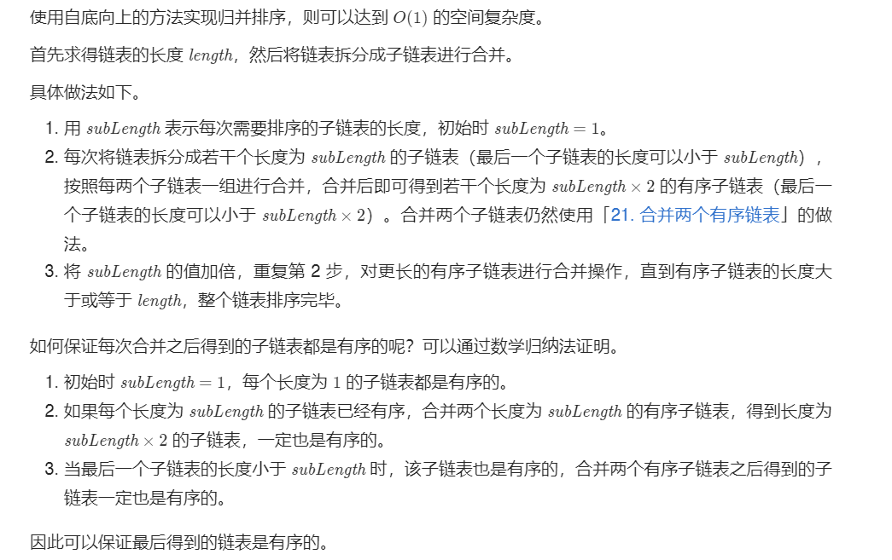
>
> ```java
> public ListNode sortList(ListNode head) {
>         int length = 0;
>         ListNode node = head; //找到链表长度
>         while (node!=null){
>             node = node.next;
>             length++;
>         }
>         //初始化
>         ListNode dummynode = new ListNode(0);
>         dummynode.next = head;
>         // 循环  子链表从1开始
>         for (int sublength=1;sublength<length;sublength<<=1){
>             ListNode prev = dummynode;
>             ListNode curr = dummynode.next;
> 
>             while (curr!=null){
>                 ListNode head1 = curr;
>                 for (int i=1;i<sublength&&curr!=null&&curr.next!=null;i++){
>                     curr = curr.next;
>                     //第一个链表
>                 }
>                 //第二个链表
>                 ListNode head2 = curr.next;
>                 curr.next = null;
>                 curr = head2;
>                 for (int i=1;i<sublength&&curr!=null&&curr.next!=null;i++){
>                     curr = curr.next;
>                 }
> 
>                 //如果不是因为到了链表结尾而终止，就把第二个链表断开
>                 ListNode next = null;
>                 if (curr!=null){
>                     next = curr.next;
>                     curr.next = null;
>                 }
> 
>                 //合并两个链表
>                 ListNode merged = Merge(head1, head2);
>                 prev.next = merged;
>                 while (prev.next!=null)
>                     prev = prev.next;
>                 
>                 curr = next;
>             }
>         }
>         return dummynode.next;
>     }
>     private ListNode Merge(ListNode list1, ListNode list2) {
>         ListNode dummynode = new ListNode(0);
>         ListNode temp=dummynode, temp1 = list1, temp2=list2;
>         while (temp1!=null && temp2!=null){
>             if (temp1.val <= temp2.val){
>                 temp.next = temp1;
>                 temp1 = temp1.next;
>             }
>             else{
>                 temp.next = temp2;
>                 temp2 = temp2.next;
>             }
>             temp = temp.next;
>         }
>         if (temp1!=null){
>             temp.next = temp1;
>         }
>         if (temp2!=null){
>             temp.next = temp2;
>         }
>         return dummynode.next;
>     }
> ```

#### [152. 乘积最大子数组](https://leetcode-cn.com/problems/maximum-product-subarray/)

> 给你一个整数数组 `nums` ，请你找出数组中乘积最大的连续子数组（该子数组中至少包含一个数字），并返回该子数组所对应的乘积。

##### 方法：动态规划

> 我们可以这样进行状态设计，也就是以$ nums[i]$ 结尾的连续子数组的最大值。现在具体看下如何进行状态设计、推导状态转移方程，进而加以实现。因为数组中存在着负数，所以有可能导致乘积会从最大变为最小，同样的，最小也可能变为最大。
>
> ==由于存在负数，那么会导致最大的变最小的，最小的变最大的。因此还需要维护当前最小值==
>
> ```java
>     public int maxProduct(int[] nums) {
>            if (nums.length==0)
>                return 0;
>            if (nums.length==1)
>                return nums[0];
>            int ans = nums[0];
>                 int theMax = nums[0], theMin = nums[0];
>            for (int i = 1; i < nums.length; i++) {
>                int max = theMax, min = theMin;
>                theMax = Math.max(min*nums[i], Math.max(nums[i], max*nums[i]));
>                theMin = Math.min(min*nums[i], Math.min(nums[i], max*nums[i]));
>                ans = Math.max(theMax, ans);
>            }
>            return ans;
>     }
>    ```

#### [155. 最小栈](https://leetcode-cn.com/problems/min-stack/)

> 设计一个支持 push ，pop ，top 操作，并能在常数时间内检索到最小元素的栈。
>
> - push(x) —— 将元素 x 推入栈中。
> - pop() —— 删除栈顶的元素。
> - top() —— 获取栈顶元素。
> - getMin() —— 检索栈中的最小元素。
>
> $$
> 输入：
> ["MinStack","push","push","push","getMin","pop","top","getMin"]\\
> [[],[-2],[0],[-3],[],[],[],[]]\\
> 
> 输出：\\
> [null,null,null,null,-3,null,0,-2]\\
> \\
> 解释：
> MinStack minStack = new MinStack();\\
> minStack.push(-2);\\
> minStack.push(0);\\
> minStack.push(-3);\\
> minStack.getMin();   --> 返回 -3.\\
> minStack.pop();\\
> minStack.top();      --> 返回 0.\\
> minStack.getMin();   --> 返回 -2.\\
> $$

##### 方法一：辅助栈

> 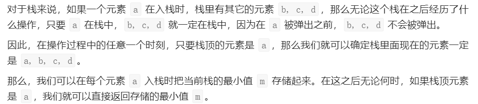
>
> 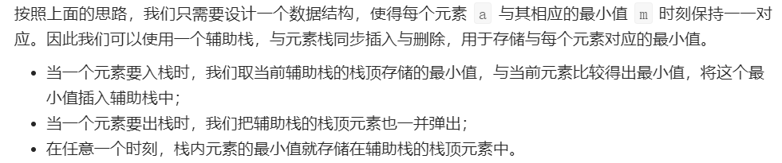
>
> ```java
> class MinStack {
> 
>     /** initialize your data structure here. */
>     Stack<Integer> stackA;
>     Stack<Integer> stackB;
> 
>     public MinStack() {
>         stackA = new Stack<>();
>         stackB = new Stack<>();
>     }
> 
>     public void push(int val) {
>         stackA.push(val);
>         if (stackB.isEmpty()){
>             stackB.push(val);
>         } else if (stackB.peek()>=val){
>             stackB.push(val);
>         }
>     }
> 
>     public void pop() {
>         int temp = stackA.pop();
>         if (temp == stackB.peek())
>             stackB.pop();
>     }
> 
>     public int top() {
>         return stackA.peek();
>     }
> 
>     public int getMin() {
>         return stackB.peek();
>     }
> }
> 
> /**
>  * Your MinStack object will be instantiated and called as such:
>  * MinStack obj = new MinStack();
>  * obj.push(val);
>  * obj.pop();
>  * int param_3 = obj.top();
>  * int param_4 = obj.getMin();
>  */
> ```

##### 方法二：链表

> 如果不能使用栈，我们可是使用链表的方法。我们可以定义这样一个链表，$val|min|next$，每次让$push$操作的时候都在链表的头部新建一个结点，其中$min$存放的是最小值。这样求最小值的时候，就可以返回头结点的$min$值就可以了。

> ```java
>class MinStack {
> 
>  /** initialize your data structure here. */
>      class Node{
>             int value;
>             int min;
>             Node next;
>             Node(){}
>             Node(int _value, int _min){this.value=_value; this.min=_min;next=null;}
>     }
>     Node head;
>    
>     public MinStack() {
>      head = null;
>     }
>    
>     public void push(int val) {
>      if (head==null){
>             Node node = new Node(val, val);
>             head = node;
>         }
>         else {
>             Node node = new Node(val, Math.min(val, head.min));
>             node.next = head;
>             head = node;
>         }
>     }
>    
>     public void pop() {
>      if (head==null)
>             return;
>         else {
>             head = head.next;
>         }
>     }
>    
>     public int top() {
>      if (head==null)
>             return -1;
>         else return head.value;
>     }
>    
>     public int getMin() {
>      if (head==null)
>             return -1;
>         else return head.min;
>     }
>    }
>    ```

#### [160. 相交链表](https://leetcode-cn.com/problems/intersection-of-two-linked-lists/)

> 编写一个程序，找到两个单链表相交的起始节点。
>
> 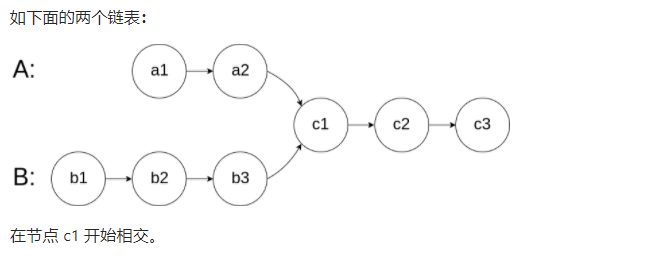

##### 方法一：暴力解决

> 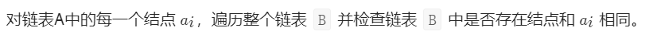

##### 方法二：哈希表

> 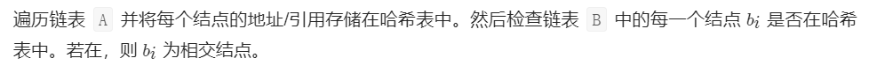
>
> > ```java
> > /**
> >  * Definition for singly-linked list.
> >  * public class ListNode {
> >  *     int val;
> >  *     ListNode next;
> >  *     ListNode(int x) {
> >  *         val = x;
> >  *         next = null;
> >  *     }
> >  * }
> >  */
> > public class Solution {
> >     public ListNode getIntersectionNode(ListNode headA, ListNode headB) {
> >         Set<ListNode> set = new HashSet<>();
> >         while (headA!=null){
> >             set.add(headA);
> >             headA = headA.next;
> >         }
> >         while (headB!=null){
> >             if (set.contains(headB))
> >                 return headB;
> >             headB = headB.next;
> >         }
> >         return null;
> >     }
> > }
> > ```

##### 方法三：双指针法

> 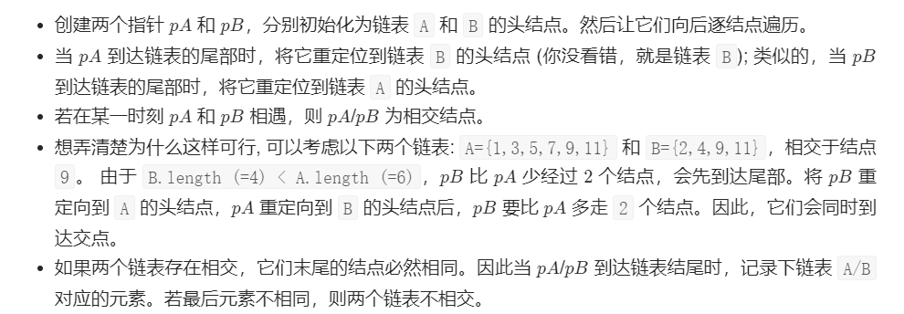
>
> > ```java
> > /**
> >  * Definition for singly-linked list.
> >  * public class ListNode {
> >  *     int val;
> >  *     ListNode next;
> >  *     ListNode(int x) {
> >  *         val = x;
> >  *         next = null;
> >  *     }
> >  * }
> >  */
> > public class Solution {
> >     public ListNode getIntersectionNode(ListNode headA, ListNode headB) {
> >         if (headA==null || headB==null)
> >             return null;
> >         ListNode currA=headA, currB=headB;
> >         while (currA!=null || currB!=null){
> >             if (currA==null)
> >                 currA = headB;
> >             if (currB==null)
> >                 currB = headA;
> >             if (currA==currB)
> >                 return currA;
> >             currA = currA.next;
> >             currB = currB.next;
> >         }
> >         return null;
> >     }
> > }
> > ```

##### 方法四：判断长度

> 因为两个链表不一样长，那么第一次遍历，分别记录两个链表的长度。然后将长度作差，让更长的链表先走相差的那些步，然后两个链表一起走，然后相遇的第一个结点即为两个链表相交的交点。
>
> ```java
> /**
>  * Definition for singly-linked list.
>  * public class ListNode {
>  *     int val;
>  *     ListNode next;
>  *     ListNode(int x) {
>  *         val = x;
>  *         next = null;
>  *     }
>  * }
>  */
> public class Solution {
>     public ListNode getIntersectionNode(ListNode headA, ListNode headB) {
>         if (headA==null || headB==null)
>             return null;
>         int length1 = 0, length2 = 0;
>         ListNode currA = headA, currB = headB;
>         while (currA!=null){
>             ++length1;
>             currA = currA.next;
>         }
>         while (currB!=null){
>             ++length2;
>             currB = currB.next;
>         }
>         int len = Math.abs(length1-length2);
>         for (int i=0;i<len;++i){
>             if (length1>length2){
>                 headA = headA.next;
>             }
>             if (length1<length2){
>                 headB = headB.next;
>             }
>         }
>         while (headA!=null){
>             if (headA == headB)
>                 return headA;
>             headA = headA.next;
>             headB = headB.next;
>         }
>         return null;
>     }
> }
> ```

#### [169. 多数元素](https://leetcode-cn.com/problems/majority-element/)

> 给定一个大小为 n 的数组，找到其中的多数元素。多数元素是指在数组中出现次数 大于 ⌊ n/2 ⌋ 的元素。
>
> 你可以假设数组是非空的，并且给定的数组总是存在多数元素。

##### 方法一：存储每个元素出现的次数

> 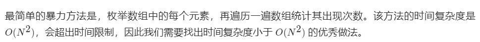

##### 方法二：哈希表

> 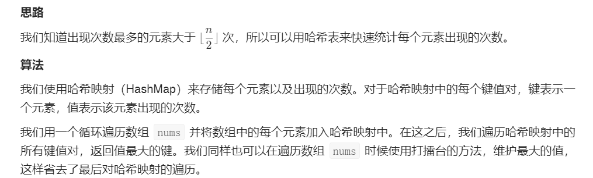
>
> ```java
> public int majorityElement(int[] nums) {
>     HashMap<Integer, Integer> map = new HashMap<>();
>     int n = nums.length;
>     for (int i = 0; i < nums.length; i++) {
>         int before = map.getOrDefault(nums[i], 0);
>         if (before == n / 2) { //超过半数的数字一定有且只有一个。所以在计数过程中如果出现了超过半数的数字，我们可以立刻返回
>             return nums[i];
>         }
>         map.put(nums[i], before + 1);
>     }
>     //随便返回一个
>     return -1;
> }
> ```

##### 方法四：排序

> 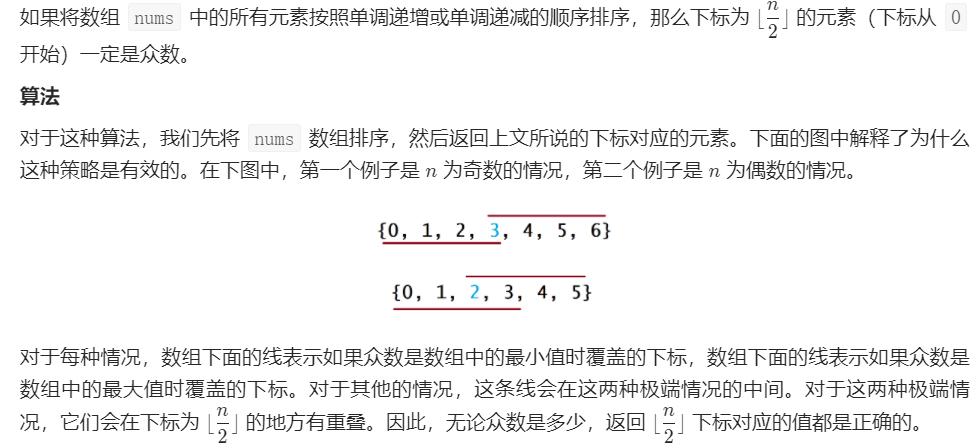
>
> ```java
> class Solution {
>     public int majorityElement(int[] nums) {
>         Arrays.sort(nums);
>         return nums[nums.length / 2];
>     }
> }
> ```

##### 方法五：摩尔投票法

> 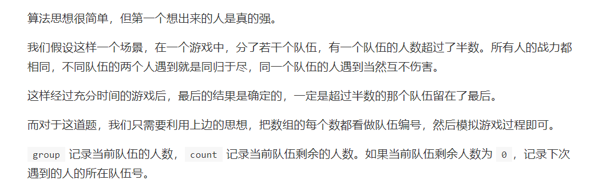
>
> ```java
> class Solution {
>     public int majorityElement(int[] nums) {
>         int ans = nums[0];
>         int count = 1;
>         for (int i=1;i<nums.length;++i){
>             if (count==0){
>                 ans = nums[i];
>                 count = 1;
>             }
>             else {
>                 if (ans == nums[i])
>                     ++count;
>                 else --count;
>             }
>         }
>         return ans;
>     }
> }
> ```

#### [198. 打家劫舍](https://leetcode-cn.com/problems/house-robber/)

> 你是一个专业的小偷，计划偷窃沿街的房屋。每间房内都藏有一定的现金，影响你偷窃的唯一制约因素就是相邻的房屋装有相互连通的防盗系统，如果两间相邻的房屋在同一晚上被小偷闯入，系统会自动报警。
>
> 给定一个代表每个房屋存放金额的非负整数数组，计算你 不触动警报装置的情况下 ，一夜之内能够偷窃到的最高金额。
> $$
> 输入：[1,2,3,1]\\
> 输出：4\\
> 解释：偷窃 1 号房屋 (金额 = 1) ，然后偷窃 3 号房屋 (金额 = 3)。\\
>      偷窃到的最高金额 = 1 + 3 = 4 。
> $$

##### 方法：动态规划

> 下面是自己的思路：
>
> ```java
> public int rob(int[] nums) {
>         /*
>         动态规划
>          */
>         int length = nums.length;
>         int[] dp = new int[length];
>         if (length==1)
>             return nums[0];
>         if (length==2)
>             return Math.max(nums[0], nums[1]);
>         if (length==3)
>             return Math.max(nums[0] + nums[2], nums[1]);
>         dp[0] = nums[0];
>         dp[1] = nums[1];
>         dp[2] = dp[0] + nums[2];
>         for (int i=3;i<length;i++){
>             dp[i] = nums[i] + Math.max(dp[i-2], dp[i-3]);
>         }
>         return Math.max(dp[length-1], dp[length-2]);
>     }
>    ```

> 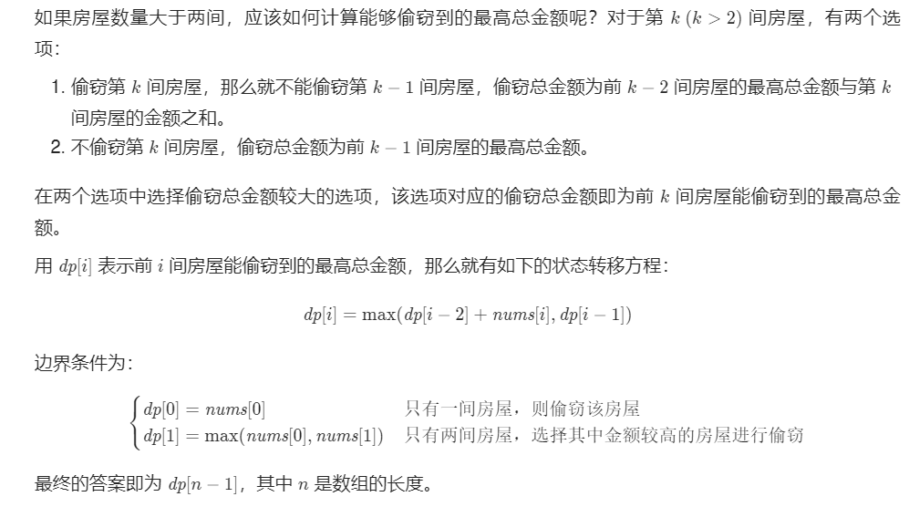
>
> ```java
>    class Solution {
>        public int rob(int[] nums) {
>            if (nums==null || nums.length==0)
>                return 0;
>            int length = nums.length;
>            if (length==1)
>                return nums[0];
>            int[] dp = new int[length];
>            dp[0] = nums[0];
>            dp[1] = Math.max(nums[0], nums[1]);
>            for (int i=2;i<length;++i){
>                dp[i] = Math.max(dp[i-1], nums[i] + dp[i-2]);
>            }
>            return dp[length-1];
>        }
>    }
> ```

> 上述方法使用了数组存储结果。考虑到每间房屋的最高总金额只和该房屋的前两间房屋的最高总金额相关，因此可以使用滚动数组，在每个时刻只需要存储前两间房屋的最高总金额。
>
> ```java
>    class Solution {
>        public int rob(int[] nums) {
>            if (nums==null || nums.length==0)
>                return 0;
>            int length = nums.length;
>            if (length==1)
>                return nums[0];
>            int first=nums[0], second=Math.max(nums[0], nums[1]);
>            for (int i=2;i<length;++i){
>                int temp = second;
>                second = Math.max(second, first + nums[i]);
>                first = temp;
>            }
>            return second;
>        }
>    }
> ```

#### [200. 岛屿数量](https://leetcode-cn.com/problems/number-of-islands/)

##### 方法一：深度优先遍历

> 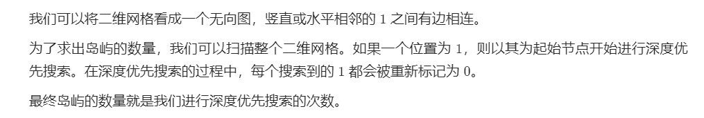
>
> ```java
> class Solution {
>        public int numIslands(char[][] grid) {
>            int rows = grid.length, cols = grid[0].length;
>            int count = 0;
>                 for (int i=0;i<rows;++i){
>                for (int j=0;j<cols;++j){
>                    if (grid[i][j] == '1'){
>                        ++count;
>                        DFS(grid, i, j);
>                    }
>                }
>            }
>            return count;
>        }
>    
>     private void DFS(char[][] grid, int i, int j) {
>            if (i<0 || i>=grid.length || j<0 || j>= grid[0].length || grid[i][j]=='0')
>                return;
>                 grid[i][j] = '0';
>            DFS(grid, i-1, j);
>            DFS(grid, i+1, j);
>                 DFS(grid, i, j+1);
>            DFS(grid, i, j-1);
>        }
>    }
>    ```

##### 方法二：宽度优先遍历

> 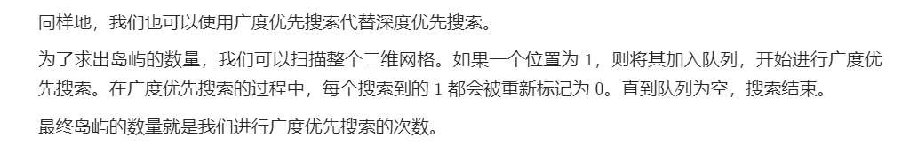
>
> ```java
> class Solution {
>     public int numIslands(char[][] grid) {
>         int row=grid.length, col=grid[0].length;
>         int count=0;
>         Queue<Integer> queue = new LinkedList<>();
> 
>         for (int i=0;i<row;++i){
>             for (int j=0;j<col;++j){
>                 if (grid[i][j]=='1'){
>                     ++count;
>                     grid[i][j] = '0';
>                     queue.offer(i*col+j);
>                     while (!queue.isEmpty()){
>                         int temp = queue.poll();
>                         int x = temp / col;
>                         int y = temp % col;
> 
>                         if ((x-1)>=0 && grid[x-1][y]=='1'){
>                             queue.offer((x-1)*col+y);
>                             grid[x-1][y] = '0';
>                         }
>                         if ((x+1)<row && grid[x+1][y]=='1'){
>                             queue.offer((x+1)*col+y);
>                             grid[x+1][y] = '0';
>                         }
>                         if ((y-1)>=0 && grid[x][y-1]=='1'){
>                             queue.offer(x*col + y-1);
>                             grid[x][y-1] = '0';
>                         }
>                         if ((y+1)<col && grid[x][y+1]=='1'){
>                             queue.offer(x*col + y+1);
>                             grid[x][y+1] = '0';
>                         }
>                     }
>                 }
>             }
>         }
>         return count;
>     }
> }
> ```

##### 方法三：并查集

>  为了求出岛屿的数量，我们可以扫描整个二维网格。如果一个位置为 1，则将其与相邻四个方向上的 1 在并查集中进行合并。
>
> 最终岛屿的数量就是并查集中连通分量的数目。
>
> 
>
> ```java
> class Solution {
>     class UnionFind {
>         int count;
>         int[] parent;
>         int[] rank;
> 
>         public UnionFind(char[][] grid) {
>             count = 0;
>             int m = grid.length;
>             int n = grid[0].length;
>             parent = new int[m * n];
>             rank = new int[m * n];
>             for (int i = 0; i < m; ++i) {
>                 for (int j = 0; j < n; ++j) {
>                     if (grid[i][j] == '1') {
>                         parent[i * n + j] = i * n + j;
>                         ++count;
>                     }
>                     rank[i * n + j] = 0;
>                 }
>             }
>         }
> 
>         public int find(int i) {
>             if (parent[i] != i) parent[i] = find(parent[i]);
>             return parent[i];
>         }
> 
>         public void union(int x, int y) {
>             int rootx = find(x);
>             int rooty = find(y);
>             if (rootx != rooty) {
>                 if (rank[rootx] > rank[rooty]) {
>                     parent[rooty] = rootx;
>                 } else if (rank[rootx] < rank[rooty]) {
>                     parent[rootx] = rooty;
>                 } else {
>                     parent[rooty] = rootx;
>                     rank[rootx] += 1;
>                 }
>                 --count;
>             }
>         }
> 
>         public int getCount() {
>             return count;
>         }
>     }
> 
>     public int numIslands(char[][] grid) {
>         if (grid == null || grid.length == 0) {
>             return 0;
>         }
> 
>         int nr = grid.length;
>         int nc = grid[0].length;
>         int num_islands = 0;
>         UnionFind uf = new UnionFind(grid);
>         for (int r = 0; r < nr; ++r) {
>             for (int c = 0; c < nc; ++c) {
>                 if (grid[r][c] == '1') {
>                     grid[r][c] = '0';
>                     if (r - 1 >= 0 && grid[r-1][c] == '1') {
>                         uf.union(r * nc + c, (r-1) * nc + c);
>                     }
>                     if (r + 1 < nr && grid[r+1][c] == '1') {
>                         uf.union(r * nc + c, (r+1) * nc + c);
>                     }
>                     if (c - 1 >= 0 && grid[r][c-1] == '1') {
>                         uf.union(r * nc + c, r * nc + c - 1);
>                     }
>                     if (c + 1 < nc && grid[r][c+1] == '1') {
>                         uf.union(r * nc + c, r * nc + c + 1);
>                     }
>                 }
>             }
>         }
> 
>         return uf.getCount();
>     }
> }
> ```

#### [206. 反转链表](https://leetcode-cn.com/problems/reverse-linked-list/)

##### 方法一：迭代

> ```java
> /**
>  * Definition for singly-linked list.
>  * public class ListNode {
>  *     int val;
>  *     ListNode next;
>  *     ListNode() {}
>  *     ListNode(int val) { this.val = val; }
>  *     ListNode(int val, ListNode next) { this.val = val; this.next = next; }
>  * }
>  */
> class Solution {
>     public ListNode reverseList(ListNode head) {
>         if (head==null)
>             return head;
>         ListNode prev=null, curr=head;
>         while (curr!=null){
>             ListNode next = curr.next;
>             curr.next = prev;
>             prev = curr;
>             curr = next;
>         }
>         return prev;
>     }
> }
> ```

##### 方法二：递归

> 假设链表为：
>
> $$
> n_1\rightarrow \ldots \rightarrow n_{k-1} \rightarrow n_k \rightarrow n_{k+1} \rightarrow \ldots \rightarrow n_m \rightarrow \varnothing
> $$
> 若从结点$n_{k+1}$到$n_m$已经被反转，而我们正处于$n_k$。
> $$
> n_1\rightarrow \ldots \rightarrow n_{k-1} \rightarrow n_k \rightarrow n_{k+1} \leftarrow \ldots \leftarrow n_m \leftarrow \varnothing
> $$
> 我们希望$n_{k+1}$的下一个结点指向$n_k$。
>
> 所以，$n_k.next.next = n_k$。
>
> 要注意的是 $n_1$ 的下一个节点必须指向 $\varnothing$。如果忽略了这一点，链表中可能会产生环。
>
> > ```java
> > class Solution {
> >     public ListNode reverseList(ListNode head) {
> >         if (head == null || head.next == null) {
> >             return head;
> >         }
> >         // 想象递归已经层层返回，到了最后一步
> >         // 以链表 1->2->3->4->5 为例，现在链表变成了 1->2<-3<-4<-5, 2->null
> >         // 此时 newHead是5，head是1
> >         ListNode newHead = reverseList(head.next);
> >         // 最后的操作是把链表 1->2->null 变成 2->1->null
> >         // head是1，head.next是2，head.next.next = head 就是2指向1，此时链表为 2->1->2
> >         head.next.next = head;
> >         // 防止链表循环，1指向null，此时链表为 2->1->null，整个链表为 5->4->3->2->1->null
> >         head.next = null;
> >         return newHead;
> >     }
> > }
> > ```


#### [207. 课程表](https://leetcode-cn.com/problems/course-schedule/)

> 你这个学期必须选修` numCourses `门课程，记为` 0` 到` numCourses - 1` 。
>
> 在选修某些课程之前需要一些先修课程。 先修课程按数组` prerequisites `给出，其中` prerequisites[i] = [ai, bi] `，表示如果要学习课程` ai `则 必须 先学习课程`  bi` 。
>
> 例如，先修课程对 `[0, 1]` 表示：想要学习课程` 0` ，你需要先完成课程` 1` 。
> 请你判断是否可能完成所有课程的学习？如果可以，返回 `true` ；否则，返回` false` 。

> 有了上述的简单分析，我们就可以将本题建模成一个求拓扑排序的问题了：
>
> - 我们将每一门课看成一个节点；
>
> - 如果想要学习课程 $A$ 之前必须完成课程 $B$，那么我们从 $B$ 到 $A$ 连接一条有向边。这样以来，在拓扑排序中，$B$ 一定出现在 $A$ 的前面。
>
> 求出该图是否存在拓扑排序，就可以判断是否有一种符合要求的课程学习顺序。事实上，由于求出一种拓扑排序方法的最优时间复杂度为 $O(n+m)$$，其中 n 和 m 分别是有向图 G 的节点数和边数，方法见 [210. 课程表 II 的官方题解](https://leetcode-cn.com/problems/course-schedule-ii/solution/ke-cheng-biao-ii-by-leetcode-solution/)。而判断图 G 是否存在拓扑排序，至少也要对其进行一次完整的遍历，时间复杂度也为 O(n+m)。因此不可能存在一种仅判断图是否存在拓扑排序的方法，它的时间复杂度在渐进意义上严格优于 O(n+m)。这样一来，我们使用和 [210. 课程表 II 完全相同的方法](https://leetcode-cn.com/problems/course-schedule/solution/ke-cheng-biao-by-leetcode-solution/)，但无需使用数据结构记录实际的拓扑排序。为了叙述的完整性，下面的两种方法与 [210. 课程表 II 的官方题解](https://leetcode-cn.com/problems/course-schedule/solution/ke-cheng-biao-by-leetcode-solution/) 完全相同，但在「算法」部分后的「优化」部分说明了如何省去对应的数据结构。

**找图中是否有环**

##### 方法一：深度优先遍历

> 我们可以将深度优先搜索的流程与拓扑排序的求解联系起来，用一个栈来存储所有**已经搜索完成的节点**。
>
> > 对于一个节点 u，如果它的所有相邻节点都已经搜索完成，那么在搜索回溯到 u 的时候，u 本身也会变成一个已经搜索完成的节点。这里的「相邻节点」指的是从 u 出发通过一条有向边可以到达的所有节点。
>
> 假设我们当前搜索到了节点 u，如果它的所有相邻节点都已经搜索完成，那么这些节点都已经在栈中了，此时我们就可以把 u 入栈。可以发现，如果我们从栈顶往栈底的顺序看，由于 u 处于栈顶的位置，那么 u 出现在所有 u 的相邻节点的前面。因此对于 u 这个节点而言，它是满足拓扑排序的要求的。
>
> 这样以来，我们对图进行一遍深度优先搜索。当每个节点进行回溯的时候，我们把该节点放入栈中。最终从栈顶到栈底的序列就是一种拓扑排序。
>
> > 算法
>
> 对于图中的任意一个节点，它在搜索的过程中有三种状态，即：
>
> - 「未搜索」：我们还没有搜索到这个节点；
>
> - 「搜索中」：我们搜索过这个节点，但还没有回溯到该节点，即该节点还没有入栈，还有相邻的节点没有搜索完成；
>
> - 「已完成」：我们搜索过并且回溯过这个节点，即该节点已经入栈，并且所有该节点的相邻节点都出现在栈的更底部的位置，满足拓扑排序的要求。
>
>
> 通过上述的三种状态，我们就可以给出使用深度优先搜索得到拓扑排序的算法流程，在每一轮的搜索搜索开始时，我们任取一个「未搜索」的节点开始进行深度优先搜索。
>
> - 我们将当前搜索的节点 u 标记为「搜索中」，遍历该节点的每一个相邻节点 v：
>   - 如果 v 为「未搜索」，那么我们开始搜索 v，待搜索完成回溯到 u；
>   - 如果 v 为「搜索中」，那么我们就找到了图中的一个环，因此是不存在拓扑排序的；
>   - 如果 v 为「已完成」，那么说明 v 已经在栈中了，而 u 还不在栈中，因此 u 无论何时入栈都不会影响到 (u, v) 之前的拓扑关系，以及不用进行任何操作。
> - 当 u 的所有相邻节点都为「已完成」时，我们将 u 放入栈中，并将其标记为「已完成」。
>
>
> 在整个深度优先搜索的过程结束后，如果我们没有找到图中的环，那么栈中存储这所有的 n 个节点，从栈顶到栈底的顺序即为一种拓扑排序。
>
> 

```java
/**
 * 判断有没有环
 *      0 未搜索
 *      1 正在搜索
 *      2 搜索完
 */
class Solution {
    List<List<Integer>> edgs;
    int[] visited;
    boolean flag = true;
    public boolean canFinish(int numCourses, int[][] prerequisites) {
        // 深度优先遍历
        edgs = new ArrayList<List<Integer>>();
        visited = new int[numCourses];
        for (int i=0;i<numCourses;i++)
            edgs.add(new ArrayList<>());

        for (int[] info: prerequisites){
            edgs.get(info[1]).add(info[0]); // 存储每一个课程所需的前序课程
        }

        for (int i=0;i<numCourses && flag;i++)
            if (visited[i]==0)
                dfs(i);

        return flag;
    }

    public void dfs(int u){
        visited[u] = 1;
        for (int v:edgs.get(u)){
            if (visited[v] == 0){ // 如果前序课程没有被搜索过
                visited[v] = 1; // 标记为正在搜索中
                dfs(v);
                if (!flag)
                    return;
            }
            if (visited[v] == 1){ // 说明存在环，退出
                flag = false;
                return;
            }
        }
        visited[u] = 2;
    }
}
```

##### 方法二：广度优先遍历

> 方法一的深度优先搜索是一种「逆向思维」：最先被放入栈中的节点是在拓扑排序中最后面的节点。我们也可以使用正向思维，顺序地生成拓扑排序，这种方法也更加直观。
>
> 我们考虑拓扑排序中最前面的节点，该节点一定不会有任何入边，也就是它没有任何的先修课程要求。当我们将一个节点加入答案中后，我们就可以移除它的所有出边，代表着它的相邻节点少了一门先修课程的要求。如果某个相邻节点变成了「没有任何入边的节点」，那么就代表着这门课可以开始学习了。按照这样的流程，我们不断地将没有入边的节点加入答案，直到答案中包含所有的节点（得到了一种拓扑排序）或者不存在没有入边的节点（图中包含环）。
>
> 上面的想法类似于广度优先搜索，因此我们可以将广度优先搜索的流程与拓扑排序的求解联系起来。
>
> > **算法**
>
> 我们使用一个队列来进行广度优先搜索。初始时，所有入度为 $0$ 的节点都被放入队列中，它们就是可以作为拓扑排序最前面的节点，并且它们之间的相对顺序是无关紧要的。
>
> 在广度优先搜索的每一步中，我们取出队首的节点 $u$：
>
> 我们将 $u$ 放入答案中；
>
> 我们移除 $u$ 的所有出边，也就是将 $u$ 的所有相邻节点的入度减少 $1$。如果某个相邻节点 $v$ 的入度变为 $0$，那么我们就将 $v$ 放入队列中。
>
> 在广度优先搜索的过程结束后。如果答案中包含了这 $n$ 个节点，那么我们就找到了一种拓扑排序，否则说明图中存在环，也就不存在拓扑排序了。
>
> ```java
> class Solution {
> 
>  List<List<Integer>> edges;
>  int[] indeg;
> 
>  public boolean canFinish(int numCourses, int[][] prerequisites) {
>      // 广度优先遍历
>      edges = new ArrayList<>();
>      indeg = new int[numCourses];
>      for (int i=0;i<numCourses;i++){
>          edges.add(new ArrayList<>());
>      }
> 
>      for (int[] info: prerequisites){
>          edges.get(info[1]).add(info[0]);
>          indeg[info[0]]++;
>      }
> 
>      Queue<Integer> queue = new LinkedList<>();
>      for (int i=0;i<numCourses;i++){
>          if (indeg[i]==0)
>              queue.offer(i);
>          //Queue 中 add() 和 offer()都是用来向队列添加一个元素。
>          //在容量已满的情况下，add() 方法会抛出IllegalStateException异常，offer() 方法只会返回 false 。
>      }
> 
>      int visited = 0;
>      while (!queue.isEmpty()){
>          visited++;
>          int u = queue.poll();
>          //Queue 中 remove() 和 poll()都是用来从队列头部删除一个元素。
> 	   //在队列元素为空的情况下，remove() 方法会抛出NoSuchElementException异常，poll() 方法只会返回 null 。
>          for (int v:edges.get(u)){
>              --indeg[v];
>              if (indeg[v] == 0) {
>                  queue.offer(v);
>              }
>          }
>      }
>      return visited == numCourses;
>  }
> }
> ```

#### [208. 实现 Trie (前缀树)](https://leetcode-cn.com/problems/implement-trie-prefix-tree/)

> 实现一个 Trie (前缀树)，包含 `insert`, `search`, 和 `startsWith` 这三个操作。
> $$
> Trie trie = new Trie();\\
> 
> trie.insert("apple");\\
> trie.search("apple");   // 返回 true\\
> trie.search("app");     // 返回 false\\
> trie.startsWith("app"); // 返回 true\\
> trie.insert("app");   \\
> trie.search("app");     // 返回 true\\
> $$

***我是想着用个数组实现的，自己运行的时候没错，提交的时候一直有错误。***

> ```java
> class Trie {
> 
>     String[] tree;
>     int length;
>     /** Initialize your data structure here. */
>     public Trie() {
>         tree = new String[100];
>         length = 0;
>     }
> 
>     /** Inserts a word into the trie. */
>     public void insert(String word) {
>         for (int i=length-1;i>=0;i--)
>             tree[i+1] = tree[i];
>         tree[0] = word;
>         length++;
>     }
> 
>     /** Returns if the word is in the trie. */
>     public boolean search(String word) {
>         for (int i=0;i<length;i++)
>             if (tree[i] == word)
>                 return true;
>         return false;
>     }
> 
>     /** Returns if there is any word in the trie that starts with the given prefix. */
>     public boolean startsWith(String prefix) {
>         if (tree[0] == prefix)
>             return true;
>         return false;
>     }
> }
> 
> /**
>  * Your Trie object will be instantiated and called as such:
>  * Trie obj = new Trie();
>  * obj.insert(word);
>  * boolean param_2 = obj.search(word);
>  * boolean param_3 = obj.startsWith(prefix);
>  */
> ```

##### 方法：前缀树

Trie，又称前缀树或字典树，是一棵有根树，其每个节点包含以下字段：

- 指向子节点的指针数组 $\textit{children}$。对于本题而言，数组长度为 $26$，即小写英文字母的数量。此时 $\textit{children}[0]$ 对应小写字母 $a$，$\textit{children}[1]$ 对应小写字母 $b$，…，$\textit{children}[25]$对应小写字母 $z$。
- 布尔字段 $\textit{isEnd}$，表示该节点是否为字符串的结尾。

**插入字符串**

我们从字典树的根开始，插入字符串。对于当前字符对应的子节点，有两种情况：

- 子节点存在。沿着指针移动到子节点，继续处理下一个字符。
- 子节点不存在。创建一个新的子节点，记录在 $\textit{children}$ 数组的对应位置上，然后沿着指针移动到子节点，继续搜索下一个字符。

重复以上步骤，直到处理字符串的最后一个字符，然后将当前节点标记为字符串的结尾。

**查找前缀**

我们从字典树的根开始，查找前缀。对于当前字符对应的子节点，有两种情况：

- 子节点存在。沿着指针移动到子节点，继续搜索下一个字符。
- 子节点不存在。说明字典树中不包含该前缀，返回空指针。

重复以上步骤，直到返回空指针或搜索完前缀的最后一个字符。

若搜索到了前缀的末尾，就说明字典树中存在该前缀。此外，若前缀末尾对应节点的 $\textit{isEnd}$ 为真，则说明字典树中存在该字符串。

> ```java
> class Trie {
>     private Trie[] children;
>     private boolean isEnd;
> 
>     public Trie() {
>         children = new Trie[26];
>         isEnd = false;
>     }
>     
>     public void insert(String word) {
>         Trie node = this;
>         for (int i = 0; i < word.length(); i++) {
>             char ch = word.charAt(i);
>             int index = ch - 'a';
>             if (node.children[index] == null) {
>                 node.children[index] = new Trie();
>             }
>             node = node.children[index];
>         }
>         node.isEnd = true;
>     }
>     
>     public boolean search(String word) {
>         Trie node = searchPrefix(word);
>         return node != null && node.isEnd;
>     }
>     
>     public boolean startsWith(String prefix) {
>         return searchPrefix(prefix) != null;
>     }
> 
>     private Trie searchPrefix(String prefix) {
>         Trie node = this;
>         for (int i = 0; i < prefix.length(); i++) {
>             char ch = prefix.charAt(i);
>             int index = ch - 'a';
>             if (node.children[index] == null) {
>                 return null;
>             }
>             node = node.children[index];
>         }
>         return node;
>     }
> }
> ```


#### [215. 数组中的第K个最大元素](https://leetcode-cn.com/problems/kth-largest-element-in-an-array/)

> 在未排序的数组中找到第 **k** 个最大的元素。请注意，你需要找的是数组排序后的第 k 个最大的元素，而不是第 k 个不同的元素。
> $$
> 输入: [3,2,3,1,2,4,5,5,6] 和 k = 4 \\
> 输出: 4
> $$

##### 方法一：数组排序

```java
class Solution {
    public int findKthLargest(int[] nums, int k) {
        Arrays.sort(nums);
        return nums[nums.length-k];
    }
}
```

##### 方法二：快速排序

> 先回想一下快排的过程：
>
> - 确定分界点x，在区间[ l , r ]随意取一个数
> - 根据分界点x调整，使得x左边的数都小于等于x，x右边的数都大于等于x **（难点）**
> - 递归处理左边和右边
>
> 在第二步中，我们给数组进行从大到小逆序排序，即使得 $x$ 左边都大于等于 $x$，$x$ 右边都小于等于x，这样我们就可以确定 $x$ 在数组中的位置。
>
> - 如果 $x$ 左边的数目多于 $k$，那就说明第 $k$ 大的元素在左边，我们再对左边进行快速排序；
> - 如果 $x$ 左边的数目少于 $k$，那就说明第 $k$ 大的元素在右边，我们在对右边进行快速排序；
>
> > ```java
> > class Solution {
> >     public int findKthLargest(int[] nums, int k) {
> >         return quicklySort(nums, 0, nums.length - 1, k);
> >     }
> >     int quicklySort(int[] nums, int l, int r, int k) {
> >         if(l >= r) return nums[l];  //代表找到了第k个数，直接返回就是答案。
> >         int x = nums[l];    //确定分界点
> >         int i = l - 1, j = r + 1;   //方便后面统一处理
> >         while(i < j) {      //使得x左边都大于等于x，右边都小于等于x
> >             while(nums[++i] >= x);
> >             while(nums[--j] < x);
> >             if(i < j) {
> >                 int t = nums[i];
> >                 nums[i] = nums[j];
> >                 nums[j] = t;
> >             }
> >         }
> >         int s = j - l + 1;  //计算左区间的个数
> >         if(s >= k)      //如果左区间个数比k大，代表第k个数在左区间
> >             return quicklySort(nums, l, j, k);
> >         else
> >             return quicklySort(nums, j + 1, r, k - s);
> >     }
> > }
> > ```

##### 方法三：堆排序

> 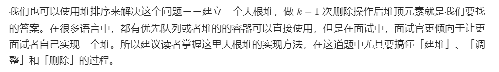
>
> ```java
> class Solution {
>        public int findKthLargest(int[] nums, int k) {
>            CreateMaxHeap(nums);
>            for (int i=nums.length-1;i>nums.length-1-k;--i){
>                int temp = nums[i];
>                nums[i] = nums[0];
>                nums[0] = temp;
>                AdjustHeap(nums, 0, i);
>            }
>            return nums[nums.length-k];
>        }
> 
>        // 创建大根堆
>        private void CreateMaxHeap(int[] nums) {
>            int length = nums.length;
>            for (int i=(length-2)/2;i>=0;i--){
>                AdjustHeap(nums, i, length);
>         }
>        }
>    
>        private void AdjustHeap(int[] nums, int index, int length) {
>            int temp = nums[index];
>            for (int i=2*index+1;i<length;i=2*i+1){
>                if (i+1<length && nums[i+1]>nums[i])
>                    i++;
>                if (temp>=nums[i])
>                    break;
>                else {
>                    nums[index] = nums[i];
>                    index = i;
>                }
>         }
>            nums[index] = temp;
>        }
>    }
>    ```

#### [221. 最大正方形](https://leetcode-cn.com/problems/maximal-square/)

> 在一个由 `'0'` 和 `'1'` 组成的二维矩阵内，找到只包含 `'1'` 的最大正方形，并返回其面积。
>
> 

##### 方法一：暴力破解

> 由于正方形的面积等于边长的平方，因此要找到最大正方形的面积，首先需要找到最大正方形的边长，然后计算最大边长的平方即可。
>
> 暴力法是最简单直观的做法，具体做法如下：
>
> - 遍历矩阵中的每个元素，每次遇到 $1$，则将该元素作为正方形的左上角；
>
> - 确定正方形的左上角后，根据左上角所在的行和列计算可能的最大正方形的边长（正方形的范围不能超出矩阵的行数和列数），在该边长范围内寻找只包含 $1$ 的最大正方形；
>
> - 每次在下方新增一行以及在右方新增一列，判断新增的行和列是否满足所有元素都是 $1$。
>
> > ```java
> > package Prob221;
> > 
> > /**
> >  * @author LYJ
> >  * @create 2021-05-18 19:09
> >  */
> > public class Solution {
> >     public int maximalSquare(char[][] matrix){
> >         int ans = 0;
> >         for (int i=0;i<matrix.length;i++){
> >             for (int j=0;j<matrix[0].length;j++){
> >                 if (matrix[i][j] == '1'){
> >                     int right = 0, bottom = 0, curr = 0;
> >                     while (Judge(matrix, i, j, right, bottom)){
> >                         ++curr;
> >                         ++right;
> >                         ++bottom;
> >                         ans = Math.max(curr, ans);
> >                     }
> >                 }
> >             }
> >         }
> >         return ans;
> >     }
> > 
> >     private boolean Judge(char[][] matrix, int x, int y, int right, int bottom) {
> >         boolean flag = true;
> >         for (int i=x;i<matrix.length && i<=x+right;i++){
> >             for (int j=y;j<matrix[0].length && j<=y+bottom;j++){
> >                 if (matrix[i][j] == '0'){
> >                     flag = false;
> >                     break;
> >                 }
> >             }
> >         }
> >         return flag;
> >     }
> > }
> > ```


##### 方法二：动态规划

> 我们用 $f[i][j]$ 表示以 $(i, j)$ 为右下角的正方形的最大边长，那么除此定义之外，$f[i][j] = x$ 也表示以 $(i, j)$ 为右下角的正方形的数目为 $x$（即边长为 $1, 2, ..., x$ 的正方形各一个）。在计算出所有的 $f[i][j]$ 后，我们将它们进行累加，就可以得到矩阵中正方形的数目。
>
> 
>
> 如上图所示，若对于位置 $(i, j)$ 有 $f[i][j] = 4$，我们将以 $(i, j)$ 为右下角、边长为 $4$ 的正方形涂上色，可以发现其左侧位置 $(i, j - 1)$，上方位置 $(i - 1, j)$ 和左上位置 $(i - 1, j - 1)$ 均可以作为一个边长为 $4 - 1 = 3$ 的正方形的右下角。也就是说，这些位置的的 $f$ 值至少为 $3$，即：
> $$
> f[i][j-1] >=f[i][j] - 1 \\
> f[i-1][j] >= f[i][j] - 1 \\
> f[i-1][j-1] >= f[i][j] - 1
> $$
> 联立这三个不等式可得：
> $$
> min(f[i][j-1], f[i-1][j], f[i-1][j-1]) >= f[i][j] - 1
> $$
> 这是我们通过固定 $f[i][j]$ 的值，判断其相邻位置与之的关系得到的不等式。同理，我们也可以固定 $f[i][j]$ 相邻位置的值，得到另外的限制条件。
>
> 
>
> 如上图所示，假设 $f[i][j - 1]$，$f[i - 1$][j] 和 $f[i - 1][j - 1]$ 中的最小值为 $3$，也就是说，$(i, j - 1)$，$(i - 1, j)$ 和 $(i - 1, j - 1)$ 均可以作为一个边长为 $3$ 的正方形的右下角。我们将这些边长为 $3$ 的正方形依次涂上色，可以发现，如果位置 $(i, j)$ 的元素为 $1$，那么它可以作为一个边长为 $4$ 的正方形的右下角，$f$ 值至少为 $4$，即：
>
> $$
> f[i][j]>=min(f[i][j-1], f[i-1][j], f[i-1][j-1]) + 1
> $$
> 最终我们可以得到：
> $$
> f[i][j] = min(f[i-1][j] , f[i][j-1], f[i-1][j-1])+1
> $$
>
> ```java
> class Solution {
>     public int maximalSquare(char[][] matrix) {
>         int rows=matrix.length, cols=matrix[0].length;
>         int[][] dp = new int[rows][cols];
>         int ans = 0;
>         for (int i=0;i<rows;++i){
>             dp[i][0] = matrix[i][0] - '0';
>             ans = Math.max(dp[i][0], ans);
>         }
>         for (int j=0;j<cols;++j){
>             dp[0][j] = matrix[0][j] - '0';
>             ans = Math.max(dp[0][j], ans);
>         }
>         for (int i=1;i<rows;++i){
>             for (int j=1;j<cols;++j){
>                 if (matrix[i][j] == '1'){
>                     dp[i][j] = Math.min(dp[i-1][j-1], Math.min(dp[i-1][j], dp[i][j-1])) + 1; 
>                     ans = Math.max(ans, dp[i][j]);
>                 }
>                 else{
>                     dp[i][j] = 0;
>                 }
>             }
>         }
>         return ans * ans;
>     }
> }
> ```

#### [226. 翻转二叉树](https://leetcode-cn.com/problems/invert-binary-tree/)

> 翻转一棵二叉树。
>
> 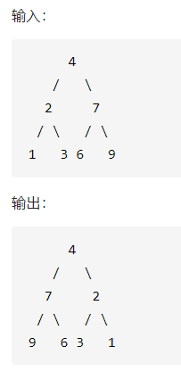


##### 方法一：层次遍历

> 按照层次遍历的思想，每次将出队的结点的左右孩子交换。
>
> > ```java
> > /**
> >  * Definition for a binary tree node.
> >  * public class TreeNode {
> >  *     int val;
> >  *     TreeNode left;
> >  *     TreeNode right;
> >  *     TreeNode() {}
> >  *     TreeNode(int val) { this.val = val; }
> >  *     TreeNode(int val, TreeNode left, TreeNode right) {
> >  *         this.val = val;
> >  *         this.left = left;
> >  *         this.right = right;
> >  *     }
> >  * }
> >  */
> > class Solution {
> >     public TreeNode invertTree(TreeNode root) {
> >         if (root==null)
> >             return null;
> >         Queue<TreeNode> queue = new LinkedList<>();
> >         queue.offer(root);
> >         while (!queue.isEmpty()){
> >             TreeNode node = queue.poll();
> >             TreeNode left = node.left;
> >             node.left = node.right;
> >             node.right = left;
> >             if (node.left!=null){
> >                 queue.offer(node.left);
> >             }
> >             if (node.right!=null){
> >                 queue.offer(node.right);
> >             }
> >         }
> >         return root;
> >     }
> > }
> > ```


##### 方法二：递归

> 这是一道很经典的二叉树问题。显然，我们从根节点开始，递归地对树进行遍历，并从叶子结点先开始翻转。如果当前遍历到的节点 $\textit{root}$ 的左右两棵子树都已经翻转，那么我们只需要交换两棵子树的位置，即可完成以 $\textit{root}$ 为根节点的整棵子树的翻转。
>
> ```java
>     public TreeNode invertTree(TreeNode root) {
>         if (root == null) {
>             return null;
>         }
>         TreeNode left = invertTree(root.left);
>         TreeNode right = invertTree(root.right);
>         root.left = right;
>         root.right = left;
>         return root;
>     }
> ```

#### [234. 回文链表](https://leetcode-cn.com/problems/palindrome-linked-list/)

##### 方法一：链表的值存入数组

> 思路：
>
> - 复制链表值到数组列表中；
> - 使用双指针判断链表是否是回文。
>
> ```java
> class Solution {
>  public boolean isPalindrome(ListNode head) {
>      List<Integer> vals = new ArrayList<Integer>();
> 
>      // 将链表的值复制到数组中
>      ListNode currentNode = head;
>      while (currentNode != null) {
>          vals.add(currentNode.val);
>          currentNode = currentNode.next;
>      }
> 
>      // 使用双指针判断是否回文
>      int front = 0;
>      int back = vals.size() - 1;
>      while (front < back) {
>          if (!vals.get(front).equals(vals.get(back))) {
>              return false;
>          }
>          front++;
>          back--;
>      }
>      return true;
>  }
> }
> ```


##### 方法二：栈

> 可以将链表的前半部分存入到栈中，然后根据栈**先进后出**的性质可以得到：
>
> - 如果链表是回文链表，那么栈中元素的顺序刚好和链表的后半部分是一样的；
>
> > ```java
> > /**
> >  * Definition for singly-linked list.
> >  * public class ListNode {
> >  *     int val;
> >  *     ListNode next;
> >  *     ListNode() {}
> >  *     ListNode(int val) { this.val = val; }
> >  *     ListNode(int val, ListNode next) { this.val = val; this.next = next; }
> >  * }
> >  */
> > class Solution {
> >     public boolean isPalindrome(ListNode head) {
> >         if (head==null){
> >             return true;
> >         }
> >         ListNode curr = head;
> >         int len = 0;
> >         while (curr!=null){
> >             ++len;
> >             curr = curr.next;
> >         }
> >         ListNode fast=head, slow=head;
> >         Stack<ListNode> stack = new Stack<>();
> >         for (int i=0;i<len/2;++i){
> >             stack.add(fast);
> >             fast = fast.next;
> >         }
> >         if (len%2==1)
> >             fast = fast.next;
> >         while (fast!=null){
> >             if (fast.val!=stack.peek().val){
> >                 return false;
> >             }
> >             fast = fast.next;
> >             stack.pop();
> >         }
> >         return true;
> >     }
> > }
> > ```


##### 方法三：递归

> 我们可以使用递归反向迭代结点，同时使用递归函数外的变量向前迭代。就可以判断链表是否是回文链表。
>
> - `currentNode`指针是先到尾结点，由于递归的性质是从后往前进行比较；
> - `frontPointer`是递归函数之外的指针，从前向后进行比较；
> - 若`currentNode.val!=frontPointer.val`则返回`false`。反之，`frontPointer`向前移动并返回`true`。
>
> 算法的正确性在于递归处理节点的顺序是相反的（回顾上面打印的算法），而我们在函数外又记录了一个变量，因此从本质上，我们同时在正向和逆向迭代匹配。
>
> ```java
> class Solution {
>  private ListNode frontPointer;
> 
>  private boolean recursivelyCheck(ListNode currentNode) {
>      if (currentNode != null) {
>          if (!recursivelyCheck(currentNode.next)) {
>              return false;
>          }
>          if (currentNode.val != frontPointer.val) {
>              return false;
>          }
>          frontPointer = frontPointer.next;
>      }
>      return true;
>  }
> 
>  public boolean isPalindrome(ListNode head) {
>      frontPointer = head;
>      return recursivelyCheck(head);
>  }
> }
> ```

##### 方法四：快慢指针+翻转链表

***这道题目自己最开始的想法是将整个链表反转，再跟之前的链表比较。但是发现如果整个链表反转的话，head也是反转了的，是无法比较的。没有想到有什么便捷的方法可以复制出一份链表。***

> 我们可以将链表的后半部分翻转，然后将前半部分和后半部分进行比较。**若题目需要链表结构不被修改的话，比较完之后再将链表恢复原样。**
>
> - 找到前半部分链表的尾结点；
> - 翻转后半部分链表；
> - 判断是否回文；
> - 恢复链表；
> - 返回结果。
>
> ```java
> public boolean isPalindrome(ListNode head) {
>      if (head == null)
>          return true;
>      ListNode fast = head, slow = head;
>     // 找到前半部分链表的尾节点并反转后半部分链表
>      while (fast.next!=null && fast.next.next!=null){
>          fast = fast.next.next;
>          slow = slow.next;
>      }
>      ListNode curr = slow.next;
>      ListNode begin = head;
>      ListNode end = reverseList(curr);
>     // 判断是否回文
>     // 结果
>     /**
>     我没有将链表的结构修改回去！！！！
>     */
>      while (begin!=null && end!=null){
>          if (begin.val != end.val)
>              return false;
>          begin = begin.next;
>          end = end.next;
>      }
>      return true;
>  }
> 
>  public ListNode reverseList(ListNode head) {
>      ListNode prev = null;
>      ListNode curr = head;
>      while (curr!=null){
>          ListNode next = curr.next;
>          curr.next = prev;
>          prev = curr;
>          curr = next;
>      }
>      return prev;
>  }
> ```

#### [236. 二叉树的最近公共祖先](https://leetcode-cn.com/problems/lowest-common-ancestor-of-a-binary-tree/)

> 给定一个二叉树, 找到该树中两个指定节点的最近公共祖先。
>
> 最近公共祖先的定义为：“对于有根树 T 的两个节点 p、q，最近公共祖先表示为一个节点 x，满足 x 是 p、q 的祖先且 x 的深度尽可能大（一个节点也可以是它自己的祖先）。”
>
> 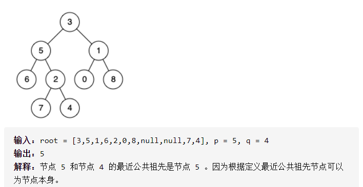

##### 方法一：递归

> 我们递归遍历整棵二叉树，定义 $f_x$，表示 $x$ 节点的子树中是否包含 $p$ 节点或 $q$ 节点，如果包含为 $true$，否则为 $false$。那么符合条件的最近公共祖先 $x$ 一定满足如下条件：
> $$
> (f_{\text{lson}}\ \&\&\ f_{\text{rson}})\ ||\ ((x\ =\ p\ ||\ x\ =\ q)\ \&\&\ (f_{\text{lson}}\ ||\ f_{\text{rson}}))
> $$
> 其中 $\text{lson}$ 和 $\text{rson}$ 分别代表 $x$ 节点的左孩子和右孩子。初看可能会感觉条件判断有点复杂。
>
> - $f_{\text{lson}}\ \&\&\ f_{\text{rson}}$说明左子树和右子树均包含 $p$ 节点或 $q$ 节点，如果左子树包含的是 $p$ 节点，那么右子树只能包含 $q$ 节点，反之然，因为 $p$ 节点和 $q$ 节点都是不同且唯一的节点，因此如果满足这个判断条件即可说明 $x$ 就是我们要找的最近公共祖先。
> - 再来看第二条判断条件：这个判断条件即是考虑了 $x$ 恰好是 $p$ 节点或 $q$ 节点且它的左子树或右子树有一个包含了另一个节点的情况，因此如果满足这个判断条件亦可说明 $x$ 就是我们要找的最近公共祖先。
>
> > ```java
> > /**
> >  * Definition for a binary tree node.
> >  * public class TreeNode {
> >  *     int val;
> >  *     TreeNode left;
> >  *     TreeNode right;
> >  *     TreeNode(int x) { val = x; }
> >  * }
> >  */
> > class Solution {
> >     TreeNode ans = null;
> >     public TreeNode lowestCommonAncestor(TreeNode root, TreeNode p, TreeNode q) {
> >         boolean flag = dfs(root, p, q);
> >         return ans;
> >     }
> > 
> >     private boolean dfs(TreeNode root, TreeNode p, TreeNode q) {
> >         if (root == null)
> >             return false;
> >         boolean lson = dfs(root.left, p, q);
> >         boolean rson = dfs(root.right, p, q);
> > 
> >         if ((lson && rson) || ((root.val==p.val)||(root.val == q.val)) && (lson||rson))
> >             ans = root;
> >         return (lson || rson || (root.val == p.val || root.val == q.val));
> >     }
> > }
> > ```

##### 方法二：后序遍历 DFS 

> **祖先的定义：**若节点 $p$ 在节点 $root$ 的左(右)子树中，或 $p=root$，则称 $root$ 是 $p$ 的祖先。
>
> 最近公共祖先的定义： 设节点 $root$ 为节点 $p, q$ 的某公共祖先，若其左子节点 $root.left$ 和右子节点 $root.right$ 都不是 $p,q$ 的公共祖先，则称 $root$ 是 “最近的公共祖先” 。
>
> 根据以上定义，若 $root$ 是 $p, q$ 的 最近公共祖先 ，则只可能为以下情况之一：
>
> 1. $p$ 和 $q$ 在 $root$ 的子树中，且分列 $root$ 的 **异侧**（即分别在左、右子树中）；
> 2. $p = root$ ，且 $q$ 在 $root$ 的左或右子树中；
> 3. $q = root$ ，且 $p$ 在 $root$ 的左或右子树中；
>
> - 递推工作：
>
>   - 开启递推左子树。返回值记为$left$；
>   - 开启递推右子树，返回子记为$right$。
>
> - 终止条件：
>
>   - 越过叶节点，则直接返回 $null$ ；
>   - 当$root$等于$p,q$，则直接返回 $root$ ；
>
> - 返回值：根据 $left$ 和 $right$ ，可分为四种情况，
>
>   - 当 $left$ 和 $right$ 同时为空：说明 $root$ 的左/右子树中都不包含 $p,q$ ,返回 $null$。
>
>   - 当 $left$ 和 $right$ 同时不为空：说明 $p,q$ 分别在 $root$ 的异侧 (分别在左/右子树)，因此 $root$ 为最近公共祖先，返回 $root$。
>
>   - 当 $left$ 为空，$right$ 不为空：$p,q$ 都不在 $root$ 的左子树，直接返回 $right$ 。
>
>     - $p,q$ 其中一个在 $root$ 的右子树中，此时 $right$ 指向 $p$（假设为 $p$）
>     - $p,q$ 两个节点都在 $root$ 的右子树中，此时的 $right$ 指向 **最近公共祖先节点**。
>
>   - 当 $left$ 不为空，$right$ 为空：与上一个情况相同。
>
>   - > 观察发现， 情况 `1.` 可合并至 `3.` 和 `4.` 内。
>
> ```java
> /**
>  * Definition for a binary tree node.
>  * public class TreeNode {
>  *     int val;
>  *     TreeNode left;
>  *     TreeNode right;
>  *     TreeNode(int x) { val = x; }
>  * }
>  */
> class Solution {
>     public TreeNode lowestCommonAncestor(TreeNode root, TreeNode p, TreeNode q) {
>         if (root==null || root==p || root==q)
>             return root;
>         TreeNode left = lowestCommonAncestor(root.left, p, q);
>         TreeNode right = lowestCommonAncestor(root.right, p, q);
> 
>         if (left==null)
>             return right;
>         if (right==null)
>             return left;
>         return root;
>     }
> }
> ```

##### 方法二：存储父节点

> 用哈希表存储所有节点的父节点。然后我们就可以利用节点的父节点信息从 $p$ 结点开始不断往上跳，并记录已经访问过的节点，再从 $q$ 节点开始不断往上跳，如果碰到已经访问过的节点，那么这个节点就是我们要找的最近公共祖先。
>
> - 遍历二叉树，存储所有节点的父节点。
> - 从节点 $p$ 开始往上跳，查找结点 $p$ 的父节点。同时记录已经查找过的节点。
> - 从节点 $q$ 往上跳，并且判断节点 $q$ 的父节点有没有被查找过。若被查找过，则该节点就是最近的公共节点。
>
> ```java
> /**
>  * Definition for a binary tree node.
>  * public class TreeNode {
>  *     int val;
>  *     TreeNode left;
>  *     TreeNode right;
>  *     TreeNode(int x) { val = x; }
>  * }
>  */
> class Solution {
>     public TreeNode lowestCommonAncestor(TreeNode root, TreeNode p, TreeNode q) {
>         Map<Integer, TreeNode> map = new HashMap<>();
>         Set<Integer> set = new HashSet<>();
>         if (p.val == q.val)
>             return p;
>         DFS(root, map);
>         while (p!=null){
>             set.add(p.val);
>             p = map.get(p.val);
>         }
>         while (q!=null){
>             if (set.contains(q.val))
>                 return q;
>             q = map.get(q.val);
>         }
>         return null;
>     }
> 
>     private void DFS(TreeNode root, Map<Integer, TreeNode> map) {
>         if (root.left!=null){
>             map.put(root.left.val, root);
>             DFS(root.left, map);
>         }
>         if (root.right!=null){
>             map.put(root.right.val, root);
>             DFS(root.right, map);
>         }
>     }
> }
> ```

#### [238. 除自身以外数组的乘积](https://leetcode-cn.com/problems/product-of-array-except-self/)

> 给你一个长度为 $n$ 的整数数组$ nums$，其中 $ n > 1$，返回输出数组 $output$ ，其中$ output[i] $等于 $nums $中除$ nums[i] $之外其余各元素的乘积。
>
> 说明: 请不要使用除法，且在 $O(n) $时间复杂度内完成此题。
>
> 进阶：
> 你可以在常数空间复杂度内完成这个题目吗？（ 出于对空间复杂度分析的目的，输出数组不被视为额外空间。）

##### 方法一：左右乘积列表

> 根据表格的主对角线（全为 $1$ ），可将表格分为 **上三角** 和 **下三角** 两部分。分别迭代计算下三角和上三角两部分的乘积，即可 **不使用除法** 就获得结果。
> $$
> B[i] = A[0]\times A[1]\times A[2] \times \dots A[i-1]\times A[i+1]\times\dots\times A[n-1]\times A[n]
> $$
>
> | $B[0]=$   | $1$     | $A[1]$  | $A[2]$  | $\dots$ | $A[n-1]$ | $A[n]$  |
> | --------- | ------- | ------- | ------- | ------- | -------- | ------- |
> | $B[1]=$   | $A[0]$  | $1$     | $A[2]$  | $\dots$ | $A[n-1]$ | $A[n]$  |
> | $B[2]=$   | $A[0]$  | $A[1]$  | $1$     | $\dots$ | $A[n-1]$ | $A[n]$  |
> | $\dots$   | $\dots$ | $\dots$ | $\dots$ | $\dots$ | $\dots$  | $\dots$ |
> | $B[n-2]=$ | $A[0]$  | $A[1]$  | $A[2]$  | $\dots$ | $A[n-1]$ | $A[n]$  |
> | $B[n-1]=$ | $A[0]$  | $A[1]$  | $A[2]$  | $\dots$ | $1$      | $A[n]$  |
> | $B[n]=$   | $A[0]$  | $A[1]$  | $A[2]$  | $\dots$ | $A[n-1]$ | $1$     |
>
> 
>
> 根据上面的表格和图像，我们可以将表格分为左边的 **上三角**和右边的 **下三角** 。分别求出两个三角的乘积即可。
>
> ```java
> class Solution {
>     public int[] productExceptSelf(int[] nums) {
>         int length = nums.length;
>         int[] left = new int[length];
>         int[] right = new int[length];
>         int[] ans = new int[length];
>         left[0]=1;
>         right[length-1] = 1;
>         for (int i=1;i<length;++i){
>             left[i] = left[i-1] * nums[i-1];
>         }
>         for (int i=length-2;i>=0;--i){
>             right[i] = right[i+1] * nums[i+1];
>         }
>         for (int i=0;i<length;++i){
>             ans[i] = left[i] * right[i];
>         }
>         return ans;
>     }
> }
> ```

##### 方法二：空间复杂度 O(1) 的方法

> - 初始化 `ans` 数组，对于给定索引 `i`，`ans[i]` 代表的是 `i` 左侧 **上三角** 所有数字的乘积。
> - 构造方式与之前相同，只是我们试图节省空间，先把 answer 作为方法一的 L 数组。
> - 这种方法的唯一变化就是我们没有构造 `right` 数组。而是用一个遍历来跟踪右边元素的乘积。并更新数组 `ans[i]=ans[i]*right`。然后 `right` 更新为 `right=right*nums[i]`，其中变量 `right` 表示的就是索引右侧数字的乘积。
>
> ```java
> class Solution {
>     public int[] productExceptSelf(int[] nums) {
>         int length = nums.length;
>         int[] ans = new int[length];
>         ans[0] = 1;
>         for (int i=1;i<length;++i){
>             ans[i] = ans[i-1] * nums[i-1];
>         }
>         int right = 1;
>         for (int i=length-1;i>=0;--i){
>             ans[i] = ans[i] * right;
>             right = right * nums[i];
>         }
>         return ans;
>     }
> }
> ```

#### [239. 滑动窗口最大值](https://leetcode-cn.com/problems/sliding-window-maximum/)

> 给你一个整数数组 `nums`，有一个大小为 `k` 的滑动窗口从数组的最左侧移动到数组的最右侧。你只可以看到在滑动窗口内的 `k` 个数字。滑动窗口每次只向右移动一位。
>
> 返回滑动窗口中的最大值。
>
> > ```java
> > 输入：nums = [1,3,-1,-3,5,3,6,7], k = 3
> > 输出：[3,3,5,5,6,7]
> > 解释：
> > 滑动窗口的位置                最大值
> > ---------------               -----
> > [1  3  -1] -3  5  3  6  7       3
> >  1 [3  -1  -3] 5  3  6  7       3
> >  1  3 [-1  -3  5] 3  6  7       5
> >  1  3  -1 [-3  5  3] 6  7       5
> >  1  3  -1  -3 [5  3  6] 7       6
> >  1  3  -1  -3  5 [3  6  7]      7
> > 
> > 输入：nums = [1], k = 1
> > 输出：[1]
> > ```

##### 方法一：顺序遍历

> 从第一个滑动窗口开始，每次形成一个窗口，每次找一个最大值。
>
> > ```java
> > class Solution {
> >  public int[] maxSlidingWindow(int[] nums, int k) {
> >      if (nums==null || nums.length==0)
> >          return new int[]{};
> > 
> >      List<Integer> list = new ArrayList<>();
> >      int slow=0, fast=k-1;
> >      while (fast<=nums.length-1){
> >          GetTheMax(nums, slow, fast, list);
> >          fast++;
> >          slow++;
> >      }
> >      int[] ans = new int[list.size()];
> >      for (int i=0;i<list.size();i++)
> >          ans[i] = list.get(i);
> >      return ans;
> >  }
> > 
> >  private void GetTheMax(int[] nums, int slow, int fast, List<Integer> list) {
> >      int max = nums[slow];
> >      for (int i=slow;i<=fast;i++)
> >          if (nums[i]>max)
> >              max=nums[i];
> >      list.add(max);
> >  }
> > }
> > ```

##### 方法二：优先队列

> 初始时，我们将数组 `nums` 的前 `k` 个元素放入优先队列中。每当我们向右移动窗口时，我们就可以把一个新的元素放入优先队列中，此时堆顶的元素就是堆中所有元素的最大值。然而这个最大值可能并不在滑动窗口中，在这种情况下，这个值在数组 `nums` 中的位置出现在滑动窗口左边界的左侧。因此，当我们后续继续向右移动窗口时，这个值就永远不可能出现在滑动窗口中了，我们可以将其永久地从优先队列中移除。
>
> ```java
> class Solution {
>     public int[] maxSlidingWindow(int[] nums, int k) {
>         int length = nums.length;
>         PriorityQueue<int[]> queue = new PriorityQueue<int[]>(new Comparator<int[]>() {
>             public int compare(int[] pair1, int[] pair2) {
>                 return pair1[0] != pair2[0] ? pair2[0] - pair1[0] : pair2[1] - pair1[1];
>             }
>         });
>         for (int i=0;i<k;++i)
>             queue.offer(new int[]{nums[i], i});
>         int right = k, left=1;
>         int[] ans = new int[length-k+1];
>         ans[0] = queue.peek()[0];
>         while (right<length){
>             queue.offer(new int[]{nums[right], right});
>             while (queue.peek()[1]<=left-1)
>                 queue.poll();
>             ans[left] = queue.peek()[0];
>             left++;
>             right++;
>         }
>         return ans;
>     }
> }
> ```

##### 方法三：单调队列

> 我们可以顺着方法二的思路继续进行优化。
>
> 由于我们需要求出的是滑动窗口的最大值，如果当前的滑动窗口中有两个下标 `i` 和 `j`，其中 `i` 在 `j` 的左侧`(i < j)`，并且 `i` 对应的元素不大于 `j` 对应的元素（`nums[i]≤nums[j]`），那么会发生什么呢？
>
> 当滑动窗口向右移动时，只要 `i` 还在窗口中，那么 `j` 一定也还在窗口中，这是 `i` 在 `j` 的左侧所保证的。因此，由于 `nums[j]` 的存在，`nums[i]` 一定不会是滑动窗口中的最大值了，我们可以将 `nums[i]` 永久地移除。
>
> 因此我们可以使用一个队列存储所有还没有被移除的下标。在队列中，这些下标按照从小到大的顺序被存储，并且它们在数组 `nums` 中对应的值是严格单调递减的。因为如果队列中有两个相邻的下标，它们对应的值相等或者递增，那么令前者为 `i`，后者为 `j`，就对应了上面所说的情况，即 `nums[i]` 会被移除，这就产生了矛盾。
>
> 当滑动窗口向右移动时，我们需要把一个新的元素放入队列中。为了保持队列的性质，我们会不断地将新的元素与队尾的元素相比较，如果前者大于等于后者，那么队尾的元素就可以被永久地移除，我们将其弹出队列。我们需要不断地进行此项操作，直到队列为空或者新的元素小于队尾的元素。
>
> 由于队列中下标对应的元素是严格单调递减的，因此此时队首下标对应的元素就是滑动窗口中的最大值。但与方法一中相同的是，此时的最大值可能在滑动窗口左边界的左侧，并且随着窗口向右移动，它永远不可能出现在滑动窗口中了。因此我们还需要不断从队首弹出元素，直到队首元素在窗口中为止。
>
> 为了可以同时弹出队首和队尾的元素，我们需要使用双端队列。满足这种单调性的双端队列一般称作「单调队列」。
>
> > ```java
> > class Solution {
> >     public int[] maxSlidingWindow(int[] nums, int k) {
> >         int[] ans = new int[nums.length-k+1];
> >         Deque<Integer> deque = new LinkedList<>();
> >         int left = 1-k, right=0;
> >         while (right<nums.length){
> >             if (left>0 && deque.peekFirst()==nums[left-1])
> >                 deque.removeFirst();
> >             while (!deque.isEmpty() && deque.peekLast()<nums[right])
> >                 deque.removeLast();
> >             deque.addLast(nums[right]);
> >             if (left>=0)
> >                 ans[left] = deque.peekFirst();
> >             ++left;
> >             ++right;
> >         }
> >         return ans;
> >     }
> > }
> > 
> > //注解版
> > class Solution {
> >  public int[] maxSlidingWindow(int[] nums, int k) {
> >      //单调队列
> >      //下面是要注意的点：
> >      //队列按从大到小放入
> >      //如果首位值（即最大值）不在窗口区间，删除首位
> >      //如果新增的值小于队列尾部值，加到队列尾部
> >      //如果新增值大于队列尾部值，删除队列中比新增值小的值，如果在把新增值加入到队列中
> >      //如果新增值大于队列中所有值，删除所有，然后把新增值放到队列首位，保证队列一直是从大到小
> >      if (nums.length == 0)   return nums;
> > 
> >      Deque<Integer> deque = new LinkedList<>();
> >      int[] arr = new int[nums.length - k + 1];
> >      int index = 0;  //arr数组的下标
> >      //未形成窗口区间
> >      for (int i = 0; i < k; i++) {
> >          //队列不为空时，当前值与队列尾部值比较，如果大于，删除队列尾部值
> >          //一直循环删除到队列中的值都大于当前值，或者删到队列为空
> >          while (!deque.isEmpty() && nums[i] > deque.peekLast())  
> >              deque.removeLast();
> >          //执行完上面的循环后，队列中要么为空，要么值都比当前值大，然后就把当前值添加到队列中
> >          deque.addLast(nums[i]);
> >      }
> >      //窗口区间刚形成后，把队列首位值添加到队列中
> >      //因为窗口形成后，就需要把队列首位添加到数组中，而下面的循环是直接跳过这一步的，所以需要我们直接添加
> >      arr[index++] = deque.peekFirst();
> >      //窗口区间形成
> >      for (int i = k; i < nums.length; i++) {
> >          //i-k是已经在区间外了，如果首位等于nums[i-k]，那么说明此时首位值已经不再区间内了，需要删除
> >          if (deque.peekFirst() == nums[i - k])   
> >              deque.removeFirst();
> >          //删除队列中比当前值大的值
> >          while (!deque.isEmpty() && nums[i] > deque.peekLast())  
> >              deque.removeLast();
> >          //把当前值添加到队列中
> >          deque.addLast(nums[i]);
> >          //把队列的首位值添加到arr数组中
> >          arr[index++] = deque.peekFirst();
> >      }
> >      return arr;
> >  }
> > }
> > ```

#### 方法四：分块 + 预处理

> 我们可以将数组 $\textit{nums}$ 从左到右按照 $k$ 个一组进行分组，最后一组中元素的数量可能会不足 $k$ 个。如果我们希望求出 $\textit{nums}[i]$ 到 $\textit{nums}[i+k-1]$ 的最大值，就会有两种情况：
>
> - 如果 $i$ 是 $k$ 的倍数，那么 $\textit{nums}[i]$ 到 $\textit{nums}[i+k-1]$ 恰好是一个分组。我们只要预处理出每个分组中的最大值，即可得到答案；
>
> - 如果 $i$ 不是 $k$ 的倍数，那么 $\textit{nums}[i]$ 到 $\textit{nums}[i+k-1]$ 会跨越两个分组，占有第一个分组的后缀以及第二个分组的前缀。假设 $j$ 是 $k$ 的倍数，并且满足 $i < j \leq i+k-1$，那么 $\textit{nums}[i]$ 到 $\textit{nums}[j-1]$就是第一个分组的后缀，$\textit{nums}[j]$到 $\textit{nums}[i+k-1]$ 就是第二个分组的前缀。如果我们能够预处理出每个分组中的前缀最大值以及后缀最大值，同样可以在 $O(1)$ 的时间得到答案。
>
> 因此我们用 $\textit{prefixMax}[i]$ 表示下标 $i$ 对应的分组中，以 $i$ 结尾的前缀最大值；$\textit{suffixMax}[i]$ 表示下标 $i$ 对应的分组中，以 $i$ 开始的后缀最大值。它们分别满足如下的递推式
>
> 
>
> 需要注意在递推 $\textit{suffixMax}[i]$ 时需要考虑到边界条件 $\textit{suffixMax}[n-1]=\textit{nums}[n-1]$，而在递推 $\textit{prefixMax}[i]$ 时的边界条件 $\textit{prefixMax}[0]=\textit{nums}[0]$ 恰好包含在递推式的第一种情况中，因此无需特殊考虑。
>
> 在预处理完成之后，对于 $\textit{nums}[i]$] 到 $\textit{nums}[i+k-1]$ 的所有元素，如果 $i$ 不是 $k$ 的倍数，那么窗口中的最大值为 $\textit{suffixMax}[i]suffixMax[i] $一整个分组，$\textit{suffixMax}[i]$ 和 $\textit{prefixMax}[i+k-1]$ 都等于分组中的最大值，因此无论窗口属于哪一种情况，
>
> $$
> \max\big\{ \textit{suffixMax}[i], \textit{prefixMax}[i+k-1] \big\}
> $$
> 即为答案。
>
> ```java
> class Solution {
>     public int[] maxSlidingWindow(int[] nums, int k) {
>         int n = nums.length;
>         int[] prefixMax = new int[n];
>         int[] suffixMax = new int[n];
>         for (int i = 0; i < n; ++i) {
>             if (i % k == 0) {
>                 prefixMax[i] = nums[i];
>             }
>             else {
>                 prefixMax[i] = Math.max(prefixMax[i - 1], nums[i]);
>             }
>         }
>         for (int i = n - 1; i >= 0; --i) {
>             if (i == n - 1 || (i + 1) % k == 0) {
>                 suffixMax[i] = nums[i];
>             } else {
>                 suffixMax[i] = Math.max(suffixMax[i + 1], nums[i]);
>             }
>         }
> 
>         int[] ans = new int[n - k + 1];
>         for (int i = 0; i <= n - k; ++i) {
>             ans[i] = Math.max(suffixMax[i], prefixMax[i + k - 1]);
>         }
>         return ans;
>     }
> }
> ```


#### [240. 搜索二维矩阵 II](https://leetcode-cn.com/problems/search-a-2d-matrix-ii/)

>编写一个高效的算法来搜索 m x n 矩阵 matrix 中的一个目标值 target 。该矩阵具有以下特性：
>
>每行的元素从左到右升序排列。
>每列的元素从上到下升序排列。
>
>

##### 方法一：暴力查找

> 这个方法就是通过两层循环遍历查找数组中所有的元素
>
> > ```java
> > class Solution {
> >     public boolean searchMatrix(int[][] matrix, int target) {
> >         for (int i = 0; i < matrix.length; i++) {
> >             for (int j = 0; j < matrix[0].length; j++) {
> >                 if (matrix[i][j] == target) {
> >                     return true;
> >                 }
> >             }
> >         }
> > 
> >         return false;
> >     }
> > }
> > 
> > ```

##### 方法二：观察数组

> 我们仔细观察数组可以发现：数组中有四个特殊的点：
>
> - 左上角：所有的元素都大于它；
> - 右下角：所有的元素都小于它；
> - 右上角：小于它的元素都在它的左边，大于它的元素都在它的下面；
> - 左下角：小于它的元素都在它的上面，大于它的元素都在它的右边；
>
> 我们可以根据这个性质，从右上角这个元素开始遍历，小于$target$则往下找，大于$target$则往左找
>
> > ```java
> > class Solution {
> >     public boolean searchMatrix(int[][] matrix, int target) {
> >         int row=matrix.length, col=matrix[0].length;
> >         int x=row-1, y=0;
> >         while (x>=0 && y<col){
> >             if (matrix[x][y] == target)
> >                 return true;
> >             else if (matrix[x][y]<target)
> >                 y++;
> >             else x--;
> >         }
> >         return false;
> >     }
> > }
> > ```

#### [279. 完全平方数](https://leetcode-cn.com/problems/perfect-squares/)

> 给定正整数 `n`，找到若干个完全平方数（比如 `1, 4, 9, 16, ...`）使得它们的和等于 `n`。你需要让组成和的完全平方数的个数最少。
>
> 给你一个整数 `n` ，返回和为 `n` 的完全平方数的 **最少数量** 。
>
> **完全平方数** 是一个整数，其值等于另一个整数的平方；换句话说，其值等于一个整数自乘的积。例如，`1`、`4`、`9` 和 `16` 都是完全平方数，而 `3` 和 `11` 不是。
>
> ```java
> 输入：n = 12
> 输出：3 
> 解释：12 = 4 + 4 + 4
>     
> 输入：n = 13
> 输出：2
> 解释：13 = 4 + 9
> ```

##### 方法一：动态规划

> - 首先初始化长度为 `n+1` 的数组 `dp`，每个位置都为 `0`;
> - 如果 `n` 为 `0`，则结果为 `0`;
> - 对数组进行遍历，下标为 `i`，每次都将当前数字先更新为最大的结果，即 `dp[i]=i`，比如 `i=4`，最坏结果为 `4=1+1+1+1` 即为 `4` 个数字;
> - 动态转移方程为：`dp[i] = MIN(dp[i], dp[i - j * j] + 1)`，`i` 表示当前数字，`j` 表示平方数;
> - 时间复杂度：`O(n*sqrt(n))`，`sqrt` 为平方根。
>
> > ```java
> > class Solution {
> >     public int numSquares(int n) {
> >         int[] dp = new int[n + 1]; // 默认初始化值都为0
> >         for (int i = 1; i <= n; i++) {
> >             dp[i] = i; // 最坏的情况就是每次+1
> >             for (int j = 1; i - j * j >= 0; j++) { 
> >                 dp[i] = Math.min(dp[i], dp[i - j * j] + 1); // 动态转移方程
> >             }
> >         }
> >         return dp[n];
> >     }
> > }
> > ```

##### 方法二：[贪心枚举](https://leetcode-cn.com/problems/perfect-squares/solution/wan-quan-ping-fang-shu-by-leetcode/)

> 为了更好的解释，我们首先定义一个名为 `is_divided_by(n, count)` 的函数，该函数返回一个布尔值，表示数字 `n` 是否可以被一个数字 `count` 组合，而不是像前面函数 `numSquares(n)` 返回组合的确切大小。
> $$
> numSquares(n)= 
> argmin_{count∈[1,2,...n]}
>  (is\_divided\_by(n,count))
> $$
> 与递归函数 `numSquare(n)` 不同，`is_divided_by(n, count)` 的递归过程可以归结为底部情况（即 `count==1`）更快。
>
> - 首先，我们准备一个小于给定数字 `n` 的完全平方数列表（称为 `square_nums`）。
> - 在主循环中，将组合的大小（称为 `count`）从 `1` 迭代到 `n`，我们检查数字 `n` 是否可以除以组合的和，即 `is_divided_by(n, count)`。
> - 函数 `is_divided_by(n, count)` 可以用递归的形式实现，如上面所说。
> - 在最下面的例子中，我们有 `count==1`，我们只需检查数字 `n` 是否本身是一个完全平方数。可以在 `square_nums` 中检查，即 $n \in \text{square_nums}$。如果 `square_nums` 使用的是集合数据结构，我们可以获得比 $n== int(sqrt(n)) ^ 2$ 更快的运行时间。
>
> > ```java
> > class Solution {
> >   Set<Integer> square_nums = new HashSet<Integer>();
> > 
> >   protected boolean is_divided_by(int n, int count) {
> >     if (count == 1) {
> >       return square_nums.contains(n);
> >     }
> > 
> >     for (Integer square : square_nums) {
> >       if (is_divided_by(n - square, count - 1)) {
> >         return true;
> >       }
> >     }
> >     return false;
> >   }
> > 
> >   public int numSquares(int n) {
> >     this.square_nums.clear();
> > 
> >     for (int i = 1; i * i <= n; ++i) {
> >       this.square_nums.add(i * i);
> >     }
> > 
> >     int count = 1;
> >     for (; count <= n; ++count) {
> >       if (is_divided_by(n, count))
> >         return count;
> >     }
> >     return count;
> >   }
> > }
> > ```

##### 方法三：贪心 + BFS（广度优先搜索）

> 正如上述贪心算法的复杂性分析种提到的，调用堆栈的轨迹形成一颗 N 元树，其中每个结点代表 `is_divided_by(n, count)` 函数的调用。基于上述想法，我们可以把原来的问题重新表述如下：
>
> 给定一个 N 元树，其中每个节点表示数字 n 的余数减去一个完全平方数的组合，我们的任务是在树中找到一个节点，该节点满足两个条件：
>
> (1) 节点的值（即余数）也是一个完全平方数。
> (2) 在满足条件（1）的所有节点中，节点和根之间的距离应该最小。
>
> 
>
> - 首先，我们准备小于给定数字 n 的完全平方数列表（即 `square_nums`）。
> - 然后创建 `queue` 遍历，该变量将保存所有剩余项在每个级别的枚举。
> - 在主循环中，我们迭代 `queue` 变量。在每次迭代中，我们检查余数是否是一个完全平方数。如果余数不是一个完全平方数，就用其中一个完全平方数减去它，得到一个新余数，然后将新余数添加到 `next_queue` 中，以进行下一级的迭代。一旦遇到一个完全平方数的余数，我们就会跳出循环，这也意味着我们找到了解。
>
> > ```java
> > class Solution {
> >   public int numSquares(int n) {
> > 
> >     ArrayList<Integer> square_nums = new ArrayList<Integer>();
> >     for (int i = 1; i * i <= n; ++i) {
> >       square_nums.add(i * i);
> >     }
> > 
> >     Set<Integer> queue = new HashSet<Integer>();
> >     queue.add(n);
> > 
> >     int level = 0;
> >     while (queue.size() > 0) {
> >       level += 1;
> >       Set<Integer> next_queue = new HashSet<Integer>();
> > 
> >       for (Integer remainder : queue) {
> >         for (Integer square : square_nums) {
> >           if (remainder.equals(square)) {
> >             return level;
> >           } else if (remainder < square) {
> >             break;
> >           } else {
> >             next_queue.add(remainder - square);
> >           }
> >         }
> >       }
> >       queue = next_queue;
> >     }
> >     return level;
> >   }
> > }
> > ```

#### [283. 移动零](https://leetcode-cn.com/problems/move-zeroes/)

> 给定一个数组 `nums`，编写一个函数将所有 `0` 移动到数组的末尾，同时保持非零元素的相对顺序。
>
> **示例:**
>
> ```java
> 输入: [0,1,0,3,12]
> 输出: [1,3,12,0,0]
> ```
>
> **说明**:
>
> 1. 必须在原数组上操作，不能拷贝额外的数组。
> 2. 尽量减少操作次数。

##### 方法：双指针

> 使用双指针，左指针指向当前已经处理好的序列的尾部，右指针指向待处理序列的头部。
>
> 右指针不断向右移动，每次右指针指向非零数，则将左右指针对应的数交换，同时左指针右移。
>
> 注意到以下性质：
>
> 1. 左指针左边均为非零数；
>
> 2. 右指针左边直到左指针处均为零。
>
>
> 因此每次交换，都是将左指针的零与右指针的非零数交换，且非零数的相对顺序并未改变。
>
> > ```java
> > class Solution {
> >     public void moveZeroes(int[] nums) {
> >         int left=0, right=0;
> >         while (right<nums.length){
> >             if (nums[right]!=0){
> >                 int temp = nums[right];
> >                 nums[right] = nums[left];
> >                 nums[left] = temp;
> >                 ++left;
> >             }
> >             ++right;
> >         }
> >     }
> > }
> > ```


#### [287. 寻找重复数](https://leetcode-cn.com/problems/find-the-duplicate-number/)

> 给定一个包含 `n + 1` 个整数的数组 `nums` ，其数字都在 `1` 到 `n` 之间（包括 `1` 和 `n`），可知至少存在一个重复的整数。
>
> 假设 `nums` 只有 一个重复的整数 ，找出 这个重复的数 。
>
> ```java
> 输入：nums = [1,3,4,2,2]
> 输出：2
> ```
>
> **进阶：**
>
> - 如何证明 `nums` 中至少存在一个重复的数字?
> - 你可以在不修改数组 `nums` 的情况下解决这个问题吗？
> - 你可以只用常量级 `O(1)` 的额外空间解决这个问题吗？
> - 你可以设计一个时间复杂度小于 O($n^2$) 的解决方案吗？

##### 方法一：排序+查找

> 最简单的方法便是先将数组进行排序，这样重复的数字一定挨在一起。
>
> > ```java
> > class Solution {
> >     public int findDuplicate(int[] nums) {
> >         Arrays.sort(nums);
> >         int ans = 0;
> >         for (int i=0;i<nums.length-1;++i){
> >             if (nums[i] == nums[i+1]){
> >                 ans = nums[i];
> >                 break;
> >             }
> >         }
> >         return ans;
> >     }
> > }
> > ```

##### 方法二：哈希集合统计个数

> 我们可以使用 `set` 集合统计出现过的次数，每次判断集合中是否存在该元素，若存在则返回该元素；若不存在，则将该元素加入集合中。
>
> > ```java
> > class Solution {
> >     public int findDuplicate(int[] nums) {
> >         Set<Integer> set = new HashSet<>();
> >         int ans = 0;
> >         for (int num: nums){
> >             if (set.contains(num)){
> >                 ans = num;
> >                 break;
> >             }
> >             else set.add(num);
> >         }
> >         return ans;
> >     }
> > }
> > ```

##### 方法三：二分查找

> 原数组不是有序的，但是我们知道重复的那个数字肯定是 `1` 到 `n` 中的某一个，而 `1,2...,n` 就是一个有序序列。因此我们可以对 `1,2...,n` 进行二分查找。
>
> `mid = (1 + n) / 2`，接下来判断最终答案是在 `[1, mid]` 中还是在 `[mid + 1, n]` 中。
>
> 我们只需要统计原数组中小于等于 `mid` 的个数，记为 `count`。
>
> 如果 `count > mid` ，鸽巢原理，在 `[1,mid]` 范围内的数字个数超过了 `mid` ，所以一定有一个重复数字。
>
> 否则的话，既然不在 `[1,mid]` ，那么最终答案一定在 `[mid + 1, n]` 中。
>
> > ```java
> > class Solution {
> >     public int findDuplicate(int[] nums) {
> >         int length = nums.length;
> >         int left = 1, right = length-1;
> >         while (left < right){
> >             int count = 0;
> >             int mid = left + (right - left) / 2;
> >             for (int i=0;i<length;++i){
> >                 if (nums[i] <= mid){
> >                     ++count;
> >                 }
> >             }
> >             if (count>mid){
> >                 right = mid;
> >             } else {
> >                 left = mid + 1;
> >             }
> >         }
> >         return left;
> >     }
> > }
> > ```

##### 方法四：二进制

> 我们先统计数组中每一位 `1` 的个数，即为 `a[i]`。再依次统计 `1` 到 `n` 中每一位 `1` 的个数，记为 `b[i]`。`i` 代表的是哪一位，因为是 `int`，所以范围是 `0` 到 `32`。
>
> 记重复的数字是 `res`。
>
> 如果 `a[i] > b[i]` 也就意味着 `res` 当前位是 `1`。
>
> 否则的话，`res` 当前位就是 `0`。
>
> 举个例子吧，`1 3 4 2 2`。
>
> ```java
> 1 3 4 2 2 写成 2 进制
> 1 [0 0 1]
> 3 [0 1 1]
> 4 [1 0 0]
> 2 [0 1 0]
> 2 [0 1 0]
> 
> 把 1 到 n,也就是 1 2 3 4 也写成 2 进制
> 1 [0 0 1]
> 2 [0 1 0]
> 3 [0 1 1]
> 4 [1 0 0]
> 
> 依次统计每一列 1 的个数, res = XXX
> 
> 原数组最后一列 1 的个数是 2
> 1 到 4 最后一列 1 的个数是 2
> 2 不大于 2,所以当前位是 0, res = XX0
> 
> 原数组倒数第二列 1 的个数是 3
> 1 到 4 倒数第二列 1 的个数是 2
> 3 大于 2,所以当前位是 1, res = X10
> 
> 原数组倒数第三列 1 的个数是 1
> 1 到 4 倒数第三列 1 的个数是 1
> 1 不大于 1,所以当前位是 0, res = 010
> 
> 所以 res = 010, 也就是 2
> ```
>
> > ```java
> > class Solution {
> >     public int findDuplicate(int[] nums) {
> >         int res = 0;
> >         int mask = 1;
> >         for (int i=0;i<32;++i){
> >             int a=0, b=0;
> >             mask = 1<<i;
> >             for (int j=0;j< nums.length;++j){
> >                 if ((nums[j]&mask)>0)
> >                     ++a;
> >                 if ((j&mask)>0)
> >                     ++b;
> >             }
> >             if (a>b)
> >                 res = res | mask;
> >         }
> >         return res;
> >     }
> > }
> > ```

##### 方法五：双指针

> 把数组的值看成 `next` 指针，数组的下标看成节点的索引。因为数组中至少有两个值一样，也说明有两个节点指向同一个位置，所以一定会出现环。
>
> 举个例子，`3 1 3 4 2` 可以看成下图的样子。
>
> 
>
> ```java
> nums[0] = 3
> nums[3] = 4
> nums[4] = 2
> nums[2] = 3
> ```
>
> 所以我们要做的就是找到上图中有环链表的入口点 `3`，也就是 [142 题](https://leetcode.wang/leetcode-142-Linked-List-CycleII.html) 。
>
> 我们需要快慢指针，同时从起点出发，慢指针一次走一步，快指针一次走两步，然后记录快慢指针相遇的点。
>
> 之后再用两个指针，一个指针从起点出发，一个指针从相遇点出发，当他们再次相遇的时候就是入口点了。
>
> > ```java
> > class Solution {
> >     public int findDuplicate(int[] nums) {
> >         int slow = nums[0];
> >         int fast = nums[nums[0]];
> >         while (slow!=fast){
> >             slow = nums[slow];
> >             fast = nums[nums[fast]];
> >         }
> >         slow = 0;
> >         while (slow!=fast){
> >             slow = nums[slow];
> >             fast = nums[fast];
> >         }
> >         return slow;
> >     }
> > }
> > ```


#### [297. 二叉树的序列化与反序列化](https://leetcode-cn.com/problems/serialize-and-deserialize-binary-tree/)

>序列化是将一个数据结构或者对象转换为连续的比特位的操作，进而可以将转换后的数据存储在一个文件或者内存中，同时也可以通过网络传输到另一个计算机环境，采取相反方式重构得到原数据。
>
>请设计一个算法来实现二叉树的序列化与反序列化。这里不限定你的序列 / 反序列化算法执行逻辑，你只需要保证一个二叉树可以被序列化为一个字符串并且将这个字符串反序列化为原始的树结构。
>
>

##### 方法：层次遍历

> 层次遍历二叉树即可。
>
> > ```java
> > /**
> >  * Definition for a binary tree node.
> >  * public class TreeNode {
> >  *     int val;
> >  *     TreeNode left;
> >  *     TreeNode right;
> >  *     TreeNode(int x) { val = x; }
> >  * }
> >  */
> > public class Codec {
> > 
> >     // Encodes a tree to a single string.
> >     public String serialize(TreeNode root) {
> >         if (root==null)
> >             return "[]";
> >         StringBuilder builder = new StringBuilder("[");
> >         Queue<TreeNode> queue = new LinkedList<>();
> >         queue.offer(root);
> >         while (!queue.isEmpty()){
> >             TreeNode node = queue.poll();
> >             if (node!=null) {
> >                 builder.append(node.val + ",");
> >                 queue.offer(node.left);
> >                 queue.offer(node.right);
> >             }
> >             else
> >                 builder.append("null,");
> >         }
> >         builder.deleteCharAt(builder.length()-1);
> >         builder.append("]");
> >         return builder.toString();
> >     }
> > 
> >     // Decodes your encoded data to tree.
> >     public TreeNode deserialize(String data) {
> >         if (data.equals("[]"))
> >             return null;
> >         String[] arr = data.substring(1, data.length()-1).split(",");
> >         TreeNode root = new TreeNode(Integer.valueOf(arr[0]));
> >         Queue<TreeNode> queue = new LinkedList<>();
> >         queue.offer(root);
> >         int index = 1;
> >         while (!queue.isEmpty()){
> >             TreeNode node = queue.poll();
> >             if (!arr[index].equals("null")){
> >                 TreeNode left = new TreeNode(Integer.parseInt(arr[index]));
> >                 node.left = left;
> >                 queue.offer(left);
> >             }
> >             ++index;
> >             if (!arr[index].equals("null")){
> >                 TreeNode right = new TreeNode(Integer.parseInt(arr[index]));
> >                 node.right = right;
> >                 queue.offer(right);
> >             }
> >             ++index;
> >         }
> >         return root;
> >     }
> > }
> > 
> > // Your Codec object will be instantiated and called as such:
> > // Codec ser = new Codec();
> > // Codec deser = new Codec();
> > // TreeNode ans = deser.deserialize(ser.serialize(root));
> > ```

##### 其他方法：见[官方解答](https://leetcode-cn.com/problems/serialize-and-deserialize-binary-tree/solution/er-cha-shu-de-xu-lie-hua-yu-fan-xu-lie-hua-by-le-2/)

#### [300. 最长递增子序列](https://leetcode-cn.com/problems/longest-increasing-subsequence/)

> 给你一个整数数组 `nums` ，找到其中最长严格递增子序列的长度。
>
> 子序列是由数组派生而来的序列，删除（或不删除）数组中的元素而不改变其余元素的顺序。例如，`[3,6,2,7]` 是数组 `[0,3,1,6,2,2,7]` 的子序列。
>
> ```
> 输入：nums = [10,9,2,5,3,7,101,18]
> 输出：4
> 解释：最长递增子序列是 [2,3,7,101]，因此长度为 4 。
> 
> 输入：nums = [7,7,7,7,7,7,7]
> 输出：1
> ```

##### 方法一：动态规划

> 我们用`dp[i]` 的值代表 `nums` 前 `i` 个数字的最长子序列长度。
>
> 设 $j∈[0,i)$，考虑每轮计算新 $dp[i]$ 时，遍历 $[0,i)$ 列表区间，做以下判断：
>
> - **当 $nums[i]>nums[j]$时**， $nums[i]$可以接在$nums[j]$之后，此情况下最长上升子序列长度为$dp[j]+1$。
> - **当 $nums[i]<=nums[j]$时**，此上升子序列不成立。
>
> 转移方程：
> $$
> dp[i] = max(dp[i], dp[j]+1), j\in [0,i]
> $$
> 例如：
>
> ```java
> nums : [10, 9, 2, 5, 3, 7, 101, 18]
>  dp  : [1, 1, 1, 2, 2, 3, 4, 4]
> ```
>
> > ```java
> > class Solution {
> >     public int lengthOfLIS(int[] nums) {
> >         int len = nums.length;
> >         int ans = 1;
> >         int[] dp = new int[len];
> >         Arrays.fill(dp, 1);
> >         for (int i=1;i<len;++i){
> >             for (int j=0;j<i;++j){
> >                 if (nums[j]<nums[i]){
> >                     dp[i] = Math.max(dp[i], dp[j] + 1);
> >                 }
> >             }
> >             ans = Math.max(ans, dp[i]);
> >         }
> >         return ans;
> >     }
> > }
> > ```

##### 方法二：动态规划+二分查找

> **状态定义：**
>
> - $tails[k]$的值代表 长度为 $k+1$ 子序列 的尾部元素值。
>
> **转移方程：** 
>
> 设 $res$ 为 $tails$ 当前长度，代表直到当前的最长上升子序列长度。设 $j∈[0,res)$，考虑每轮遍历 $nums[k]$ 时，通过二分法遍历 $[0,res)$列表区间，找出 $nums[k]$ 的大小分界点，会出现两种情况：
>
> - 区间中存在 $tails[i] > nums[k]$ ： 将第一个满足 $tails[i] > nums[k]$ 执行 $tails[i] = nums[k]$ ；因为更小的 $nums[k]$ 后更可能接一个比它大的数字（前面分析过）。
> - 区间中不存在 $tails[i] > nums[k]$ ： 意味着 $nums[k]$ 可以接在前面所有长度的子序列之后，因此肯定是接到最长的后面（长度为 $res$ ），新子序列长度为 $res + 1$。
>
> > ```java
> > class Solution {
> >     public int lengthOfLIS(int[] nums) {
> >         int[] tails = new int[nums.length];
> >         int res = 0;
> >         for (int num:nums){
> >             int left=0, right=res;
> >             while (left<right){
> >                 int mid = left + (right - left) / 2;
> >                 if (tails[mid] < num)
> >                     left = mid + 1;
> >                 else right = mid;
> >             }
> >             tails[left] = num;
> >             if (res==right)
> >                 ++res;
> >         }
> >         return res;
> >     }
> > }
> > ```

##### 方法三：贪心+二分查找

>没看明白：[官方解答](https://leetcode-cn.com/problems/longest-increasing-subsequence/solution/zui-chang-shang-sheng-zi-xu-lie-by-leetcode-soluti/)。
>
>考虑一个简单的贪心，如果我们要使上升子序列尽可能的长，则我们需要让序列上升得尽可能慢，因此我们希望每次在上升子序列最后加上的那个数尽可能的小。
>
>基于上面的贪心思路，我们维护一个数组 $d[i]$ ，表示长度为 $i$ 的最长上升子序列的末尾元素的最小值，用 $\textit{len}$记录目前最长上升子序列的长度，起始时 $len$ 为 $1$，$d[1] = \textit{nums}[0]$。
>
>同时我们可以注意到 $d[i]$ 是关于 $i$ 单调递增的。因为如果 $d[j] \geq d[i]$ 且 $j < i$，我们考虑从长度为 $i$ 的最长上升子序列的末尾删除 $i-j$ 个元素，那么这个序列长度变为 $j$ ，且第 $j$ 个元素 $x$（末尾元素）必然小于 $d[i]$，也就小于 $d[j]$。那么我们就找到了一个长度为 $j$ 的最长上升子序列，并且末尾元素比 $d[j]$ 小，从而产生了矛盾。因此数组 $d$ 的单调性得证。
>
>我们依次遍历数组 $\textit{nums}$中的每个元素，并更新数组 $d$ 和 $len$ 的值。如果 $\textit{nums}[i] > d[\textit{len}]$ 则更新 $len = len + 1$，否则在 $d[1 \ldots len]$中找满足 $d[i - 1] < \textit{nums}[j] < d[i]$ 的下标 $i$，并更新 $d[i] = \textit{nums}[j]$。
>
>根据 $d$数组的单调性，我们可以使用二分查找寻找下标 $i$，优化时间复杂度。
>
>最后整个算法流程为：
>
>设当前已求出的最长上升子序列的长度为$ \textit{len}$（初始时为 $1$），从前往后遍历数组 $\textit{nums}$，在遍历到 $\textit{nums}[i]$ 时：
>
>- 如果 $\textit{nums}[i] > d[\textit{len}]$ ，则直接加入到 $d$ 数组末尾，并更新 $\textit{len} = \textit{len} + 1$；
>
>- 否则，在 $d$ 数组中二分查找，找到第一个比 $\textit{nums}[i]$ 小的数 $d[k]$ ，并更新 $d[k + 1] = \textit{nums}[i]$。
>
>
>以输入序列$ [0, 8, 4, 12, 2]$为例：
>
>- 第一步插入 $0$，$d = [0]$；
>
>- 第二步插入 $8$，$d = [0, 8]$；
>
>- 第三步插入 $4$，$d = [0, 4]$；
>
>- 第四步插入 $12$，$d = [0, 4, 12]$；
>
>- 第五步插入 $2$，$d = [0, 2, 12]$]。
>
>> ```java
>> class Solution {
>>     public int lengthOfLIS(int[] nums) {
>>         int len = 1, n = nums.length;
>>         if (n == 0) {
>>             return 0;
>>         }
>>         int[] d = new int[n + 1];
>>         d[len] = nums[0];
>>         for (int i = 1; i < n; ++i) {
>>             if (nums[i] > d[len]) {
>>                 d[++len] = nums[i];
>>             } else {
>>                 int l = 1, r = len, pos = 0; // 如果找不到说明所有的数都比 nums[i] 大，此时要更新 d[1]，所以这里将 pos 设为 0
>>                 while (l <= r) {
>>                     int mid = (l + r) >> 1;
>>                     if (d[mid] < nums[i]) {
>>                         pos = mid;
>>                         l = mid + 1;
>>                     } else {
>>                         r = mid - 1;
>>                     }
>>                 }
>>                 d[pos + 1] = nums[i];
>>             }
>>         }
>>         return len;
>>     }
>> }
>> ```

#### [301. 删除无效的括号](https://leetcode-cn.com/problems/remove-invalid-parentheses/)

> 给你一个由若干括号和字母组成的字符串 `s` ，删除最小数量的无效括号，使得输入的字符串有效。
>
> 返回所有可能的结果。答案可以按 **任意顺序** 返回。
>
> ```java
> 输入: "()())()"
> 输出: ["()()()", "(())()"]
> 
> 输入: "(a)())()"
> 输出: ["(a)()()", "(a())()"]
> 
> 输入: ")("
> 输出: [""]
> ```

##### 方法：深度优先遍历

> 如果当前遍历到的左括号的数目严格小于右括号的数目则表达式无效（这一点非常重要）。
>
> 因此，我们可以遍历一次输入字符串，统计「左括号」和「右括号」出现的次数。
>
> - 当遍历到「右括号」的时候，
>   - 如果此时「左括号」的数量不为 $0$，因为 「右括号」可以与之前遍历到的「左括号」匹配，此时「左括号」出现的次数 $−1$；
>   - 如果此时「左括号」的数量为 $0$，「右括号」数量加 $1$；
> - 当遍历到「左括号」的时候，「左括号」数量加 $1$。
>
> 通过这样的计数规则，最后「左括号」和「右括号」的数量就是各自最少应该删除的数量
>
> > ```java
> > package Prob301;
> > 
> > import java.util.ArrayList;
> > import java.util.HashSet;
> > import java.util.List;
> > import java.util.Set;
> > 
> > public class Solution{
> > 
> >     private int len;
> >     private char[] charArray;
> >     private Set<String> validExpressions = new HashSet<>();
> > 
> >     public List<String> removeInvalidParentheses(String s) {
> >         this.len = s.length();
> >         this.charArray = s.toCharArray();
> > 
> >         // 第 1 步：遍历一次，计算多余的左右括号
> >         int leftRemove = 0;
> >         int rightRemove = 0;
> >         for (int i = 0; i < len; i++) {
> >             if (charArray[i] == '(') {
> >                 leftRemove++;
> >             } else if (charArray[i] == ')') {
> >                 // 遇到右括号的时候，须要根据已经存在的左括号数量决定
> >                 if (leftRemove == 0) {
> >                     rightRemove++;
> >                 }
> >                 if (leftRemove > 0) {
> >                     // 关键：一个右括号出现可以抵销之前遇到的左括号
> >                     leftRemove--;
> >                 }
> >             }
> >         }
> > 
> >         // 第 2 步：回溯算法，尝试每一种可能的删除操作
> >         StringBuilder path = new StringBuilder();
> >         dfs(0, 0, 0, leftRemove, rightRemove, path);
> >         return new ArrayList<>(this.validExpressions);
> >     }
> > 
> >     /**
> >      * @param index       当前遍历到的下标
> >      * @param leftCount   已经遍历到的左括号的个数
> >      * @param rightCount  已经遍历到的右括号的个数
> >      * @param leftRemove  最少应该删除的左括号的个数
> >      * @param rightRemove 最少应该删除的右括号的个数
> >      * @param path        一个可能的结果
> >      */
> >     private void dfs(int index, int leftCount, int rightCount, int leftRemove, int rightRemove, StringBuilder path) {
> >         if (index == len) {
> >             if (leftRemove == 0 && rightRemove == 0) {
> >                 validExpressions.add(path.toString());
> >             }
> >             return;
> >         }
> > 
> >         char character = charArray[index];
> >         // 可能的操作 1：删除当前遍历到的字符
> >         if (character == '(' && leftRemove > 0) {
> >             // 由于 leftRemove > 0，并且当前遇到的是左括号，因此可以尝试删除当前遇到的左括号
> >             dfs(index + 1, leftCount, rightCount, leftRemove - 1, rightRemove, path);
> >         }
> >         if (character == ')' && rightRemove > 0) {
> >             // 由于 rightRemove > 0，并且当前遇到的是右括号，因此可以尝试删除当前遇到的右括号
> >             dfs(index + 1, leftCount, rightCount, leftRemove, rightRemove - 1, path);
> >         }
> > 
> >         // 可能的操作 2：保留当前遍历到的字符
> >         path.append(character);
> >         if (character != '(' && character != ')') {
> >             // 如果不是括号，继续深度优先遍历
> >             dfs(index + 1, leftCount, rightCount, leftRemove, rightRemove, path);
> >         } else if (character == '(') {
> >             // 考虑左括号
> >             dfs(index + 1, leftCount + 1, rightCount, leftRemove, rightRemove, path);
> >         } else if (rightCount < leftCount) {
> >             // 考虑右括号
> >             dfs(index + 1, leftCount, rightCount + 1, leftRemove, rightRemove, path);
> >         }
> >         path.deleteCharAt(path.length() - 1);
> >     }
> > }
> > ```

#### [309. 最佳买卖股票时机含冷冻期](https://leetcode-cn.com/problems/best-time-to-buy-and-sell-stock-with-cooldown/)

> 给定一个整数数组，其中第 $i$ 个元素代表了第 $i$ 天的股票价格 。
>
> 设计一个算法计算出最大利润。在满足以下约束条件下，你可以尽可能地完成更多的交易（多次买卖一支股票）:
>
> - 你不能同时参与多笔交易（你必须在再次购买前出售掉之前的股票）。
> - 卖出股票后，你无法在第二天买入股票 (即冷冻期为 $1$ 天)。
>
> ```java
> 输入: [1,2,3,0,2]
> 输出: 3 
> 解释: 对应的交易状态为: [买入, 卖出, 冷冻期, 买入, 卖出]
> ```

##### 方法：动态规划

> - "冷冻期"状态只能是昨天刚买了股票，也就是"不持股"状态转移过来。
> - "不持股"状态可以由自己，或者昨天是"持股"状态，今天卖掉，转移过来。
> - "持股"状态可以由自己，或者昨天是"冷冻期"状态，今天买了，转移过来。
>
> > ```java
> > class Solution {
> >     public int maxProfit(int[] prices) {
> >         if (prices.length<2)
> >             return 0;
> >         int nonStock = 0; // 不持股
> >         int hasStock = -prices[0]; // 持股
> >         int coolDown = 0; // 冷冻期
> >         int lastNoStock = 0; // 上一次不持股
> >         for (int i=1;i< prices.length;++i){
> >             // "不持股"可以由"不持股"和"持股"转换而来。
> >             nonStock = Math.max(lastNoStock, hasStock+prices[i]);
> >             // "持股"可以由"持股"和"冷冻期"转换而来。
> >             hasStock = Math.max(hasStock, coolDown-prices[i]);
> >             // "冷冻期"只能由"不持股"转换而来。
> >             coolDown = lastNoStock;
> >             // 更新一下"上一次的不持股"状态
> >             lastNoStock = nonStock;
> >         }
> >         return Math.max(nonStock, nonStock);
> >     }
> > }
> > 
> > 
> > /**
> > 我们干脆就简化为持股状态和不持股状态两种，其状态转移方程可以描述为：
> > 
> > 持股状态可以由自己，或者连续两天为不持股状态，今天买了股票，转移而来。
> > 不持股状态可以由自己，或者前一天为持股状态，今天卖了股票，转移而来。
> > 因为我们记录的是每一天状态所对应的收入，那么所谓的连续两天为不持股状态，就是相当于从两天前收入不变。
> > **/
> > class Solution {
> >     public int maxProfit(int[] prices) {
> >         if (prices.length < 2) {
> >             return 0;
> >         }
> > 
> >         // 这次只有两个状态，但需要记录两天前的不持股收入
> >         // 定义初始情况
> >         // 不持股
> >         int noStock = 0;
> >         // 持股
> >         int hasStock = -prices[0];
> >         // 上一次的不持股
> >         int beforeNoStock = 0, temp;
> > 
> >         for (int i = 1; i < prices.length; i++) {
> >             // 记录一下"两天前的不持股"收入
> >             temp = noStock;
> >             // "不持股"可以由"不持股"和"持股"转换而来。
> >             noStock = Math.max(noStock, hasStock + prices[i]);
> >             // "持股"可以由"持股"和"冷冻期"转换而来。
> >             hasStock = Math.max(hasStock, beforeNoStock - prices[i]);
> >             // 更新一下"上一次的不持股"状态
> >             beforeNoStock = temp;
> >         }
> >                 
> >         // 最大值一定是最后一天不持股的情况
> >         return noStock;
> >     }
> > }
> > ```

#### [312. 戳气球](https://leetcode-cn.com/problems/burst-balloons/)

> 有 `n` 个气球，编号为`0` 到 `n - 1`，每个气球上都标有一个数字，这些数字存在数组 `nums` 中。
>
> 现在要求你戳破所有的气球。戳破第 `i` 个气球，你可以获得 `nums[i - 1] * nums[i] * nums[i + 1]` 枚硬币。 这里的 `i - 1` 和 `i + 1` 代表和 `i` 相邻的两个气球的序号。如果 `i - 1`或 `i + 1` 超出了数组的边界，那么就当它是一个数字为 `1` 的气球。
>
> 求所能获得硬币的最大数量。
>
> ```java
> 输入：nums = [3,1,5,8]
> 输出：167
> 解释：
> nums = [3,1,5,8] --> [3,5,8] --> [3,8] --> [8] --> []
> coins =  3*1*5    +   3*5*8   +  1*3*8  + 1*8*1 = 167
> ```

##### 方法：动态规划

> 为了计算方便，我们设置一个数组 `coins`，存储`nums` 以及两个边界的 `1`，即
> $$
> coins[0]=1, coins[i]=nums[i-1], coins[coins.length-1]=1
> $$
> 动态规划数组 `dp[m][n]`表示区间 `[m,n]` 能戳破气球获得的最大值。
>
> 我们枚举区间 `dp[m][n]` 内的所有位置 `mid`，假设 `nums[k]` 是最后一个戳破的气球，该操作能得到的硬币数是 $coins[m]\times coins[k]\times coins[n]$。同时递归的计算分割出的两区间对 `dp[m][n]` 的贡献，这三项之和的最大值，即为 `dp[m][n]` 的值。
>
> > ```java
> > class Solution {
> >     public int maxCoins(int[] nums) {
> >         int len = nums.length;
> >         int[] coins = new int[len+2];
> >         coins[0] = 1;
> >         coins[len+1] = 1;
> >         int[][] dp = new int[len+2][len+2];
> >         
> >         for (int i=0;i<len;++i){
> >             coins[i+1] = nums[i];
> >         }
> >         for (int i=2;i<len+2;++i){
> >             for (int j=0;j+i<len+2;++j){
> >                 for (int k=j+1;k<j+i;++k){
> >                     dp[j][j+i] = Math.max(dp[j][j+i], dp[j][k]+dp[k][j+i]+coins[j]*coins[k]*coins[j+i]);
> >                 }
> >             }
> >         }
> >         return dp[0][len+1];
> >     }
> > }
> > ```

#### [322. 零钱兑换](https://leetcode-cn.com/problems/coin-change/)

> 给定不同面额的硬币 `coins` 和一个总金额 `amount`。编写一个函数来计算可以凑成总金额所需的最少的硬币个数。如果没有任何一种硬币组合能组成总金额，返回 `-1`。
>
> 你可以认为每种硬币的数量是无限的。
>
> ```java
> 输入：coins = [1, 2, 5], amount = 11
> 输出：3 
> 解释：11 = 5 + 5 + 1
> 
> 输入：coins = [1], amount = 0
> 输出：0
> ```

##### 方法一：深度优先遍历（超时）

> 这种找路径，找方法的题一般可以使用回溯法。
>
> > ```java
> > class Solution {
> >     int res = Integer.MAX_VALUE;
> >     public int coinChange(int[] coins, int amount) {
> >         if(coins.length == 0){
> >             return -1;
> >         }
> > 
> >         findWay(coins,amount,0);
> > 
> >         // 如果没有任何一种硬币组合能组成总金额，返回 -1。
> >         if(res == Integer.MAX_VALUE){
> >             return -1;
> >         }
> >         return res;
> >     }
> > 
> >     public void findWay(int[] coins,int amount,int count){
> >         if(amount < 0){
> >             return;
> >         }
> >         if(amount == 0){
> >             res = Math.min(res,count);
> >         }
> > 
> >         for(int i = 0;i < coins.length;i++){
> >             findWay(coins,amount-coins[i],count+1);
> >         }
> >     }
> > }
> > ```


##### 方法二：记忆化搜索

> 在进行递归的时候，有很多重复的节点要进行操作，这样会浪费很多的时间。
>
> 使用数组 `memo[\ ]`来保存节点的值
>
> `memo[n]` 表示钱币 `n` 可以被换取的最少的硬币数，不能换取就为 `-1​`
>
> `DFS` 函数的目的是为了找到 `amount` 数量的零钱可以兑换的最少硬币数量，返回其值 `int`
>
> 在进行递归的时候，`memo[n]`被复制了，就不用继续递归了，可以直接的调用。
>
> > ```java
> > class Solution {
> >     int[] memo;
> >     public int coinChange(int[] coins, int amount) {
> >         if (amount==0)
> >             return 0;
> >         memo = new int[amount];
> >         return DFS(coins, amount);
> >     }
> >     
> >     // memo[n] 表示钱币n可以被换取的最少的硬币数，不能换取就为-1
> >     // DFS函数的目的是为了找到 amount数量的零钱可以兑换的最少硬币数量，返回其值int
> >     private int DFS(int[] coins, int amount) {
> >         if (amount<0)
> >             return -1;
> >         if (amount==0){
> >             return 0;
> >         }
> >         
> >         // 记忆化的处理，memo[n]用赋予了值，就不用继续下面的循环
> >         // 直接的返回memo[n] 的最优值
> >         if (memo[amount-1] != 0)
> >             return memo[amount-1];
> >         int min = Integer.MAX_VALUE;
> >         
> >         for (int i=0;i<coins.length;++i){
> >             int res = DFS(coins, amount-coins[i]);
> >             if (res>=0 && res<min)
> >                 min = res + 1; // 加1，是为了加上得到res结果的那个步骤中，兑换的一个硬币
> >         }
> >         memo[amount-1] = (min==Integer.MAX_VALUE ? -1 : min);
> >         return memo[amount-1];
> >     }
> > }
> > ```

##### 方法三：深度优先遍历

> 假设`F(i)`表示组成金额`i`所需要的最少的硬币数，假设在`F(i)`之前已经计算出了`F(0)~F(i-1)`。那么`F(i)`对应的状态转移方程为：
> $$
> F(i) = min(F(i), F(i-coins[j]) + 1)
> $$
> 用`coins=[1,2,5], amount=11`举例：
>
> | $F(i)$  | 最少的硬币数量                               |
> | ------- | -------------------------------------------- |
> | $F(0)$  | $0$                                          |
> | $F(1)$  | $1 //F(1)=min(F(1-1), F(1-2),F(1-5))+1=1$    |
> | $F(2)$  | $1 //F(1)=min(F(2-1), F(2-2),F(2-5))+1=1$    |
> | $F(3)$  | $2 //F(1)=min(F(3-1), F(3-2),F(3-5))+1=2$    |
> | $\dots$ | $\dots$                                      |
> | $F(11)$ | $3 //F(1)=min(F(11-1), F(11-2),F(11-5))+1=3$ |
>
> > ```java
> > class Solution {
> >     public int coinChange(int[] coins, int amount) {
> >         if (amount==0)
> >             return 0;
> >         int[] dp = new int[amount+1];
> >         Arrays.fill(dp, amount+1);
> >         dp[0] = 0;
> >         for (int i=1;i<=amount;++i){
> >             for (int j=0;j<coins.length;++j){
> >                 if (coins[j]<=i){
> >                     dp[i] = Math.min(dp[i], dp[i-coins[j]]+1);
> >                 }
> >             }
> >         }
> >         return dp[amount] > amount ? -1 : dp[amount];
> >     }
> > }
> > ```

#### [337. 打家劫舍 III](https://leetcode-cn.com/problems/house-robber-iii/)

> 在上次打劫完一条街道之后和一圈房屋后，小偷又发现了一个新的可行窃的地区。这个地区只有一个入口，我们称之为“根”。 除了“根”之外，每栋房子有且只有一个“父“房子与之相连。一番侦察之后，聪明的小偷意识到“这个地方的所有房屋的排列类似于一棵二叉树”。 如果两个直接相连的房子在同一天晚上被打劫，房屋将自动报警
>
> 计算在不触动警报的情况下，小偷一晚能够盗取的最高金额。
>
> **实例1**
>
> ```java
> 输入: [3,2,3,null,3,null,1]
> 
>      3
>     / \
>    2   3
>     \   \ 
>      3   1
> 
> 输出: 7 
> 解释: 小偷一晚能够盗取的最高金额 = 3 + 3 + 1 = 7.
> ```
>
> **实例2**
>
> ```java
> 输入: [3,4,5,1,3,null,1]
> 
>      3
>     / \
>    4   5
>   / \   \ 
>  1   3   1
> 
> 输出: 9
> 解释: 小偷一晚能够盗取的最高金额 = 4 + 5 = 9.
> ```

##### 方法：动态规划

> 根据题目要求，不能同时选择父子结点。
>
> 我们用`f(o)`表示选择当前结点`o`的情况下，结点`o`的最大权重和；`g(o)`表示不选择当前结点`o`的情况下，结点`o`的最大权重和。假设结点`o`的左右孩子结点分别是`left`，`right`。
> $$
> f(o) = o.val + g(left) + g(right);\\
> g(o) = max\{f(left), g(left)\} + max\{f(right), g(right)\}
> $$
> 我们用两个哈希表存储所有情况。
>
> > ```java
> > /**
> >  * Definition for a binary tree node.
> >  * public class TreeNode {
> >  *     int val;
> >  *     TreeNode left;
> >  *     TreeNode right;
> >  *     TreeNode() {}
> >  *     TreeNode(int val) { this.val = val; }
> >  *     TreeNode(int val, TreeNode left, TreeNode right) {
> >  *         this.val = val;
> >  *         this.left = left;
> >  *         this.right = right;
> >  *     }
> >  * }
> >  */
> > class Solution {
> >     Map<TreeNode, Integer> f = new HashMap<>();
> >     Map<TreeNode, Integer> g = new HashMap<>();
> > 
> >     public int rob(TreeNode root){
> >         Search(root);
> >         return Math.max(f.getOrDefault(root, 0), g.getOrDefault(root, 0));
> >     }
> > 
> >     private void Search(TreeNode root) {
> >         if (root==null)
> >             return;
> >         Search(root.left);
> >         Search(root.right);
> >         f.put(root, root.val + g.getOrDefault(root.left, 0) + g.getOrDefault(root.right, 0));
> >         g.put(root, Math.max(f.getOrDefault(root.left, 0), g.getOrDefault(root.left, 0)) + 
> >                 Math.max(f.getOrDefault(root.right, 0), g.getOrDefault(root.right, 0)));
> >     }
> > }
> > ```
>
> **优化**
>
> > ```java
> > /**
> >  * Definition for a binary tree node.
> >  * public class TreeNode {
> >  *     int val;
> >  *     TreeNode left;
> >  *     TreeNode right;
> >  *     TreeNode() {}
> >  *     TreeNode(int val) { this.val = val; }
> >  *     TreeNode(int val, TreeNode left, TreeNode right) {
> >  *         this.val = val;
> >  *         this.left = left;
> >  *         this.right = right;
> >  *     }
> >  * }
> >  */
> > class Solution {
> >     public int rob(TreeNode root) {
> >         int[] ans = DFS(root);
> >         return Math.max(ans[0], ans[1]);
> >     }
> > 
> >     private int[] DFS(TreeNode root) {
> >         if (root==null)
> >             return new int[]{0, 0};
> >         int[] left = DFS(root.left);
> >         int[] right = DFS(root.right);
> >         int select = root.val + left[1] + right[1];
> >         int notSelect = Math.max(left[0], left[1]) + Math.max(right[0], right[1]);
> >         return new int[]{select, notSelect};
> >     }
> > }
> > ```

#### [338. 比特位计数](https://leetcode-cn.com/problems/counting-bits/)

> 给定一个非负整数 **num**。对于 **0 ≤ i ≤ num** 范围中的每个数字 **i** ，计算其二进制数中的 1 的数目并将它们作为数组返回。
>
> > ```java
> > 输入: 2
> > 输出: [0,1,1]
> > 
> > 输入: 5
> > 输出: [0,1,1,2,1,2]
> > ```
> >
> > 进阶:
> >
> > - 给出时间复杂度为 `O(n*sizeof(integer))` 的解答非常容易。但你可以在线性时间 `O(n)` 内用一趟扫描做到吗？
> > - 要求算法的空间复杂度为 `O(n)` 。
> > - 你能进一步完善解法吗？要求在C++或任何其他语言中不使用任何内置函数（如 C++ 中的 __builtin_popcount）来执行此操作。

##### 方法一：顺序遍历

> 从`0~n`挨个遍历，每个遍历一个数，求该数的二进制中`1`的个数。
>
> > ```java
> > class Solution {
> >     public int[] countBits(int n) {
> >         int[] ans = new int[n+1];
> >         ans[0] = 0;
> >         for (int i=1;i<=n;++i){
> >             Bits(ans, i);
> >         }
> >         return ans;
> >     }
> > 
> >     public void Bits(int[] ans, int n){
> >         int num = 0, index = n;
> >         while (n>0){
> >             if ((n&1)==1)
> >                 ++num;
> >             n>>=1;
> >         }
> >         ans[index] = num;
> >     }
> > }
> > ```

##### 方法二：动态规划+最高有效位

> 对于正整数 $x$，如果可以知道最大的正整数 $y$，使得 $y \le x$ 且 $y$ 是 $2$ 的整数次幂，则 $y$ 的二进制表示中只有最高位是 $1$，其余都是 $0$，此时称 $y$ 为 $x$ 的「最高有效位」。令 $z=x-y$，显然 $0 \le z<x$，则 $\textit{bits}[x]=\textit{bits}[z]+1$。
>
> 显然，$0$ 的「一比特数」为 $0$。使用 $\textit{highBit}$ 表示当前的最高有效位，遍历从 $1$ 到 $\textit{num}$的每个正整数 $i$，进行如下操作。
>
> - 如果 $i\&(i-1)=0$，则令 $\textit{highBit}=i$，更新当前的最高有效位。
> - $i$ 比 $i-\textit{highBit}$ 的「一比特数」多 $1$，由于是从小到大遍历每个数，因此遍历到 $i$ 时，$i-\textit{highBit}$ 的「一比特数」已知，令 $\textit{bits}[i]=\textit{bits}[i-\textit{highBit}]+1$。
>
> > ```java
> > class Solution {
> >     public int[] countBits(int n) {
> >         int[] ans = new int[n+1];
> >         int highBit = 0;
> >         for (int i=1;i<=n;++i){
> >             if ((i&(i-1))==0)
> >                 highBit = i;
> >             ans[i] = ans[i-highBit] + 1;
> >         }
> >         return ans;
> >     }
> > }
> > ```

##### 方法三：动态规划+最低有效位

> 对于正整数 $x$，将其二进制表示右移一位，等价于将其二进制表示的最低位去掉，得到的数是 $\lfloor \frac{x}{2} \rfloor$。如果 $\textit{bits}\big[\lfloor \frac{x}{2} \rfloor\big]的$值已知，则可以得到 $\textit{bits}[x]$ 的值：
>
> - 如果$x$是偶数，则 $bits[x] = bits[\lfloor \frac{x}{2}\rfloor]$；
> - 如果$x$是奇数，则 $bits[x] = bits[\lfloor \frac{x}{2}\rfloor]+1$。
>
> 上述两种情况可以合并成：$\textit{bits}[x]$ 的值等于 $\textit{bits}\big[\lfloor \frac{x}{2} \rfloor\big]$ 的值加上 $x$ 除以 $2$ 的余数。
>
> 由于 $\lfloor \frac{x}{2} \rfloor$可以通过 $x >> 1$ 得到，$x$ 除以 $2$ 的余数可以通过$x \& 1$ 得到，因此有：$bits[x]=bits[x>>1]+(x \& 1)$。
>
> > ```java
> > class Solution {
> >     public int[] countBits(int n) {
> >         int[] ans = new int[n+1];
> >         for (int i=1;i<=n;++i){
> >             ans[i] = ans[i>>1] + (i&1);
> >         }
> >         return ans;
> >     }
> > }
> > ```

##### 方法四：最低设置位

> 定义正整数 $x$ 的「最低设置位」为 $x$ 的二进制表示中的最低的 $1$ 所在位。例如，$1010$ 的二进制表示是 $1010_{(2)}$, 其最低设置位为 $2$，对应的二进制表示是 $10_{(2)}$ 。
>
> 令 $y=x \& (x−1)$，则 $y$ 为将 $x$ 的最低设置位从 $1$ 变成 $0$ 之后的数，显然 $0 \le y<x0$，$\textit{bits}[x]=\textit{bits}[y]+1$。因此对任意正整数 $x$，都有 $\textit{bits}[x]=\textit{bits}[x~\&~(x-1)]+1$。
>
> 遍历从 $1$ 到 $\textit{num}$的每个正整数 $i$，计算 $\textit{bits}$的值。最终得到的数组 $\textit{bits}$即为答案。
>
> > ```java
> > class Solution {
> >     public int[] countBits(int n) {
> >         int[] ans = new int[n+1];
> >         for (int i=1;i<=n;++i){
> >             ans[i] = ans[i&(i-1)] + 1;
> >         }
> >         return ans;
> >     }
> > }
> > ```

#### [347. 前 K 个高频元素](https://leetcode-cn.com/problems/top-k-frequent-elements/)

> 给你一个整数数组 `nums` 和一个整数 `k` ，请你返回其中出现频率前 `k` 高的元素。你可以按 **任意顺序** 返回答案。
>
> ```java
> 输入: nums = [1,1,1,2,2,3], k = 2
> 输出: [1,2]
> 
> 输入: nums = [1], k = 1
> 输出: [1]
> ```

##### 方法一：暴力法

> 首先使用哈希表存储数组中每个元素出现的字符，然后循环 `k` 次，每次从哈希表中找出出现次数最多的那个元素，然后将该元素的出现次数变为`0`。
>
> > ```java
> > class Solution {
> >     public int[] topKFrequent(int[] nums, int k) {
> >         int[] ans = new int[k];
> >         Map<Integer, Integer> map = new HashMap<>();
> >         for (int i=0;i< nums.length;++i){
> >             map.put(nums[i], map.getOrDefault(nums[i], 0)+1);
> >         }
> >         int index=0;
> >         while (k>0){
> >             int curr = 0, count = 0;
> >             for (int i=0;i<nums.length;++i){
> >                 if (map.get(nums[i]) > count){
> >                     count = map.get(nums[i]);
> >                     curr = i;
> >                 }
> >             }
> >             map.put(nums[curr], 0);
> >             ans[index++] = nums[curr];
> >             --k;
> >         }
> >         return ans;
> >     }
> > }
> > ```

##### 方法二：哈希表+堆

>首先遍历整个数组，并使用哈希表记录每个数字出现的次数，并形成一个「出现次数数组」。找出原数组的前 `k` 个高频元素，就相当于找出「出现次数数组」的前 `k` 大的值。
>
>我们可以利用堆的思想：建立一个小顶堆，然后遍历「出现次数数组」：
>
>- 如果堆的元素个数小于 `k`，就可以直接插入堆中。
>- 如果堆的元素个数等于 `k`，则检查堆顶与当前出现次数的大小。如果堆顶更大，说明至少有 `k` 个数字的出现次数比当前值大，故舍弃当前值；否则，就弹出堆顶，并将当前值插入堆中。
>
>> ```java
>> class Solution {
>>  public int[] topKFrequent(int[] nums, int k) {
>>      Map<Integer, Integer> map = new HashMap<>();
>>      for (int i=0;i< nums.length;++i){
>>          map.put(nums[i], map.getOrDefault(nums[i], 0)+1);
>>      }
>>      PriorityQueue<int[]> queue = new PriorityQueue<int[]>(new Comparator<int[]>() {
>>          @Override
>>          public int compare(int[] m, int[] n) {
>>              return m[1]-n[1];
>>          }
>>      });
>>      for (Map.Entry<Integer, Integer> entry: map.entrySet()){
>>     int num=entry.getKey(), count=entry.getValue();
>>     if (queue.size()==k){
>>         if (queue.peek()[1]<count){
>>             queue.poll();
>>             queue.offer(new int[]{num, count});
>>         }
>>     } else {
>>         queue.offer(new int[]{num, count});
>>     }
>> }
>>     int[] ans = new int[k];
>>     for (int i=k-1;i>=0;--i){
>>         ans[i] = queue.poll()[0];
>>     }
>>     return ans;
>>     }
>> 
>

##### 方法三：快排

> 我们可以使用基于快速排序的方法，求出「出现次数数组」的前 `k`大的值。
>
> 在对数组 $\textit{arr}[l \ldots r]$ 做快速排序的过程中，我们首先将数组划分为两个部分 $\textit{arr}[i \ldots q-1]$ 与 $\textit{arr}[q+1 \ldots j]$，并使得 $\textit{arr}[i \ldots q-1]$ 中的每一个值都不超过 $\textit{arr}[q]$，且 $\textit{arr}[q+1 \ldots j]$ 中的每一个值都大于 $\textit{arr}[q]$。
>
> 于是，我们根据 $k$ 与左侧子数组 $\textit{arr}[i \ldots q-1]$ 的长度（为 $q-i$）的大小关系：
>
> - 如果 $k \le q-i$，则数组 $\textit{arr}[l \ldots r]$前 $k$ 大的值，就等于子数组 $\textit{arr}[i \ldots q-1]$ 前 $k$ 大的值。
> - 否则，数组 $\textit{arr}[l \ldots r]$ 前 $k$ 大的值，就等于左侧子数组全部元素，加上右侧子数组 $\textit{arr}[q+1 \ldots j]$ 中前 $k - (q - i)$ 大的值。
>
> > ```java
> > class Solution {
> >     public int[] topKFrequent(int[] nums, int k) {
> >         Map<Integer, Integer> occurrences = new HashMap<Integer, Integer>();
> >         for (int num : nums) {
> >             occurrences.put(num, occurrences.getOrDefault(num, 0) + 1);
> >         }
> > 
> >         List<int[]> values = new ArrayList<int[]>();
> >         for (Map.Entry<Integer, Integer> entry : occurrences.entrySet()) {
> >             int num = entry.getKey(), count = entry.getValue();
> >             values.add(new int[]{num, count});
> >         }
> >         int[] ret = new int[k];
> >         qsort(values, 0, values.size() - 1, ret, 0, k);
> >         return ret;
> >     }
> > 
> >     public void qsort(List<int[]> values, int start, int end, int[] ret, int retIndex, int k) {
> >         int picked = (int) (Math.random() * (end - start + 1)) + start;
> >         Collections.swap(values, picked, start);
> >         
> >         int pivot = values.get(start)[1];
> >         int index = start;
> >         for (int i = start + 1; i <= end; i++) {
> >             if (values.get(i)[1] >= pivot) {
> >                 Collections.swap(values, index + 1, i);
> >                 index++;
> >             }
> >         }
> >         Collections.swap(values, start, index);
> > 
> >         if (k <= index - start) {
> >             qsort(values, start, index - 1, ret, retIndex, k);
> >         } else {
> >             for (int i = start; i <= index; i++) {
> >                 ret[retIndex++] = values.get(i)[0];
> >             }
> >             if (k > index - start + 1) {
> >                 qsort(values, index + 1, end, ret, retIndex, k - (index - start + 1));
> >             }
> >         }
> >     }
> > }
> > ```

#### [394. 字符串解码](https://leetcode-cn.com/problems/decode-string/)

> 给定一个经过编码的字符串，返回它解码后的字符串。
>
> 编码规则为: `k[encoded_string]`，表示其中方括号内部的 *encoded_string* 正好重复 *k* 次。注意 *k* 保证为正整数。
>
> 你可以认为输入字符串总是有效的；输入字符串中没有额外的空格，且输入的方括号总是符合格式要求的。
>
> 此外，你可以认为原始数据不包含数字，所有的数字只表示重复的次数 *k* ，例如不会出现像 `3a` 或 `2[4]` 的输入。
>
> ```java
> 输入：s = "3[a]2[bc]"
> 输出："aaabcbc"
> 
> 输入：s = "3[a2[c]]"
> 输出："accaccacc"
> 
> 输入：s = "2[abc]3[cd]ef"
> 输出："abcabccdcdcdef"
> ```

##### 方法一：栈

> - 构建辅助栈 `stack`， 遍历字符串 `s` 中每个字符 `c`；
>   - 当 `c` 为数字时，将数字字符转化为数字 `multi`，用于后续倍数计算；
>   - 当 `c` 为字母时，在 `res` 尾部添加 `c`；
>   - 当 `c` 为 `[` 时，将当前 `multi` 和` res` 入栈，并分别置空置 `0`：
>     - 记录此 `[` 前的临时结果 `res` 至栈，用于发现对应 `]` 后的拼接操作；
>     - 记录此 `[` 前的倍数 `multi` 至栈，用于发现对应 `]` 后，获取 `multi × [...] `字符串。
>     - 进入到新 `[` 后，`res` 和 `multi` 重新记录。
>   - 当 `c` 为 `]` 时，`stack` 出栈，拼接字符串 `res = last_res + cur_multi * res`，其中:
>     - `last_res`是上个 `[` 到当前 `[` 的字符串，例如 "`3[a2[c]]`" 中的 `a`；
>     - `cur_multi`是当前 `[` 到 `]` 内字符串的重复倍数，例如 "`3[a2[c]]`" 中的 `2`。
> - 返回字符串 `res`。
>
> > ```java
> > class Solution {
> >     public String decodeString(String s) {
> >         StringBuilder res = new StringBuilder();
> >         int multi = 0;
> >         LinkedList<Integer> stack_multi = new LinkedList<>();
> >         LinkedList<String> stack_res = new LinkedList<>();
> >         for(Character c : s.toCharArray()) {
> >             if(c == '[') {
> >                 stack_multi.addLast(multi);
> >                 stack_res.addLast(res.toString());
> >                 multi = 0;
> >                 res = new StringBuilder();
> >             }
> >             else if(c == ']') {
> >                 StringBuilder tmp = new StringBuilder();
> >                 int cur_multi = stack_multi.removeLast();
> >                 for(int i = 0; i < cur_multi; i++) 
> >                     tmp.append(res);
> >                 res = new StringBuilder(stack_res.removeLast() + tmp);
> >             }
> >             else if(c >= '0' && c <= '9') 
> >                 multi = multi * 10 + Integer.parseInt(c + "");
> >             else res.append(c);
> >         }
> >         return res.toString();
> > 
> >     }
> > }
> > ```

##### 方法二：回溯

> 当 `s[i] == ']'` 时，返回当前括号内记录的 `res` 字符串与 `]` 的索引 `i`（更新上层递归指针位置）；
> 当 `s[i] == '['` 时，开启新一层递归，记录此 `[...]` 内字符串 `tmp` 和递归后的最新索引 `i`，并执行 `res + multi * tmp` 拼接字符串。
> 遍历完毕后返回 `res`。
>
> > ```java
> > class Solution {
> >     public String decodeString(String s) {
> > return dfs(s, 0)[0];
> >     }
> >     private String[] dfs(String s, int i) {
> >         StringBuilder res = new StringBuilder();
> >         int multi = 0;
> >         while(i < s.length()) {
> >             if(s.charAt(i) >= '0' && s.charAt(i) <= '9')
> >                 multi = multi * 10 + Integer.parseInt(String.valueOf(s.charAt(i)));
> >             else if(s.charAt(i) == '[') {
> >                 String[] tmp = dfs(s, i + 1);
> >                 i = Integer.parseInt(tmp[0]);
> >                 while(multi > 0) {
> >                     res.append(tmp[1]);
> >                     multi--;
> >                 }
> >             }
> >             else if(s.charAt(i) == ']')
> >                 return new String[] { String.valueOf(i), res.toString() };
> >             else
> >                 res.append(String.valueOf(s.charAt(i)));
> >             i++;
> >         }
> >         return new String[] { res.toString() };
> >     }
> > }
> > ```

#### [399. 除法求值](https://leetcode-cn.com/problems/evaluate-division/)

> 给你一个变量对数组 `equations` 和一个实数值数组 `values` 作为已知条件，其中 `equations[i] = [Ai, Bi]` 和 `values[i]` 共同表示等式 `Ai / Bi = values[i]` 。每个 `Ai`或 `Bi` 是一个表示单个变量的字符串。
>
> 另有一些以数组 `queries` 表示的问题，其中 `queries[j] = [Cj, Dj]` 表示第 `j` 个问题，请你根据已知条件找出 `Cj / Dj = ?` 的结果作为答案。
>
> 返回 所有问题的答案 。如果存在某个无法确定的答案，则用 `-1.0` 替代这个答案。如果问题中出现了给定的已知条件中没有出现的字符串，也需要用 `-1.0` 替代这个答案。
>
> 注意：输入总是有效的。你可以假设除法运算中不会出现除数为 `0` 的情况，且不存在任何矛盾的结果。

##### 方法：[并查集](https://leetcode-cn.com/problems/evaluate-division/solution/399-chu-fa-qiu-zhi-nan-du-zhong-deng-286-w45d/)

> ```java
> import java.util.HashMap;
> import java.util.List;
> import java.util.Map;
> 
> public class Solution {
> 
>     public double[] calcEquation(List<List<String>> equations, double[] values, List<List<String>> queries) {
>         int equationsSize = equations.size();
> 
>         UnionFind unionFind = new UnionFind(2 * equationsSize);
>         // 第 1 步：预处理，将变量的值与 id 进行映射，使得并查集的底层使用数组实现，方便编码
>         Map<String, Integer> hashMap = new HashMap<>(2 * equationsSize);
>         int id = 0;
>         for (int i = 0; i < equationsSize; i++) {
>             List<String> equation = equations.get(i);
>             String var1 = equation.get(0);
>             String var2 = equation.get(1);
> 
>             if (!hashMap.containsKey(var1)) {
>                 hashMap.put(var1, id);
>                 id++;
>             }
>             if (!hashMap.containsKey(var2)) {
>                 hashMap.put(var2, id);
>                 id++;
>             }
>             unionFind.union(hashMap.get(var1), hashMap.get(var2), values[i]);
>         }
> 
>         // 第 2 步：做查询
>         int queriesSize = queries.size();
>         double[] res = new double[queriesSize];
>         for (int i = 0; i < queriesSize; i++) {
>             String var1 = queries.get(i).get(0);
>             String var2 = queries.get(i).get(1);
> 
>             Integer id1 = hashMap.get(var1);
>             Integer id2 = hashMap.get(var2);
> 
>             if (id1 == null || id2 == null) {
>                 res[i] = -1.0d;
>             } else {
>                 res[i] = unionFind.isConnected(id1, id2);
>             }
>         }
>         return res;
>     }
> 
>     private class UnionFind {
> 
>         private int[] parent;
> 
>         /**
>          * 指向的父结点的权值
>          */
>         private double[] weight;
> 
> 
>         public UnionFind(int n) {
>             this.parent = new int[n];
>             this.weight = new double[n];
>             for (int i = 0; i < n; i++) {
>                 parent[i] = i;
>                 weight[i] = 1.0d;
>             }
>         }
> 
>         public void union(int x, int y, double value) {
>             int rootX = find(x);
>             int rootY = find(y);
>             if (rootX == rootY) {
>                 return;
>             }
> 
>             parent[rootX] = rootY;
>           	// 关系式的推导请见「参考代码」下方的示意图
>             weight[rootX] = weight[y] * value / weight[x];
>         }
> 
>         /**
>          * 路径压缩
>          *
>          * @param x
>          * @return 根结点的 id
>          */
>         public int find(int x) {
>             if (x != parent[x]) {
>                 int origin = parent[x];
>                 parent[x] = find(parent[x]);
>                 weight[x] *= weight[origin];
>             }
>             return parent[x];
>         }
> 
>         public double isConnected(int x, int y) {
>             int rootX = find(x);
>             int rootY = find(y);
>             if (rootX == rootY) {
>                 return weight[x] / weight[y];
>             } else {
>                 return -1.0d;
>             }
>         }
>     }
> }
> ```

#### [406. 根据身高重建队列](https://leetcode-cn.com/problems/queue-reconstruction-by-height/)

> 假设有打乱顺序的一群人站成一个队列，数组 `people` 表示队列中一些人的属性（不一定按顺序）。每个 `people[i] = [hi, ki]` 表示第 `i` 个人的身高为 `hi` ，前面 正好 有 `ki` 个身高大于或等于 `hi` 的人。
>
> 请你重新构造并返回输入数组 `people` 所表示的队列。返回的队列应该格式化为数组 `queue` ，其中 `queue[j] = [hj, kj]` 是队列中第 `j` 个人的属性（`queue[0]` 是排在队列前面的人）。
>
> **实例1**
>
> ```java
> 输入：people = [[7,0],[4,4],[7,1],[5,0],[6,1],[5,2]]
> 输出：[[5,0],[7,0],[5,2],[6,1],[4,4],[7,1]]
> 解释：
> 编号为 0 的人身高为 5 ，没有身高更高或者相同的人排在他前面。
> 编号为 1 的人身高为 7 ，没有身高更高或者相同的人排在他前面。
> 编号为 2 的人身高为 5 ，有 2 个身高更高或者相同的人排在他前面，即编号为 0 和 1 的人。
> 编号为 3 的人身高为 6 ，有 1 个身高更高或者相同的人排在他前面，即编号为 1 的人。
> 编号为 4 的人身高为 4 ，有 4 个身高更高或者相同的人排在他前面，即编号为 0、1、2、3 的人。
> 编号为 5 的人身高为 7 ，有 1 个身高更高或者相同的人排在他前面，即编号为 1 的人。
> 因此 [[5,0],[7,0],[5,2],[6,1],[4,4],[7,1]] 是重新构造后的队列
> ```
>
> **实例2**
>
> ```java
> 输入：people = [[6,0],[5,0],[4,0],[3,2],[2,2],[1,4]]
> 输出：[[4,0],[5,0],[2,2],[3,2],[1,4],[6,0]]
> ```

##### 方法：排序+插队

> 根据题目要求，我们可以得到这样一个结论：**个子高的是看不见各自低的**。
>
> - 我们先按照个子高度，按照降序的方式排列。
> - 各自相同的话，按照人数的升序进行排序。
>
> 用 `[[7,0],[4,4],[7,1],[5,0],[6,1],[5,2]]` 举例：
> $$
> 排序：[[7,0],[7,1],[6,1],[5,0],[5,2],[4,4]] \\ \\
> 插入： [[7,0]]\\ \downarrow\\
> [[7,0], [7,1]]\\ \downarrow\\
> [[7,0], [6,1], [7,1]]\\ \downarrow\\
> [[5,0],[7,0], [6,1], [7,1]]\\ \downarrow\\
> [[5,0],[7,0],[5,2] , [6,1], [7,1]]\\ \downarrow\\
> [[5,0],[7,0],[5,2] , [6,1], [4,4],[7,1]]
> $$
>
> > ```java
> > class Solution {
> >     public int[][] reconstructQueue(int[][] people) {
> >         Arrays.sort(people, new Comparator<int[]>() {
> >             @Override
> >             public int compare(int[] people1, int[] people2) {
> >                 if (people1[0] == people2[0]){
> >                     return people1[1] - people2[1];
> >                 } else {
> >                     return people2[0] - people1[0];
> >                 }
> >             }
> >         });
> >         List<int []> list = new ArrayList<>();
> >         for (int[] person: people)
> >             list.add(person[1], person);
> > 
> >         return list.toArray(new int[list.size()][]);
> >     }
> > }
> > ```

#### [416. 分割等和子集](https://leetcode-cn.com/problems/partition-equal-subset-sum/)

> 给你一个 **只包含正整数** 的 **非空** 数组 `nums` 。请你判断是否可以将这个数组分割成两个子集，使得两个子集的元素和相等。
>
> **示例 1：**
>
> ```java
> 输入：nums = [1,5,11,5]
> 输出：true
> 解释：数组可以分割成 [1, 5, 5] 和 [11] 。
> ```
>
> **示例 2：**
>
> ```
> 输入：nums = [1,2,3,5]
> 输出：false
> 解释：数组不能分割成两个元素和相等的子集。
> ```

##### 方法：动态规划

> 在使用动态规划求解之前，首先需要进行以下判断。
>
> - 根据数组的长度 $n$：判断数组是否可以被划分。如果 $n<2$，则不可能将数组分割成元素和相等的两个子集，因此直接返回 $\text{false}$。
>
> - 计算整个数组的元素和 $\textit{sum}$ 以及最大元素 $\textit{maxNum}$。如果 $\textit{sum}$ 是奇数，则不可能将数组分割成元素和相等的两个子集，因此直接返回 $\text{false}$。如果 $\textit{sum}$是偶数，则令 $\textit{target}=\frac{\textit{sum}}{2}，$需要判断是否可以从数组中选出一些数字，使得这些数字的和等于 $\textit{target}$。如果 $\textit{maxNum}>\textit{target}$，则除了 $\textit{maxNum}$以外的所有元素之和一定小于 $\textit{target}$，因此不可能将数组分割成元素和相等的两个子集，直接返回 $\text{false}$。
>
> 创建二维数组 $\textit{dp}$，包含 $n$ 行 $\textit{target}+1$ 列，其中 $\textit{dp}[i][j]$ 表示从数组的 $[0,i]$ 下标范围内选取若干个正整数（可以是 $0$ 个），是否存在一种选取方案使得被选取的正整数的和等于 $j$。初始时，$\textit{dp}$ 中的全部元素都是 $\text{false}$。
>
> 在定义状态之后，需要考虑边界情况。以下两种情况都属于边界情况。
>
> - 如果不选取任何正整数，则被选取的正整数等于 $0$。因此对于所有 $0 \le i < n$，都有 $\textit{dp}[i][0]=\text{true}$。
> - 当 $i==0$ 时，只有一个正整数 $\textit{nums}[0]$ 可以被选取，因此 $\textit{dp}[0][\textit{nums}[0]]=\text{true}$。
>
> 对于 $i>0$ 且 $j>0$ 的情况，如何确定 $\textit{dp}[i][j]$的值？需要分别考虑以下两种情况。
>
> - 如果 $j \ge \textit{nums}[i]$，则对于当前的数字 $\textit{nums}[i]$，可以选取也可以不选取，下面两种情况只要有一个为 $\text{true}$，就有 $\textit{dp}[i][j]=\text{true}$。
>   - 如果不选取 $\textit{nums}[i]$，则 $\textit{dp}[i][j]=\textit{dp}[i-1][j]$；
>   - 如果选取 $\textit{nums}[i]$，则 $\textit{dp}[i][j]=\textit{dp}[i-1][j-\textit{nums}[i]]$。
> - 如果 $j < \textit{nums}[i]$，则在选取的数字的和等于 $j$ 的情况下无法选取当前的数字 $\textit{nums}[i]$，因此有 $\textit{dp}[i][j]=\textit{dp}[i-1][j]$。
>
> 最终状态转移方程如下：
> $$
> dp[i][j]= 
> \begin{cases}
> dp[i-1][j]\ | \ dp[i-1][j-nums[i]] \ \ \ if\  \ j\ge nums[i]; \\
> dp[i-1][j] \ \ \ \ \ \ \ \ \ \ \ \ \ \ \ \ \ \ \ \ \ \ \ \ \ \ \ \ \ \ \ \ \ \ \ \ \ \ \ \ \ \ \ if\ \  j\le nums[i].
> \end{cases}

> $$
> 最终得到 $\textit{dp}[n-1][\textit{target}]$ 即为答案。
>
> > ```java
> > class Solution {
> >     public boolean canPartition(int[] nums) {
> >         int len = nums.length;
> >         if (len<2)
> >             return false;
> >         int sum=0, maxNum=0;
> >         for (int num: nums){
> >             sum += num;
> >             maxNum = Math.max(maxNum, num);
> >         }
> >         if (sum%2==1)
> >             return false;
> >         int target = sum / 2;
> >         if (maxNum > target)
> >             return false;
> > 
> >         boolean[][] dp = new boolean[len][target+1];
> >         for (int i=0;i<len;++i)
> >             dp[i][0] = true;
> >         dp[0][nums[0]] = true;
> >         for (int i=1;i<len;++i){
> >             int num = nums[i];
> >             for (int j=1;j<=target;++j){
> >                 if (j >= num){
> >                     dp[i][j] = dp[i-1][j] | dp[i-1][j-num];
> >                 } else {
> >                     dp[i][j] = dp[i-1][j];
> >                 }
> >             }
> >         }
> >         return dp[len-1][target];
> >     }
> > }
> > ```
>
> 上述代码的空间复杂度是 $O(n \times \textit{target})$。但是可以发现在计算 $\textit{dp}$的过程中，每一行的 $dp$ 值都只与上一行的 $dp$ 值有关，因此只需要一个一维数组即可将空间复杂度降到 $O(\textit{target})$。此时的转移方程为：
>$$
> \textit{dp}[j]=\textit{dp}[j]\ |\ dp[j-\textit{nums}[i]]
> $$
> 且需要注意的是第二层的循环我们需要从大到小计算，因为如果我们从小到大更新 $\textit{dp}$ 值，那么在计算 $\textit{dp}[j]$ 值的时候，$\textit{dp}[j-\textit{nums}[i]]$ 已经是被更新过的状态，不再是上一行的 $\textit{dp}$ 值。
> 
>时间复杂度：$O(n \times \textit{target})$、空间复杂度：$O(\textit{target})$。
> 
>> ```java
> > class Solution {
> >     public boolean canPartition(int[] nums) {
> >         int len = nums.length;
> >         if (len<2)
> >             return false;
> >         int sum=0, maxNum=0;
> >         for (int num: nums){
> >             sum += num;
> >             maxNum = Math.max(maxNum, num);
> >         }
> >         if (sum%2==1)
> >             return false;
> >         int target = sum / 2;
> >         if (maxNum > target)
> >             return false;
> > 
> >         boolean[] dp = new boolean[target + 1];
> >         dp[0] = true;
> >         for (int i = 0; i < len; i++) {
> >             int num = nums[i];
> >             for (int j = target; j >= num; --j) {
> >                 dp[j] |= dp[j - num];
> >             }
> >         }
> >         return dp[target];
> >     }
> > }
> > ```

#### [437. 路径总和 III](https://leetcode-cn.com/problems/path-sum-iii/)

> 给定一个二叉树，它的每个结点都存放着一个整数值。
>
> 找出路径和等于给定数值的路径总数。
>
> 路径不需要从根节点开始，也不需要在叶子节点结束，但是路径方向必须是向下的（只能从父节点到子节点）。
>
> 二叉树不超过 `1000` 个节点，且节点数值范围是 `[-1000000,1000000]` 的整数。
>
> 示例：
>
> root = [10,5,-3,3,2,null,11,3,-2,null,1], sum = 8
>
>           10
>          /  \
>         5   -3
>        / \    \
>       3   2   11
>      / \   \
>     3  -2   1
>     
>     返回 3。和等于 8 的路径有:
>     
>     1.  5 -> 3
>     2.  5 -> 2 -> 1
>     3.  -3 -> 11

##### 方法一：回溯(DFS)

> 对二叉树的所有结点进行深度优先遍历。
>
> > ```java
> > /**
> >  * Definition for a binary tree node.
> >  * public class TreeNode {
> >  *     int val;
> >  *     TreeNode left;
> >  *     TreeNode right;
> >  *     TreeNode() {}
> >  *     TreeNode(int val) { this.val = val; }
> >  *     TreeNode(int val, TreeNode left, TreeNode right) {
> >  *         this.val = val;
> >  *         this.left = left;
> >  *         this.right = right;
> >  *     }
> >  * }
> >  */
> > class Solution {
> >     private int res = 0;
> >     public int pathSum(TreeNode root, int targetSum) {
> >         if (root==null)
> >             return 0;
> >         FindPath(root, targetSum);
> >         pathSum(root.left, targetSum);
> >         pathSum(root.right, targetSum);
> >         return res;
> >     }
> > 
> >     private void FindPath(TreeNode root, int target) {
> >         if (root==null){
> >             return;
> >         }
> >         if (target==root.val){
> >             ++res;
> >         }
> > 
> >         FindPath(root.left, target-root.val);
> >         FindPath(root.right, target-root.val);
> >     }
> > }
> > ```

##### 方法二：前缀和+递归

>前缀和：就是到达当前元素的路径上，之前所有元素的和。
>
>在同一个路径之下（可以理解成二叉树从 `root` 节点出发，到叶子节点的某一条路径），如果两个数的前缀总和是相同的，那么这些节点之间的元素总和为零。进一步扩展相同的想法，如果前缀总和 `currSum` ，在节点A和节点B处相差`target`，则位于节点A和节点B之间的元素之和是 `target`。
>
>抵达当前节点(即B节点)后，将前缀和累加，然后查找在前缀和上，有没有前缀和 `currSum-target` 的节点(即A节点)，存在即表示从A到B有一条路径之和满足条件的情况。结果加上满足前缀和 `currSum-target` 的节点的数量。然后递归进入左右子树。
>
>左右子树遍历完成之后，回到当前层，需要把当前节点添加的前缀和去除。避免回溯之后影响上一层。因为思想是前缀和，不属于前缀的，我们就要去掉它。
>
>> ```java
>> class Solution {
>>     Map<Integer,Integer> mem = new HashMap<Integer,Integer>();//保存前缀树
>>     int target;
>>     public int pathSum(TreeNode root, int targetSum) {
>>         target = targetSum;
>>         mem.put(0,1);//前缀树为0的个数至少是一个
>>         return dfs(root,0);
>>     }
>>     public int dfs(TreeNode root,int curSum){
>>         if(root == null) return 0;
>>         curSum += root.val;//得到当前前缀树的值
>>         int res = 0;
>>         res = mem.getOrDefault(curSum-target,0);//得到我们想要前缀树的个数，想要前缀树值就是当前前缀树值减去目标值
>>         mem.put(curSum,mem.getOrDefault(curSum,0)+1);//将当前前缀树的值保存
>>         int left = dfs(root.left,curSum);//遍历左边
>>         int right = dfs(root.right,curSum);//遍历右边
>>         mem.put(curSum,mem.get(curSum)-1);//防止左边前缀树影响右边前缀树，左边前缀树可能有个为6，右边正好想要一个前缀树为6的，这样子就出错了
>>         return res+left+right;//结果是当前节点前缀树的个数加上左边满足的个数加右边满足的个数
>>     }
>> }
>> ```

#### [438. 找到字符串中所有字母异位词](https://leetcode-cn.com/problems/find-all-anagrams-in-a-string/)

> 给定一个字符串 **s** 和一个非空字符串 **p**，找到 **s** 中所有是 **p** 的字母异位词的子串，返回这些子串的起始索引。
>
> 字符串只包含小写英文字母，并且字符串 **s** 和 **p** 的长度都不超过 20100。
>
> **说明：**
>
> - 字母异位词指字母相同，但排列不同的字符串。
> - 不考虑答案输出的顺序
>
> **示例 1:**
>
> ```java
> 输入:
> s: "cbaebabacd" p: "abc"
> 
> 输出:
> [0, 6]
> 
> 解释:
> 起始索引等于 0 的子串是 "cba", 它是 "abc" 的字母异位词。
> 起始索引等于 6 的子串是 "bac", 它是 "abc" 的字母异位词。
> ```
>
> **示例 2:**
>
> ```java
> 输入:
> s: "abab" p: "ab"
> 
> 输出:
> [0, 1, 2]
> 
> 解释:
> 起始索引等于 0 的子串是 "ab", 它是 "ab" 的字母异位词。
> 起始索引等于 1 的子串是 "ba", 它是 "ab" 的字母异位词。
> 起始索引等于 2 的子串是 "ab", 它是 "ab" 的字母异位词。
> ```

##### 方法一：滑动窗口+数组

> 因为字符串中的字符全是小写字母，可以用长度为 `26` 的数组记录字母出现的次数。
>
> 设`lenS=len(s), lenP=len(p)`。
>
> 记录 `p` 字符串的字母频次 `arrP`，和 `s` 字符串前`m`个字母频次`arrS`。
>
> 若 `arrP` 和 `arrS` 相等，则找到第一个异位词索引0；
>
> 继续遍历 `s` 中字符串索引为 `[m,n)`的字母，在`arrS`中每次新增加一个新字母，去除一个旧字母。
>
> 判断 `arrP` 和 `arrS` 是否相等，相等则找到新的异位词索引 `i-m+1`。
>
> > ```java
> > class Solution {
> >     public List<Integer> findAnagrams(String s, String p) {
> >         List<Integer> ans = new ArrayList<>();
> >         int lenS=s.length(), lenP=p.length();
> >         if (lenS < lenP){
> >             return ans;
> >         }
> >         int[] arrS = new int[26];
> >         int[] arrP = new int[26];
> >         
> >         for (int i=0;i<lenP;++i){
> >             ++arrP[p.charAt(i) - 'a'];
> >             ++arrS[s.charAt(i) - 'a'];
> >         }
> >         
> >         if (Arrays.equals(arrP, arrS)){
> >             ans.add(0);
> >         }
> >         for (int i=lenP;i<lenS;++i){
> >             --arrS[s.charAt(i-lenP) - 'a'];
> >             ++arrS[s.charAt(i) - 'a'];
> >             if (Arrays.equals(arrP, arrS)){
> >                 ans.add(i-lenP+1);
> >             }
> >         }
> >         return ans;
> >     }
> > }
> > ```

##### 方法二：滑动窗口+双指针

> 定义滑动窗口的左右两个指针`left`，`right`
> `right`一步一步向右走遍历`s`字符串
> `right`当前遍历到的字符加入`arrS`后不满足`arrP`的字符数量要求，将滑动窗口左侧字符不断弹出，也就是`left`不断右移，直到符合要求为止。
> 当滑动窗口的长度等于`p`的长度时，这时的`s`子字符串就是`p`的异位词。
> 其中，`left`和`right`表示滑动窗口在字符串s中的索引，`cur_left`和`cur_right`表示字符串`s`中索引为`left`和`right`的字符在数组中的索引
>
> > ```java
> > class Solution {
> >     public List<Integer> findAnagrams(String s, String p) {
> >         List<Integer> ans = new ArrayList<>();
> >         int lenS=s.length(), lenP=p.length();
> >         if (lenS < lenP){
> >             return ans;
> >         }
> >         int[] arrS = new int[26];
> >         int[] arrP = new int[26];
> > 
> >         for (int i=0;i<lenP;++i){
> >             ++arrP[p.charAt(i) - 'a'];
> >         }
> >         int left = 0;
> >         for (int i=0;i<lenS;++i){
> >             int right = s.charAt(i) - 'a';
> >             ++arrS[right];
> >             while (arrS[right] > arrP[right]){
> >                 int curLeft = s.charAt(left) - 'a';
> >                 --arrS[curLeft];
> >                 ++left;
> >             }
> >             if (i - left + 1 == lenP){
> >                 ans.add(left);
> >             }
> >         }
> >         return ans;
> >     }
> > }
> > ```

#### [448. 找到所有数组中消失的数字](https://leetcode-cn.com/problems/find-all-numbers-disappeared-in-an-array/)

> 给你一个含 `n` 个整数的数组 `nums` ，其中 `nums[i]` 在区间 `[1, n]` 内。请你找出所有在 `[1, n]` 范围内但没有出现在 `nums` 中的数字，并以数组的形式返回结果。
>
> **示例 1：**
>
> ```
> 输入：nums = [4,3,2,7,8,2,3,1]
> 输出：[5,6]
> ```
>
> **示例 2：**
>
> ```
> 输入：nums = [1,1]
> 输出：[2]
> ```
>
> **进阶：**你能在不使用额外空间且时间复杂度为 `O(n)` 的情况下解决这个问题吗? 你可以假定返回的数组不算在额外空间内。

##### 方法：数组下标计数法

> 看到这个题目的第一想法便是通过哈希表记录数字中每个元素的出现次数，然后判断 `1~n` 中哪个数字没有出现过。
>
> 但是这样的话，空间复杂度会达到`O(n)`。
>
> 由于 `nums` 的数字范围均在 `[1,n]`中，我们可以利用这一范围**之外**的数字，来表达「是否存在」的含义。
>
> 具体来说，遍历 `nums`，每遇到一个数 `x`，就让 `nums[x−1]` 增加 `n`。由于 `nums` 中所有数均在 `1,n]` 中，增加以后，这些数必然大于 `n`。最后我们遍历 `nums`，若 `nums[i]` 未大于 `n`，就说明没有遇到过数 `i+1`。这样我们就找到了缺失的数字。
>
> > ```java
> > class Solution {
> >     public List<Integer> findDisappearedNumbers(int[] nums) {
> >         int len = nums.length;
> >         for (int num: nums){
> >             int x = (num - 1) % len;
> >             nums[x] += len;
> >         }
> >         List<Integer> ans = new ArrayList<>();
> >         for (int i=0;i<len;++i){
> >             if (nums[i] <= len){
> >                 ans.add(i+1);
> >             }
> >         }
> >         return ans;
> >     }
> > }
> > ```

#### [461. 汉明距离](https://leetcode-cn.com/problems/hamming-distance/)

> 两个整数之间的 [汉明距离](https://baike.baidu.com/item/汉明距离) 指的是这两个数字对应二进制位不同的位置的数目。
>
> 给你两个整数 `x` 和 `y`，计算并返回它们之间的汉明距离。
>
> **示例 1：**
>
> ```java
> 输入：x = 1, y = 4
> 输出：2
> 解释：
> 1   (0 0 0 1)
> 4   (0 1 0 0)
>        ↑   ↑
> 上面的箭头指出了对应二进制位不同的位置。
> ```
>
> **示例 2：**
>
> ```java
> 输入：x = 3, y = 1
> 输出：1
> ```

##### 方法一：内置位计数功能

> ```java
> class Solution {
>     public int hammingDistance(int x, int y) {
>         return Integer.bitCount(x ^ y);
>     }
> }
> ```

##### 方法二：移位实现位计数

> 要想判断 `x` 和 `y`  中二进制位不同的位置的数目。可以使用移位计数，即 `x` 和 `y` 二进制的每一位分别与`1`进行与操作，如果结构不同，则 `++ans`。
>
> 或者：我们先令 `s=x^y`，这样 `s`中`1`的个数便是我们相求的答案。
>
> > ```jaba
> > class Solution {
> >     public int hammingDistance(int x, int y) {
> >         int s = x ^ y, ret = 0;
> >         while (s != 0) {
> >             ret += s & 1;
> >             s >>= 1;
> >         }
> >         return ret;
> >     }
> > }
> > 
> > class Solution {
> >     public int hammingDistance(int x, int y) {
> >         int ans = 0;
> >         while (x!=0 || y!=0){
> >             if ((x&1)!=(y&1)){
> >                 ++ans;
> >             }
> >             x>>=1;
> >             y>>=1;
> >         }
> >         return ans;
> >     }
> > }
> > ```
> >
> > ​	

##### 方法三：Brian Kernighan 算法

> 记 $f(x)$ 表示 $x$ 和 $x-1$ 进行与运算所得的结果（即 $f(x)=x \& (x−1)$），那么 $f(x)$恰为 $x$ 删去其二进制表示中最右侧的 $1$ 的结果。
>
> 
>
> 基于该算法，当我们计算出 $s = x \oplus y$，只需要不断让 $s = f(s)$，直到 $s=0$ 即可。这样每循环一次，$s$ 都会删去其二进制表示中最右侧的 $1$，最终循环的次数即为 $s$ 的二进制表示中 $1$ 的数量。
>
> > ```java
> > class Solution {
> >     public int hammingDistance(int x, int y) {
> >         int s = x ^ y, ret = 0;
> >         while (s != 0) {
> >             s &= s - 1;
> >             ret++;
> >         }
> >         return ret;
> >     }
> > }
> > ```


